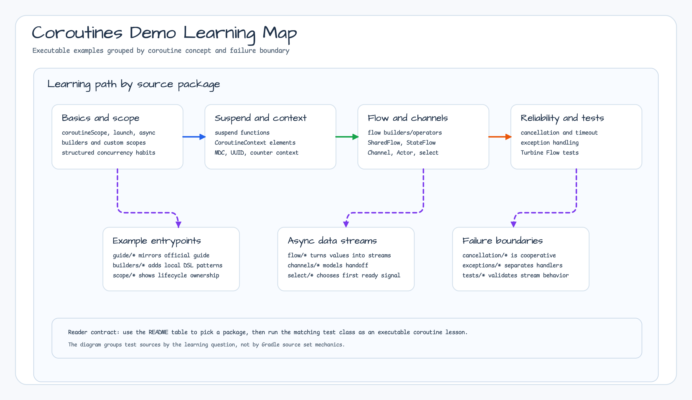

# Module Examples - Kotlin Coroutines

[English](./README.md) | 한국어

Kotlin Coroutines의 다양한 기능과 사용 패턴을 학습하기 위한 예제 모음입니다.



## 예제 목록

### 기초 가이드 (guide/)

| 예제 파일                         | 설명                                |
|-------------------------------|-----------------------------------|
| `CoroutineExamples.kt`        | 코루틴 기본: coroutineScope, launch    |
| `CoroutineBuilderExamples.kt` | 코루틴 빌더: launch, async, produce    |
| `CoroutineContextExamples.kt` | CoroutineContext 이해와 활용           |
| `SuspendExamples.kt`          | suspend 함수 기본                     |
| `MDCContextExamples.kt`       | MDC(Mapped Diagnostic Context) 연동 |

### Flow 예제 (flow/)

| 예제 파일                      | 설명                               |
|----------------------------|----------------------------------|
| `FlowBasicExamples.kt`     | Flow 기본 생성과 수집                   |
| `FlowBuilderExamples.kt`   | flowOf, asFlow, channelFlow 등 빌더 |
| `FlowOperatorExamples.kt`  | map, filter, transform 등 연산자     |
| `FlowLifecycleExamples.kt` | onStart, onCompletion, onEach    |
| `SharedFlowExamples.kt`    | SharedFlow로 이벤트 버스 구현            |
| `StateFlowExamples.kt`     | StateFlow로 상태 관리                 |
| `ChannelFlowExamples.kt`   | channelFlow와 콜드/핫 플로우            |
| `CallbackFlowExamples.kt`  | Kafka producer callback을 `Flow<RecordMetadata>`로 변환하고 backpressure·취소·정리를 제한 시간으로 검증 |

### Channel 예제 (channels/)

| 예제 파일                | 설명                           |
|----------------------|------------------------------|
| `ChannelExamples.kt` | Channel 기본: produce, consume |
| `ActorExamples.kt`   | Actor 패턴으로 상태 관리             |

### 코루틴 취소 (cancellation/)

| 예제 파일                     | 설명               |
|---------------------------|------------------|
| `CancellationExamples.kt` | 협력적 취소, 취소 예외 처리 |

### 코루틴 컨텍스트 (context/)

| 예제 파일                             | 설명                      |
|-----------------------------------|-------------------------|
| `CoroutineContextExamples.kt`     | 커스텀 CoroutineContext 구현 |
| `CounterCoroutineContext.kt`      | 카운터 컨텍스트 예제             |
| `UuidProviderCoroutineContext.kt` | UUID 제공 컨텍스트            |

### 빌더 (builders/)

| 예제 파일                                | 설명         |
|--------------------------------------|------------|
| `CoroutineBuilderExamples.kt`        | 커스텀 코루틴 빌더 |
| `CoroutineContextBuilderExamples.kt` | 컨텍스트 빌더 패턴 |

### 디스패처 (dispatchers/)

| 예제 파일                   | 설명                                 |
|-------------------------|------------------------------------|
| `DispatcherExamples.kt` | Default, IO, Unconfined, Main 디스패처 |

### 예외 처리 (exceptions/)

| 예제 파일                          | 설명                                   |
|--------------------------------|--------------------------------------|
| `ExceptionHandlingExamples.kt` | CoroutineExceptionHandler, try-catch |

### 스코프 (scope/)

| 예제 파일                       | 설명                                          |
|-----------------------------|---------------------------------------------|
| `CoroutineScopeExamples.kt` | lifecycleScope, viewModelScope, customScope |

### 테스트 (tests/)

| 예제 파일                | 설명                 |
|----------------------|--------------------|
| `TurbineExamples.kt` | Turbine으로 Flow 테스트 |

## 실행 방법

```bash
# 모든 예제 테스트 실행
./gradlew :bluetape4k-examples-coroutines-demo:test

# 특정 예제만 실행
./gradlew :bluetape4k-examples-coroutines-demo:test --tests "io.bluetape4k.examples.coroutines.guide.*"
./gradlew :bluetape4k-examples-coroutines-demo:test --tests "io.bluetape4k.examples.coroutines.flow.*"
```

### Kafka callbackFlow 계약

실행 가능한 Kafka callback 예제는 다음 명령으로 실행한다.

```bash
./gradlew :bluetape4k-examples-coroutines-demo:test \
  --tests 'io.bluetape4k.examples.coroutines.flow.CallbackFlowExamples' \
  --no-configuration-cache --max-workers=1
```

이 테스트는 Testcontainers가 동적 포트의 Kafka broker를 시작하므로 Docker
daemon이 필요하다. 각 테스트는 고유 topic을 사용하며 consumer poll과 producer
close에는 제한 시간(timeout)이 있다. adapter는 send를 재시도하지 않고 metadata 순서를
보장하지 않는다. collection이 실패하거나 취소되면 부분 결과가 관찰될 수 있고,
첫 producer/callback 실패가 terminal cause로 유지되며 in-flight send future는
best-effort로 취소를 시도한다. 늦게 도착한 callback은 무시된 뒤 producer가 제한된
정리 과정에서 닫힌다.

## 주요 학습 포인트

1. **CoroutineScope**: 구조적 동시성의 핵심
2. **suspend 함수**: 비동기 코드를 동기처럼 작성
3. **Flow**: 리액티브 스트림의 Kotlin 구현
4. **Channel**: 코루틴 간 통신
5. **예외 처리**: SupervisorJob, CoroutineExceptionHandler

## 참고

- [Kotlin Coroutines Guide](https://kotlinlang.org/docs/coroutines-guide.html)
- [Kotlin Flow](https://kotlinlang.org/docs/flow.html)
