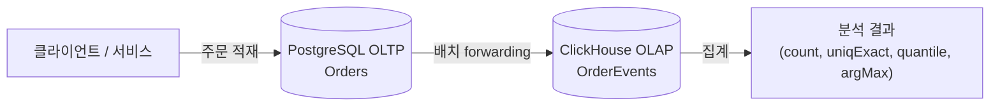

# bluetape4k-examples-exposed-clickhouse-oltp-olap

한국어 | [English](./README.md)

PostgreSQL **OLTP**와 ClickHouse **OLAP**를 동시에 사용하는 end-to-end 예제입니다.
Exposed를 통해 트랜잭션성 데이터를 OLAP 저장소로 forwarding하고, ClickHouse 전용 집계
함수로 분석 쿼리를 수행하는 방법을 보여줍니다.

## Architecture



## 구성 요소

| 구성 요소               | 역할                                                              |
|---------------------|-----------------------------------------------------------------|
| `Orders` 테이블         | PostgreSQL OLTP — JDBC 트랜잭션 단일 행 적재                              |
| `OrdersRepository`  | PostgreSQL 동기 저장소                                                |
| `OrderEvents` 테이블    | ClickHouse OLAP — `region` 파티셔닝의 `MergeTree`                     |
| `AnalyticsRepository` | 배치 삽입 + 집계 쿼리 (`uniqExact`, `quantile`, `argMax`)                |

## 실행

통합 테스트는 **Testcontainers**로 PostgreSQL과 ClickHouse를 모두 기동합니다:

```bash
./gradlew :bluetape4k-examples-exposed-clickhouse-oltp-olap:test
```

## 주의사항

- ClickHouse는 **트랜잭션을 지원하지 않습니다** — forwarding 도중 실패 시 부분 데이터가
  남을 수 있습니다. `order_id` 중복 제거가 가능한 `ReplacingMergeTree` 엔진을 사용하거나
  멱등(idempotent) forwarder를 설계하세요.
- 집계 함수(`uniqExact`, `quantile`, `argMax`)는 Exposed 표현식 API가 ClickHouse 전용
  함수를 모두 모델링하지 않아 raw SQL로 실행합니다.

## 관련 모듈

- [`bluetape4k-exposed-clickhouse`](../../data/exposed-clickhouse/README.ko.md) — 본 예제의 ClickHouse 어댑터
