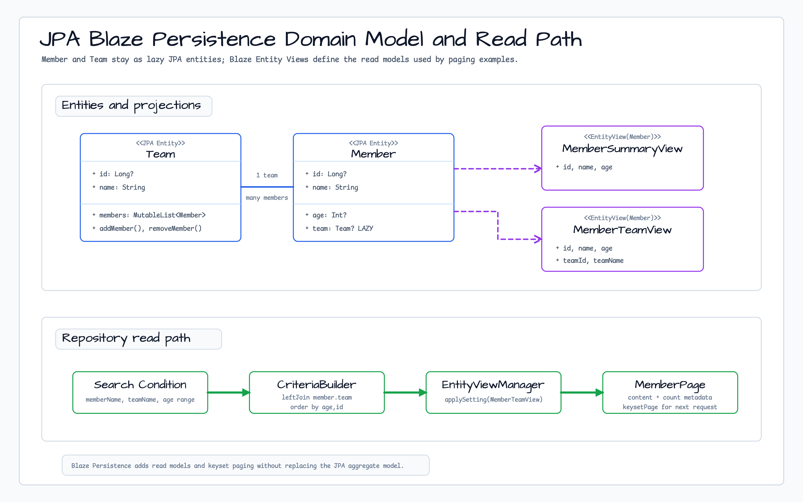

# Module Examples - JPA & Blaze Persistence

[English](./README.md) | 한국어

이 모듈은 [Blaze Persistence](https://persistence.blazebit.com/)를 사용한
JPA 쿼리 예제입니다. Criteria Builder, Entity Views, offset pagination,
keyset pagination, count metadata를 다룹니다. `examples/jpa-querydsl-demo`와
함께 참고할 수 있으며, Querydsl의 deprecated `fetchCount()` / `fetchResults()`
패턴을 명시적인 page/count API로 대체하는 예제를 제공합니다.

## Blaze Persistence를 사용하는 이유

Blaze Persistence는 JPA 위에 더 표현력 있는 Criteria API와 projection
모델을 제공합니다.

- JPQL 문자열 조립 없이 fluent API로 동적 쿼리를 구성합니다.
- `PagedList`로 `totalSize`, `totalPages`, keyset 상태를 함께 받습니다.
- 정렬 기준이 안정적인 목록에서 keyset pagination으로 다음/이전 페이지를 이동합니다.
- Entity Views로 전체 entity graph를 로딩하지 않고 DTO 형태 projection을 만듭니다.
- CTE, set operation, window function, entity-view filter 같은 고급 JPA 기능을 확장할 수 있습니다.
- Querydsl의 deprecated count shortcut 대신 data query와 count query 처리를 명시적으로 검증할 수 있습니다.

## 예제 범위

| 영역 | 파일 | 설명 |
|------|------|------|
| 로컬 설정 | `config/BlazePersistenceConfiguration.kt` | Spring Boot 4에서 `CriteriaBuilderFactory`, `EntityViewManager` 수동 Bean 구성 |
| 도메인 모델 | `domain/model/Member.kt`, `domain/model/Team.kt` | lazy association을 가진 단순 JPA entity |
| Entity Views | `domain/view/*View.kt` | interface projection과 team field mapping |
| 동적 조회 | `MemberBlazeRepository.findViews` | optional filter 기반 Blaze Criteria Builder |
| Offset pagination | `MemberBlazeRepository.findPage` | `PagedList` content, total size, total pages, first/max metadata |
| Keyset pagination | `MemberBlazeRepository.findNextPage` | `EntityViewSetting.withKeysetPage(...)` 기반 안정적인 페이지 이동 |
| 테스트 | `MemberBlazeRepositoryTest.kt` | 결과, metadata, keyset, Entity View 등록 검증 |

## 도메인 모델과 조회 경로



## 핵심 사용법

### Entity View 등록

```kotlin
@Bean
fun entityViewConfiguration(): EntityViewConfiguration {
    return EntityViews.createDefaultConfiguration().apply {
        addEntityView(MemberSummaryView::class.java)
        addEntityView(MemberTeamView::class.java)
    }
}
```

예제에서는 module-local annotation processing 없이 runtime 등록을 사용합니다.
운영 모듈에서는 startup 비용이나 view 검증 피드백이 중요할 때 annotation
processing으로 전환할 수 있습니다.

### 동적 Criteria Query

```kotlin
val criteria = criteriaBuilderFactory.create(entityManager, Member::class.java, "member")
    .leftJoin("member.team", "team")

condition.memberName?.let { criteria.where("member.name").eq(it) }
condition.teamName?.let { criteria.where("team.name").eq(it) }
condition.ageGoe?.let { criteria.where("member.age").ge(it) }
condition.ageLoe?.let { criteria.where("member.age").le(it) }
```

### Entity View Pagination

```kotlin
val setting = EntityViewSetting.create(MemberTeamView::class.java, firstResult, maxResults)
    .withKeysetPage(null)

val page = entityViewManager
    .applySetting(setting, baseCriteria(condition))
    .resultList

val next = EntityViewSetting.create(MemberTeamView::class.java, nextFirstResult, maxResults)
    .withKeysetPage(page.keysetPage)
```

`withKeysetPage(null)`은 첫 페이지에서 keyset 추출을 활성화합니다. 이후
반환된 `PagedList.keysetPage`를 다음 요청에 전달합니다.

## Querydsl Migration Notes

Querydsl `fetchCount()`와 `fetchResults()`는 복잡한 JPQL에서 count query
형태가 달라질 수 있어 deprecated 되었습니다. 이 모듈은 Blaze Persistence
`PagedList`에서 count metadata를 얻습니다.

```kotlin
MemberPage(
    content = page,
    totalSize = page.totalSize,
    totalPages = page.totalPages,
    firstResult = page.firstResult,
    maxResults = page.maxResults,
    keysetPage = page.keysetPage,
)
```

이 방식은 fluent query 스타일을 유지하면서 count 동작을 테스트로 명확히
검증할 수 있습니다.

## 의존성

이 모듈은 Jakarta Blaze Persistence artifact와 Hibernate 7.0 integration
artifact를 사용합니다. `blaze-persistence-integration-hibernate-7.0:1.6.16`이
Hibernate `7.0.3.Final` 기준으로 컴파일되어 있으므로 이 모듈의 dependency
resolution에서 Hibernate 버전을 module-local로 고정합니다.

## 실행 방법

```bash
./gradlew :bluetape4k-examples-jpa-blazepersistence-demo:test
```

repository 예제만 실행:

```bash
./gradlew :bluetape4k-examples-jpa-blazepersistence-demo:test \
  --tests 'io.bluetape4k.examples.jpa.blazepersistence.domain.repository.MemberBlazeRepositoryTest'
```

## 참고

- [Blaze Persistence Documentation](https://persistence.blazebit.com/documentation/)
- [Blaze Persistence Entity Views](https://persistence.blazebit.com/documentation/entity-view/manual/en_US/)
- [Spring Data JPA](https://spring.io/projects/spring-data-jpa)
