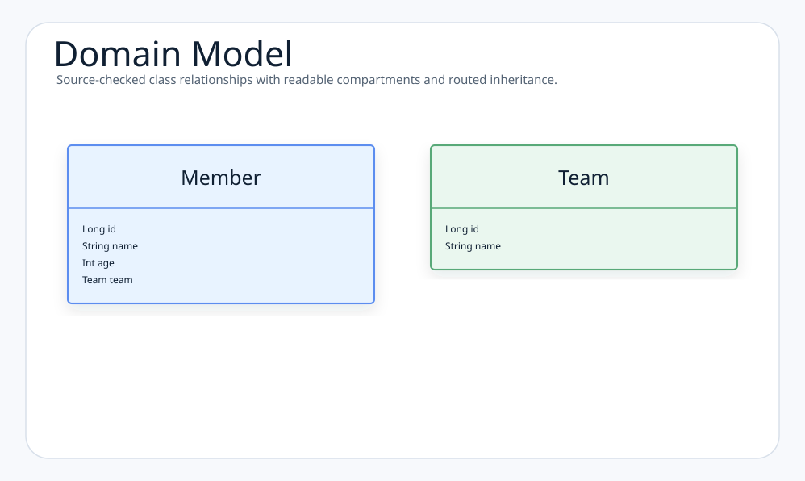

# Module Examples - JPA & Blaze Persistence

English | [한국어](./README.ko.md)

This module demonstrates JPA query patterns with [Blaze Persistence](https://persistence.blazebit.com/):
Criteria Builder, Entity Views, offset pagination, keyset pagination, and count
metadata. It is intended as a companion to `examples/jpa-querydsl-demo` for
cases where Querydsl's deprecated `fetchCount()` / `fetchResults()` patterns
should be replaced by a pagination API with explicit count-query support.

## Why Blaze Persistence

Blaze Persistence extends JPA with a fluent Criteria API and a projection model
that are useful for larger read models:

- Type-safe query composition without building JPQL strings by hand.
- `PagedList` metadata with `totalSize`, `totalPages`, and keyset state.
- Keyset pagination for stable next/previous navigation on ordered result sets.
- Entity Views for DTO-like projections without loading full entity graphs.
- Advanced JPA features such as CTEs, set operations, window functions, and
  entity-view filters when the application needs them.
- Better migration path for old Querydsl count usage: build the data query and
  let Blaze Persistence manage the page/count query instead of relying on
  deprecated `fetchCount()` or `fetchResults()` shortcuts.

## Example Coverage

| Area | Files | What it demonstrates |
|------|-------|----------------------|
| Local wiring | `config/BlazePersistenceConfiguration.kt` | Manual `CriteriaBuilderFactory` and `EntityViewManager` beans for Spring Boot 4 |
| Domain model | `domain/model/Member.kt`, `domain/model/Team.kt` | Simple JPA entities with a lazy association |
| Entity Views | `domain/view/*View.kt` | Interface projections and nested team mappings |
| Dynamic search | `MemberBlazeRepository.findViews` | Optional filters with Blaze Criteria Builder |
| Offset pagination | `MemberBlazeRepository.findPage` | `PagedList` content, total size, total pages, and first/max metadata |
| Keyset pagination | `MemberBlazeRepository.findNextPage` | `EntityViewSetting.withKeysetPage(...)` for stable page navigation |
| Tests | `MemberBlazeRepositoryTest.kt` | Query result, metadata, keyset, and Entity View registration checks |

## Domain Model



## Core Usage

### Entity View Registration

```kotlin
@Bean
fun entityViewConfiguration(): EntityViewConfiguration {
    return EntityViews.createDefaultConfiguration().apply {
        addEntityView(MemberSummaryView::class.java)
        addEntityView(MemberTeamView::class.java)
    }
}
```

Runtime registration keeps the example simple and avoids module-local annotation
processing. Production modules can switch to annotation processing if startup
cost or view validation feedback becomes important.

### Dynamic Criteria Query

```kotlin
val criteria = criteriaBuilderFactory.create(entityManager, Member::class.java, "member")
    .leftJoin("member.team", "team")

condition.memberName?.let { criteria.where("member.name").eq(it) }
condition.teamName?.let { criteria.where("team.name").eq(it) }
condition.ageGoe?.let { criteria.where("member.age").ge(it) }
condition.ageLoe?.let { criteria.where("member.age").le(it) }
```

### Entity View Pagination

```kotlin
val setting = EntityViewSetting.create(MemberTeamView::class.java, firstResult, maxResults)
    .withKeysetPage(null)

val page = entityViewManager
    .applySetting(setting, baseCriteria(condition))
    .resultList

val next = EntityViewSetting.create(MemberTeamView::class.java, nextFirstResult, maxResults)
    .withKeysetPage(page.keysetPage)
```

`withKeysetPage(null)` enables keyset extraction for the first page. The
returned `PagedList.keysetPage` can then be passed to the next request.

## Querydsl Migration Notes

Querydsl `fetchCount()` and `fetchResults()` are deprecated because complex JPQL
queries often need a separate count query shape. In this module, count metadata
is obtained from Blaze Persistence `PagedList`:

```kotlin
MemberPage(
    content = page,
    totalSize = page.totalSize,
    totalPages = page.totalPages,
    firstResult = page.firstResult,
    maxResults = page.maxResults,
    keysetPage = page.keysetPage,
)
```

This keeps count behavior explicit and testable while preserving a fluent query
style.

## Dependencies

The module uses the Jakarta Blaze Persistence artifacts and the Hibernate 7.0
integration artifact. Module-local dependency resolution pins Hibernate to
`7.0.3.Final` because `blaze-persistence-integration-hibernate-7.0:1.6.16` is
compiled against that Hibernate line.

## How to Run

```bash
./gradlew :bluetape4k-examples-jpa-blazepersistence-demo:test
```

Run only the repository examples:

```bash
./gradlew :bluetape4k-examples-jpa-blazepersistence-demo:test \
  --tests 'io.bluetape4k.examples.jpa.blazepersistence.domain.repository.MemberBlazeRepositoryTest'
```

## References

- [Blaze Persistence Documentation](https://persistence.blazebit.com/documentation/)
- [Blaze Persistence Entity Views](https://persistence.blazebit.com/documentation/entity-view/manual/en_US/)
- [Spring Data JPA](https://spring.io/projects/spring-data-jpa)
