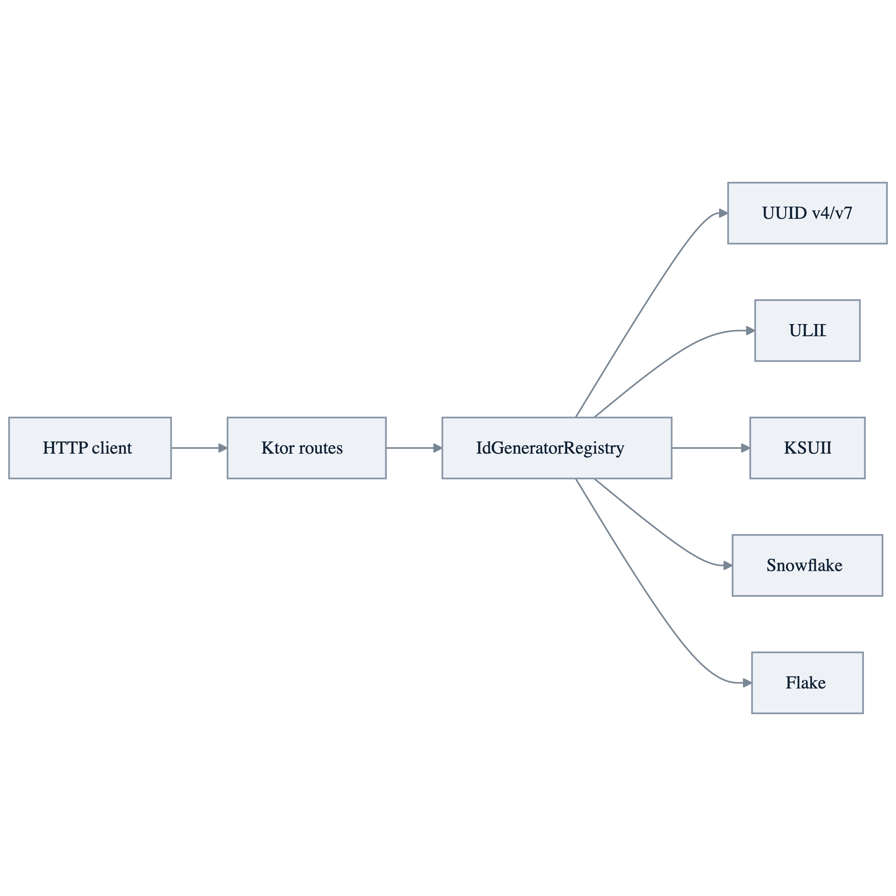

# idgenerator Ktor Demo

[English](./README.md) | 한국어

bluetape4k `idgenerators`를 HTTP endpoint로 노출하는 실행 가능한 Ktor application입니다.
공통 bluetape4k Ktor 모듈을 사용해 JSON, 표준 오류 응답, health/readiness route,
correlation ID, call logging, test assertion을 구성합니다.

## 구조



명시적 `/ids/...` route와 generic `/idgen/{type}` route는 같은 registry를 공유합니다. route 스타일은 두 가지를 모두 보여주되 ID 생성 로직은 중복하지 않습니다.

공통 Ktor 설정은 application module에서 명시적으로 설치합니다:

- `bluetape4k-ktor-core`: content negotiation, `ApiErrorResponse`, `/healthz`, `/readyz`
- `bluetape4k-ktor-observability`: `X-Request-Id` 전파와 call logging
- `bluetape4k-ktor-testing`: response status, JSON body, API error assertion

## 실행

```bash
./gradlew :idgenerator-ktor-demo:run
```

application은 `0.0.0.0:8080`에서 실행됩니다.

## 테스트

```bash
./gradlew :idgenerator-ktor-demo:compileKotlin :idgenerator-ktor-demo:test
```

## Endpoints

### 명시적 Route

```bash
curl http://localhost:8080/ids/uuid-v4
curl http://localhost:8080/ids/uuid-v7
curl http://localhost:8080/ids/ulid
curl http://localhost:8080/ids/ksuid
curl http://localhost:8080/ids/snowflake
curl http://localhost:8080/ids/flake
```

### 명시적 Batch Route

```bash
curl 'http://localhost:8080/ids/uuid-v7/batch?size=10'
curl 'http://localhost:8080/ids/snowflake/batch?size=10'
```

`size`는 `1..100` 범위여야 합니다. 생략하면 `10`을 사용합니다.

### Generic Route

```bash
curl http://localhost:8080/idgen/uuid-v7
curl 'http://localhost:8080/idgen/uuid-v7/batch?size=10'
```

지원하는 `{type}` 값:

- `uuid-v4`
- `uuid-v7`
- `ulid`
- `ksuid`
- `snowflake`
- `flake`

### Metadata

```bash
curl http://localhost:8080/generators
curl http://localhost:8080/health
curl http://localhost:8080/healthz
curl http://localhost:8080/readyz
```

잘못된 path/query 입력은 공통 API error 형식으로 응답합니다:

```json
{
  "error": "bad_request",
  "message": "Query parameter 'size' must be in 1..100.",
  "status": 400,
  "path": "/idgen/uuid-v7/batch"
}
```

## Generator 선택 기준

| Type | 사용 기준 |
|---|---|
| `uuid-v4` | 랜덤 UUID 호환성이 충분할 때 |
| `uuid-v7` | UUID 형식을 유지하면서 시간 정렬 특성이 필요할 때 |
| `ulid` | 짧고 사전순 정렬 가능한 문자열 ID가 필요할 때 |
| `ksuid` | timestamp와 random payload를 포함한 K-sortable ID가 필요할 때 |
| `snowflake` | 분산 시스템에서 쓰기 좋은 compact numeric ID가 필요할 때 |
| `flake` | Boundary 스타일 128-bit Base62 ID가 필요할 때 |
