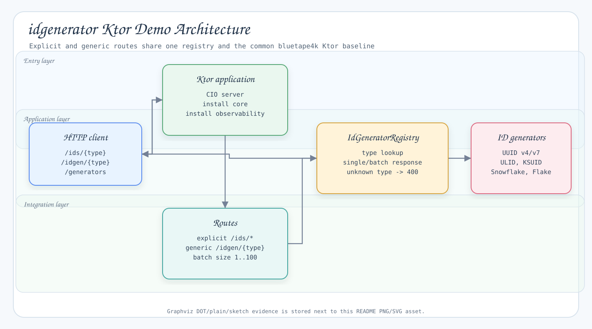

# idgenerator Ktor Demo

English | [한국어](./README.ko.md)

Runnable Ktor application that exposes bluetape4k `idgenerators` through HTTP endpoints.

## Architecture



The explicit `/ids/...` routes and generic `/idgen/{type}` routes share the same registry, so the example shows both route styles without duplicating ID generation logic.

## Run

```bash
./gradlew :idgenerator-ktor-demo:run
```

The application listens on `0.0.0.0:8080`.

## Test

```bash
./gradlew :idgenerator-ktor-demo:compileKotlin :idgenerator-ktor-demo:test
```

## Endpoints

### Explicit Routes

```bash
curl http://localhost:8080/ids/uuid-v4
curl http://localhost:8080/ids/uuid-v7
curl http://localhost:8080/ids/ulid
curl http://localhost:8080/ids/ksuid
curl http://localhost:8080/ids/snowflake
curl http://localhost:8080/ids/flake
```

### Explicit Batch Routes

```bash
curl 'http://localhost:8080/ids/uuid-v7/batch?size=10'
curl 'http://localhost:8080/ids/snowflake/batch?size=10'
```

`size` must be in `1..100`. If omitted, it defaults to `10`.

### Generic Routes

```bash
curl http://localhost:8080/idgen/uuid-v7
curl 'http://localhost:8080/idgen/uuid-v7/batch?size=10'
```

Supported `{type}` values:

- `uuid-v4`
- `uuid-v7`
- `ulid`
- `ksuid`
- `snowflake`
- `flake`

### Metadata

```bash
curl http://localhost:8080/generators
curl http://localhost:8080/health
```

## Generator Choice

| Type | Use when |
|---|---|
| `uuid-v4` | Random UUID compatibility is enough. |
| `uuid-v7` | You want UUID format with time-sortable behavior. |
| `ulid` | You want compact lexicographically sortable string IDs. |
| `ksuid` | You want K-sortable IDs with embedded timestamp and random payload. |
| `snowflake` | You want compact numeric IDs suitable for distributed systems. |
| `flake` | You want Boundary-style 128-bit Base62 IDs. |
