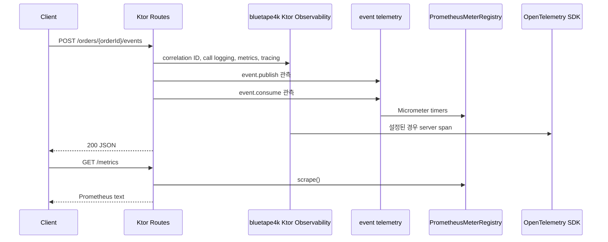

# bluetape4k Ktor observability demo

[English](./README.md) | 한국어

Ktor 3에서 애플리케이션이 소유한 Prometheus metrics route, opt-in OpenTelemetry tracing,
bluetape4k event telemetry helper를 함께 사용하는 실행 가능한 예제입니다.

## 구조



## 의존성

- `bluetape4k-ktor-core`: JSON, 오류 처리, health/readiness 기본 기능
- `bluetape4k-ktor-observability`: correlation ID, call logging, Micrometer, Prometheus route, OTel tracing helper
- `bluetape4k-micrometer`: event publish/consume telemetry helper
- `micrometer-registry-prometheus`: 애플리케이션 소유 scrape registry
- `opentelemetry-ktor-3.0`: 선택적 Ktor server span

## 설정

Ktor는 Actuator로 Prometheus를 노출하지 않습니다. 애플리케이션이 registry를 소유하고 scrape route를 명시적으로 mount합니다.

```kotlin
val meterRegistry = PrometheusMeterRegistry(PrometheusConfig.DEFAULT)

installBluetape4kKtorObservability(
    Bluetape4kKtorObservabilityConfig(
        meterRegistry = meterRegistry,
        tracing = KtorOpenTelemetryTracingConfig(openTelemetry),
    )
)

routing {
    prometheusScrapeRoute(meterRegistry, path = "/metrics")
}
```

`OpenTelemetry` 인스턴스에 `null`을 전달하면 tracing은 비활성화됩니다. 테스트는 in-memory SDK exporter를 사용하므로 외부 collector가 필요하지 않습니다.

## 실행

```bash
./gradlew :observability-ktor-demo:run
```

애플리케이션은 `0.0.0.0:8080`에서 실행됩니다.

## 확인

관측 대상 애플리케이션 이벤트를 만듭니다.

```bash
curl -X POST -H 'X-Request-Id: REQ_123' \
  http://localhost:8080/orders/order-1/events
```

애플리케이션 소유 Prometheus metrics를 scrape합니다.

```bash
curl http://localhost:8080/metrics | grep -E 'ktor_http_server_requests|event_publish|event_consume'
```

Health route를 확인합니다.

```bash
curl http://localhost:8080/health
curl http://localhost:8080/healthz
curl http://localhost:8080/readyz
```

## 테스트

```bash
./gradlew :observability-ktor-demo:compileKotlin :observability-ktor-demo:test
```
