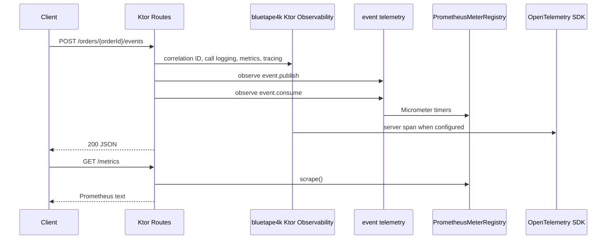

# bluetape4k Ktor observability demo

English | [한국어](./README.ko.md)

Runnable Ktor 3 application that shows application-owned Prometheus metrics routing, opt-in
OpenTelemetry tracing, and bluetape4k event telemetry helpers.

## Architecture



## Dependencies

- `bluetape4k-ktor-core`: JSON, error handling, health/readiness baseline
- `bluetape4k-ktor-observability`: correlation ID, call logging, Micrometer, Prometheus route, OTel tracing helper
- `bluetape4k-micrometer`: event publish/consume telemetry helpers
- `micrometer-registry-prometheus`: application-owned scrape registry
- `opentelemetry-ktor-3.0`: optional Ktor server spans

## Configuration

Ktor does not expose Prometheus through Actuator. The application owns the registry and explicitly
mounts the scrape route:

```kotlin
val meterRegistry = PrometheusMeterRegistry(PrometheusConfig.DEFAULT)

installBluetape4kKtorObservability(
    Bluetape4kKtorObservabilityConfig(
        meterRegistry = meterRegistry,
        tracing = KtorOpenTelemetryTracingConfig(openTelemetry),
    )
)

routing {
    prometheusScrapeRoute(meterRegistry, path = "/metrics")
}
```

Passing `null` for the `OpenTelemetry` instance keeps tracing disabled. Tests use an in-memory SDK
exporter, so no external collector is required.

## Run

```bash
./gradlew :observability-ktor-demo:run
```

The application listens on `0.0.0.0:8080`.

## Verify

Create an observed application event:

```bash
curl -X POST -H 'X-Request-Id: REQ_123' \
  http://localhost:8080/orders/order-1/events
```

Scrape application-owned Prometheus metrics:

```bash
curl http://localhost:8080/metrics | grep -E 'ktor_http_server_requests|event_publish|event_consume'
```

Check health routes:

```bash
curl http://localhost:8080/health
curl http://localhost:8080/healthz
curl http://localhost:8080/readyz
```

## Test

```bash
./gradlew :observability-ktor-demo:compileKotlin :observability-ktor-demo:test
```
