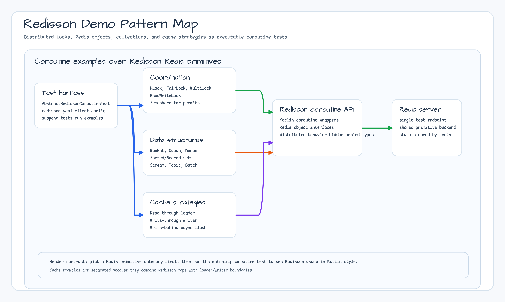

# Module Examples - Redisson

English | [한국어](./README.ko.md)

A collection of examples demonstrating distributed Redis patterns using [Redisson](https://github.com/redisson/redisson) with Kotlin Coroutines.



## Examples

### Distributed Locks (coroutines/locks/)

| Example File               | Description                     |
|----------------------------|---------------------------------|
| `LockExamples.kt`          | Basic distributed lock (RLock)  |
| `FairLockExamples.kt`      | Fair lock                       |
| `ReadWriteLockExamples.kt` | Read/write lock                 |
| `MultiLockExamples.kt`     | Multi-lock (across Redis nodes) |
| `SemaphoreExamples.kt`     | Distributed semaphore           |

### Redis Objects (coroutines/objects/)

| Example File              | Description                             |
|---------------------------|-----------------------------------------|
| `BucketExamples.kt`       | RBucket - single value storage          |
| `BloomFilterExamples.kt`  | RBloomFilter - probabilistic membership |
| `HyperLogLogExamples.kt`  | RHyperLogLog - cardinality estimation   |
| `GeoExamples.kt`          | RGeo - geospatial storage               |
| `AtomicLongExamples.kt`   | RAtomicLong - atomic counter            |
| `RateLimiterExamples.kt`  | RRateLimiter - rate limiting            |
| `BinaryStreamExamples.kt` | RBinaryStream - binary data storage     |
| `BatchExamples.kt`        | RBatch - batch operations               |
| `TopicExamples.kt`        | RTopic - Pub/Sub messaging              |

### Collections (coroutines/collections/)

| Example File                   | Description                              |
|--------------------------------|------------------------------------------|
| `QueueExamples.kt`             | RQueue - distributed queue               |
| `DequeExamples.kt`             | RDeque - distributed deque               |
| `BlockingDequeExamples.kt`     | RBlockingDeque - blocking deque          |
| `ReliableQueueExamples.kt`     | RReliableQueue - reliable queue          |
| `PriorityQueueExamples.kt`     | RPriorityQueue - priority queue          |
| `ScoredSortedSetExamples.kt`   | RScoredSortedSet - scored sorted set     |
| `SortedSetExamples.kt`         | RSortedSet - sorted set                  |
| `RingBufferExamples.kt`        | RRingBuffer - ring buffer                |
| `StreamExamples.kt`            | RStream - Redis Streams                  |
| `LocalCachedMapExamples.kt`    | RLocalCachedMap - numeric atomic updates and local invalidation |
| `SetMultimapCacheExamples.kt`  | RSetMultimapCache - set multimap cache   |
| `ListMultimapCacheExamples.kt` | RListMultimapCache - list multimap cache |

### Cache Strategies (coroutines/cachestrategy/)

| Example File                    | Description                       |
|---------------------------------|-----------------------------------|
| `CacheReadThroughExample.kt`    | Read-Through cache pattern        |
| `CacheWriteThroughExample.kt`   | Write-Through cache pattern       |
| `CacheWriteBehindExample.kt`    | Write-Behind cache pattern        |
| `CacheWriteBehindForIoTData.kt` | Write-Behind example for IoT data |

### Read/Write Through (coroutines/readwritethrough/)

| Example File                 | Description                     |
|------------------------------|---------------------------------|
| `MapReadWriteThroughTest.kt` | MapLoader/MapWriter integration |

## Key Pattern Examples

### Distributed Lock

```kotlin
val lock = redisson.getLock("my-lock")

// Coroutines support
lock.useLocked {
    // Runs while the lock is held
    criticalSection()
}
```

### Read-Through Cache

```kotlin
val map = redisson.getMapCache<String, User>("users")
val config = MapCacheOptions.defaults<String, User>()
    .loader(MyMapLoader(userRepository))

val user = map["user-1"]  // Automatically loaded from DB on cache miss
```

### Distributed Semaphore

```kotlin
val semaphore = redisson.getSemaphore("rate-limiter")
semaphore.trySetPermits(10)

semaphore.useAcquired {
    // Up to 10 concurrent executions
    limitedResource()
}
```

### Bloom Filter

```kotlin
val bloomFilter = redisson.getBloomFilter<String>("emails")
bloomFilter.tryInit(10000, 0.01)

bloomFilter.add("user@example.com")
val exists = bloomFilter.contains("user@example.com")  // true
```

### LocalCachedMap numeric updates and invalidation

`LocalCachedMapExamples.kt` keeps Int and Double values in separate maps and
passes the same `CompositeCodec` (String keys plus the matching numeric value
codec) to both the local and backend views. `addAndGetAsync` uses Redis
`HINCRBYFLOAT`, so the stored hash field must already be numeric-compatible;
the negative test records Redisson's `RedisException` for a mismatched value.

`LocalCachedMapTest.kt` uses two Redisson clients. A write through one local
cached map invalidates the other client's cached value asynchronously. A read
immediately after the write may still observe the old value; the example waits
up to five seconds with a 100 ms poll interval before asserting the refreshed
value or deletion. The tests start Redis through Testcontainers, use its dynamic
port, and therefore require a running Docker daemon.

## How to Run

```bash
# Start Redis (Docker)
docker run -d --name redis -p 6379:6379 redis:7

# Run all examples in this module
./gradlew :bluetape4k-examples-redisson-demo:test \
  --no-configuration-cache --max-workers=1

# Run the LocalCachedMap contract tests
./gradlew :bluetape4k-examples-redisson-demo:test \
  --tests 'io.bluetape4k.examples.redisson.coroutines.collections.LocalCachedMapExamples' \
  --tests 'io.bluetape4k.examples.redisson.coroutines.collections.LocalCachedMapTest' \
  --no-configuration-cache --max-workers=1
```

## Requirements

- Redis 6.0+
- Redisson 3.37+

## References

- [Redisson Wiki](https://github.com/redisson/redisson/wiki)
- [Redisson Kotlin Coroutines](https://github.com/redisson/redisson/tree/master/redisson-kotlin)
