# bluetape4k Spring Boot idgenerator demo

[English](./README.md) | 한국어

이 예제는 `bluetape4k-idgenerators`를 Spring Boot REST 애플리케이션으로 노출하는 방법을 보여줍니다.
Ktor 예제는 #419에서 별도로 다룹니다.

## 아키텍처



## 설정

```yaml
bluetape4k:
  id-generator:
    default-batch-size: 10
    max-batch-size: 100
```

`IdGeneratorConfiguration`은 각 generator를 Spring Bean으로 등록합니다. `IdGeneratorRegistry`는 REST
type 이름을 실제 generator에 매핑하고, `IdGeneratorService`는 batch size 검증을 담당합니다.

## 엔드포인트

명시적 엔드포인트:

| Method | Path |
|---|---|
| GET | `/ids/uuid-v4` |
| GET | `/ids/uuid-v7` |
| GET | `/ids/ulid` |
| GET | `/ids/ksuid` |
| GET | `/ids/snowflake` |
| GET | `/ids/flake` |
| GET | `/ids/{type}/batch?size=10` |

Generic 엔드포인트:

| Method | Path |
|---|---|
| GET | `/idgen/{type}` |
| GET | `/idgen/{type}/batch?size=10` |
| GET | `/generators` |
| GET | `/health` |

지원 type은 `uuid-v4`, `uuid-v7`, `ulid`, `ksuid`, `snowflake`, `flake`입니다.

## 사용법

```bash
./gradlew :idgenerator-spring-boot-demo:bootRun
```

```bash
curl http://localhost:8080/ids/uuid-v7
curl 'http://localhost:8080/idgen/snowflake/batch?size=5'
curl http://localhost:8080/generators
```

## 테스트

```bash
./gradlew :idgenerator-spring-boot-demo:test
```

테스트는 Spring Boot 애플리케이션을 로드하고 모든 REST endpoint를 검증합니다. 또한 `SuspendedJobTester`로
UUID v7과 Snowflake 병렬 요청이 중복 없는 ID를 반환함을 증명합니다.
