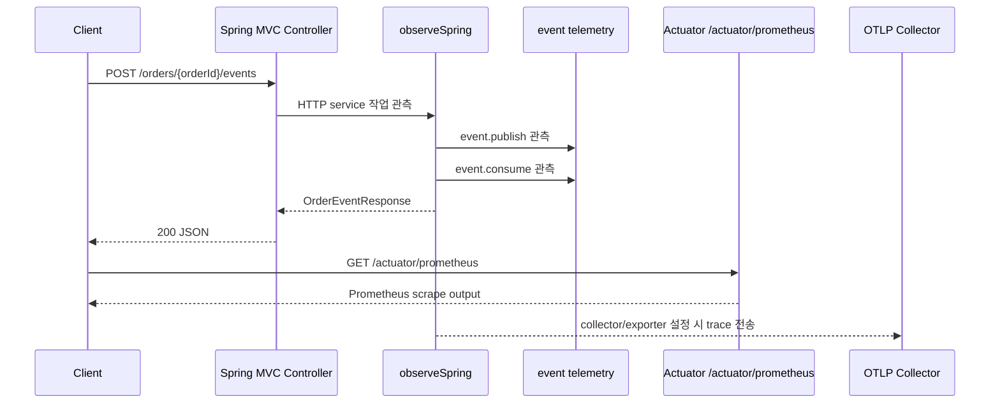

# bluetape4k Spring Boot observability demo

[English](./README.md) | 한국어

Spring Boot 4에서 bluetape4k observation helper를 Spring Boot Actuator Prometheus metrics와
애플리케이션 소유 OTLP tracing 설정으로 사용하는 실행 가능한 예제입니다.

## 구조



## 의존성

이 예제는 Spring Boot BOM과 기존 bluetape4k helper 모듈을 사용합니다.

- `bluetape4k-spring-boot-core`: `ObservationRegistry.observeSpring`
- `bluetape4k-micrometer`: event publish/consume telemetry helper
- `spring-boot-starter-actuator`와 `micrometer-registry-prometheus`: `/actuator/prometheus`
- `micrometer-tracing-bridge-otel`과 `opentelemetry-exporter-otlp`: 선택적 OTLP trace export

## 설정

Prometheus와 OTLP 설정은 Spring Boot가 소유합니다. 이 애플리케이션은 별도 custom Prometheus endpoint를 만들지 않습니다.

```yaml
management:
  defaults:
    metrics:
      export:
        enabled: false
  endpoints:
    web:
      exposure:
        include: health,info,prometheus
  endpoint:
    prometheus:
      access: read_only
  prometheus:
    metrics:
      export:
        enabled: true
  tracing:
    sampling:
      probability: 1.0
  otlp:
    tracing:
      endpoint: ${OTEL_EXPORTER_OTLP_TRACES_ENDPOINT:http://localhost:4318/v1/traces}
```

`management.defaults.metrics.export.enabled=false`는 예제 classpath에 Datadog 같은 registry 구현이
있더라도 credential 없이 시작되지 않게 막습니다. Prometheus만 명시적으로 활성화합니다.

## 실행

```bash
./gradlew :observability-spring-boot-demo:bootRun
```

애플리케이션은 `localhost:8080`에서 실행됩니다.

## 확인

관측 대상 애플리케이션 이벤트를 만듭니다.

```bash
curl -X POST -H 'X-Request-Id: REQ_123' \
  http://localhost:8080/orders/order-1/events
```

Spring Boot Actuator를 통해 metrics를 scrape합니다.

```bash
curl http://localhost:8080/actuator/prometheus | grep -E 'http_server_requests|event_publish|event_consume'
```

Health도 Actuator endpoint로 확인합니다.

```bash
curl http://localhost:8080/actuator/health
```

Trace를 export하려면 로컬 OTLP collector를 실행하거나 다음 환경 변수를 지정합니다.

```bash
export OTEL_EXPORTER_OTLP_TRACES_ENDPOINT=http://localhost:4318/v1/traces
```

테스트는 외부 trace export를 비활성화하고, 애플리케이션 기동, event telemetry 실행, Prometheus 출력의 HTTP/event observation metrics를 검증합니다.

## 테스트

```bash
./gradlew :observability-spring-boot-demo:compileKotlin :observability-spring-boot-demo:test
```
