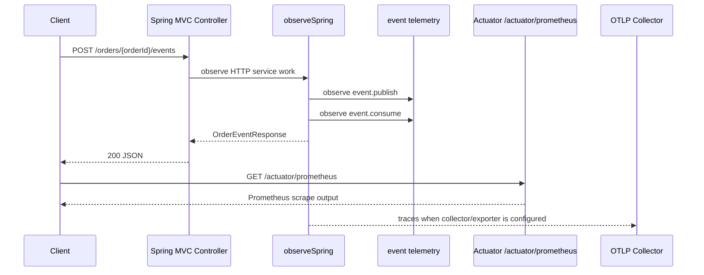

# bluetape4k Spring Boot observability demo

English | [한국어](./README.ko.md)

Runnable Spring Boot 4 application that shows how to use bluetape4k observation helpers with
Spring Boot Actuator Prometheus metrics and application-owned OTLP tracing configuration.

## Architecture



## Dependencies

The demo uses the Spring Boot BOM and the existing bluetape4k helper modules:

- `bluetape4k-spring-boot-core` for `ObservationRegistry.observeSpring`
- `bluetape4k-micrometer` for event publish/consume telemetry helpers
- `spring-boot-starter-actuator` plus `micrometer-registry-prometheus` for `/actuator/prometheus`
- `micrometer-tracing-bridge-otel` and `opentelemetry-exporter-otlp` for optional OTLP trace export

## Configuration

Spring Boot owns Prometheus and OTLP configuration. The application does not register a custom
Prometheus endpoint.

```yaml
management:
  defaults:
    metrics:
      export:
        enabled: false
  endpoints:
    web:
      exposure:
        include: health,info,prometheus
  endpoint:
    prometheus:
      access: read_only
  prometheus:
    metrics:
      export:
        enabled: true
  tracing:
    sampling:
      probability: 1.0
  otlp:
    tracing:
      endpoint: ${OTEL_EXPORTER_OTLP_TRACES_ENDPOINT:http://localhost:4318/v1/traces}
```

`management.defaults.metrics.export.enabled=false` keeps registry implementations that may be present
on the demo classpath, such as Datadog, from starting without credentials. Prometheus is enabled
explicitly.

## Run

```bash
./gradlew :observability-spring-boot-demo:bootRun
```

The application listens on `localhost:8080`.

## Verify

Create an observed application event:

```bash
curl -X POST -H 'X-Request-Id: REQ_123' \
  http://localhost:8080/orders/order-1/events
```

Scrape metrics through Spring Boot Actuator:

```bash
curl http://localhost:8080/actuator/prometheus | grep -E 'http_server_requests|event_publish|event_consume'
```

Health remains an Actuator endpoint:

```bash
curl http://localhost:8080/actuator/health
```

To export traces, run an OTLP collector locally or set:

```bash
export OTEL_EXPORTER_OTLP_TRACES_ENDPOINT=http://localhost:4318/v1/traces
```

The tests disable external trace export and prove the application starts, event telemetry runs, and
Prometheus output includes HTTP and event observation metrics.

## Test

```bash
./gradlew :observability-spring-boot-demo:compileKotlin :observability-spring-boot-demo:test
```
