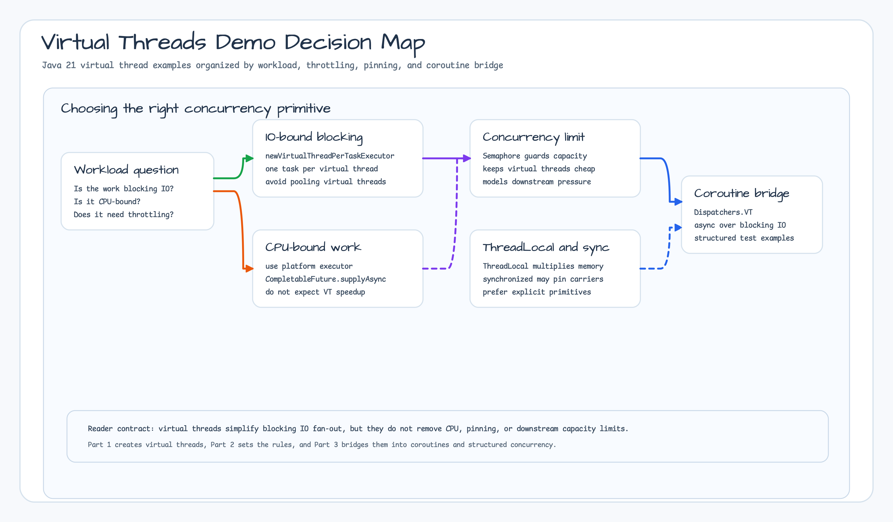

# Module Examples - Java 25 Virtual Threads

English | [한국어](./README.ko.md)

A collection of examples covering best practices and rules for using Java 25 Virtual Threads and Structured Concurrency effectively.



## Examples

### Virtual Thread Usage Rules

| Example File                                       | Rule       | Description                                      |
|----------------------------------------------------|------------|--------------------------------------------------|
| `Rule2RunBlockingSynchronousCode.kt`               | **Rule 2** | Run blocking synchronous code asynchronously     |
| `Rule3DoNotPooledVirtualThreads.kt`                | **Rule 3** | Never pool Virtual Threads                       |
| `Rule4UseSemaphoreInsteadOfFixedThreadPool.kt`     | **Rule 4** | Use Semaphore instead of a fixed thread pool     |
| `Rule5UseThreadLocalCarefully.kt`                  | **Rule 5** | Use ThreadLocal with caution                     |
| `Rule6UseSynchronizedBlocksAndMethodsCarefully.kt` | **Rule 6** | Use synchronized blocks and methods with caution |

## Key Learning Points

### Rule 2: Choosing How to Run Synchronous Code

```kotlin
// CPU-intensive work → Platform Thread + CompletableFuture
CompletableFuture.supplyAsync { cpuIntensiveTask() }

// I/O-intensive work → Virtual Thread
Executors.newVirtualThreadPerTaskExecutor().use { executor ->
    executor.submit { ioTask() }
}

// Or Kotlin Coroutines + Virtual Thread Dispatcher
runSuspendTest(Dispatchers.VT) {
    async { ioTaskAwait() }
}
```

### Rule 3: Never Pool Virtual Threads

```kotlin
// ❌ Wrong approach
val pool = Executors.newFixedThreadPool(100)  // Do not pool Virtual Threads

// ✅ Correct approach
val executor = Executors.newVirtualThreadPerTaskExecutor()
```

### Rule 4: Control Concurrency with Semaphore

```kotlin
// ❌ Wrong approach
val pool = Executors.newFixedThreadPool(10)

// ✅ Correct approach
val semaphore = Semaphore(10)
Executors.newVirtualThreadPerTaskExecutor().use { executor ->
    semaphore.acquire()
    try { task() } finally { semaphore.release() }
}
```

### Rule 5: ThreadLocal Caution

Because Virtual Threads can be created in large numbers, be mindful of memory usage when using ThreadLocal.

### Rule 6: Synchronized Block Caution

`synchronized` blocks can cause Virtual Thread pinning, which blocks the underlying carrier thread.

## How to Run

```bash
# Run all examples (requires Java 25+)
./gradlew :bluetape4k-examples-virtualthreads-demo:test

# Run a specific rule example
./gradlew :bluetape4k-examples-virtualthreads-demo:test --tests "*Rule2*"
```

## Requirements

- Java 25 or later

## References

- [JEP 444: Virtual Threads](https://openjdk.org/jeps/444)
- [Virtual Threads - Baeldung](https://www.baeldung.com/java-virtual-thread)
