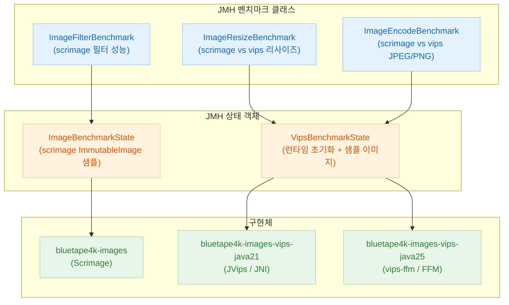

한국어 | [English](./README.md)

# Module bluetape4k-images-benchmark

Scrimage와 libvips 이미지 처리 성능을 비교하는 JMH 벤치마크 모듈.

## 아키텍처



## 개요

이 모듈은 다음 항목에 대한 JMH 벤치마크를 제공합니다:

- **리사이즈**: scrimage `scaleTo` vs vips `resize` (다양한 출력 크기)
- **인코딩**: scrimage JPEG/PNG writer vs vips JPEG/PNG 인코더
- **필터**: scrimage `GrayscaleFilter`, `BlurFilter`, `SepiaFilter` 파이프라인 처리량

## 벤치마크 실행

```bash
# 모든 벤치마크 실행 (기본 JMH 설정)
./gradlew :bluetape4k-images-benchmark:benchmark

# vips java21 바인딩으로 실행
./gradlew :bluetape4k-images-benchmark:benchmark -Pvips.impl=java21

# vips java25 바인딩으로 실행 (Java 25 + --enable-native-access 필요)
./gradlew :bluetape4k-images-benchmark:benchmark -Pvips.impl=java25

# 특정 벤치마크 클래스만 실행
./gradlew :bluetape4k-images-benchmark:benchmark \
    -Pbenchmark.includes=".*ImageResizeBenchmark.*"

# JMH 옵션 커스터마이즈 (fork, 워밍업, 측정 반복 횟수)
./gradlew :bluetape4k-images-benchmark:benchmark \
    -Pbenchmark.forks=2 \
    -Pbenchmark.warmupIterations=3 \
    -Pbenchmark.measurementIterations=5
```

## 벤치마크 클래스

### `ImageResizeBenchmark`

다양한 출력 크기에서의 리사이즈 처리량을 측정합니다.

| 파라미터 | 값 |
|----------|-----|
| `width`  | 320, 640, 1280 |
| `height` | 240, 480, 720  |
| `impl`   | `scrimage`, `vips` |

```kotlin
@Benchmark
fun resizeScrimage(state: ImageBenchmarkState): ImmutableImage =
    state.image.scaleTo(state.width, state.height)

@Benchmark
fun resizeVips(state: VipsBenchmarkState): VipsImage =
    state.image.resize(state.width, state.height)
```

### `ImageEncodeBenchmark`

다양한 품질 수준에서의 JPEG 및 PNG 인코딩 처리량을 측정합니다.

| 파라미터  | 값 |
|-----------|-----|
| `format`  | `JPEG`, `PNG` |
| `quality` | 75, 85, 95 |
| `impl`    | `scrimage`, `vips` |

### `ImageFilterBenchmark`

scrimage 필터 파이프라인 처리량을 측정합니다.

| 벤치마크  | 필터 |
|-----------|------|
| `grayscale` | `GrayscaleFilter` |
| `blur`      | `BlurFilter` |
| `sepia`     | `SepiaFilter` |
| `chain`     | `GrayscaleFilter + BlurFilter + SepiaFilter` |

### `VipsBenchmarkState`

JMH `@State` — fork당 한 번 vips 런타임을 초기화하고 샘플 이미지를 로드합니다.

```kotlin
@State(Scope.Benchmark)
class VipsBenchmarkState {
    lateinit var runtime: VipsRuntime
    lateinit var imageBytes: ByteArray

    @Setup(Level.Trial)
    fun setUp() {
        runtime = vipsRuntimeOf()
        runtime.init(concurrency = 4, maxPixels = 150_000_000L)
        imageBytes = loadSampleImageBytes()  // 1920x1080 JPEG
    }

    @TearDown(Level.Trial)
    fun tearDown() {
        runtime.shutdown()
    }
}
```

## 의존성 추가

```kotlin
dependencies {
    implementation("io.github.bluetape4k:bluetape4k-images-benchmark:${version}")
}
```
