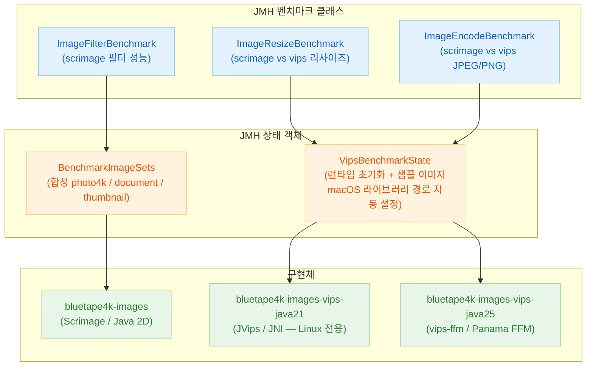
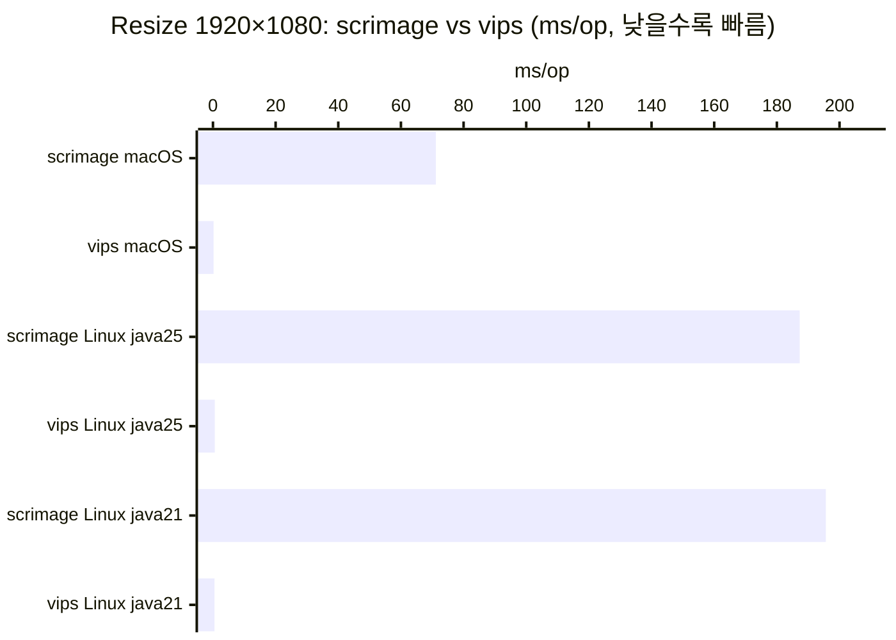
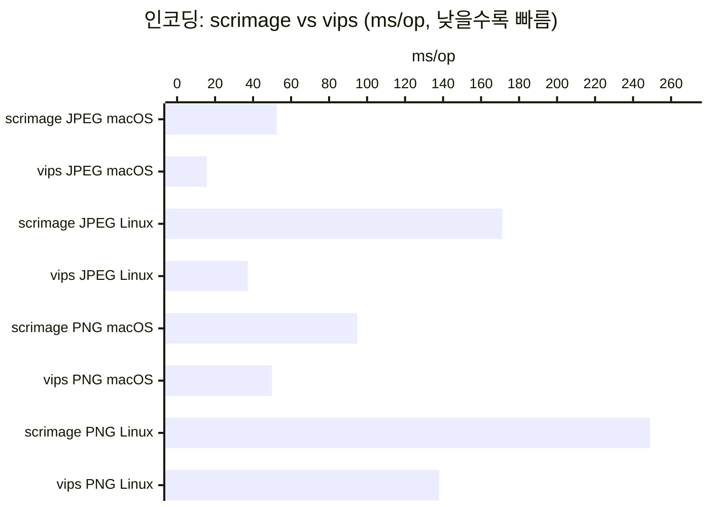
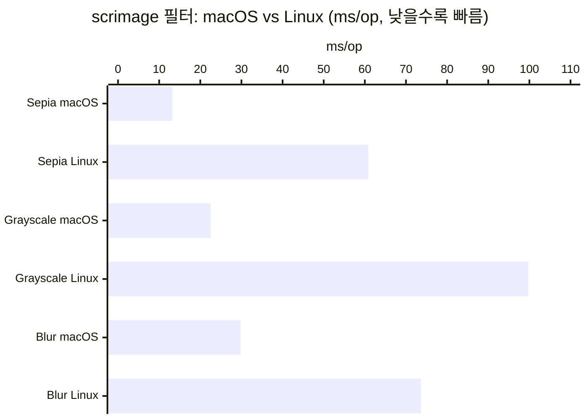

한국어 | [English](./README.md)

# Module bluetape4k-images-benchmark

[scrimage](https://sksamuel.github.io/scrimage/)와 [libvips](https://www.libvips.org/) 이미지 처리 성능을 비교하는 JMH 벤치마크 모듈.

## 아키텍처



## 벤치마크 결과

> AverageTime ms/op. 전체 원본 데이터: [`docs/benchmark-results-2026-04-29.md`](docs/benchmark-results-2026-04-29.md)

### 리사이즈 (4K 3840×2160 → 1920×1080)



| 환경 | scrimage (ms/op) | vips (ms/op) | 속도 향상 |
|------|-----------------|--------------|----------|
| macOS, vips-ffm  | 71.16 ± 2.02  | 0.202 ± 0.006 | **352배** |
| CI Linux, java25 | 187.29 ± 9.07 | 0.591 ± 0.046 | **317배** |
| CI Linux, java21 | 195.63 ± 7.39 | 0.495 ± 0.062 | **395배** |

### 인코딩 (1240×1754 document 이미지)



| 포맷 | 환경 | scrimage (ms/op) | vips (ms/op) | 속도 향상 |
|------|------|-----------------|--------------|----------|
| JPEG | macOS, vips-ffm  | 52.49 ± 0.44   | 15.67 ± 0.27  | **3.3배** |
| JPEG | CI Linux, java25 | 171.16 ± 121.3 | 37.20 ± 0.99  | **4.6배** |
| JPEG | CI Linux, java21 | 161.09 ± 38.9  | 37.22 ± 1.50  | **4.3배** |
| PNG  | macOS, vips-ffm  | 94.87 ± 4.65   | 49.88 ± 1.02  | **1.9배** |
| PNG  | CI Linux, java25 | 249.01 ± 2.14  | 137.95 ± 2.93 | **1.8배** |
| PNG  | CI Linux, java21 | 246.44 ± 2.14  | 255.90 ± 10.2 | −1.04배 ⚠️ |

> ⚠️ **java21 (JNI) PNG**: JNI 경계 오버헤드가 압축 이득을 상쇄합니다. Linux PNG 인코딩은 java25 (FFM) 사용을 권장합니다.

### 필터 (scrimage 전용, 1240×1754)



| 필터      | macOS (ms/op) | CI Linux java25 (ms/op) |
|-----------|--------------|------------------------|
| Sepia     | 13.19 ± 0.49 | 60.83 ± 0.42 |
| Grayscale | 22.51 ± 9.19 | 99.72 ± 23.9 |
| Blur      | 29.80 ± 1.23 | 73.64 ± 1.28 |

---

## 벤치마크 실행

```bash
# Java 25 — scrimage + vips-ffm (Panama FFM, macOS/Linux)
./gradlew :bluetape4k-images-benchmark:benchmarkBenchmark -Pvips.impl=java25

# Java 21 — scrimage + JVips JNI (Linux 전용)
./gradlew :bluetape4k-images-benchmark:benchmarkBenchmark -Pvips.impl=java21
```

**macOS 사전 요구사항**: `brew install vips`

`VipsBenchmarkState`가 macOS를 자동 감지하고 Homebrew 라이브러리 경로를 등록합니다
(`vipsffm.libpath.*.override`). macOS SIP가 `DYLD_LIBRARY_PATH`를 제거하므로 필수.

---

## 벤치마크 클래스

### `ImageResizeBenchmark`

합성 4K 사진(3840×2160)을 여러 해상도로 리사이즈합니다.

| 파라미터     | 값 |
|-------------|-----|
| `resolution` | `1920x1080`, `1280x720` |

```kotlin
@Benchmark
fun scrimage_scaleTo(bh: Blackhole) {
    val resized = BenchmarkImageSets.photo4k.scaleTo(targetWidth, targetHeight)
    bh.consume(resized)
}

@Benchmark
fun vips_resize(state: VipsBenchmarkState, bh: Blackhole) {
    if (!state.vipsAvailable) { bh.consume(null); return }
    state.createVipsImage(state.photo4kJpegBytes).use { img ->
        bh.consume(img.resize(targetWidth, targetHeight))
    }
}
```

### `ImageEncodeBenchmark`

합성 1240×1754 document 이미지를 JPEG/PNG로 인코딩합니다.

```kotlin
@Benchmark
fun scrimage_encodeJpeg(bh: Blackhole) {
    bh.consume(BenchmarkImageSets.document.bytes(JpegWriter(85, false)))
}

@Benchmark
fun vips_encodeJpeg(state: VipsBenchmarkState, bh: Blackhole) {
    if (!state.vipsAvailable) { bh.consume(null); return }
    state.createVipsImage(state.photo4kJpegBytes).use { img ->
        bh.consume(img.toJpegBytes(85))
    }
}
```

### `ImageFilterBenchmark`

1240×1754 document 이미지에 scrimage 필터를 적용합니다.

| 벤치마크             | 필터              |
|----------------------|-----------------|
| `scrimage_blur`      | `BlurFilter`    |
| `scrimage_grayscale` | `GrayscaleFilter` |
| `scrimage_sepia`     | `SepiaFilter`   |

### `VipsBenchmarkState`

JMH `@State(Scope.Thread)` — 리플렉션으로 vips 런타임을 Trial당 1회 초기화합니다
(`FfmVipsRuntime` Java 25 또는 `JVipsRuntime` Java 21 자동 탐색).

```kotlin
@Setup(Level.Trial)
fun setup() {
    photo4kJpegBytes = BenchmarkImageSets.photo4k.bytes(JpegWriter(80, false))
    applyMacOsVipsLibraryPaths()   // macOS에서 vipsffm.libpath.*.override 설정
    vipsAvailable = tryInitVipsRuntime()
}
```
