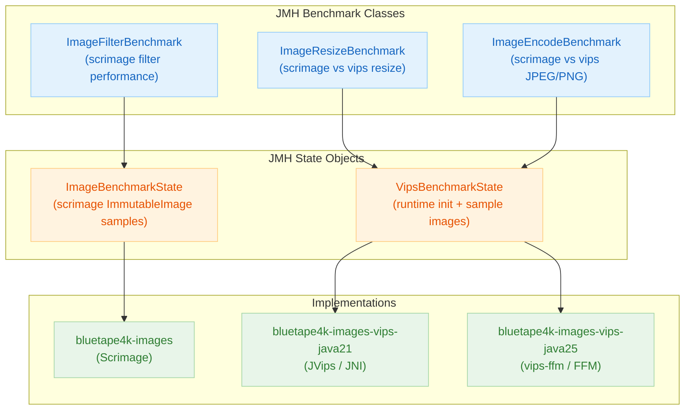

[한국어](./README.ko.md) | English

# Module bluetape4k-images-benchmark

JMH benchmarks comparing scrimage and libvips image processing performance.

## Architecture



## Overview

This module provides JMH benchmarks for comparing:

- **Resize**: scrimage `scaleTo` vs vips `resize` at multiple output sizes
- **Encode**: scrimage JPEG/PNG writer vs vips JPEG/PNG encoder
- **Filter**: scrimage `GrayscaleFilter`, `BlurFilter`, `SepiaFilter` pipeline throughput

## Running Benchmarks

```bash
# Run all benchmarks (default JMH settings)
./gradlew :bluetape4k-images-benchmark:benchmark

# Run with vips java21 binding
./gradlew :bluetape4k-images-benchmark:benchmark -Pvips.impl=java21

# Run with vips java25 binding (requires Java 25 + --enable-native-access)
./gradlew :bluetape4k-images-benchmark:benchmark -Pvips.impl=java25

# Run a specific benchmark class
./gradlew :bluetape4k-images-benchmark:benchmark \
    -Pbenchmark.includes=".*ImageResizeBenchmark.*"

# Custom JMH options (forks, warmup, measurement iterations)
./gradlew :bluetape4k-images-benchmark:benchmark \
    -Pbenchmark.forks=2 \
    -Pbenchmark.warmupIterations=3 \
    -Pbenchmark.measurementIterations=5
```

## Benchmark Classes

### `ImageResizeBenchmark`

Measures resize throughput at multiple output dimensions.

| Parameter | Values |
|-----------|--------|
| `width`   | 320, 640, 1280 |
| `height`  | 240, 480, 720  |
| `impl`    | `scrimage`, `vips` |

```kotlin
@Benchmark
fun resizeScrimage(state: ImageBenchmarkState): ImmutableImage =
    state.image.scaleTo(state.width, state.height)

@Benchmark
fun resizeVips(state: VipsBenchmarkState): VipsImage =
    state.image.resize(state.width, state.height)
```

### `ImageEncodeBenchmark`

Measures JPEG and PNG encoding throughput at different quality levels.

| Parameter | Values |
|-----------|--------|
| `format`  | `JPEG`, `PNG` |
| `quality` | 75, 85, 95 |
| `impl`    | `scrimage`, `vips` |

### `ImageFilterBenchmark`

Measures scrimage filter pipeline throughput.

| Benchmark | Filter |
|-----------|--------|
| `grayscale` | `GrayscaleFilter` |
| `blur`      | `BlurFilter` |
| `sepia`     | `SepiaFilter` |
| `chain`     | `GrayscaleFilter + BlurFilter + SepiaFilter` |

### `VipsBenchmarkState`

JMH `@State` that initializes the vips runtime and loads sample images once per fork.

```kotlin
@State(Scope.Benchmark)
class VipsBenchmarkState {
    lateinit var runtime: VipsRuntime
    lateinit var imageBytes: ByteArray

    @Setup(Level.Trial)
    fun setUp() {
        runtime = vipsRuntimeOf()
        runtime.init(concurrency = 4, maxPixels = 150_000_000L)
        imageBytes = loadSampleImageBytes()  // 1920x1080 JPEG
    }

    @TearDown(Level.Trial)
    fun tearDown() {
        runtime.shutdown()
    }
}
```

## Dependency

```kotlin
dependencies {
    implementation("io.github.bluetape4k:bluetape4k-images-benchmark:${version}")
}
```
