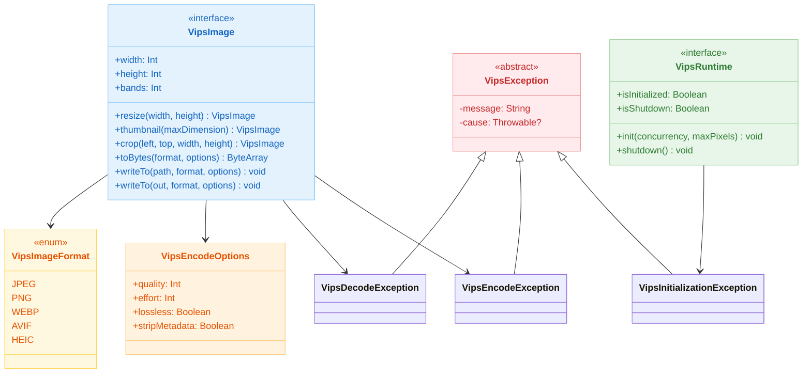

# Module bluetape4k-images-vips-api

[English](./README.md) | 한국어

libvips 기반 이미지 처리를 위한 바인딩 중립(binding-neutral) API입니다. Java 21(JVips)과 Java 25(vips-ffm) 백엔드 구현체에서 공유하는 인터페이스와 값 타입을 정의합니다. 기본 libvips 바인딩에 관계없이 통일된 인터페이스가 필요할 때 이 모듈을 사용하세요.

## 아키텍처

### 클래스 다이어그램



### 처리 파이프라인

```mermaid
flowchart LR
    subgraph Init["초기화"]
        RT["VipsRuntime.init()"]
    end

    subgraph Input["입력 소스"]
        FILE["파일 / Path"]
        BA["ByteArray"]
        IS["InputStream"]
    end

    subgraph Loading["이미지 로드"]
        IMG["VipsImage<br/>(vipsImageOf)"]
    end

    subgraph Operations["이미지 조작"]
        RESIZE["resize()"]
        THUMB["thumbnail()"]
        CROP["crop()"]
    end

    subgraph Output["비동기 출력 (Coroutines)"]
        BYTES["suspendToBytes()"]
        FILE_OUT["suspendWriteTo(Path)"]
        STREAM_OUT["suspendWriteTo(OutputStream)"]
    end

    subgraph Cleanup["정리"]
        CLOSE["close()"]
    end

    Init --> Input
    Input --> Loading
    Loading --> Operations
    Operations --> Output
    Output --> Cleanup

    classDef initStyle fill:#E8F5E9,stroke:#A5D6A7,color:#2E7D32
    classDef inputStyle fill:#F57F17,stroke:#F57F17,color:#FFFFFF
    classDef opStyle fill:#E3F2FD,stroke:#90CAF9,color:#1565C0
    classDef asyncStyle fill:#F3E5F5,stroke:#CE93D8,color:#6A1B9A
    classDef cleanStyle fill:#FFEBEE,stroke:#EF9A9A,color:#C62828

    class RT initStyle
    class FILE,BA,IS inputStyle
    class IMG,RESIZE,THUMB,CROP opStyle
    class BYTES,FILE_OUT,STREAM_OUT asyncStyle
    class CLOSE cleanStyle
```



## 주요 기능

### 핵심 인터페이스

| 타입 | 용도 |
|------|------|
| `VipsImage` | libvips 이미지 추상화: 리사이즈, 크롭, 썸네일, 인코딩/디코딩 |
| `VipsRuntime` | 런타임 라이프사이클: 초기화 및 종료 |
| `VipsEncodeOptions` | 인코딩 옵션: 품질, 노력도, 메타데이터 제거 여부 |
| `VipsImageFormat` | 지원 포맷: JPEG, PNG, WebP 및 incubating AVIF/HEIC |

### 예외 계층

| 예외 | 원인 | 복구 가능? |
|------|------|----------|
| `VipsException` | 모든 libvips 에러의 기반 클래스 | 아니오 |
| `VipsDecodeException` | 디코딩 실패: 미지원 포맷, 손상된 입력, 크기 초과 | 아니오 |
| `VipsEncodeException` | 인코딩 실패: I/O 에러, 잘못된 옵션 | 아니오 |
| `VipsInitializationException` | 런타임 초기화 실패 또는 종료 후 재초기화 시도 (프로세스 재시작 필요) | 아니오 |

### 인코딩 옵션

```kotlin
// 기본값 (quality=85, effort=4)
VipsEncodeOptions.Default

// 고품질 (quality=95, effort=6)
VipsEncodeOptions.HighQuality

// 저대역폭 (quality=60, effort=3)
VipsEncodeOptions.LowBandwidth

// 커스텀
VipsEncodeOptions(quality = 80, effort = 5, lossless = false, stripMetadata = true)
```

### 지원 포맷

| 포맷 | 상태 | 특징 |
|------|------|------|
| JPEG | 안정화 | 손실 압축, 실시간 처리에 빠름 |
| PNG | 안정화 | 무손실, 투명도 보존 |
| WebP | 안정화 | 최신 포맷, 최고 압축률 |
| AVIF | Incubating | libvips 빌드에 libaom 필요 |
| HEIC | Incubating | libvips 빌드에 libheif 필요 |

## 사용 예시

### 초기화 및 이미지 로드

```kotlin
import io.bluetape4k.images.vips.*
import java.nio.file.Paths
import kotlin.use

// libvips 런타임 초기화 (프로세스당 1회)
val runtime = vipsRuntimeOf()
runtime.init(concurrency = 4, maxPixels = 150_000_000L)

// 이미지 로드 및 처리
vipsImageOf(Paths.get("input.jpg")).use { image ->
    println("너비: ${image.width}, 높이: ${image.height}, 채널: ${image.bands}")
    
    // 리사이즈
    val resized = image.resize(640, 480)
    resized.close()  // 수동 정리
}

// JVM 종료 시 종료
Runtime.getRuntime().addShutdownHook(Thread { runtime.shutdown() })
```

### 리사이즈 및 인코딩

```kotlin
import io.bluetape4k.images.vips.*
import java.nio.file.Paths

vipsImageOf(Paths.get("photo.jpg")).use { image ->
    // 썸네일 (비율 유지, 800px 맞춤)
    val thumbnail = image.thumbnail(800)
    
    // WebP로 인코딩 (커스텀 옵션)
    val options = VipsEncodeOptions(quality = 75, effort = 5)
    val webpBytes = thumbnail.toBytes(VipsImageFormat.WEBP, options)
    
    // 파일로 저장
    thumbnail.writeTo(Paths.get("thumbnail.webp"), VipsImageFormat.WEBP, options)
}
```

### Coroutine 기반 비동기 인코딩

```kotlin
import io.bluetape4k.images.vips.*
import io.bluetape4k.images.vips.coroutines.*
import java.nio.file.Paths

suspend fun processImageAsync(inputPath: String) {
    vipsImageOf(Paths.get(inputPath)).use { image ->
        val thumbnail = image.thumbnail(400)
        
        // Suspend 인코딩 (Dispatchers.IO에서 실행)
        val jpegBytes = thumbnail.suspendToBytes(
            format = VipsImageFormat.JPEG,
            options = VipsEncodeOptions.HighQuality
        )
        
        // Suspend 파일 쓰기
        thumbnail.suspendWriteTo(
            Paths.get("output.jpg"),
            VipsImageFormat.JPEG,
            VipsEncodeOptions.Default
        )
    }
}
```

### 크롭 및 다중 연산 체인

```kotlin
import io.bluetape4k.images.vips.*

vipsImageOf(Paths.get("large.jpg")).use { image ->
    // 영역 크롭
    val cropped = image.crop(left = 100, top = 50, width = 400, height = 300)
    
    // 크롭된 영역 리사이즈
    val scaled = cropped.resize(200, 150)
    
    // 저대역폭 설정으로 인코딩
    val pngBytes = scaled.toBytes(VipsImageFormat.PNG, VipsEncodeOptions.LowBandwidth)
}
```

## 예외 처리

```kotlin
import io.bluetape4k.images.vips.*

try {
    val image = vipsImageOf(Paths.get("image.jpg"))
    val bytes = image.toBytes(VipsImageFormat.WEBP)
} catch (e: VipsDecodeException) {
    // 이미지 파일이 손상되었거나 미지원 포맷
    logger.error("이미지 디코딩 실패: ${e.message}", e.cause)
} catch (e: VipsEncodeException) {
    // 인코딩 실패 (I/O 에러 또는 잘못된 옵션)
    logger.error("이미지 인코딩 실패: ${e.message}", e.cause)
} catch (e: VipsInitializationException) {
    // 런타임이 초기화되지 않았거나 이미 종료됨
    // 프로세스 재시작 필요
    logger.fatal("VipsRuntime을 사용할 수 없음, 프로세스 재시작 필요", e.cause)
    System.exit(1)
}
```

## 스레드 안전성 및 라이프사이클

### VipsImage

- **스레드 안전하지 않음**: 각 `VipsImage` 인스턴스는 단일 스레드에 바인딩됨
- **리소스 관리**: 네이티브 메모리 해제를 위해 반드시 `close()` 호출 또는 `use { }` 사용
- **불변 연산**: 모든 연산은 새로운 `VipsImage` 인스턴스를 반환하며, 원본은 절대 변경되지 않음

```kotlin
// 좋은 예: 리소스 정리
vipsImageOf(path).use { image ->
    val resized = image.resize(640, 480)
    resized.close()
}

// 나쁜 예: 리소스 누수
val image = vipsImageOf(path)  // 네이티브 메모리 할당
val resized = image.resize(640, 480)  // 정리하지 않으면 둘 다 누수
```

### VipsRuntime

- **스레드 안전 초기화**: atomic CAS 사용, `@Synchronized` 미사용
- **Virtual Thread 친화적**: 모니터 잠금 없음, Virtual Thread 호환
- **터미널 종료**: `shutdown()` 은 불가역적이며, 종료 후 `init()` 호출 시 `VipsInitializationException` 발생

```kotlin
// 1회만 초기화
runtime.init()

// 종료 후 재초기화 불가능
runtime.shutdown()
runtime.init()  // VipsInitializationException: 프로세스 재시작 필요
```

### Spring Boot 주의사항

VipsRuntime.shutdown()을 `@PreDestroy` 빈 메서드로 등록하지 마세요. Spring DevTools가 ApplicationContext를 다시 로드하면 `@PreDestroy` 훅을 호출하여 shutdown → init 순서로 실행되어 `VipsInitializationException`이 발생합니다. 대신 JVM 종료 훅만 사용하세요:

```kotlin
// 좋은 예: JVM 종료 훅
Runtime.getRuntime().addShutdownHook(Thread { vipsRuntime.shutdown() })

// 나쁜 예: Spring @PreDestroy (devtools 리로드 시 실패)
@Bean
fun vipsRuntimeBean(): VipsRuntime {
    val runtime = vipsRuntimeOf()
    runtime.init()
    return runtime
}

@PreDestroy
fun shutdownVips() {  // 하지 마세요
    vipsRuntime.shutdown()
}
```

## 보안 고려사항

### 메시지 보안

예외 메시지는 내부 정보(파일 경로, 메모리 주소)를 누출하지 않도록 정제됩니다. 상세한 에러 컨텍스트는 `cause` 필드에 서버 로그용으로만 보존됩니다:

```kotlin
try {
    image.toBytes(format)
} catch (e: VipsEncodeException) {
    // 사용자 대면 API에 안전
    response.error = e.message  // "이미지 인코딩 실패: ..."
    
    // 서버 로그용 상세 정보
    logger.error("인코딩 에러: ${e.cause?.message}", e.cause)
}
```

### 경로 탐색(Path Traversal)

`writeTo(Path, ...)` 메서드는 경로를 검증하지 않습니다. 호출자는 경로가 허용된 디렉토리 내에 있는지 확인해야 합니다:

```kotlin
// 좋은 예: 호출 전 검증
val outputDir = Paths.get("/var/images/uploads")
val userPath = outputDir.resolve(sanitizedFilename)
image.writeTo(userPath, format)  // 경로가 안전함

// 나쁜 예: 신뢰할 수 없는 사용자 경로
val userPath = Paths.get(userInput)
image.writeTo(userPath, format)  // 경로 탐색 가능
```

## 모듈 통합

이 모듈은 API 레이어만 제공합니다. 실제 이미지 처리를 위해 구현체에 의존해야 합니다:

```kotlin
dependencies {
    api("io.github.bluetape4k:bluetape4k-images-vips-api:${version}")
    
    // 다음 중 하나를 선택하세요:
    runtimeOnly("io.github.bluetape4k:bluetape4k-images-vips-java21:${version}")  // JVips (Java 21+)
    // 또는
    runtimeOnly("io.github.bluetape4k:bluetape4k-images-vips-java25:${version}")  // vips-ffm (Java 25+)
}
```

## testFixtures

### VipsGoldenAssert

`testFixtures`는 vips 연산에 대한 픽셀 단위 골든 이미지 비교를 위한 `VipsGoldenAssert`를 제공합니다.

- **갱신 모드**: Java 25+ 가드 적용 (`@EnabledForJreRange(min = JRE.JAVA_25)`) — java25 모듈만이 공식 골든 이미지를 생성합니다
- **CI 가드**: CI 환경에서 골든 이미지 재생성을 방지하기 위해 갱신 모드를 차단합니다
- **비교 허용 오차**: 채널당 픽셀 차이 허용 오차 설정 가능 (기본값: 2.0)

```kotlin
// testFixtures에 의존하는 테스트에서
VipsGoldenAssert(goldenDir = Path.of("src/testFixtures/resources/golden/vips"))
    .assertMatchesGolden(resultImage, "resize_800x600.png")
```

## 참고

- `bluetape4k-images-vips-java21` — Java 21+ 용 JVips 바인딩
- `bluetape4k-images-vips-java25` — Java 25+ 용 Foreign Function Memory 바인딩
- `bluetape4k-images` — 고수준 이미지 조작 (Scrimage 기반, incubating AVIF/HEIC 인터페이스)
