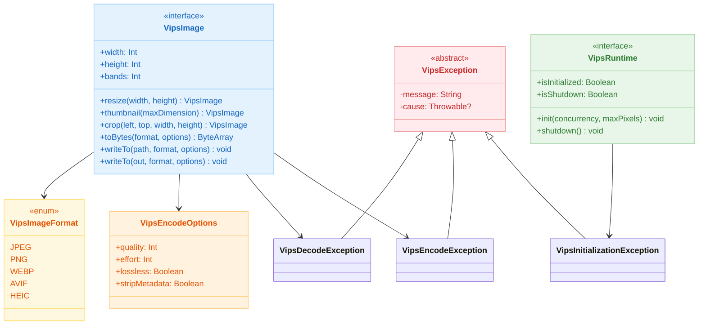

# Module bluetape4k-images-vips-api

English | [한국어](./README.ko.md)

Binding-neutral API for libvips-backed image processing. Defines shared interfaces and value types for both Java 21 (JVips) and Java 25 (vips-ffm) backend implementations. Use this module when you need a unified interface independent of the underlying libvips binding.

## Architecture

### Class Diagram



### Processing Pipeline

```mermaid
flowchart LR
    subgraph Init["Initialization"]
        RT["VipsRuntime.init()"]
    end

    subgraph Input["Input Sources"]
        FILE["File / Path"]
        BA["ByteArray"]
        IS["InputStream"]
    end

    subgraph Loading["Image Loading"]
        IMG["VipsImage<br/>(vipsImageOf)"]
    end

    subgraph Operations["Image Operations"]
        RESIZE["resize()"]
        THUMB["thumbnail()"]
        CROP["crop()"]
    end

    subgraph Output["Async Output (Coroutines)"]
        BYTES["suspendToBytes()"]
        FILE_OUT["suspendWriteTo(Path)"]
        STREAM_OUT["suspendWriteTo(OutputStream)"]
    end

    subgraph Cleanup["Cleanup"]
        CLOSE["close()"]
    end

    Init --> Input
    Input --> Loading
    Loading --> Operations
    Operations --> Output
    Output --> Cleanup

    classDef initStyle fill:#E8F5E9,stroke:#A5D6A7,color:#2E7D32
    classDef inputStyle fill:#F57F17,stroke:#F57F17,color:#FFFFFF
    classDef opStyle fill:#E3F2FD,stroke:#90CAF9,color:#1565C0
    classDef asyncStyle fill:#F3E5F5,stroke:#CE93D8,color:#6A1B9A
    classDef cleanStyle fill:#FFEBEE,stroke:#EF9A9A,color:#C62828

    class RT initStyle
    class FILE,BA,IS inputStyle
    class IMG,RESIZE,THUMB,CROP opStyle
    class BYTES,FILE_OUT,STREAM_OUT asyncStyle
    class CLOSE cleanStyle
```



## Key Features

### Core Interfaces

| Type | Purpose |
|------|---------|
| `VipsImage` | libvips image abstraction: resize, crop, thumbnail, encode/decode operations |
| `VipsRuntime` | Runtime lifecycle: initialization and graceful shutdown |
| `VipsEncodeOptions` | Encoding parameters: quality, effort, metadata stripping |
| `VipsImageFormat` | Supported output formats: JPEG, PNG, WebP, and incubating AVIF/HEIC |

### Exception Hierarchy

| Exception | Cause | Recover? |
|-----------|-------|----------|
| `VipsException` | Base class for all libvips errors | No |
| `VipsDecodeException` | Image decode failed: unsupported format, corrupted input, size exceeded | No |
| `VipsEncodeException` | Image encode failed: I/O error, invalid options | No |
| `VipsInitializationException` | Runtime init failed or re-init after shutdown (process restart required) | No |

### Encoding Options

```kotlin
// Default (quality=85, effort=4)
VipsEncodeOptions.Default

// High quality (quality=95, effort=6)
VipsEncodeOptions.HighQuality

// Low bandwidth (quality=60, effort=3)
VipsEncodeOptions.LowBandwidth

// Custom
VipsEncodeOptions(quality = 80, effort = 5, lossless = false, stripMetadata = true)
```

### Supported Formats

| Format | Status | Notes |
|--------|--------|-------|
| JPEG | Stable | Lossy, fast for real-time processing |
| PNG | Stable | Lossless, preserves transparency |
| WebP | Stable | Modern format, best compression |
| AVIF | Incubating | Requires libaom in libvips build |
| HEIC | Incubating | Requires libheif in libvips build |

## Usage Examples

### Initialize and Load Image

```kotlin
import io.bluetape4k.images.vips.*
import java.nio.file.Paths
import kotlin.use

// Initialize libvips runtime (once per process)
val runtime = vipsRuntimeOf()
runtime.init(concurrency = 4, maxPixels = 150_000_000L)

// Load and process image
vipsImageOf(Paths.get("input.jpg")).use { image ->
    println("Width: ${image.width}, Height: ${image.height}, Bands: ${image.bands}")
    
    // Resize
    val resized = image.resize(640, 480)
    resized.close()  // Manual cleanup
}

// Shutdown on JVM exit
Runtime.getRuntime().addShutdownHook(Thread { runtime.shutdown() })
```

### Resize and Encode

```kotlin
import io.bluetape4k.images.vips.*
import java.nio.file.Paths

vipsImageOf(Paths.get("photo.jpg")).use { image ->
    // Thumbnail (maintain aspect ratio, fit to 800px)
    val thumbnail = image.thumbnail(800)
    
    // Encode to WebP with custom options
    val options = VipsEncodeOptions(quality = 75, effort = 5)
    val webpBytes = thumbnail.toBytes(VipsImageFormat.WEBP, options)
    
    // Save to file
    thumbnail.writeTo(Paths.get("thumbnail.webp"), VipsImageFormat.WEBP, options)
}
```

### Coroutine-based Async Encoding

```kotlin
import io.bluetape4k.images.vips.*
import io.bluetape4k.images.vips.coroutines.*
import java.nio.file.Paths

suspend fun processImageAsync(inputPath: String) {
    vipsImageOf(Paths.get(inputPath)).use { image ->
        val thumbnail = image.thumbnail(400)
        
        // Suspend encoding (runs on Dispatchers.IO)
        val jpegBytes = thumbnail.suspendToBytes(
            format = VipsImageFormat.JPEG,
            options = VipsEncodeOptions.HighQuality
        )
        
        // Suspend file write
        thumbnail.suspendWriteTo(
            Paths.get("output.jpg"),
            VipsImageFormat.JPEG,
            VipsEncodeOptions.Default
        )
    }
}
```

### Crop and Multi-Operation Chain

```kotlin
import io.bluetape4k.images.vips.*

vipsImageOf(Paths.get("large.jpg")).use { image ->
    // Crop region
    val cropped = image.crop(left = 100, top = 50, width = 400, height = 300)
    
    // Resize the cropped region
    val scaled = cropped.resize(200, 150)
    
    // Encode with low bandwidth settings
    val pngBytes = scaled.toBytes(VipsImageFormat.PNG, VipsEncodeOptions.LowBandwidth)
}
```

## Exception Handling

```kotlin
import io.bluetape4k.images.vips.*

try {
    val image = vipsImageOf(Paths.get("image.jpg"))
    val bytes = image.toBytes(VipsImageFormat.WEBP)
} catch (e: VipsDecodeException) {
    // Image file is corrupted or unsupported format
    logger.error("Failed to decode image: ${e.message}", e.cause)
} catch (e: VipsEncodeException) {
    // Encoding failed (I/O error or invalid options)
    logger.error("Failed to encode image: ${e.message}", e.cause)
} catch (e: VipsInitializationException) {
    // Runtime not initialized or already shutdown
    // Process must be restarted
    logger.fatal("VipsRuntime is unusable, process restart required", e.cause)
    System.exit(1)
}
```

## Thread Safety and Lifecycle

### VipsImage

- **Not thread-safe**: Each `VipsImage` instance is bound to a single thread
- **Resource management**: Must call `close()` or use `use { }` to free native memory
- **Immutable operations**: All operations return new `VipsImage` instances; original is never mutated

```kotlin
// GOOD: Resource cleanup
vipsImageOf(path).use { image ->
    val resized = image.resize(640, 480)
    resized.close()
}

// BAD: Resource leak
val image = vipsImageOf(path)  // Native memory allocated
val resized = image.resize(640, 480)  // Both leak if not closed
```

### VipsRuntime

- **Thread-safe initialization**: Using atomic CAS, not `@Synchronized`
- **Virtual Thread friendly**: No monitor locking, compatible with Virtual Threads
- **Terminal shutdown**: `shutdown()` is irreversible; `init()` after shutdown throws `VipsInitializationException`

```kotlin
// Initialize once
runtime.init()

// Cannot re-initialize after shutdown
runtime.shutdown()
runtime.init()  // VipsInitializationException: process restart required
```

### Spring Boot Caution

Do NOT register `VipsRuntime.shutdown()` as a `@PreDestroy` bean method. Spring DevTools reloads the ApplicationContext by calling `@PreDestroy` hooks, which would trigger shutdown followed by init—resulting in `VipsInitializationException`. Instead, use only JVM shutdown hooks:

```kotlin
// GOOD: JVM shutdown hook
Runtime.getRuntime().addShutdownHook(Thread { vipsRuntime.shutdown() })

// BAD: Spring @PreDestroy (fails with devtools reload)
@Bean
fun vipsRuntimeBean(): VipsRuntime {
    val runtime = vipsRuntimeOf()
    runtime.init()
    return runtime
}

@PreDestroy
fun shutdownVips() {  // DON'T DO THIS
    vipsRuntime.shutdown()
}
```

## Security Considerations

### Message Security

Exception messages are sanitized to avoid leaking internal information (file paths, memory addresses). Detailed error context is preserved in the `cause` field for server-side logging only:

```kotlin
try {
    image.toBytes(format)
} catch (e: VipsEncodeException) {
    // Safe for user-facing API
    response.error = e.message  // "Image encode failed: ..."
    
    // Detailed context for server logs
    logger.error("Encode error: ${e.cause?.message}", e.cause)
}
```

### Path Traversal

The `writeTo(Path, ...)` method does **not** validate paths. Callers must ensure the path is within an allowed directory:

```kotlin
// GOOD: Validate before calling
val outputDir = Paths.get("/var/images/uploads")
val userPath = outputDir.resolve(sanitizedFilename)
image.writeTo(userPath, format)  // Path is safe

// BAD: Untrusted user path
val userPath = Paths.get(userInput)
image.writeTo(userPath, format)  // Path traversal possible
```

## Module Integration

This module provides only the API layer. For actual image processing, depend on an implementation:

```kotlin
dependencies {
    api("io.github.bluetape4k:bluetape4k-images-vips-api:${version}")
    
    // Choose ONE implementation:
    runtimeOnly("io.github.bluetape4k:bluetape4k-images-vips-java21:${version}")  // JVips (Java 21+)
    // OR
    runtimeOnly("io.github.bluetape4k:bluetape4k-images-vips-java25:${version}")  // vips-ffm (Java 25+)
}
```

## testFixtures

### VipsGoldenAssert

`testFixtures` provides `VipsGoldenAssert` for pixel-level golden image comparison of vips operations.

- **Update mode**: guarded by Java 25+ (`@EnabledForJreRange(min = JRE.JAVA_25)`) — only the java25 module generates authoritative golden images
- **CI guard**: update mode is blocked in CI environments to prevent accidental golden regeneration
- **Comparison tolerance**: configurable per-channel pixel delta tolerance (default: 2.0)

```kotlin
// In tests that depend on testFixtures
VipsGoldenAssert(goldenDir = Path.of("src/testFixtures/resources/golden/vips"))
    .assertMatchesGolden(resultImage, "resize_800x600.png")
```

## See Also

- `bluetape4k-images-vips-java21` — JVips binding for Java 21+
- `bluetape4k-images-vips-java25` — Foreign Function Memory binding for Java 25+
- `bluetape4k-images` — High-level image operations (Scrimage-based, incubating AVIF/HEIC interfaces)
