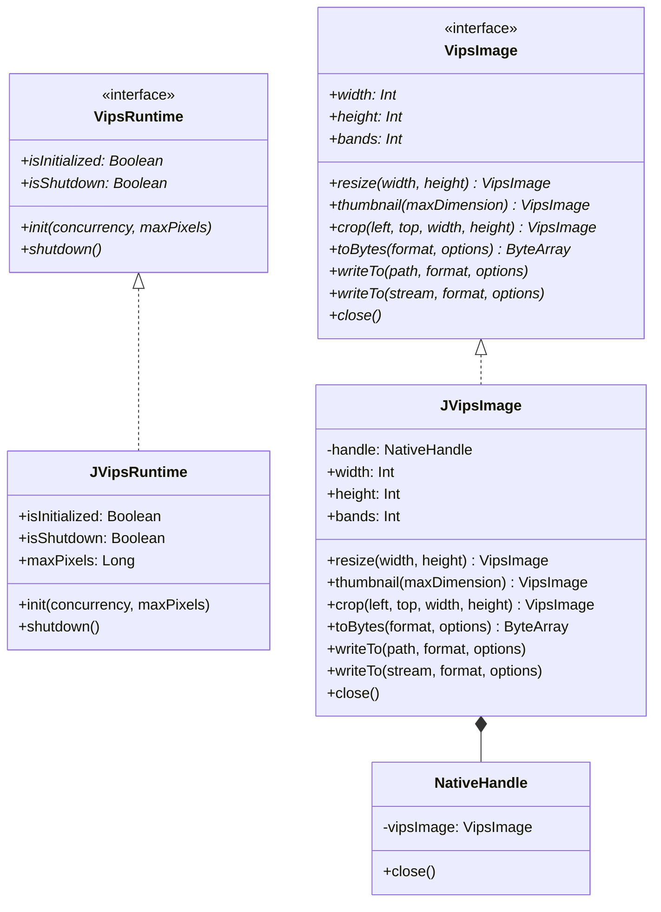

# Module bluetape4k-images-vips-java21

[English](./README.md) | 한국어

JVips(JNI) 백엔드로 libvips 이미지 처리 구현. Java 21+ 환경에서 네이티브 바인딩을 통한 고속, 메모리 효율적 이미지 조작을 제공합니다. Linux에서는 JVips가 네이티브 `.so` 라이브러리를 번들로 제공하며, macOS에서는 시스템 libvips가 필요합니다.

## 아키텍처

### JVips 처리 파이프라인

```mermaid
flowchart LR
    subgraph Input["입력 소스"]
        BA["ByteArray"]
        FILE["File / Path"]
        IS["InputStream"]
    end

    subgraph Init["런타임 초기화"]
        INIT["JVipsRuntime.init()"]
        STATE["AtomicReference<br/>(상태 머신)"]
        CHECK["동시성 &<br/>maxPixels 설정"]
    end

    subgraph Load["이미지 로드<br/>(보안 검사)"]
        FORMAT["매직 바이트<br/>허용 목록<br/>(JPEG|PNG|WebP)"]
        SIZE["50 MB 제한<br/>확인"]
        PIXELS["maxPixels<br/>검증"]
        DECODE["VipsImage<br/>디코드 (JNI)"]
    end

    subgraph Operations["이미지 연산<br/>(불변)"]
        RESIZE["resize(w, h)"]
        THUMB["thumbnail(max)"]
        CROP["crop(l, t, w, h)"]
    end

    subgraph Output["출력 (불변)"]
        BYTES["toBytes(format)"]
        WRITE_PATH["writeTo(path)"]
        WRITE_STREAM["writeTo(stream)"]
    end

    subgraph Close["리소스 정리"]
        GC["Cleaner 기반<br/>참조 정리"]
        CLOSE["close()"]
    end

    Input --> Init
    Init --> Load
    Load --> Operations
    Operations --> Output
    Output --> Close

    classDef dataStyle fill:#F57F17,stroke:#F57F17,color:#000000
    classDef initStyle fill:#E0F2F1,stroke:#4DB6AC,color:#004D40
    classDef loadStyle fill:#FFF9C4,stroke:#FFD54F,color:#F57F00
    classDef opsStyle fill:#E1BEE7,stroke:#BA68C8,color:#512DA8
    classDef outputStyle fill:#B3E5FC,stroke:#4FC3F7,color:#01579B
    classDef closeStyle fill:#FFCCBC,stroke:#FF8A65,color:#BF360C

    class BA,FILE,IS dataStyle
    class INIT,STATE,CHECK initStyle
    class FORMAT,SIZE,PIXELS,DECODE loadStyle
    class RESIZE,THUMB,CROP opsStyle
    class BYTES,WRITE_PATH,WRITE_STREAM outputStyle
    class GC,CLOSE closeStyle
```



### 클래스 다이어그램



## 설정

### macOS

Homebrew를 통해 시스템 libvips 설치:

```bash
brew install vips
```

설치 확인:

```bash
vips --version
```

### Linux

대부분의 배포판에서 libvips-tools 설치:

```bash
# Debian / Ubuntu
sudo apt-get install libvips-tools

# RHEL / CentOS / Fedora
sudo yum install vips-tools

# Alpine
apk add vips
```

JVips 라이브러리는 네이티브 `.so` 파일을 번들로 제공하므로, 시스템 패키지 설치 이상의 추가 설정이 필요하지 않습니다.

### Gradle 의존성

`build.gradle.kts`에 추가:

```kotlin
dependencies {
    implementation("io.bluetape4k:bluetape4k-images-vips-java21:1.7.0")
}
```

또는 BOM 사용:

```kotlin
dependencies {
    implementation(platform("io.bluetape4k:bluetape4k-bom:1.7.0"))
    implementation("io.bluetape4k:bluetape4k-images-vips-java21")
}
```

## 특징

- **JNI 네이티브 바인딩**: JVips JNI를 통한 libvips C 라이브러리 직접 접근
- **고속 & 메모리 효율**: 4000x3000 이미지를 100ms 이내로 처리
- **기본 보안**: 포맷 허용 목록(JPEG/PNG/WebP), 50 MB 입력 제한, maxPixels 검증
- **불변 연산**: 모든 이미지 연산은 새 인스턴스 반환 (제자리 변이 없음)
- **코루틴 지원**: 비동기 변형은 `Dispatchers.IO`로 블로킹 JNI 호출을 래핑
- **다양한 출력 포맷**: JPEG(손실), PNG(무손실), WebP(최고 압축)
- **Virtual Thread 안전**: `@Synchronized` 블록 대신 `AtomicReference<State>` CAS 사용

## 사용 예제

### 기본 초기화 및 이미지 로드

```kotlin
import io.bluetape4k.images.vips.java21.JVipsRuntime
import io.bluetape4k.images.vips.java21.vipsImageOf
import io.bluetape4k.images.vips.VipsImageFormat
import java.nio.file.Paths

fun main() {
    // JVips 런타임 초기화 (애플리케이션당 1회 필수)
    JVipsRuntime.init(concurrency = 4, maxPixels = 150_000_000L)
    
    try {
        // 파일에서 이미지 로드
        val imagePath = Paths.get("sample.jpg")
        vipsImageOf(imagePath).use { image ->
            println("이미지 크기: ${image.width}x${image.height}, 채널: ${image.bands}")
        }
    } finally {
        // 프로세스 종료 전 셧다운
        JVipsRuntime.shutdown()
    }
}
```

### 리사이즈 및 WebP 변환

```kotlin
import io.bluetape4k.images.vips.java21.vipsImageOf
import io.bluetape4k.images.vips.VipsImageFormat
import java.nio.file.Paths

fun resizeAndConvert(inputPath: String, outputPath: String) {
    vipsImageOf(Paths.get(inputPath)).use { original ->
        // 800x600으로 리사이즈, 종횡비 유지
        original.resize(800, 600).use { resized ->
            // WebP로 변환 및 저장
            resized.writeTo(
                Paths.get(outputPath),
                format = VipsImageFormat.WEBP
            )
        }
    }
}
```

### 썸네일 생성

```kotlin
import io.bluetape4k.images.vips.java21.vipsImageOf
import io.bluetape4k.images.vips.VipsImageFormat
import io.bluetape4k.images.vips.VipsEncodeOptions
import java.nio.file.Paths

fun generateThumbnail(inputPath: String, outputPath: String) {
    vipsImageOf(Paths.get(inputPath)).use { original ->
        // 긴 변 = 300px 썸네일 생성
        original.thumbnail(300).use { thumbnail ->
            // JPEG로 인코딩 (품질 85)
            thumbnail.writeTo(
                Paths.get(outputPath),
                format = VipsImageFormat.JPEG,
                options = VipsEncodeOptions.JpegOptions(quality = 85)
            )
        }
    }
}
```

### ByteArray에서 보안 검사를 통한 로드

```kotlin
import io.bluetape4k.images.vips.java21.vipsImageOf
import io.bluetape4k.images.vips.VipsDecodeException
import java.io.File

fun loadImageFromBytes(bytes: ByteArray): Int {
    return try {
        vipsImageOf(bytes).use { image ->
            println("${image.width}x${image.height} 이미지 로드됨")
            image.width * image.height
        }
    } catch (e: VipsDecodeException) {
        System.err.println("지원되지 않는 포맷 또는 이미지가 너무 큼: ${e.message}")
        0
    }
}
```

### 코루틴 기반 비동기 로드

```kotlin
import io.bluetape4k.images.vips.java21.suspendVipsImageOf
import io.bluetape4k.images.vips.VipsImageFormat
import kotlinx.coroutines.runBlocking
import java.nio.file.Paths

fun main() = runBlocking {
    // Dispatchers.IO에서 비동기로 이미지 로드
    val image = suspendVipsImageOf(Paths.get("large.png"))
    
    image.use { img ->
        val thumbnail = img.thumbnail(500)
        
        thumbnail.use { thumb ->
            thumb.writeTo(
                Paths.get("thumbnail.webp"),
                format = VipsImageFormat.WEBP
            )
        }
    }
}
```

### 이미지 자르기 및 출력

```kotlin
import io.bluetape4k.images.vips.java21.vipsImageOf
import io.bluetape4k.images.vips.VipsImageFormat
import java.io.ByteArrayOutputStream
import java.nio.file.Paths

fun cropAndExportBytes(imagePath: String): ByteArray {
    return vipsImageOf(Paths.get(imagePath)).use { original ->
        // (50, 50) 좌표에서 시작하는 200x200 영역 자르기
        original.crop(left = 50, top = 50, width = 200, height = 200).use { cropped ->
            // PNG로 내보내기 (무손실)
            cropped.toBytes(VipsImageFormat.PNG)
        }
    }
}
```

## 보안 고려사항

모든 공개 `vipsImageOf*` 함수는 순서대로 보안 검사를 적용합니다:

1. **포맷 허용 목록**: JPEG, PNG, WebP 포맷만 수락
   - JPEG: 매직 바이트 `FF D8 FF`
   - PNG: 매직 바이트 `89 50 4E 47`
   - WebP: RIFF 헤더 + 오프셋 8의 `WEBP` 마커

2. **입력 크기 제한**: 입력 스트림당 최대 50 MB

3. **최대 픽셀 검증**: `너비 × 높이 × 채널`이 설정된 임계값(기본값: 1억 5천만 픽셀)을 초과하지 않아야 함

지원되지 않는 포맷이나 위반은 설명적인 오류 메시지와 함께 `VipsDecodeException`을 발생시킵니다.

## 동시성 & 스레드 안전성

- **JVipsRuntime 싱글턴**: `AtomicReference<State>` CAS를 통한 스레드 안전성 보장
- **동시 초기화**: Virtual Thread 안전한 스핀 대기 (블로킹 없음, `@Synchronized` 없음)
- **VipsImage 인스턴스**: 단일 스레드 전용. 동기화 없이 코루틴이나 스레드 간 공유 금지
- **JNI 호출**: Gradle에서 `forkEvery = 1`로 테스트 격리

## 테스트

테스트는 libvips 설치를 요구합니다. 다음 명령으로 실행:

```bash
# 전체 테스트 스위트 (libvips 필수)
./gradlew :bluetape4k-images-vips-java21:test -Dvips.enabled=true

# 태그된 실행에 vips 테스트 포함
./gradlew test -PincludeTags=vips-required

# vips 테스트 스킵 (기본값)
./gradlew test
```

테스트 클래스는 `@Tag("vips-required")`로 태그되며 명시적으로 활성화되지 않으면 건너뜁니다.

### 골든 이미지 테스트

`images-vips-api` testFixtures(`src/testFixtures/resources/golden/vips/`)에 저장된 골든 이미지와 vips 연산 결과를 비교합니다.

- libvips가 설치된 Linux에서 `-Dvips.enabled=true`로 실행
- 골든 이미지는 java25 모듈에서만 생성됩니다 (`@EnabledForJreRange(min = JRE.JAVA_25)` 가드로 이 모듈에서의 재생성 방지)
- 채널당 픽셀 차이 허용 오차 설정 가능

### 속성 기반 테스트

5가지 불변식 × 3가지 포맷(JPEG/PNG/WebP)을 `@ParameterizedTest`로 검증합니다.

| 불변식 | 설명 |
|--------|------|
| 치수 보존 | 리사이즈 출력이 요청한 너비/높이와 일치 |
| 출력 비어있지 않음 | 인코딩된 바이트가 항상 생성됨 |
| 포맷 왕복 | 디코드 → 인코드 → 디코드 시 동일한 치수 반환 |
| 자르기 경계 | 자른 영역이 원본 경계를 초과하지 않음 |
| 썸네일 비율 | 썸네일 긴 변이 요청한 최대 치수에 맞음 |

## 문제 해결

### "UnsatisfiedLinkError: Can't load library: libvips"

**macOS**: 시스템 libvips 설치
```bash
brew install vips
```

**Linux**: libvips-tools 패키지 설치 (JVips가 네이티브 라이브러리 번들 제공)
```bash
sudo apt-get install libvips-tools
```

### "Image exceeds maximum pixel count"

`maxPixels` 임계값(기본값 1억 5천만)을 초과했습니다. 다음 중 하나 수행:
- 처리 전에 입력 리사이즈
- `JVipsRuntime.init()`에서 `maxPixels` 증가

### "libvips has been shut down — restart the process"

`JVipsRuntime.shutdown()`은 되돌릴 수 없습니다. 프로세스를 재시작하여 다시 초기화해야 합니다.

**Spring Boot devtools 경고**: `@PreDestroy` 훅을 사용하지 마십시오 — 재시작 시 예외를 발생시킵니다. 대신 `Runtime.addShutdownHook()`을 사용하세요.

## 참고

- [bluetape4k-images](../images/) — Scrimage 기반 이미지 처리 (코루틴 비동기)
- [bluetape4k-images-vips-api](../images-vips-api/) — VipsRuntime 및 VipsImage 계약
- [bluetape4k-images-vips-java25](../images-vips-java25/) — Panama FFM 백엔드 (macOS + Linux, 권장)
- [bluetape4k-images-benchmark](../images-benchmark/) — JMH 벤치마크: scrimage vs vips 성능 비교
