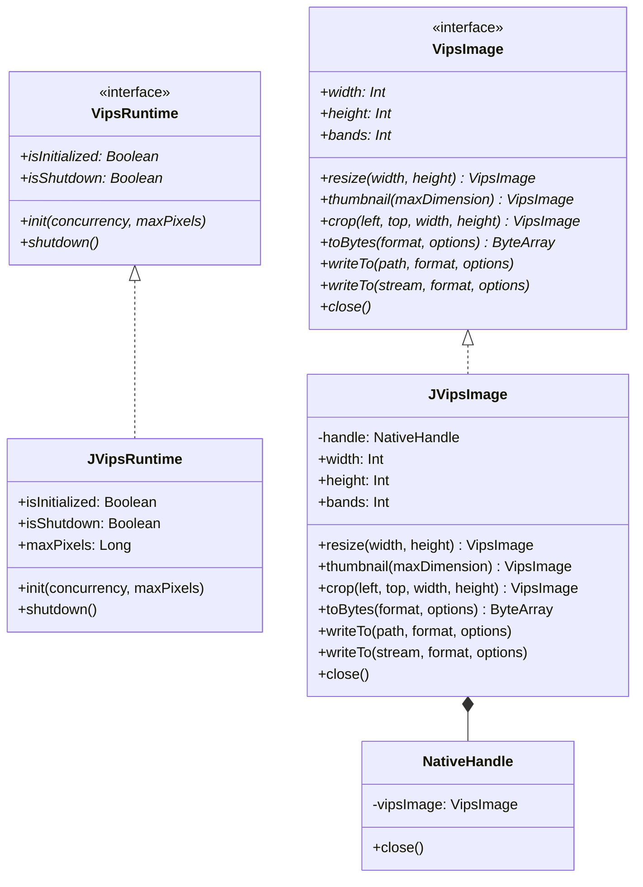

# Module bluetape4k-images-vips-java21

English | [한국어](./README.ko.md)

JVips (JNI) backend implementation for libvips image processing. Provides fast, memory-efficient image manipulation on Java 21+ via native bindings. On Linux, JVips bundles native `.so` libraries. On macOS, system libvips is required.

## Architecture

### JVips Processing Pipeline

```mermaid
flowchart LR
    subgraph Input["Input Sources"]
        BA["ByteArray"]
        FILE["File / Path"]
        IS["InputStream"]
    end

    subgraph Init["Runtime Initialization"]
        INIT["JVipsRuntime.init()"]
        STATE["AtomicReference<br/>(State Machine)"]
        CHECK["Concurrency &<br/>maxPixels Config"]
    end

    subgraph Load["Image Loading<br/>(Security Checks)"]
        FORMAT["Magic Byte<br/>Allowlist<br/>(JPEG|PNG|WebP)"]
        SIZE["50 MB Limit<br/>Check"]
        PIXELS["maxPixels<br/>Validation"]
        DECODE["VipsImage<br/>Decode (JNI)"]
    end

    subgraph Operations["Image Operations<br/>(Immutable)"]
        RESIZE["resize(w, h)"]
        THUMB["thumbnail(max)"]
        CROP["crop(l, t, w, h)"]
    end

    subgraph Output["Output (Immutable)"]
        BYTES["toBytes(format)"]
        WRITE_PATH["writeTo(path)"]
        WRITE_STREAM["writeTo(stream)"]
    end

    subgraph Close["Resource Cleanup"]
        GC["Cleaner-based<br/>Reference Cleanup"]
        CLOSE["close()"]
    end

    Input --> Init
    Init --> Load
    Load --> Operations
    Operations --> Output
    Output --> Close

    classDef dataStyle fill:#F57F17,stroke:#F57F17,color:#000000
    classDef initStyle fill:#E0F2F1,stroke:#4DB6AC,color:#004D40
    classDef loadStyle fill:#FFF9C4,stroke:#FFD54F,color:#F57F00
    classDef opsStyle fill:#E1BEE7,stroke:#BA68C8,color:#512DA8
    classDef outputStyle fill:#B3E5FC,stroke:#4FC3F7,color:#01579B
    classDef closeStyle fill:#FFCCBC,stroke:#FF8A65,color:#BF360C

    class BA,FILE,IS dataStyle
    class INIT,STATE,CHECK initStyle
    class FORMAT,SIZE,PIXELS,DECODE loadStyle
    class RESIZE,THUMB,CROP opsStyle
    class BYTES,WRITE_PATH,WRITE_STREAM outputStyle
    class GC,CLOSE closeStyle
```



### Class Diagram



## Setup

### macOS

Install system libvips via Homebrew:

```bash
brew install vips
```

Verify installation:

```bash
vips --version
```

### Linux

On most distributions, install libvips-tools:

```bash
# Debian / Ubuntu
sudo apt-get install libvips-tools

# RHEL / CentOS / Fedora
sudo yum install vips-tools

# Alpine
apk add vips
```

The JVips library bundles native `.so` files, so no additional setup is needed beyond installing the system package.

### Gradle Dependency

Add to `build.gradle.kts`:

```kotlin
dependencies {
    implementation("io.bluetape4k:bluetape4k-images-vips-java21:1.7.0")
}
```

Or use the BOM:

```kotlin
dependencies {
    implementation(platform("io.bluetape4k:bluetape4k-bom:1.7.0"))
    implementation("io.bluetape4k:bluetape4k-images-vips-java21")
}
```

## Features

- **JNI Native Bindings**: Direct access to libvips C library via JVips JNI
- **Fast & Memory-Efficient**: Scales 4000x3000 images in <100ms
- **Security by Default**: Format allowlist (JPEG/PNG/WebP), 50 MB input limit, maxPixels validation
- **Immutable Operations**: All image operations return new instances (no in-place mutation)
- **Coroutine Support**: Async variants wrap blocking JNI calls with `Dispatchers.IO`
- **Multiple Output Formats**: JPEG (lossy), PNG (lossless), WebP (best compression)
- **Virtual Thread Safe**: Uses `AtomicReference<State>` CAS instead of `@Synchronized` blocks

## Usage Examples

### Basic Initialization and Image Loading

```kotlin
import io.bluetape4k.images.vips.java21.JVipsRuntime
import io.bluetape4k.images.vips.java21.vipsImageOf
import io.bluetape4k.images.vips.VipsImageFormat
import java.nio.file.Paths

fun main() {
    // Initialize JVips runtime (required once per application)
    JVipsRuntime.init(concurrency = 4, maxPixels = 150_000_000L)
    
    try {
        // Load image from file
        val imagePath = Paths.get("sample.jpg")
        vipsImageOf(imagePath).use { image ->
            println("Image dimensions: ${image.width}x${image.height}, bands: ${image.bands}")
        }
    } finally {
        // Shutdown before process exit
        JVipsRuntime.shutdown()
    }
}
```

### Resize and Convert to WebP

```kotlin
import io.bluetape4k.images.vips.java21.vipsImageOf
import io.bluetape4k.images.vips.VipsImageFormat
import java.nio.file.Paths

fun resizeAndConvert(inputPath: String, outputPath: String) {
    vipsImageOf(Paths.get(inputPath)).use { original ->
        // Resize to 800x600, preserving aspect ratio
        original.resize(800, 600).use { resized ->
            // Convert to WebP and write
            resized.writeTo(
                Paths.get(outputPath),
                format = VipsImageFormat.WEBP
            )
        }
    }
}
```

### Thumbnail Generation

```kotlin
import io.bluetape4k.images.vips.java21.vipsImageOf
import io.bluetape4k.images.vips.VipsImageFormat
import io.bluetape4k.images.vips.VipsEncodeOptions
import java.nio.file.Paths

fun generateThumbnail(inputPath: String, outputPath: String) {
    vipsImageOf(Paths.get(inputPath)).use { original ->
        // Create thumbnail with longest side = 300px
        original.thumbnail(300).use { thumbnail ->
            // Encode as JPEG with quality 85
            thumbnail.writeTo(
                Paths.get(outputPath),
                format = VipsImageFormat.JPEG,
                options = VipsEncodeOptions.JpegOptions(quality = 85)
            )
        }
    }
}
```

### Loading from ByteArray with Security

```kotlin
import io.bluetape4k.images.vips.java21.vipsImageOf
import io.bluetape4k.images.vips.VipsDecodeException
import java.io.File

fun loadImageFromBytes(bytes: ByteArray): Int {
    return try {
        vipsImageOf(bytes).use { image ->
            println("Loaded ${image.width}x${image.height} image")
            image.width * image.height
        }
    } catch (e: VipsDecodeException) {
        System.err.println("Format not allowed or image too large: ${e.message}")
        0
    }
}
```

### Coroutine-Based Async Loading

```kotlin
import io.bluetape4k.images.vips.java21.suspendVipsImageOf
import io.bluetape4k.images.vips.VipsImageFormat
import kotlinx.coroutines.runBlocking
import java.nio.file.Paths

fun main() = runBlocking {
    // Load image asynchronously on Dispatchers.IO
    val image = suspendVipsImageOf(Paths.get("large.png"))
    
    image.use { img ->
        val thumbnail = img.thumbnail(500)
        
        thumbnail.use { thumb ->
            thumb.writeTo(
                Paths.get("thumbnail.webp"),
                format = VipsImageFormat.WEBP
            )
        }
    }
}
```

### Image Crop and Output

```kotlin
import io.bluetape4k.images.vips.java21.vipsImageOf
import io.bluetape4k.images.vips.VipsImageFormat
import java.io.ByteArrayOutputStream
import java.nio.file.Paths

fun cropAndExportBytes(imagePath: String): ByteArray {
    return vipsImageOf(Paths.get(imagePath)).use { original ->
        // Crop 200x200 region starting at (50, 50)
        original.crop(left = 50, top = 50, width = 200, height = 200).use { cropped ->
            // Export to PNG (lossless)
            cropped.toBytes(VipsImageFormat.PNG)
        }
    }
}
```

## Security Considerations

All public `vipsImageOf*` functions enforce security checks in order:

1. **Format Allowlist**: Only JPEG, PNG, and WebP formats are accepted
   - JPEG: magic bytes `FF D8 FF`
   - PNG: magic bytes `89 50 4E 47`
   - WebP: RIFF header with `WEBP` marker at offset 8

2. **Input Size Limit**: Maximum 50 MB per input stream

3. **Max Pixels Validation**: `width × height × bands` must not exceed the configured threshold (default: 150 million pixels)

Unsupported formats or violations raise `VipsDecodeException` with descriptive error messages.

## Concurrency & Thread Safety

- **JVipsRuntime singleton**: Thread-safe via `AtomicReference<State>` compare-and-swap
- **Concurrent initialization**: Spin-waits without blocking (no `@Synchronized`, Virtual Thread safe)
- **VipsImage instances**: Single-threaded. Do not share across coroutines or threads without synchronization
- **JNI calls**: Isolated per test via `forkEvery = 1` in Gradle

## Testing

Tests require libvips to be installed. Run with:

```bash
# Full test suite (requires libvips)
./gradlew :bluetape4k-images-vips-java21:test -Dvips.enabled=true

# Include vips tests in tagged execution
./gradlew test -PincludeTags=vips-required

# Skip vips tests (default)
./gradlew test
```

Test classes are tagged with `@Tag("vips-required")` and skipped unless explicitly enabled.

### Golden Image Tests

Compares vips operation results against golden images stored in `images-vips-api` testFixtures (`src/testFixtures/resources/golden/vips/`).

- Run with `-Dvips.enabled=true` on Linux with libvips installed
- Golden images are generated exclusively by the java25 module (`@EnabledForJreRange(min = JRE.JAVA_25)` guard prevents regeneration here)
- Comparison uses configurable per-channel pixel delta tolerance

### Property-Based Tests

5 invariants × 3 formats (JPEG/PNG/WebP) verified via `@ParameterizedTest`.

| Invariant | Description |
|-----------|-------------|
| Dimensions preserved | Resize output matches requested width/height |
| Output is non-empty | Encoded bytes are always produced |
| Format round-trip | Decode → encode → decode yields same dimensions |
| Crop bounds | Cropped region never exceeds original bounds |
| Thumbnail proportionality | Thumbnail longest side fits the requested max dimension |

## Troubleshooting

### "UnsatisfiedLinkError: Can't load library: libvips"

**macOS**: Install system libvips
```bash
brew install vips
```

**Linux**: Install libvips-tools package (JVips bundles native libs)
```bash
sudo apt-get install libvips-tools
```

### "Image exceeds maximum pixel count"

The `maxPixels` threshold (default 150 million) was exceeded. Either:
- Resize input before processing
- Increase `maxPixels` in `JVipsRuntime.init()`

### "libvips has been shut down — restart the process"

`JVipsRuntime.shutdown()` is irreversible. The process must be restarted to re-initialize.

**Do not use `@PreDestroy` hooks** with Spring Boot devtools — it causes restart-induced exceptions. Use `Runtime.addShutdownHook()` instead.

## See Also

- [bluetape4k-images](../images/) — Scrimage-based image processing (Coroutine async)
- [bluetape4k-images-vips-api](../images-vips-api/) — VipsRuntime and VipsImage contracts
- [bluetape4k-images-vips-java25](../images-vips-java25/) — Panama FFM backend (macOS + Linux, recommended)
- [bluetape4k-images-benchmark](../images-benchmark/) — JMH benchmarks: scrimage vs vips performance comparison
