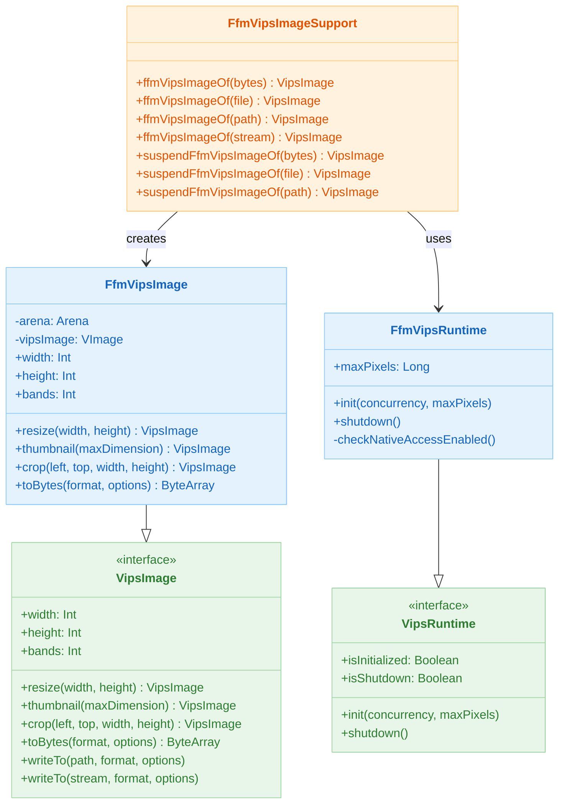
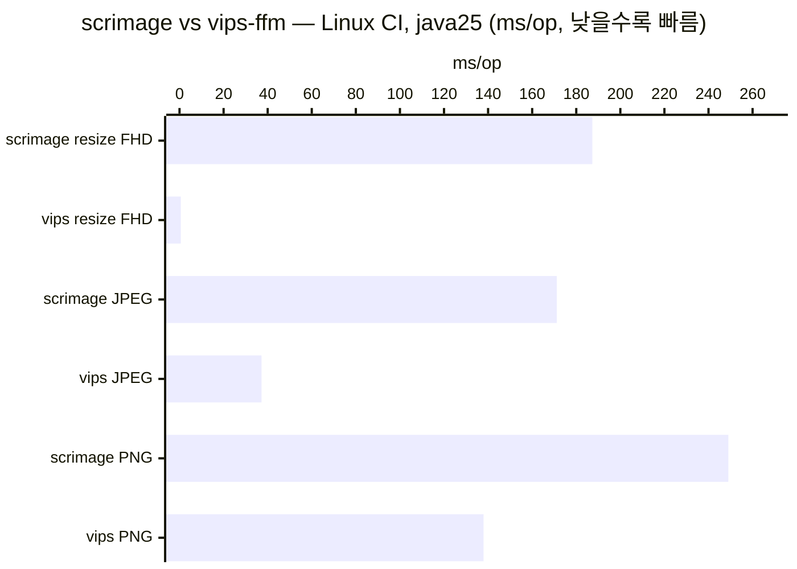

# Module bluetape4k-images-vips-java25

[한국어](./README.ko.md) | English

Java 23+ 환경에서 libvips 이미지 처리를 위한 FFM(Foreign Function & Memory) API 백엔드. JNI 없이 `vips-ffm` FFM 바인딩을 사용합니다. Java 25 권장, 시스템 libvips 라이브러리 필수.

> **중요:** 이 모듈은 JVM 시작 시 `--enable-native-access=ALL-UNNAMED` 플래그가 필수입니다. 이 플래그 없이는 FFM API가 작동하지 않습니다. [JVM 설정](#jvm-설정) 섹션을 참고하세요.

## 아키텍처

### 클래스 다이어그램



## 사전요구사항

### Java 버전
- **최소:** Java 23
- **권장:** Java 25

### 시스템 요구사항
- **macOS:** `brew install vips`
- **Ubuntu/Debian:** `apt-get install libvips-tools libvips-dev`
- **RHEL/CentOS:** `yum install vips-devel vips-tools`
- **Windows:** [libvips 릴리스](https://libvips.github.io/libvips/)에서 다운로드 후 PATH 설정

### JVM 설정

FFM API 네이티브 메모리 접근을 위해 `--enable-native-access=ALL-UNNAMED` 플래그가 반드시 설정되어야 합니다.

#### Gradle 테스트에서

```kotlin
tasks.withType<Test>().configureEach {
    jvmArgs("--enable-native-access=ALL-UNNAMED")
}
```

#### Spring Boot (application.yml)에서

```yaml
spring:
  jvm:
    args: --enable-native-access=ALL-UNNAMED
```

#### Java 명령줄에서

```bash
java -jar myapp.jar --enable-native-access=ALL-UNNAMED
```

#### IDE (IntelliJ IDEA)에서

1. Run → Edit Configurations
2. 테스트 설정 찾기
3. VM options 추가: `-XX:+UnlockDiagnosticVMOptions -XX:+LogCompilation --enable-native-access=ALL-UNNAMED`

이 플래그 없으면 `FfmVipsRuntime.init()`에서 경고가 기록되고 FFM 연산이 실패할 수 있습니다.

## 설정

### 의존성 추가

```kotlin
dependencies {
    implementation("io.bluetape4k:bluetape4k-images-vips-java25:1.7.0")
}
```

### 애플리케이션 시작 시 초기화

```kotlin
import io.bluetape4k.images.vips.java25.FfmVipsRuntime

// main 함수 또는 Spring Boot @PostConstruct에서
FfmVipsRuntime.init(
    concurrency = Runtime.getRuntime().availableProcessors(),
    maxPixels = 150_000_000L
)

// 애플리케이션 종료 시
Runtime.getRuntime().addShutdownHook(Thread {
    FfmVipsRuntime.shutdown()
})
```

## 기능

- **FFM 기반 (JDK 23+):** JNI 없이 순수 Foreign Function & Memory API
- **스레드 안전 초기화:** CAS 기반 상태 머신으로 경쟁 조건 방지
- **이미지 디코딩:** JPEG, PNG, WebP (매직 바이트 허용 목록)
- **이미지 연산:** 리사이즈, 썸네일, 자르기
- **이미지 인코딩:** JPEG, PNG, WebP (품질 설정 가능)
- **코루틴 지원:** 비동기 처리용 suspend 변형 (`suspendFfmVipsImageOf`)
- **보안:** 포맷 허용 목록, maxPixels 제한, 입력 스트림 제한 (50 MB)
- **메모리 안전성:** 각 연산마다 격리된 FFM Arena 사용

## 사용법

### 기본: 로드, 리사이즈, 인코딩

```kotlin
import io.bluetape4k.images.vips.java25.FfmVipsRuntime
import io.bluetape4k.images.vips.java25.ffmVipsImageOf
import io.bluetape4k.images.vips.VipsImageFormat
import io.bluetape4k.images.vips.VipsEncodeOptions
import java.nio.file.Paths

// 1. 런타임 초기화 (시작 시 한 번)
FfmVipsRuntime.init(
    concurrency = 4,
    maxPixels = 150_000_000L
)

// 2. 파일에서 이미지 로드
val image = ffmVipsImageOf(Paths.get("input.jpg"))

image.use { img ->
    // 3. 800x600으로 리사이즈
    val resized = img.resize(800, 600)
    resized.use { rs ->
        // 4. WebP로 저장
        rs.writeTo(
            Paths.get("output.webp"),
            format = VipsImageFormat.WEBP,
            options = VipsEncodeOptions.WebpOptions(quality = 85)
        )
    }
}
```

### 코루틴을 사용한 썸네일

```kotlin
import io.bluetape4k.images.vips.java25.suspendFfmVipsImageOf
import kotlinx.coroutines.runBlocking
import java.nio.file.Paths

runBlocking {
    // IO 디스패처를 통해 비동기 로드
    val image = suspendFfmVipsImageOf(Paths.get("large.jpg"))
    
    image.use { img ->
        // 긴 변을 300px으로 맞추기
        val thumbnail = img.thumbnail(300)
        thumbnail.use { thumb ->
            thumb.writeTo(
                Paths.get("thumb.png"),
                format = VipsImageFormat.PNG
            )
        }
    }
}
```

### ByteArray에서

```kotlin
import io.bluetape4k.images.vips.java25.ffmVipsImageOf
import io.bluetape4k.images.vips.VipsImageFormat

val bytes = readImageBytes() // 이미지 바이트

val image = ffmVipsImageOf(bytes)
image.use { img ->
    println("이미지 크기: ${img.width}x${img.height}")
    println("채널: ${img.bands}")
    
    // 인코딩된 바이트 얻기
    val jpegBytes = img.toBytes(
        format = VipsImageFormat.JPEG,
        options = VipsEncodeOptions.JpegOptions(quality = 90)
    )
}
```

### InputStream에서

```kotlin
import io.bluetape4k.images.vips.java25.ffmVipsImageOf
import java.io.FileInputStream

FileInputStream("image.webp").use { stream ->
    val image = ffmVipsImageOf(stream)
    image.use { img ->
        // 최대 50 MB 자동 제한
        val cropped = img.crop(left = 0, top = 0, width = 400, height = 300)
        cropped.use { crop ->
            // 자른 영역 처리
        }
    }
}
```

### 영역 자르기

```kotlin
import io.bluetape4k.images.vips.java25.ffmVipsImageOf

val image = ffmVipsImageOf(Paths.get("input.jpg"))
image.use { img ->
    // (50, 100)에서 시작하는 400x300 영역 추출
    val region = img.crop(left = 50, top = 100, width = 400, height = 300)
    region.use { r ->
        r.writeTo(Paths.get("cropped.jpg"))
    }
}
```

## 보안

### 이미지 포맷 허용 목록

JPEG, PNG, WebP만 허용됩니다. 다른 포맷은 `VipsDecodeException` 발생:

```kotlin
try {
    ffmVipsImageOf(unsafeBytes)
} catch (e: VipsDecodeException) {
    // 지원하지 않는 포맷 처리
    logger.error("포맷 허용되지 않음: ${e.message}")
}
```

### 최대 픽셀 수

이미지 크기는 `FfmVipsRuntime.maxPixels`에 대해 검증됩니다. 초과 시 `VipsDecodeException` 발생:

```kotlin
// 기본값: 150,000,000 픽셀
// init()를 통해 사용자 정의 가능
FfmVipsRuntime.init(concurrency = 4, maxPixels = 100_000_000L)
```

5000x5000 이미지 (3채널): 75,000,000 픽셀 (기본 제한 하)

### 입력 스트림 제한

스트림은 50 MB로 제한됩니다. 더 큰 입력은 `VipsDecodeException` 발생:

```kotlin
val stream: InputStream = // ... 큰 파일
try {
    ffmVipsImageOf(stream) // > 50 MB이면 실패
} catch (e: VipsDecodeException) {
    // 크기 위반 처리
}
```

### 경로 탐색 경고

`Path`에서 로드할 때, 호출자는 경로가 허용된 디렉토리 내에 있음을 검증해야 합니다:

```kotlin
import java.nio.file.Paths

fun loadImage(userProvidedPath: String): VipsImage {
    val base = Paths.get("/allowed/uploads")
    val requested = base.resolve(userProvidedPath).normalize()
    
    // 경로 탐색 방지: ../../../etc/passwd
    check(requested.startsWith(base)) {
        "경로 탐색 시도: $requested"
    }
    
    return ffmVipsImageOf(requested)
}
```

## 에러 처리

```kotlin
import io.bluetape4k.images.vips.VipsDecodeException
import io.bluetape4k.images.vips.VipsEncodeException

try {
    val image = ffmVipsImageOf(bytes)
    image.use { img ->
        img.resize(800, 600).use { resized ->
            resized.writeTo(path, VipsImageFormat.JPEG)
        }
    }
} catch (e: VipsDecodeException) {
    // 디코딩 실패: 지원하지 않는 포맷, 손상된 이미지, 또는 maxPixels 초과
    logger.error("이미지 디코딩 실패", e)
} catch (e: VipsEncodeException) {
    // 인코딩 실패: 잘못된 크기 또는 I/O 오류
    logger.error("이미지 인코딩 실패", e)
}
```

## 런타임 생명주기

```kotlin
import io.bluetape4k.images.vips.VipsInitializationException

// 언제든지 상태 확인
if (!FfmVipsRuntime.isInitialized) {
    FfmVipsRuntime.init(concurrency = 4)
}

if (FfmVipsRuntime.isShutdown) {
    throw VipsInitializationException(
        "libvips가 종료됨 — 프로세스 재시작 필요"
    )
}

// 종료 (선택사항; 프로세스 종료 시 자동 정리)
FfmVipsRuntime.shutdown()

// 종료 후 재초기화는 프로세스 재시작 필요
FfmVipsRuntime.init() // VipsInitializationException
```

## 가상 스레드 호환성

`FfmVipsRuntime`은 모니터 없이 `AtomicReference`를 사용해 스레드 안전성을 보장합니다. 가상 스레드와 안전하게 사용 가능:

```kotlin
import java.util.concurrent.Executors

Thread.ofVirtual().factory().newThread {
    val image = ffmVipsImageOf(bytes)
    // 가상 스레드에서 안전
}.start()
```

`suspendFfmVipsImageOf*` 변형들은 논블로킹 로딩을 위해 `withContext(Dispatchers.IO)`를 사용합니다.

## Spring Boot 통합

### 설정

```yaml
app:
  images:
    vips:
      concurrency: 4
      maxPixels: 150000000
      enableNativeAccess: true  # 반드시 설정
```

### 컴포넌트

```kotlin
import org.springframework.beans.factory.annotation.Value
import org.springframework.stereotype.Component
import jakarta.annotation.PostConstruct
import jakarta.annotation.PreDestroy

@Component
class VipsImageService(
    @Value("\${app.images.vips.concurrency:4}")
    private val concurrency: Int,
    
    @Value("\${app.images.vips.maxPixels:150000000}")
    private val maxPixels: Long,
) {
    @PostConstruct
    fun init() {
        FfmVipsRuntime.init(concurrency, maxPixels)
        log.info("FfmVipsRuntime 초기화: concurrency=$concurrency")
    }
    
    @PreDestroy
    fun shutdown() {
        FfmVipsRuntime.shutdown()
        log.info("FfmVipsRuntime 종료")
    }
    
    suspend fun resizeImage(bytes: ByteArray, width: Int, height: Int): ByteArray {
        val image = suspendFfmVipsImageOf(bytes)
        return image.use { img ->
            img.resize(width, height).use { resized ->
                resized.toBytes(VipsImageFormat.JPEG)
            }
        }
    }
}
```

### 컨트롤러 예제

```kotlin
import org.springframework.web.bind.annotation.*
import org.springframework.web.multipart.MultipartFile
import org.springframework.http.MediaType

@RestController
@RequestMapping("/api/images")
class ImageController(
    private val vipsService: VipsImageService
) {
    @PostMapping("/resize", consumes = [MediaType.MULTIPART_FORM_DATA_VALUE])
    suspend fun resize(
        @RequestParam file: MultipartFile,
        @RequestParam width: Int,
        @RequestParam height: Int,
    ): ByteArray {
        val bytes = file.bytes
        return vipsService.resizeImage(bytes, width, height)
    }
}
```

## Java 21 모듈과의 비교 (java21 모듈)

| 기능 | java25 (FFM) | java21 (JNI) |
|------|------|------|
| **바인딩** | vips-ffm (FFM API) | libjvips (JNI) |
| **Java 버전** | 23+ | 21+ |
| **JVM 플래그** | `--enable-native-access=ALL-UNNAMED` | 없음 |
| **메모리 모델** | Arena 기반 자동 정리 | JNI 참조 계수 |
| **플랫폼** | macOS + Linux | Linux 전용 (macOS native binary 없음) |
| **API** | 동일 VipsImage 인터페이스 | 동일 VipsImage 인터페이스 |

두 모듈 모두 동일한 `VipsImage` 인터페이스를 구현하며 API 수준에서 상호교환 가능합니다.

### scrimage 대비 성능



**CI Linux (Ubuntu 24.04, GraalVM 25, libvips 8.15.1)**

| 연산 | scrimage (ms/op) | vips-ffm (ms/op) | 속도 향상 |
|------|-----------------|------------------|----------|
| resize 4K→1920×1080 | 187.29 | **0.591** | **317배** |
| resize 4K→1280×720  | 119.45 | **0.626** | **191배** |
| encode JPEG         | 171.16 | **37.20** | **4.6배** |
| encode PNG          | 249.01 | **137.95** | **1.8배** |

**macOS (Apple Silicon, GraalVM 25.0.3, libvips 8.18.2)**

| 연산 | scrimage (ms/op) | vips-ffm (ms/op) | 속도 향상 |
|------|-----------------|------------------|----------|
| resize 4K→1920×1080 | 71.16 | **0.202** | **352배** |
| encode JPEG         | 52.49 | **15.67** | **3.3배** |
| encode PNG          | 94.87 | **49.88** | **1.9배** |

전체 상세 결과: [`images-benchmark/docs/benchmark-results-2026-04-29.md`](../images-benchmark/docs/benchmark-results-2026-04-29.md)

## 테스트

libvips가 없으면 테스트가 자동으로 스킵됩니다:

```bash
./gradlew :bluetape4k-images-vips-java25:test
# System.getProperty("vips.enabled") != "true"이면 스킵

# 테스트 강제 실행 (시스템 libvips 필수)
./gradlew :bluetape4k-images-vips-java25:test -Dvips.enabled=true
```

### 골든 이미지 테스트 (마스터 소스)

java25 모듈은 `images-vips-api/src/testFixtures/resources/golden/vips/`에 저장된 vips 골든 이미지의 **공식 소스**입니다.

- 갱신 모드는 Java 25+ 환경에서만 활성화 — `@EnabledForJreRange(min = JRE.JAVA_25)` 가드 적용
- 골든 이미지 재생성: `-Dbluetape4k.images.golden.update=true -Dvips.enabled=true`
- CI 가드: CI 환경에서 골든 이미지 재생성을 방지합니다

```bash
# 골든 이미지 재생성 (Java 25+에서 실행해야 함)
./gradlew :bluetape4k-images-vips-java25:test \
    -Dvips.enabled=true \
    -Dbluetape4k.images.golden.update=true
```

### 속성 기반 테스트

5가지 불변식 × 3가지 포맷(JPEG/PNG/WebP)을 `@ParameterizedTest`로 검증합니다.

| 불변식 | 설명 |
|--------|------|
| 치수 보존 | 리사이즈 출력이 요청한 너비/높이와 일치 |
| 출력 비어있지 않음 | 인코딩된 바이트가 항상 생성됨 |
| 포맷 왕복 | 디코드 → 인코드 → 디코드 시 동일한 치수 반환 |
| 자르기 경계 | 자른 영역이 원본 경계를 초과하지 않음 |
| 썸네일 비율 | 썸네일 긴 변이 요청한 최대 치수에 맞음 |

## 문제 해결

### "FFM API requires --enable-native-access" 오류

**증상:** FFM 메서드 호출 시 UnsupportedOperationException 발생.

**해결법:** JVM 인자에 `--enable-native-access=ALL-UNNAMED` 추가. [JVM 설정](#jvm-설정) 참고.

### "libvips not found" 또는 "Cannot find vips library"

**증상:** UnsatisfiedLinkError 등 발생.

**해결법:** 시스템 libvips 설치:
```bash
# macOS
brew install vips

# Ubuntu
apt-get install libvips-tools libvips-dev

# 설치 확인
vips --version
```

### "Unsupported image format" 오류

**증상:** VipsDecodeException with "only JPEG, PNG, and WebP are allowed".

**해결법:** 이미지를 지원하는 포맷으로 변환:
```bash
# ImageMagick 사용
convert input.gif output.jpg

# 또는 온라인 도구 사용
```

### "Image exceeds maximum pixel count" 오류

**증상:** VipsDecodeException with dimensions.

**해결법:** 다음 중 하나:
1. 초기화 시 `maxPixels` 증가 (안전한 경우)
2. 입력 이미지를 먼저 리사이즈
3. 서비스 계층에서 큰 이미지 거부

```kotlin
if (width * height > SAFE_LIMIT) {
    throw BadRequestException("이미지가 너무 큼")
}
```

## 참고 자료

- [vips-ffm GitHub](https://github.com/criteo-forks/vips-ffm)
- [libvips 공식 문서](https://libvips.github.io/)
- [FFM API (JEP 454)](https://openjdk.org/jeps/454)
- [부모 VipsImage 인터페이스](../images-vips-api/src/main/kotlin/io/bluetape4k/images/vips/VipsImage.kt)
