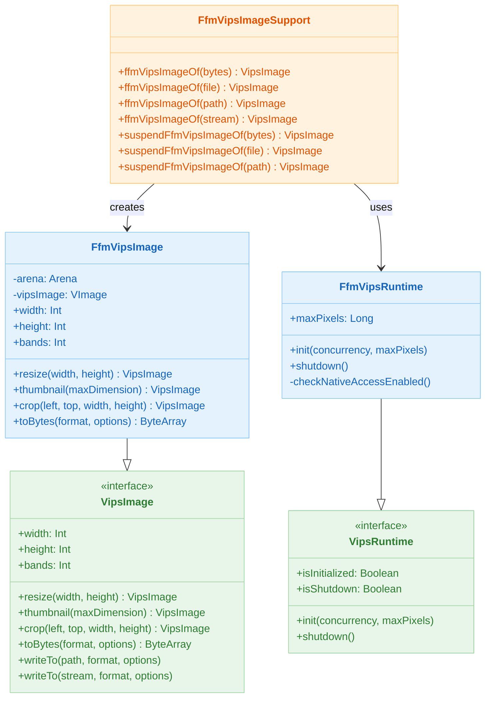
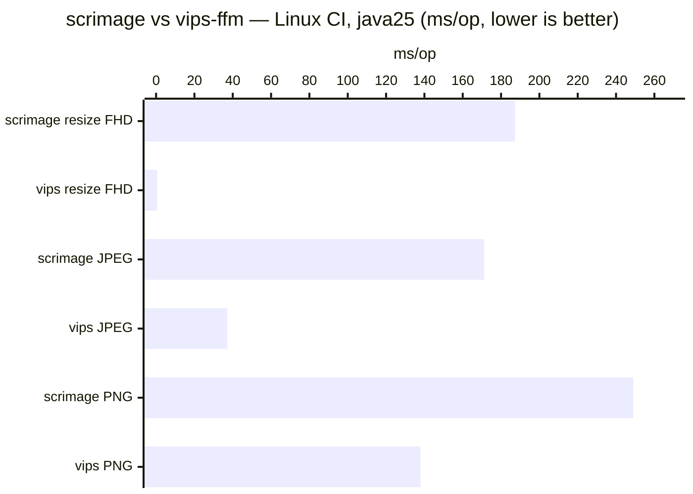

# Module bluetape4k-images-vips-java25

English | [한국어](./README.ko.md)

FFM (Foreign Function & Memory) API backend for libvips image processing on Java 23+. Uses zero JNI, pure FFM bindings via `vips-ffm`. Requires Java 25 recommended and system-installed libvips library.

> **CRITICAL:** This module requires the JVM flag `--enable-native-access=ALL-UNNAMED` to be set at startup. Without this flag, the FFM API will fail. See [JVM Configuration](#jvm-configuration) below.

## Architecture

### Class Diagram



## Prerequisites

### Java Version
- **Minimum:** Java 23
- **Recommended:** Java 25

### System Requirements
- **macOS:** `brew install vips`
- **Ubuntu/Debian:** `apt-get install libvips-tools libvips-dev`
- **RHEL/CentOS:** `yum install vips-devel vips-tools`
- **Windows:** Download from [libvips releases](https://libvips.github.io/libvips/) and set PATH

### JVM Configuration

The `--enable-native-access=ALL-UNNAMED` flag MUST be set when running your application. This enables FFM API access to native memory.

#### In Gradle Tests

```kotlin
tasks.withType<Test>().configureEach {
    jvmArgs("--enable-native-access=ALL-UNNAMED")
}
```

#### In Spring Boot (application.yml)

```yaml
spring:
  jvm:
    args: --enable-native-access=ALL-UNNAMED
```

#### In Java Command Line

```bash
java -jar myapp.jar --enable-native-access=ALL-UNNAMED
```

#### In IDE (IntelliJ IDEA)

1. Run → Edit Configurations
2. Find your test configuration
3. Add VM options: `-XX:+UnlockDiagnosticVMOptions -XX:+LogCompilation --enable-native-access=ALL-UNNAMED`

Without this flag, `FfmVipsRuntime.init()` will log a warning and FFM operations may fail.

## Setup

### Add Dependency

```kotlin
dependencies {
    implementation("io.bluetape4k:bluetape4k-images-vips-java25:1.7.0")
}
```

### Initialize at Application Startup

```kotlin
import io.bluetape4k.images.vips.java25.FfmVipsRuntime

// In your main function or Spring Boot @PostConstruct
FfmVipsRuntime.init(
    concurrency = Runtime.getRuntime().availableProcessors(),
    maxPixels = 150_000_000L
)

// At application shutdown
Runtime.getRuntime().addShutdownHook(Thread {
    FfmVipsRuntime.shutdown()
})
```

## Features

- **FFM-based (JDK 23+):** No JNI, pure Foreign Function & Memory API
- **Thread-safe initialization:** CAS-based state machine prevents race conditions
- **Image decoding:** JPEG, PNG, WebP (magic byte allowlist)
- **Image operations:** Resize, thumbnail, crop
- **Image encoding:** JPEG, PNG, WebP with configurable quality
- **Coroutine support:** Suspend variants for async processing (`suspendFfmVipsImageOf`)
- **Security:** Format allowlist, maxPixels limit, bounded input stream (50 MB)
- **Memory safety:** Each operation uses isolated FFM Arena

## Usage

### Basic: Load, Resize, Encode

```kotlin
import io.bluetape4k.images.vips.java25.FfmVipsRuntime
import io.bluetape4k.images.vips.java25.ffmVipsImageOf
import io.bluetape4k.images.vips.VipsImageFormat
import io.bluetape4k.images.vips.VipsEncodeOptions
import java.nio.file.Paths

// 1. Initialize runtime (once at startup)
FfmVipsRuntime.init(
    concurrency = 4,
    maxPixels = 150_000_000L
)

// 2. Load image from file
val image = ffmVipsImageOf(Paths.get("input.jpg"))

image.use { img ->
    // 3. Resize to 800x600
    val resized = img.resize(800, 600)
    resized.use { rs ->
        // 4. Save as WebP
        rs.writeTo(
            Paths.get("output.webp"),
            format = VipsImageFormat.WEBP,
            options = VipsEncodeOptions.WebpOptions(quality = 85)
        )
    }
}
```

### Thumbnail with Coroutines

```kotlin
import io.bluetape4k.images.vips.java25.suspendFfmVipsImageOf
import kotlinx.coroutines.runBlocking
import java.nio.file.Paths

runBlocking {
    // Load asynchronously via IO dispatcher
    val image = suspendFfmVipsImageOf(Paths.get("large.jpg"))
    
    image.use { img ->
        // Fit to 300px on longest side
        val thumbnail = img.thumbnail(300)
        thumbnail.use { thumb ->
            thumb.writeTo(
                Paths.get("thumb.png"),
                format = VipsImageFormat.PNG
            )
        }
    }
}
```

### From ByteArray

```kotlin
import io.bluetape4k.images.vips.java25.ffmVipsImageOf
import io.bluetape4k.images.vips.VipsImageFormat

val bytes = readImageBytes() // Your image bytes

val image = ffmVipsImageOf(bytes)
image.use { img ->
    println("Image dimensions: ${img.width}x${img.height}")
    println("Channels: ${img.bands}")
    
    // Get encoded bytes
    val jpegBytes = img.toBytes(
        format = VipsImageFormat.JPEG,
        options = VipsEncodeOptions.JpegOptions(quality = 90)
    )
}
```

### From InputStream

```kotlin
import io.bluetape4k.images.vips.java25.ffmVipsImageOf
import java.io.FileInputStream

FileInputStream("image.webp").use { stream ->
    val image = ffmVipsImageOf(stream)
    image.use { img ->
        // Max 50 MB enforced automatically
        val cropped = img.crop(left = 0, top = 0, width = 400, height = 300)
        cropped.use { crop ->
            // Process cropped region
        }
    }
}
```

### Crop Region

```kotlin
import io.bluetape4k.images.vips.java25.ffmVipsImageOf

val image = ffmVipsImageOf(Paths.get("input.jpg"))
image.use { img ->
    // Extract 400x300 region starting at (50, 100)
    val region = img.crop(left = 50, top = 100, width = 400, height = 300)
    region.use { r ->
        r.writeTo(Paths.get("cropped.jpg"))
    }
}
```

## Security

### Image Format Allowlist

Only JPEG, PNG, and WebP are permitted. Other formats throw `VipsDecodeException`:

```kotlin
try {
    ffmVipsImageOf(unsafeBytes)
} catch (e: VipsDecodeException) {
    // Handle unsupported format
    logger.error("Format not allowed: ${e.message}")
}
```

### Maximum Pixel Count

Image dimensions are validated against `FfmVipsRuntime.maxPixels`. Exceeding this limit throws `VipsDecodeException`:

```kotlin
// Default: 150,000,000 pixels
// Customizable via init()
FfmVipsRuntime.init(concurrency = 4, maxPixels = 100_000_000L)
```

For a 5000x5000 image with 3 channels: 75,000,000 pixels (under default limit).

### Input Stream Limit

Streams are bounded to 50 MB. Larger inputs throw `VipsDecodeException`:

```kotlin
val stream: InputStream = // ... large file
try {
    ffmVipsImageOf(stream) // Will fail if > 50 MB
} catch (e: VipsDecodeException) {
    // Handle size violation
}
```

### Path Traversal Warning

When loading from `Path`, callers must validate that the path is within an allowed directory:

```kotlin
import java.nio.file.Paths
import java.io.File

fun loadImage(userProvidedPath: String): VipsImage {
    val base = Paths.get("/allowed/uploads")
    val requested = base.resolve(userProvidedPath).normalize()
    
    // Prevent path traversal: ../../../etc/passwd
    check(requested.startsWith(base)) {
        "Path traversal attempt: $requested"
    }
    
    return ffmVipsImageOf(requested)
}
```

## Error Handling

```kotlin
import io.bluetape4k.images.vips.VipsDecodeException
import io.bluetape4k.images.vips.VipsEncodeException

try {
    val image = ffmVipsImageOf(bytes)
    image.use { img ->
        img.resize(800, 600).use { resized ->
            resized.writeTo(path, VipsImageFormat.JPEG)
        }
    }
} catch (e: VipsDecodeException) {
    // Decoding failed: unsupported format, corruption, or maxPixels exceeded
    logger.error("Failed to decode image", e)
} catch (e: VipsEncodeException) {
    // Encoding failed: invalid dimensions or I/O error
    logger.error("Failed to encode image", e)
}
```

## Runtime Lifecycle

```kotlin
import io.bluetape4k.images.vips.VipsInitializationException

// Check state at any time
if (!FfmVipsRuntime.isInitialized) {
    FfmVipsRuntime.init(concurrency = 4)
}

if (FfmVipsRuntime.isShutdown) {
    throw VipsInitializationException(
        "libvips has been shut down — restart the process to re-initialize"
    )
}

// Shutdown (optional; process exit handles cleanup)
FfmVipsRuntime.shutdown()

// After shutdown, re-initialization requires process restart
FfmVipsRuntime.init() // VipsInitializationException
```

## Virtual Thread Compatibility

`FfmVipsRuntime` uses `AtomicReference` for thread-safe state without monitors. Safe for use with Virtual Threads:

```kotlin
import java.util.concurrent.Executors

Thread.ofVirtual().factory().newThread {
    val image = ffmVipsImageOf(bytes)
    // Safe under Virtual Thread
}.start()
```

The `suspendFfmVipsImageOf*` variants use `withContext(Dispatchers.IO)` for non-blocking loading.

## Spring Boot Integration

### Configuration

```yaml
app:
  images:
    vips:
      concurrency: 4
      maxPixels: 150000000
      enableNativeAccess: true  # Ensure this is set
```

### Component

```kotlin
import org.springframework.beans.factory.annotation.Value
import org.springframework.stereotype.Component
import jakarta.annotation.PostConstruct
import jakarta.annotation.PreDestroy

@Component
class VipsImageService(
    @Value("\${app.images.vips.concurrency:4}")
    private val concurrency: Int,
    
    @Value("\${app.images.vips.maxPixels:150000000}")
    private val maxPixels: Long,
) {
    @PostConstruct
    fun init() {
        FfmVipsRuntime.init(concurrency, maxPixels)
        log.info("FfmVipsRuntime initialized: concurrency=$concurrency")
    }
    
    @PreDestroy
    fun shutdown() {
        FfmVipsRuntime.shutdown()
        log.info("FfmVipsRuntime shut down")
    }
    
    suspend fun resizeImage(bytes: ByteArray, width: Int, height: Int): ByteArray {
        val image = suspendFfmVipsImageOf(bytes)
        return image.use { img ->
            img.resize(width, height).use { resized ->
                resized.toBytes(VipsImageFormat.JPEG)
            }
        }
    }
}
```

### Controller Example

```kotlin
import org.springframework.web.bind.annotation.*
import org.springframework.web.multipart.MultipartFile
import org.springframework.http.MediaType

@RestController
@RequestMapping("/api/images")
class ImageController(
    private val vipsService: VipsImageService
) {
    @PostMapping("/resize", consumes = [MediaType.MULTIPART_FORM_DATA_VALUE])
    suspend fun resize(
        @RequestParam file: MultipartFile,
        @RequestParam width: Int,
        @RequestParam height: Int,
    ): ByteArray {
        val bytes = file.bytes
        return vipsService.resizeImage(bytes, width, height)
    }
}
```

## Comparison with Java 21 (java21 module)

| Feature | java25 (FFM) | java21 (JNI) |
|---------|------|------|
| **Binding** | vips-ffm (FFM API) | libjvips (JNI) |
| **Java Version** | 23+ | 21+ |
| **JVM Flag** | `--enable-native-access=ALL-UNNAMED` | None |
| **Memory Model** | Arena-based auto-cleanup | JNI reference counting |
| **Platform** | macOS + Linux | Linux only (no macOS native binary) |
| **API** | Same VipsImage interface | Same VipsImage interface |

Both modules implement the same `VipsImage` interface and are interchangeable at the API level.

### Performance vs scrimage



**CI Linux (Ubuntu 24.04, GraalVM 25, libvips 8.15.1)**

| Operation | scrimage (ms/op) | vips-ffm (ms/op) | Speedup |
|-----------|-----------------|------------------|---------|
| resize 4K→1920×1080 | 187.29 | **0.591** | **317×** |
| resize 4K→1280×720  | 119.45 | **0.626** | **191×** |
| encode JPEG         | 171.16 | **37.20** | **4.6×** |
| encode PNG          | 249.01 | **137.95** | **1.8×** |

**macOS (Apple Silicon, GraalVM 25.0.3, libvips 8.18.2)**

| Operation | scrimage (ms/op) | vips-ffm (ms/op) | Speedup |
|-----------|-----------------|------------------|---------|
| resize 4K→1920×1080 | 71.16 | **0.202** | **352×** |
| encode JPEG         | 52.49 | **15.67** | **3.3×** |
| encode PNG          | 94.87 | **49.88** | **1.9×** |

Full details: [`images-benchmark/docs/benchmark-results-2026-04-29.md`](../images-benchmark/docs/benchmark-results-2026-04-29.md)

## Testing

Tests are skipped automatically if libvips is unavailable:

```bash
./gradlew :bluetape4k-images-vips-java25:test
# Tests skipped if System.getProperty("vips.enabled") != "true"

# Force test execution (requires system libvips installed)
./gradlew :bluetape4k-images-vips-java25:test -Dvips.enabled=true
```

### Golden Image Tests (Master Source)

java25 is the **authoritative source** for vips golden images stored in `images-vips-api/src/testFixtures/resources/golden/vips/`.

- Update mode enabled only on Java 25+ — guarded by `@EnabledForJreRange(min = JRE.JAVA_25)`
- Regenerate goldens: `-Dbluetape4k.images.golden.update=true -Dvips.enabled=true`
- CI guard prevents accidental regeneration in CI environments

```bash
# Regenerate golden images (must run on Java 25+)
./gradlew :bluetape4k-images-vips-java25:test \
    -Dvips.enabled=true \
    -Dbluetape4k.images.golden.update=true
```

### Property-Based Tests

5 invariants × 3 formats (JPEG/PNG/WebP) verified via `@ParameterizedTest`.

| Invariant | Description |
|-----------|-------------|
| Dimensions preserved | Resize output matches requested width/height |
| Output is non-empty | Encoded bytes are always produced |
| Format round-trip | Decode → encode → decode yields same dimensions |
| Crop bounds | Cropped region never exceeds original bounds |
| Thumbnail proportionality | Thumbnail longest side fits the requested max dimension |

## Troubleshooting

### "FFM API requires --enable-native-access"

**Error:** UnsupportedOperationException when calling FFM methods.

**Solution:** Add `--enable-native-access=ALL-UNNAMED` to JVM arguments. See [JVM Configuration](#jvm-configuration).

### "libvips not found" or "Cannot find vips library"

**Error:** UnsatisfiedLinkError or similar.

**Solution:** Install system libvips:
```bash
# macOS
brew install vips

# Ubuntu
apt-get install libvips-tools libvips-dev

# Verify installation
vips --version
```

### "Unsupported image format"

**Error:** VipsDecodeException with "only JPEG, PNG, and WebP are allowed".

**Solution:** Convert your image to a supported format:
```bash
# Using ImageMagick
convert input.gif output.jpg

# Or online tools
```

### "Image exceeds maximum pixel count"

**Error:** VipsDecodeException with dimensions.

**Solution:** Either:
1. Increase `maxPixels` during init (if safe)
2. Resize the input image first
3. Reject oversized uploads in your service layer

```kotlin
if (width * height > SAFE_LIMIT) {
    throw BadRequestException("Image too large")
}
```

## References

- [vips-ffm on GitHub](https://github.com/criteo-forks/vips-ffm)
- [libvips Official Documentation](https://libvips.github.io/)
- [FFM API (JEP 454)](https://openjdk.org/jeps/454)
- [Parent VipsImage Interface](../images-vips-api/src/main/kotlin/io/bluetape4k/images/vips/VipsImage.kt)
