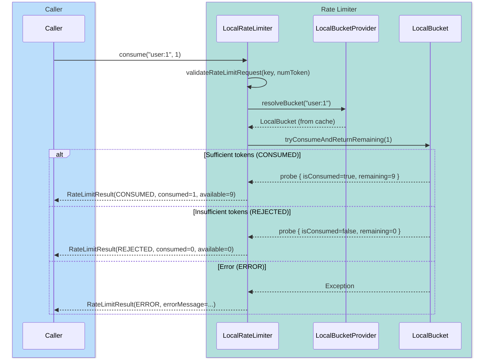
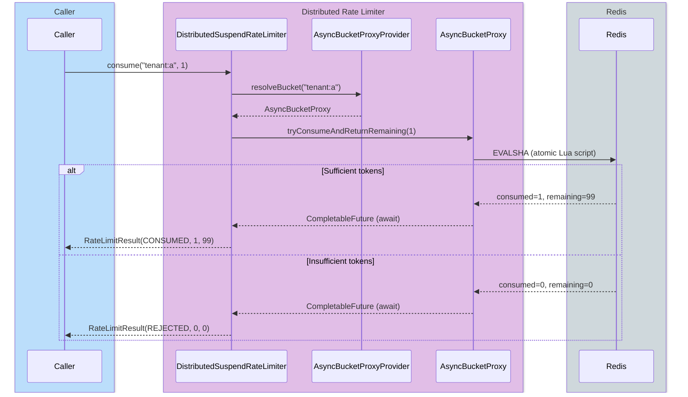

# Module bluetape4k-bucket4j

English | [한국어](./README.ko.md)

A wrapper and utility module for building application-level rate limiters using Bucket4j.

## Key Features

- **Custom key-based limiting**: Control by `userId`, `apiKey`, `tenantId`, or any key — not just IP addresses
- **Local and distributed support**: In-memory (`Local*`) and Redis-based distributed (`Distributed*`) implementations
- **Sync and coroutine APIs**: `RateLimiter` and `SuspendRateLimiter`
- **Immediate consume contract**:
  `SuspendRateLimiter.consume` attempts consumption immediately without waiting and returns `CONSUMED` or `REJECTED`
- **Probe-based result calculation**: Derives consumption outcome and remaining tokens from a single
  `ConsumptionProbe` query, avoiding extra token lookups
- **Bucket configuration DSL**: `bucketConfiguration { ... }` and `addBandwidth { ... }` helpers
- **Redis ProxyManager helpers**: `*ProxyManagerOf` utilities for Lettuce and Redisson
- **Standardized result state**:
  `RateLimitResult(status, consumedTokens, availableTokens)` consistently represents consumed, rejected, and error outcomes
- **Built-in request validation**: Rejects blank keys, tokens <= 0, and requests exceeding the policy maximum (
  `MAX_TOKENS_PER_REQUEST`) upfront

## Class Structure

### Bucket4j Integration Class Diagram

```mermaid
classDiagram
    direction TB

    class RateLimiter~K~ {
        <<interface>>
        +consume(key: K, numToken: Long) RateLimitResult
    }

    class SuspendRateLimiter~K~ {
        <<interface>>
        +consume(key: K, numToken: Long) RateLimitResult
    }

    class RateLimitResult {
        +status: RateLimitStatus
        +consumedTokens: Long
        +availableTokens: Long
        +errorMessage: String?
        +isConsumed: Boolean
        +isRejected: Boolean
        +isError: Boolean
        +consumed(consumedTokens, availableTokens) RateLimitResult
        +rejected(availableTokens) RateLimitResult
        +error(cause) RateLimitResult
    }

    class RateLimitStatus {
        <<enumeration>>
        CONSUMED
        REJECTED
        ERROR
    }

    class LocalRateLimiter {
        -bucketProvider: LocalBucketProvider
        +consume(key, numToken) RateLimitResult
    }

    class LocalSuspendRateLimiter {
        -bucketProvider: LocalSuspendBucketProvider
        +consume(key, numToken) RateLimitResult
    }

    class DistributedRateLimiter {
        -bucketProxyProvider: BucketProxyProvider
        +consume(key, numToken) RateLimitResult
    }

    class DistributedSuspendRateLimiter {
        -asyncBucketProxyProvider: AsyncBucketProxyProvider
        +consume(key, numToken) RateLimitResult
    }

    class AbstractLocalBucketProvider~T~ {
        #bucketConfiguration: BucketConfiguration
        #keyPrefix: String
        #cache: LoadingCache
        +resolveBucket(key: String) T
        #createBucket() T
    }

    class LocalBucketProvider {
        +createBucket() LocalBucket
    }

    class LocalSuspendBucketProvider {
        +createBucket() SuspendLocalBucket
    }

    class SuspendLocalBucket {
        +tryConsume(tokensToConsume, maxWaitTime) Boolean
        +consume(tokensToConsume)
    }

    class BucketProxyProvider {
        #proxyManager: ProxyManager
        #bucketConfiguration: BucketConfiguration
        +resolveBucket(key: String) BucketProxy
    }

    class AsyncBucketProxyProvider {
        #asyncProxyManager: AsyncProxyManager
        #bucketConfiguration: BucketConfiguration
        +resolveBucket(key: String) AsyncBucketProxy
    }

    RateLimiter <|.. LocalRateLimiter
    RateLimiter <|.. DistributedRateLimiter
    SuspendRateLimiter <|.. LocalSuspendRateLimiter
    SuspendRateLimiter <|.. DistributedSuspendRateLimiter
    AbstractLocalBucketProvider <|-- LocalBucketProvider
    AbstractLocalBucketProvider <|-- LocalSuspendBucketProvider
    LocalBucketProvider <-- LocalRateLimiter
    LocalSuspendBucketProvider <-- LocalSuspendRateLimiter
    LocalSuspendBucketProvider ..> SuspendLocalBucket: creates
    BucketProxyProvider <-- DistributedRateLimiter
    AsyncBucketProxyProvider <-- DistributedSuspendRateLimiter
    RateLimitResult --> RateLimitStatus

    style RateLimiter fill:#1565C0,stroke:#0D47A1,color:#FFFFFF
    style SuspendRateLimiter fill:#1565C0,stroke:#0D47A1,color:#FFFFFF
    style RateLimitResult fill:#F57F17,stroke:#E65100,color:#000000
    style RateLimitStatus fill:#F57F17,stroke:#E65100,color:#000000
    style LocalRateLimiter fill:#00897B,stroke:#00695C,color:#FFFFFF
    style LocalSuspendRateLimiter fill:#6A1B9A,stroke:#4A148C,color:#FFFFFF
    style DistributedRateLimiter fill:#00897B,stroke:#00695C,color:#FFFFFF
    style DistributedSuspendRateLimiter fill:#6A1B9A,stroke:#4A148C,color:#FFFFFF
    style AbstractLocalBucketProvider fill:#1976D2,stroke:#1565C0,color:#FFFFFF
    style LocalBucketProvider fill:#00897B,stroke:#00695C,color:#FFFFFF
    style LocalSuspendBucketProvider fill:#6A1B9A,stroke:#4A148C,color:#FFFFFF
    style SuspendLocalBucket fill:#6A1B9A,stroke:#4A148C,color:#FFFFFF
    style BucketProxyProvider fill:#37474F,stroke:#263238,color:#FFFFFF
    style AsyncBucketProxyProvider fill:#37474F,stroke:#263238,color:#FFFFFF

```



### Rate Limiting Sequence Diagrams

#### Local Rate Limiter — Token Consumption Flow



#### Distributed Suspend Rate Limiter — Redis-Based Coroutine Flow



## What This Module Adds Over Raw Bucket4j

`bluetape4k-bucket4j` focuses on eliminating boilerplate when using Bucket4j directly.

- **Standardized key-based bucket resolution**: `LocalBucketProvider`, `BucketProxyProvider`, `AsyncBucketProxyProvider`
- **RateLimiter abstraction**: Swap between local and distributed implementations via the same
  `consume(key, token)` call
- **Coroutine-friendly implementations**: `SuspendLocalBucket`, `LocalSuspendRateLimiter`,
  `DistributedSuspendRateLimiter`
- **Simplified Redis initialization**: `lettuceBasedProxyManagerOf`, `redissonBasedProxyManagerOf`
- **Minimized extra remote calls**: Distributed and local rate limiters do not issue additional
  `availableTokens` queries to build results

## Dependency

```kotlin
dependencies {
    implementation("io.github.bluetape4k:bluetape4k-bucket4j:${version}")

    // For Redis-based distributed rate limiting
    implementation("io.lettuce:lettuce-core") // or redisson
    implementation("com.bucket4j:bucket4j-redis")
}
```

## Usage Examples

### 1) Local Rate Limiter

```kotlin
val config = bucketConfiguration {
    addBandwidth { Bandwidth.simple(10, Duration.ofSeconds(1)) }
}

val bucketProvider = LocalBucketProvider(config)
val rateLimiter: RateLimiter<String> = LocalRateLimiter(bucketProvider)

val result = rateLimiter.consume("user:1001", 1)
// result.status, result.consumedTokens, result.availableTokens
```

### 2) Distributed Rate Limiter (Redis + Lettuce)

```kotlin
val config = bucketConfiguration {
    addBandwidth { Bandwidth.simple(100, Duration.ofMinutes(1)) }
}

val redisClient = RedisClient.create("redis://localhost:6379")
val proxyManager = lettuceBasedProxyManagerOf(redisClient) {
    withClientSideConfig(ClientSideConfig.getDefault())
}

val bucketProvider = BucketProxyProvider(proxyManager, config)
val rateLimiter: RateLimiter<String> = DistributedRateLimiter(bucketProvider)

val result = rateLimiter.consume("tenant:a:user:42", 1)
```

### 3) Coroutine-Based Rate Limiter

```kotlin
val config = bucketConfiguration {
    addBandwidth { Bandwidth.simple(20, Duration.ofSeconds(1)) }
}

val bucketProvider = LocalSuspendBucketProvider(config)
val rateLimiter: SuspendRateLimiter<String> = LocalSuspendRateLimiter(bucketProvider)

val result = rateLimiter.consume("user:1001", 1)

when (result.status) {
    RateLimitStatus.CONSUMED -> {
        // Allowed
    }
    RateLimitStatus.REJECTED -> {
        // Rejected due to insufficient tokens
    }
    RateLimitStatus.ERROR -> {
        // Redis failure or communication error
        // Check result.errorMessage
    }
}
```

> Note:
`SuspendRateLimiter.consume` attempts immediate consumption internally without waiting. When tokens are insufficient,
`REJECTED` is returned immediately. Retry/backoff logic is the caller's responsibility.

## Public API Contract Notes

- Both `RateLimiter.consume` and `SuspendRateLimiter.consume` validate `key` and `numToken` first.
  `key` must not be blank, and `numToken` must be in the range `1..MAX_TOKENS_PER_REQUEST`.
- `DistributedRateLimiter` and
  `DistributedSuspendRateLimiter` derive the consumption outcome and remaining tokens from a single
  `ConsumptionProbe`, so no extra Redis round-trips are made to build results.
- `BucketProxyProvider` and
  `AsyncBucketProxyProvider` namespace bucket keys using a default prefix. In production, if multiple rate limiting policies share the same Redis instance, it is safer to use distinct prefixes.
- `LocalBucketProvider` and `LocalSuspendBucketProvider` reuse the same bucket state for the same key.
- `SuspendLocalBucket.tryConsume(maxWaitTime)` suspends the coroutine with
  `delay` when waiting is needed, and propagates `CancellationException` unchanged on cancellation.
- `RateLimitResult.error(cause)` preserves the exception message in
  `errorMessage` so that higher layers can reuse it for logging or metric tagging.

## Spring Boot Configuration

This module is better suited for assembly as application beans than Spring Boot Auto Configuration.

```kotlin
@Configuration
class RateLimitConfig {
    @Bean
    fun bucketConfiguration(): BucketConfiguration =
        bucketConfiguration {
            addBandwidth { Bandwidth.simple(60, Duration.ofMinutes(1)) }
        }

    @Bean
    fun localRateLimiter(config: BucketConfiguration): RateLimiter<String> =
        LocalRateLimiter(LocalBucketProvider(config))
}
```

Inject `RateLimiter` into a WebFlux/WebMVC filter or interceptor and call
`consume(key)` to apply application-level rate limiting policies.

## Implementation Notes

- `SuspendLocalBucket` uses `delay` when waiting, making it coroutine-friendly.
- If the coroutine is cancelled while waiting, the interrupt event is recorded and cancellation is propagated as-is.
- `LocalSuspendRateLimiter` and `DistributedSuspendRateLimiter` propagate
  `CancellationException` unchanged rather than converting it to `ERROR`.
- An unusually large `maxWaitTime` that overflows during nanosecond conversion is handled with an
  `IllegalArgumentException`.
- `AbstractLocalBucketProvider` does not accept blank keys.
- `BucketProxyProvider` and
  `AsyncBucketProxyProvider` do not read remaining tokens at bucket resolution time, preventing unnecessary remote calls.
