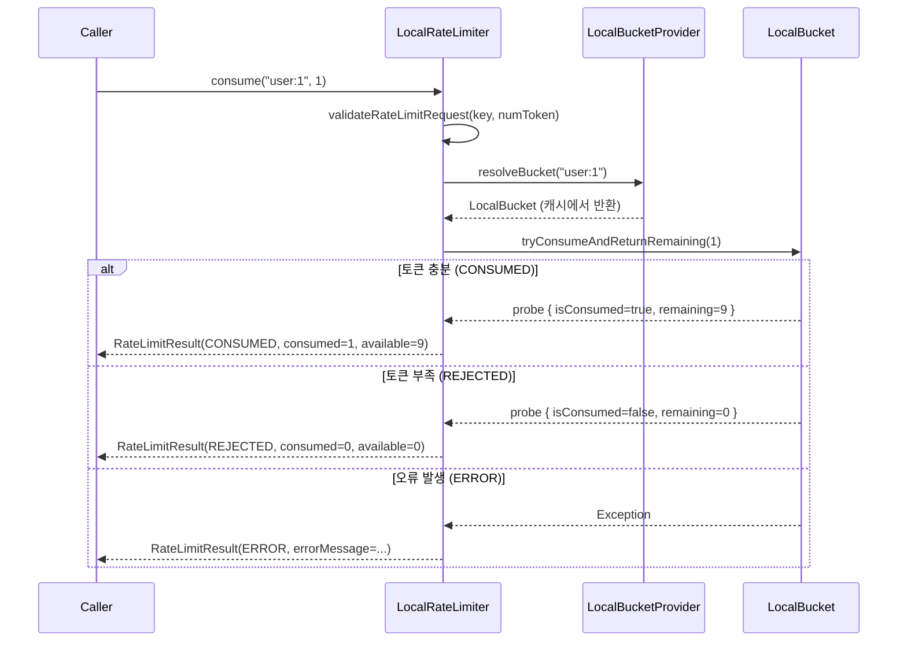
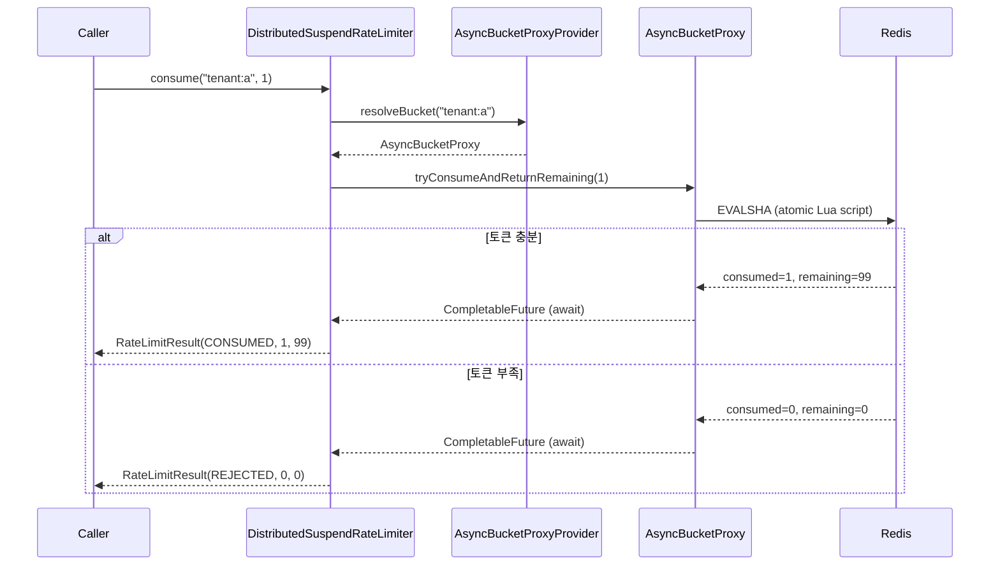

# Module bluetape4k-bucket4j

Bucket4j 기반으로 애플리케이션 레벨 Rate Limiter를 구성하기 위한 래퍼/유틸 모듈입니다.

## 주요 기능

- **Custom Key 기반 제한**: IP가 아닌 `userId`, `apiKey`, `tenantId` 같은 키 기준으로 제어
- **로컬/분산 환경 지원**: in-memory(`Local*`)와 Redis 기반 분산(`Distributed*`) 구현 제공
- **동기/코루틴 API 동시 제공**: `RateLimiter`, `SuspendRateLimiter`
- **즉시 소비 시도 계약**: `SuspendRateLimiter.consume`은 대기하지 않고 즉시 소비 시도 후 `CONSUMED/REJECTED`를 반환
- **Probe 기반 결과 계산**: 소비 성공 여부와 남은 토큰 수를 `ConsumptionProbe` 한 번의 조회 결과로 계산해 추가 토큰 조회를 줄임
- **Bucket 구성 DSL**: `bucketConfiguration { ... }`, `addBandwidth { ... }` 헬퍼 제공
- **Redis ProxyManager 헬퍼**: Lettuce/Redisson용 `*ProxyManagerOf` 유틸 제공
- **결과 상태 표준화**: `RateLimitResult(status, consumedTokens, availableTokens)`로 소비/거절/오류를 일관되게 반환
- **요청 검증 내장**: 빈 key, `0 이하 token`, 정책 상한(`MAX_TOKENS_PER_REQUEST`) 초과 요청을 사전에 차단

## 클래스 구조

### Bucket4j 통합 클래스 다이어그램

```mermaid
classDiagram
    direction TB

    class RateLimiter~K~ {
        <<interface>>
        +consume(key: K, numToken: Long) RateLimitResult
    }

    class SuspendRateLimiter~K~ {
        <<interface>>
        +consume(key: K, numToken: Long) RateLimitResult
    }

    class RateLimitResult {
        +status: RateLimitStatus
        +consumedTokens: Long
        +availableTokens: Long
        +errorMessage: String?
        +isConsumed: Boolean
        +isRejected: Boolean
        +isError: Boolean
        +consumed(consumedTokens, availableTokens) RateLimitResult
        +rejected(availableTokens) RateLimitResult
        +error(cause) RateLimitResult
    }

    class RateLimitStatus {
        <<enumeration>>
        CONSUMED
        REJECTED
        ERROR
    }

    class LocalRateLimiter {
        -bucketProvider: LocalBucketProvider
        +consume(key, numToken) RateLimitResult
    }

    class LocalSuspendRateLimiter {
        -bucketProvider: LocalSuspendBucketProvider
        +consume(key, numToken) RateLimitResult
    }

    class DistributedRateLimiter {
        -bucketProxyProvider: BucketProxyProvider
        +consume(key, numToken) RateLimitResult
    }

    class DistributedSuspendRateLimiter {
        -asyncBucketProxyProvider: AsyncBucketProxyProvider
        +consume(key, numToken) RateLimitResult
    }

    class AbstractLocalBucketProvider~T~ {
        #bucketConfiguration: BucketConfiguration
        #keyPrefix: String
        #cache: LoadingCache
        +resolveBucket(key: String) T
        #createBucket() T
    }

    class LocalBucketProvider {
        +createBucket() LocalBucket
    }

    class LocalSuspendBucketProvider {
        +createBucket() SuspendLocalBucket
    }

    class SuspendLocalBucket {
        +tryConsume(tokensToConsume, maxWaitTime) Boolean
        +consume(tokensToConsume)
    }

    class BucketProxyProvider {
        #proxyManager: ProxyManager
        #bucketConfiguration: BucketConfiguration
        +resolveBucket(key: String) BucketProxy
    }

    class AsyncBucketProxyProvider {
        #asyncProxyManager: AsyncProxyManager
        #bucketConfiguration: BucketConfiguration
        +resolveBucket(key: String) AsyncBucketProxy
    }

    RateLimiter <|.. LocalRateLimiter
    RateLimiter <|.. DistributedRateLimiter
    SuspendRateLimiter <|.. LocalSuspendRateLimiter
    SuspendRateLimiter <|.. DistributedSuspendRateLimiter
    AbstractLocalBucketProvider <|-- LocalBucketProvider
    AbstractLocalBucketProvider <|-- LocalSuspendBucketProvider
    LocalBucketProvider <-- LocalRateLimiter
    LocalSuspendBucketProvider <-- LocalSuspendRateLimiter
    LocalSuspendBucketProvider ..> SuspendLocalBucket: creates
    BucketProxyProvider <-- DistributedRateLimiter
    AsyncBucketProxyProvider <-- DistributedSuspendRateLimiter
    RateLimitResult --> RateLimitStatus


```



### Rate Limiting 시퀀스 다이어그램

#### 로컬 Rate Limiter — 토큰 소비 흐름



#### 분산 Suspend Rate Limiter — Redis 기반 코루틴 흐름



## Bucket4j 직접 사용 대비 추가 기능

`bluetape4k-bucket4j`는 Bucket4j를 직접 사용할 때 반복되는 보일러플레이트를 줄이는 데 초점이 있습니다.

- **키 기반 버킷 조회 표준화**: `LocalBucketProvider`, `BucketProxyProvider`, `AsyncBucketProxyProvider`
- **RateLimiter 추상화 제공**: `consume(key, token)` 호출로 로컬/분산 구현체 교체가 쉬움
- **코루틴 친화 구현**: `SuspendLocalBucket`, `LocalSuspendRateLimiter`, `DistributedSuspendRateLimiter`
- **Redis 연동 초기화 단순화**: `lettuceBasedProxyManagerOf`, `redissonBasedProxyManagerOf`
- **추가 원격 조회 최소화**: distributed/local rate limiter는 잔여 토큰 계산을 위해 별도 `availableTokens` 조회를 하지 않음

## 의존성 추가

```kotlin
dependencies {
    implementation("io.github.bluetape4k:bluetape4k-bucket4j:${version}")

    // Redis 기반 분산 Rate Limiter 사용 시
    implementation("io.lettuce:lettuce-core") // 또는 redisson
    implementation("com.bucket4j:bucket4j-redis")
}
```

## 사용 예

### 1) Local Rate Limiter

```kotlin
val config = bucketConfiguration {
    addBandwidth { Bandwidth.simple(10, Duration.ofSeconds(1)) }
}

val bucketProvider = LocalBucketProvider(config)
val rateLimiter: RateLimiter<String> = LocalRateLimiter(bucketProvider)

val result = rateLimiter.consume("user:1001", 1)
// result.status, result.consumedTokens, result.availableTokens
```

### 2) Distributed Rate Limiter (Redis + Lettuce)

```kotlin
val config = bucketConfiguration {
    addBandwidth { Bandwidth.simple(100, Duration.ofMinutes(1)) }
}

val redisClient = RedisClient.create("redis://localhost:6379")
val proxyManager = lettuceBasedProxyManagerOf(redisClient) {
    withClientSideConfig(ClientSideConfig.getDefault())
}

val bucketProvider = BucketProxyProvider(proxyManager, config)
val rateLimiter: RateLimiter<String> = DistributedRateLimiter(bucketProvider)

val result = rateLimiter.consume("tenant:a:user:42", 1)
```

### 3) Coroutine 기반 Rate Limiter

```kotlin
val config = bucketConfiguration {
    addBandwidth { Bandwidth.simple(20, Duration.ofSeconds(1)) }
}

val bucketProvider = LocalSuspendBucketProvider(config)
val rateLimiter: SuspendRateLimiter<String> = LocalSuspendRateLimiter(bucketProvider)

val result = rateLimiter.consume("user:1001", 1)

when (result.status) {
    RateLimitStatus.CONSUMED -> {
        // 허용됨
    }
    RateLimitStatus.REJECTED -> {
        // 토큰 부족으로 거절됨
    }
    RateLimitStatus.ERROR -> {
        // Redis 장애/통신 오류 등
        // result.errorMessage 확인 가능
    }
}
```

> 참고: `SuspendRateLimiter.consume`은 내부적으로 대기하지 않는 즉시 소비 시도 API입니다. 토큰 부족 시 `REJECTED`가 즉시 반환되며, 재시도/백오프는 호출자 정책으로 처리합니다.

## Public API 계약 메모

- `RateLimiter.consume`, `SuspendRateLimiter.consume`은 모두 `key`와 `numToken`을 먼저 검증합니다.
  `key`는 blank일 수 없고, `numToken`은 `1..MAX_TOKENS_PER_REQUEST` 범위여야 합니다.
- `DistributedRateLimiter`, `DistributedSuspendRateLimiter`는 `ConsumptionProbe` 한 번으로 소비 여부와 잔여 토큰을 계산합니다.
  따라서 결과를 만들기 위해 추가 Redis round-trip을 발생시키지 않습니다.
- `BucketProxyProvider`, `AsyncBucketProxyProvider`는 기본 prefix를 사용해 bucket key를 namespacing 합니다.
  운영 환경에서 여러 rate limit 정책이 같은 Redis를 공유한다면 prefix를 명시적으로 분리하는 것이 안전합니다.
- `LocalBucketProvider`, `LocalSuspendBucketProvider`는 같은 key에 대해 동일한 버킷 상태를 재사용합니다.
- `SuspendLocalBucket.tryConsume(maxWaitTime)`는 대기가 필요하면 코루틴을 `delay`로 일시 중단하고, 취소 시 `CancellationException`을 그대로 전파합니다.
- `RateLimitResult.error(cause)`는 예외 메시지를 `errorMessage`에 보존해 상위 계층이 로깅/메트릭 태깅에 재사용할 수 있게 합니다.

## Spring Boot 환경 구성

이 모듈은 Spring Boot Auto Configuration을 제공하기보다, 애플리케이션 빈으로 조립해 사용하는 방식에 적합합니다.

```kotlin
@Configuration
class RateLimitConfig {
    @Bean
    fun bucketConfiguration(): BucketConfiguration =
        bucketConfiguration {
            addBandwidth { Bandwidth.simple(60, Duration.ofMinutes(1)) }
        }

    @Bean
    fun localRateLimiter(config: BucketConfiguration): RateLimiter<String> =
        LocalRateLimiter(LocalBucketProvider(config))
}
```

WebFlux/WebMVC 필터(또는 인터셉터)에서 `RateLimiter`를 주입받아 `consume(key)`를 호출하면 애플리케이션 정책으로 쉽게 연결할 수 있습니다.

## 구현 메모

- `SuspendLocalBucket`은 대기 시 `delay`를 사용해 코루틴 친화적으로 동작합니다.
- 대기 중 코루틴이 취소되면 interrupt 이벤트를 기록하고 취소를 그대로 전파합니다.
- `LocalSuspendRateLimiter`, `DistributedSuspendRateLimiter`는 `CancellationException`을 `ERROR`로 변환하지 않고 그대로 전파합니다.
- `maxWaitTime`이 비정상적으로 큰 경우 nanos 변환 overflow를 `IllegalArgumentException`으로 처리합니다.
- `AbstractLocalBucketProvider`는 blank key를 허용하지 않습니다.
- `BucketProxyProvider`, `AsyncBucketProxyProvider`는 bucket resolve 시점에 잔여 토큰을 읽지 않아 불필요한 원격 조회를 방지합니다.
