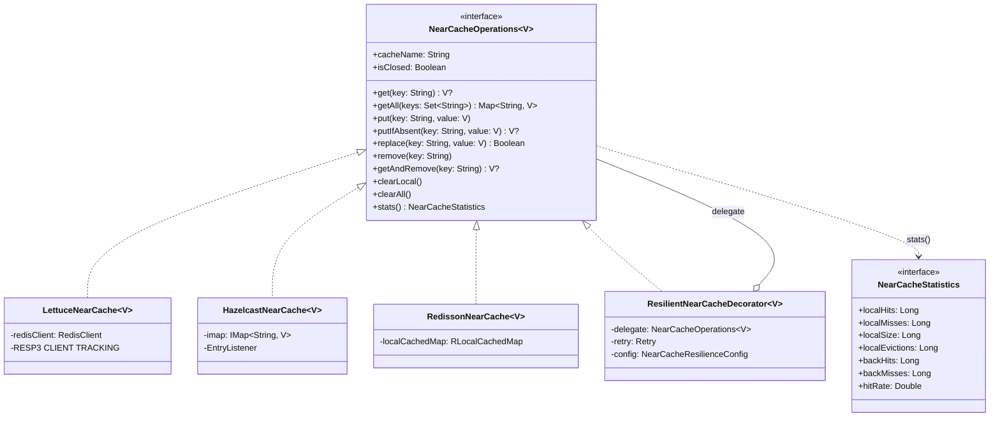
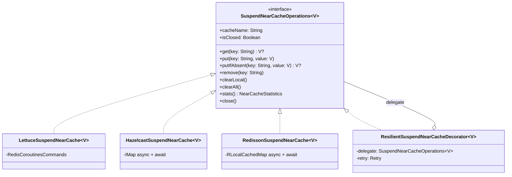
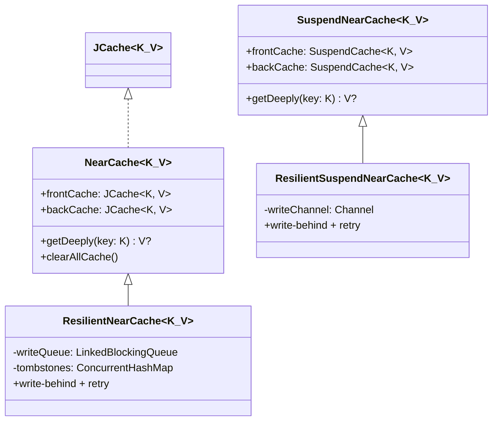

# Module bluetape4k-cache-core

`bluetape4k-cache-core`는 캐시 기능의 공통 API, 핵심 추상화, 그리고 **로컬 캐시 구현체**를 제공하는 모듈입니다.

> 기존 `bluetape4k-cache-local` 모듈이 이 모듈에 통합되었습니다.

## 제공 기능

- **JCache 공통 유틸리티**: `JCaching`, `jcacheManager`, `jcacheConfiguration` 등
- **Coroutines 캐시 추상화**: `SuspendCache`, `SuspendCacheEntry`
- **NearCache 통일 인터페이스**: `NearCacheOperations<V>`, `SuspendNearCacheOperations<V>`, `NearCacheStatistics`
- **Resilient Decorator**: `ResilientNearCacheDecorator`, `ResilientSuspendNearCacheDecorator` (retry + failure strategy)
- **JCache NearCache**: `JCacheNearCache<V>` — JCache 호환 백엔드용 NearCacheOperations 구현
- **Legacy Near Cache**: `NearCache<K,V>`, `SuspendNearCache<K,V>` (기존 호환)
- **Memorizer 추상화**: `Memorizer`, `AsyncMemorizer`, `SuspendMemorizer` (구 인터페이스)
- **Memoizer 추상화**: `Memoizer`, `AsyncMemoizer`, `SuspendMemoizer` (신 인터페이스)
- **로컬 캐시 Provider** (구 `cache-local` 통합):
  - **Caffeine**: `CaffeineSupport`, `CaffeineSuspendCache`, `CaffeineMemorizer`
  - **Cache2k**: `Cache2kSupport`, `Cache2kMemorizer`
  - **Ehcache**: `EhcacheSupport`, `EhCacheMemorizer`

## 설치

```kotlin
dependencies {
    implementation("io.github.bluetape4k:bluetape4k-cache-core:${bluetape4kVersion}")
}
```

분산 캐시가 필요하면 해당 Provider 모듈을 추가합니다.

## 제공 기능 (상세)

### NearCache 통일 인터페이스

모든 NearCache 백엔드(Lettuce, Hazelcast, Redisson, JCache)가 공통 인터페이스를 구현합니다.

#### NearCacheOperations (Blocking)



#### SuspendNearCacheOperations (Coroutine)



#### Legacy JCache NearCache (`nearcache.jcache` 패키지)

JCache 인터페이스를 직접 구현하는 기존 2-tier 캐시. `JCache<K,V> by backCache` 위임으로 JCache 호환성을 유지합니다.



> `nearcache.jcache` 패키지의 클래스는 JCache 호환이 필요한 경우에 사용합니다.
> 새 코드는 `NearCacheOperations<V>` / `SuspendNearCacheOperations<V>` 인터페이스를 사용하세요.

| 클래스 | 모듈 | 설명 |
|---|---|---|
| `NearCacheOperations<V>` | cache-core | 공통 blocking 인터페이스 (AutoCloseable) |
| `SuspendNearCacheOperations<V>` | cache-core | 공통 suspend 인터페이스 |
| `NearCacheStatistics` | cache-core | 로컬/백엔드 hit/miss 통계 |
| `NearCacheResilienceConfig` | cache-core | retry + failure strategy 설정 |
| `ResilientNearCacheDecorator<V>` | cache-core | Decorator: Resilience4j retry + GetFailureStrategy |
| `ResilientSuspendNearCacheDecorator<V>` | cache-core | Decorator suspend 버전 |
| `JCacheNearCache<V>` | cache-core | JCache 호환 백엔드용 구현 |
| `LettuceNearCache<V>` | cache-lettuce | RESP3 CLIENT TRACKING 기반 |
| `LettuceSuspendNearCache<V>` | cache-lettuce | Lettuce coroutines 버전 |
| `HazelcastNearCache<V>` | cache-hazelcast | IMap + EntryListener invalidation |
| `HazelcastSuspendNearCache<V>` | cache-hazelcast | IMap async + await |
| `RedissonNearCache<V>` | cache-redisson | RLocalCachedMap (내장 invalidation) |
| `RedissonSuspendNearCache<V>` | cache-redisson | RLocalCachedMap async + await |

**Resilience Decorator 사용:**
```kotlin
// 어떤 백엔드든 .withResilience {} 로 래핑 가능
val cache = lettuceNearCacheOf<String>(redisClient, codec, config)
    .withResilience {
        retryMaxAttempts = 5
        retryWaitDuration = Duration.ofSeconds(1)
        getFailureStrategy = GetFailureStrategy.PROPAGATE_EXCEPTION
    }
```

**GetFailureStrategy:**
- `RETURN_FRONT_OR_NULL`: back cache GET 실패 시 null 반환 (graceful degradation)
- `PROPAGATE_EXCEPTION`: 예외를 호출자에게 전파

---

## 기본 사용 예시

### 1. Caffeine 로컬 캐시

```kotlin
import io.bluetape4k.cache.caffeine.caffeine
import com.github.benmanes.caffeine.cache.Cache

val cache: Cache<String, Any> = caffeine {
    maximumSize(1_000)
    expireAfterWrite(10, TimeUnit.MINUTES)
}.build()
```

### 2. CaffeineSuspendCache

```kotlin
import io.bluetape4k.cache.jcache.CaffeineSuspendCache

val suspendCache = CaffeineSuspendCache<String, Any>("local-cache")
suspendCache.put("key", "value")
val value = suspendCache.get("key")
```

### 3. JCache 유틸리티

```kotlin
import io.bluetape4k.cache.jcache.jcacheConfiguration

val config = jcacheConfiguration<String, String> {
    isStatisticsEnabled = true
    isManagementEnabled = true
}
```

### 4. NearCacheOperations (통일 인터페이스)

```kotlin
import io.bluetape4k.cache.nearcache.jcacheNearCacheOf
import io.bluetape4k.cache.jcache.JCaching

// JCache 백엔드로 NearCache 생성
val backCache = JCaching.Caffeine.getOrCreate<String, String>("back-cache")
val cache = jcacheNearCacheOf<String>(backCache)

cache.put("key", "value")
cache.get("key")             // front hit → 즉시 반환
cache.clearLocal()           // front만 비우기
cache.clearAll()             // front + back 모두 비우기
cache.stats()                // NearCacheStatistics 조회
cache.close()
```

### 5. Resilient Decorator (.withResilience)

```kotlin
import io.bluetape4k.cache.nearcache.jcacheNearCacheOf
import io.bluetape4k.cache.nearcache.withResilience
import io.bluetape4k.cache.nearcache.GetFailureStrategy

val cache = jcacheNearCacheOf<String>(backCache)
    .withResilience {
        retryMaxAttempts = 3
        retryWaitDuration = Duration.ofMillis(200)
        retryExponentialBackoff = true
        getFailureStrategy = GetFailureStrategy.RETURN_FRONT_OR_NULL
    }

cache.put("key", "value")   // retry 적용된 write-through
cache.get("key")             // retry + failure strategy 적용
cache.close()
```

### 7. Caffeine Memorizer

```kotlin
import io.bluetape4k.cache.memorizer.caffeine.CaffeineMemorizer

val factorial = CaffeineMemorizer<Int, Long> { n ->
    (1..n).fold(1L) { acc, i -> acc * i }
}

val result = factorial[10]  // 캐싱되어 반복 계산 방지
```

## 권장 사용 방식

| 사용 목적 | 권장 모듈 |
|-----------|-----------|
| 로컬 캐시(Caffeine/Cache2k/Ehcache) | `bluetape4k-cache-core` |
| Hazelcast 분산 캐시 + Near Cache | `bluetape4k-cache-hazelcast` |
| Redisson 분산 캐시 + Near Cache | `bluetape4k-cache-redisson` |
| 전체 Provider 일괄 사용 | `bluetape4k-cache` (umbrella) |

## testFixtures 활용 가이드

`bluetape4k-cache-core`는 분산 캐시 Provider 구현을 위한 **6개의 추상 테스트 클래스**를 `testFixtures`로 제공합니다.

### 추상 테스트 클래스 목록

| 클래스 | 패키지 | 설명 |
|--------|--------|------|
| `AbstractSuspendCacheTest` | `jcache` | `SuspendCache` 기본 CRUD + 동시성 검증 |
| `AbstractNearCacheOperationsTest<V>` | `nearcache` | `NearCacheOperations` 공통 14개 시나리오 (blocking) |
| `AbstractSuspendNearCacheOperationsTest<V>` | `nearcache` | `SuspendNearCacheOperations` 공통 14개 시나리오 (suspend) |
| `AbstractNearCacheTest` | `nearcache` | `NearCache` (legacy) write-through/event 전파 검증 |
| `AbstractSuspendNearCacheTest` | `nearcache` | `SuspendNearCache` (legacy) coroutines 검증 |
| `AbstractMemorizerTest` | `memorizer` | `Memorizer` 단일 계산 보장 |
| `AbstractAsyncMemorizerTest` | `memorizer` | `AsyncMemorizer` CompletableFuture 검증 |
| `AbstractSuspendMemorizerTest` | `memorizer` | `SuspendMemorizer` suspend 검증 |

### Provider별 호환성 매트릭스

| testFixtures | Hazelcast | Ignite2 | Redisson | Lettuce |
|---|:---:|:---:|:---:|:---:|
| `AbstractSuspendCacheTest` | ✅ | ✅ | ✅ | ✅ |
| `AbstractNearCacheTest` | ✅ | ✅ | ✅ | N/A(아키텍처 상이) |
| `AbstractSuspendNearCacheTest` | ✅ | ✅ | ✅ | N/A(아키텍처 상이) |
| `AbstractMemorizerTest` 3종 | N/A | N/A | N/A | N/A |

> Memorizer는 로컬 캐시 전용 패턴으로 분산 캐시 모듈에는 해당 없음

### 새 Provider에서 testFixtures 사용하기

```kotlin
// build.gradle.kts
dependencies {
    testImplementation(testFixtures(project(":bluetape4k-cache-core")))
}
```

```kotlin
// 새 Provider NearCache 테스트 예시 (통일 인터페이스)
class MyProviderNearCacheTest : AbstractNearCacheOperationsTest<String>() {
    override fun createCache(): NearCacheOperations<String> = myProviderNearCacheOf(...)
    override fun sampleValue(): String = "hello"
    override fun anotherValue(): String = "world"
}

// Resilient Decorator 테스트도 동일 패턴
class ResilientMyProviderTest : AbstractNearCacheOperationsTest<String>() {
    override fun createCache() = myProviderNearCacheOf(...)
        .withResilience { retryMaxAttempts = 3 }
    override fun sampleValue(): String = "hello"
    override fun anotherValue(): String = "world"
}
```
