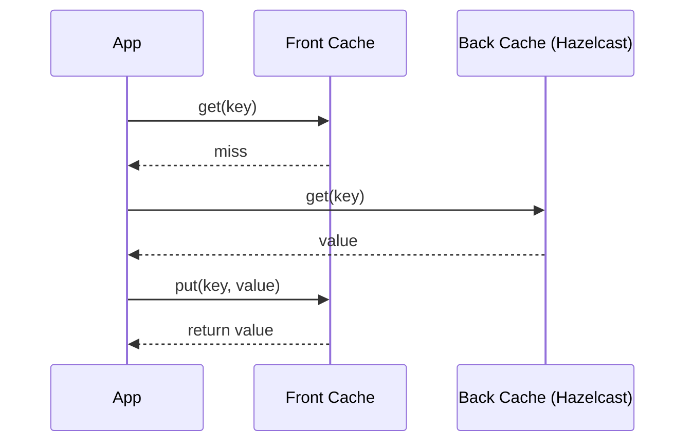
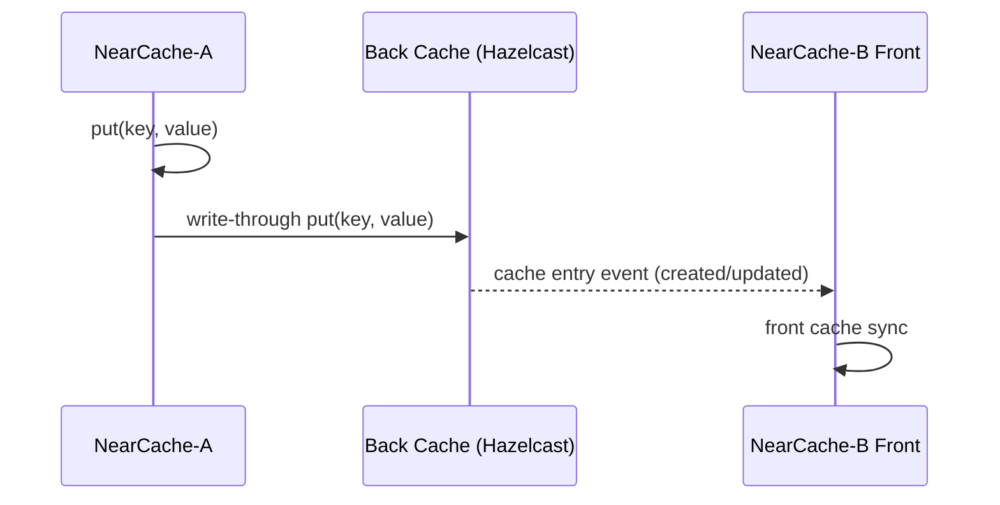
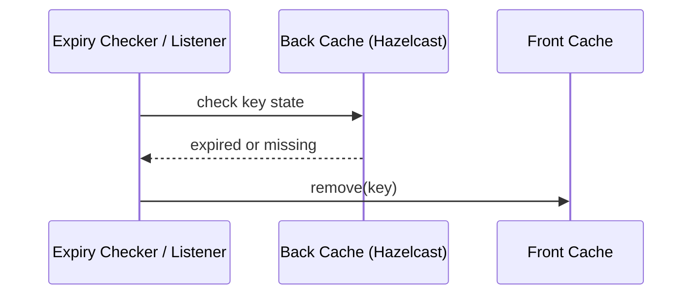

# bluetape4k-cache-hazelcast-near

`bluetape4k-cache-hazelcast-near`는 Hazelcast Back Cache와 Near Cache 조합을 위한 모듈입니다.

핵심 제공 요소:
- `HazelcastNearCache`
- `HazelcastNearSuspendCache`

기본 Front는 Caffeine 기반이며, 사용자 지정 Front cache/suspendCache를 사용할 수 있습니다.

## 설치

```kotlin
dependencies {
    implementation("io.bluetape4k:bluetape4k-cache-hazelcast-near:${bluetape4kVersion}")
}
```

## CachingProvider

`META-INF/services/javax.cache.spi.CachingProvider`에 Hazelcast Provider가 등록됩니다.
- `com.hazelcast.cache.HazelcastCachingProvider`

## 사용 예시

### 1. NearCache 생성 (동기 API)

```kotlin
import io.bluetape4k.cache.nearcache.hazelcast.HazelcastNearCache

val near = HazelcastNearCache<String, Any>("hz-users-near")
```

### 2. NearSuspendCache 생성 (기본 Front=Caffeine)

```kotlin
import io.bluetape4k.cache.nearcache.hazelcast.HazelcastNearSuspendCache

val nearSuspend = HazelcastNearSuspendCache<String, Any>("hz-users-near-suspend")
```

### 3. NearSuspendCache 생성 (사용자 Front 지정)

```kotlin
val nearSuspend = HazelcastNearSuspendCache(
    backCacheName = "hz-users-near-suspend",
    frontSuspendCache = myFrontSuspendCache,
)
```

## 동작 시퀀스

### 1. Read-through (Front miss -> Back hit)



### 2. Write-through + 전파



### 3. Back 만료 -> Front 무효화


