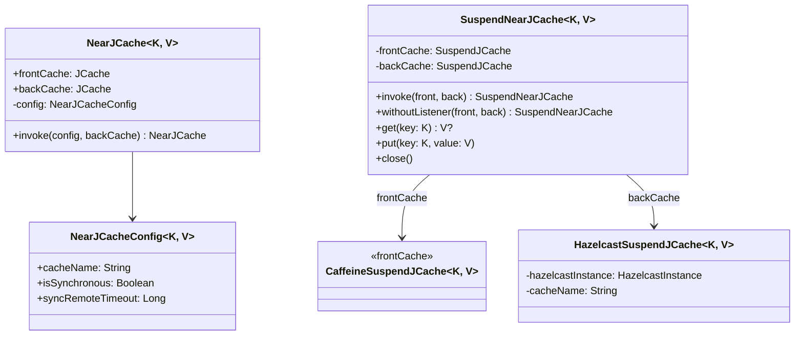
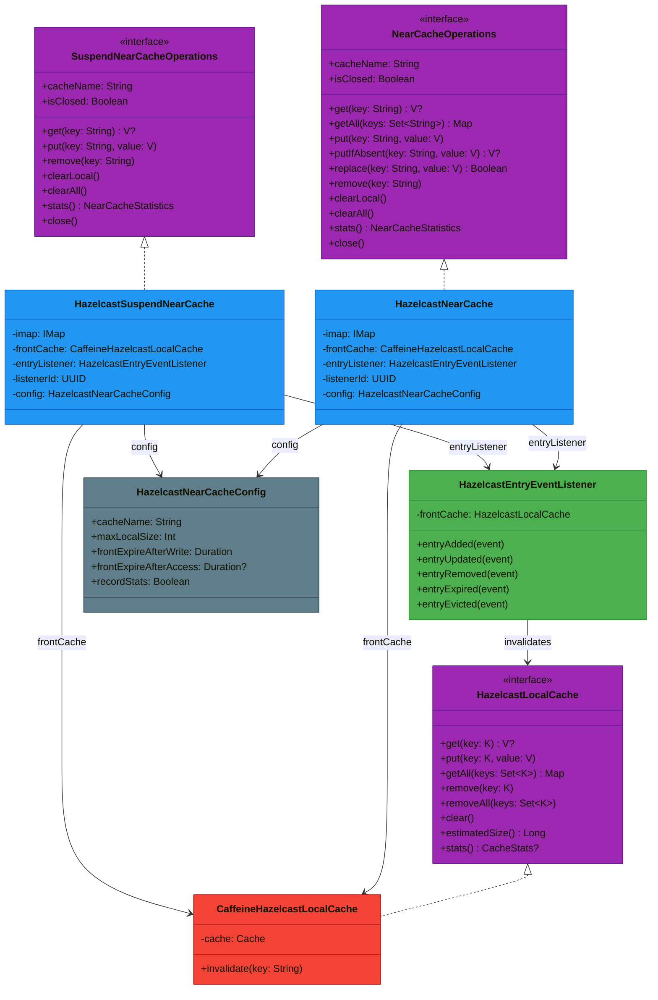
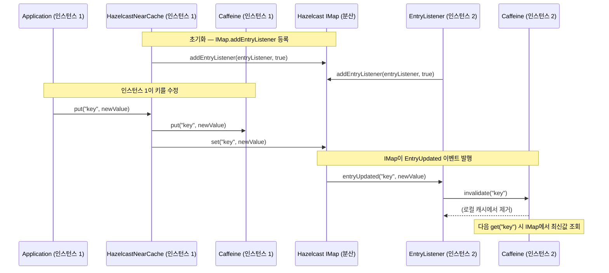

# Module bluetape4k-cache-hazelcast

`bluetape4k-cache-hazelcast`는 Hazelcast 기반 JCache Provider, Coroutines 캐시 구현, 그리고 **Caffeine + Hazelcast IMap 2-Tier Near Cache**를 제공합니다.

> 기존 `bluetape4k-cache-hazelcast-near` 모듈이 이 모듈에 통합되었습니다.

## 제공 기능

| 클래스 | 설명 |
|---|---|
| `HazelcastJCaching` | Hazelcast JCache Provider |
| `HazelcastSuspendCache` | JCache 기반 코루틴 캐시 |
| `HazelcastNearCache<V>` | Caffeine(front) + IMap(back) 2-Tier Near Cache (동기, write-through) |
| `HazelcastSuspendNearCache<V>` | Near Cache 코루틴 구현 (write-through) |
| `ResilientHazelcastNearCache<V>` | write-behind + retry + graceful degradation 동기 구현 |
| `ResilientHazelcastSuspendNearCache<V>` | write-behind + retry + graceful degradation 코루틴 구현 |
| `HazelcastNearCacheConfig` | Near Cache 설정 data class + DSL 빌더 |
| `ResilientHazelcastNearCacheConfig` | Resilient NearCache 추가 설정 (retry, queue 등) |
| `HazelcastLocalCache<V>` | front cache 추상 인터페이스 |
| `CaffeineHazelcastLocalCache<V>` | Caffeine 기반 LocalCache 구현 |
| `HazelcastEntryEventListener` | IMap EntryListener 기반 invalidation 리스너 |
| `HazelcastMemoizer<K,V>` | IMap 기반 함수 결과 메모이제이션 (sync, `Memoizer` 인터페이스) |
| `AsyncHazelcastMemoizer<K,V>` | IMap.getAsync() 기반 비동기 메모이제이션 (`AsyncMemoizer` 인터페이스) |
| `SuspendHazelcastMemoizer<K,V>` | IMap.getAsync().await() 기반 코루틴 메모이제이션 (`SuspendMemoizer` 인터페이스) |

`HazelcastNearCacheConfig` 제약:
- `cacheName`은 공백일 수 없습니다.
- `maxLocalSize`는 0보다 커야 합니다.
- `frontExpireAfterWrite`, `frontExpireAfterAccess`는 지정 시 0보다 커야 합니다.

## 설치

```kotlin
dependencies {
    implementation("io.github.bluetape4k:bluetape4k-cache-hazelcast:${bluetape4kVersion}")
}
```

## Factory (HazelcastCaches)

`HazelcastCaches` 오브젝트를 통해 모든 캐시 타입을 편리하게 생성할 수 있습니다.

```kotlin
// JCache
val jcache = HazelcastCaches.jcache<String, String>(hazelcastInstance, "my-cache")

// SuspendCache
val sc = HazelcastCaches.suspendCache<String, String>(hazelcastInstance, "my-cache")

// NearJCache — JCache 기반 2-Tier (동기, DSL)
val nearJCache = HazelcastCaches.nearJCache<String, String>(hazelcastInstance) {
    cacheName = "my-near-jcache"
    isSynchronous = true
}

// SuspendNearJCache — JCache 기반 2-Tier (코루틴, DSL)
val suspendNearJCache = HazelcastCaches.suspendNearJCache<String, String>(hazelcastInstance) {
    cacheName = "my-suspend-near-jcache"
}

// NearCache — Caffeine + IMap 기반 (동기, DSL)
val near = HazelcastCaches.nearCache<String>(hazelcastInstance) { cacheName = "my-near" }

// SuspendNearCache — Caffeine + IMap 기반 (코루틴, DSL)
val suspendNear = HazelcastCaches.suspendNearCache<String>(hazelcastInstance) { cacheName = "my-near" }

// Resilient NearCache (write-behind + retry)
val resilient = HazelcastCaches.resilientNearCache<String>(hazelcastInstance, nearCacheConfig)
```

## JCache 기반 NearCache (nearcache.jcache 패키지)

`NearJCache<K,V>` /
`SuspendNearJCache<K,V>`는 JCache 인터페이스를 직접 구현하는 2-tier 캐시입니다. Caffeine(front) + Hazelcast IMap(back) 구조입니다.



> Hazelcast client JCache는 리스너를 클러스터에 직렬화해서 전파하므로, `SuspendNearJCache`는 `withoutListener(front, back)`로 생성됩니다.

### NearJCache 사용 예

```kotlin
// DSL로 NearJCache 생성
val nearJCache = HazelcastCaches.nearJCache<String, String>(hazelcastInstance) {
    cacheName = "orders-near-jcache"
    isSynchronous = true
}

nearJCache.put("order-1", "data")
val value = nearJCache.get("order-1")   // front(Caffeine) → back(IMap) 순으로 조회
nearJCache.close()

// DSL로 SuspendNearJCache 생성
val suspendNearJCache = HazelcastCaches.suspendNearJCache<String, String>(hazelcastInstance) {
    cacheName = "sessions-near-jcache"
}

suspendNearJCache.put("session-1", "token-abc")
val token = suspendNearJCache.get("session-1")   // suspend fun
suspendNearJCache.close()
```

## 클래스 구조

### HazelcastNearCache 계층



### IMap EntryListener 기반 Invalidation 흐름



## NearCache 아키텍처

### Write-through (기본)

```
Application
    |
[HazelcastNearCache / HazelcastSuspendNearCache]
    |
+--------+--------+-----------+
|        |        |           |
Front   Back    Listener
Caffeine  IMap   EntryListener
(local) (remote)  (invalidation)
```

- **Read**: front hit → 즉시 반환 / front miss → IMap GET → front populate → 반환
- **Write**: front put + IMap PUT (write-through, 동기)
- **Invalidation**: IMap EntryListener → 로컬 캐시 자동 무효화

### Write-behind (Resilient)

```
Application
    |
[ResilientHazelcastNearCache / ResilientHazelcastSuspendNearCache]
    |
+---+----------+
|              |
Front          Write Queue (LinkedBlockingQueue / Channel)
Caffeine           |
(즉시 반영)    Consumer (virtualThread / coroutine)
               (retry { imap.set/delete })
```

- **Write**: front 즉시 반영 + IMap 쓰기는 queue/channel로 비동기 처리 (write-behind)
- **tombstones**: remove 후 write-behind 완료 전 stale read 방지
- **clearPending**: clearAll 후 IMap read 차단
- **retry**: Resilience4j Retry로 IMap 쓰기 실패 시 재시도
- **GetFailureStrategy**: IMap GET 실패 시 null 반환 또는 예외 전파

> JCache `registerCacheEntryListener`는 리스너 factory를 서버로 직렬화해 전송하므로
> non-serializable 리스너가 실패한다. `IMap.addEntryListener`는 클라이언트 JVM에서 리스너를
> 실행하므로 직렬화가 불필요하다.

## 사용 예시

### 1. HazelcastSuspendCache

```kotlin
import io.bluetape4k.cache.jcache.HazelcastSuspendCache

val suspendCache = HazelcastSuspendCache<String, Any>("hazelcast-cache")
suspendCache.put("key", "value")
val value = suspendCache.get("key")
```

### 2. HazelcastNearCacheConfig DSL

```kotlin
import io.bluetape4k.cache.nearcache.hazelcastNearCacheConfig

val config = hazelcastNearCacheConfig {
    cacheName = "my-near-cache"
    maxLocalSize = 10_000
    frontExpireAfterWrite = Duration.ofMinutes(30)
    frontExpireAfterAccess = null
    recordStats = false
}
```

### 3. HazelcastNearCache (동기)

```kotlin
import io.bluetape4k.cache.nearcache.HazelcastNearCache
import io.bluetape4k.cache.nearcache.HazelcastNearCacheConfig

val cache = HazelcastNearCache<String>(
    hazelcastInstance = hazelcastClient,
    config = HazelcastNearCacheConfig(cacheName = "orders"),
)

cache.use { c ->
    c.put("order-1", "data")
    val value = c.get("order-1")  // 로컬 Caffeine에서 우선 조회
    c.remove("order-1")
}
```

### 4. HazelcastSuspendNearCache (코루틴)

```kotlin
import io.bluetape4k.cache.nearcache.HazelcastSuspendNearCache
import io.bluetape4k.cache.nearcache.HazelcastNearCacheConfig

val cache = HazelcastSuspendNearCache<String>(
    hazelcastInstance = hazelcastClient,
    config = HazelcastNearCacheConfig(cacheName = "sessions"),
)

cache.use { c ->
    c.put("session-1", "token-abc")
    val token = c.get("session-1")  // suspend fun
    c.clearAll()
}
```

### 5. ResilientHazelcastNearCache (write-behind + retry)

```kotlin
import io.bluetape4k.cache.nearcache.ResilientHazelcastNearCache
import io.bluetape4k.cache.nearcache.ResilientHazelcastNearCacheConfig
import io.bluetape4k.cache.nearcache.HazelcastNearCacheConfig
import java.time.Duration

val cache = ResilientHazelcastNearCache<String>(
    hazelcastInstance = hazelcastClient,
    config = ResilientHazelcastNearCacheConfig(
        base = HazelcastNearCacheConfig(cacheName = "orders"),
        retryMaxAttempts = 3,
        retryWaitDuration = Duration.ofMillis(200),
        retryExponentialBackoff = true,
        writeQueueCapacity = 1024,
    ),
)

cache.put("key", "value")       // front 즉시 반영, IMap은 write-behind
cache.get("key")                // front hit → 즉시 반환
cache.localCacheSize()          // 로컬 Caffeine 크기
cache.backCacheSize()           // IMap 크기
cache.clearAll()                // front 즉시 초기화, IMap은 write-behind
cache.close()
```

### 6. ResilientHazelcastSuspendNearCache (코루틴)

```kotlin
import io.bluetape4k.cache.nearcache.ResilientHazelcastSuspendNearCache

val cache = ResilientHazelcastSuspendNearCache<String>(
    hazelcastInstance = hazelcastClient,
    config = ResilientHazelcastNearCacheConfig(
        base = HazelcastNearCacheConfig(cacheName = "sessions"),
    ),
)

// suspend 함수로 사용
cache.put("session-1", "token-abc")
val token = cache.get("session-1")
cache.close()
```

## HazelcastNearCacheConfig 옵션

| 옵션                       | 기본값                      | 설명                                |
|--------------------------|--------------------------|-----------------------------------|
| `cacheName`              | `"hazelcast-near-cache"` | 캐시(IMap) 이름                       |
| `maxLocalSize`           | `10_000`                 | Caffeine 최대 항목 수                   |
| `frontExpireAfterWrite`  | `30분`                    | 로컬 캐시 write 후 만료 시간               |
| `frontExpireAfterAccess` | `null`                   | 로컬 캐시 access 후 만료 시간 (null이면 비활성) |
| `recordStats`            | `false`                  | Caffeine 통계 수집 여부                  |

## ResilientHazelcastNearCacheConfig 옵션

| 옵션 | 기본값 | 설명 |
|---|---|---|
| `base` | `HazelcastNearCacheConfig()` | 기본 NearCache 설정 |
| `writeQueueCapacity` | `1024` | write-behind 큐 최대 용량 |
| `retryMaxAttempts` | `3` | IMap 쓰기 최대 재시도 횟수 |
| `retryWaitDuration` | `500ms` | 재시도 대기 시간 |
| `retryExponentialBackoff` | `true` | 지수 백오프 사용 여부 |
| `getFailureStrategy` | `RETURN_FRONT_OR_NULL` | IMap GET 실패 시 동작 전략 |

### 7. HazelcastMemoizer — 함수 결과 Hazelcast 캐싱

```kotlin
import io.bluetape4k.cache.memoizer.hazelcast.memoizer
import io.bluetape4k.cache.memoizer.hazelcast.asyncMemoizer
import io.bluetape4k.cache.memoizer.hazelcast.suspendMemoizer

val imap: IMap<Int, Int> = hazelcastClient.getMap("squares")

// 동기 메모이저
val memoizer = imap.memoizer { key -> key * key }
val result1 = memoizer(5)   // 25 — 계산 후 IMap에 저장
val result2 = memoizer(5)   // 25 — IMap에서 반환

// 비동기 메모이저 (IMap.getAsync 활용)
val asyncMemoizer = imap.asyncMemoizer { key -> key * key }
val asyncResult = asyncMemoizer(5).get()

// 코루틴 메모이저
val suspendMemoizer = imap.suspendMemoizer { key -> computeExpensive(key) }
val suspendResult = suspendMemoizer(5)
```

## CachingProvider 등록 목록

`META-INF/services/javax.cache.spi.CachingProvider`에 등록된 Provider:

```
com.hazelcast.cache.HazelcastCachingProvider
```

클래스패스에 여러 Provider가 공존할 때는 명시적으로 지정하세요:

```kotlin
val provider = Caching.getCachingProvider("com.hazelcast.cache.HazelcastCachingProvider")
```
