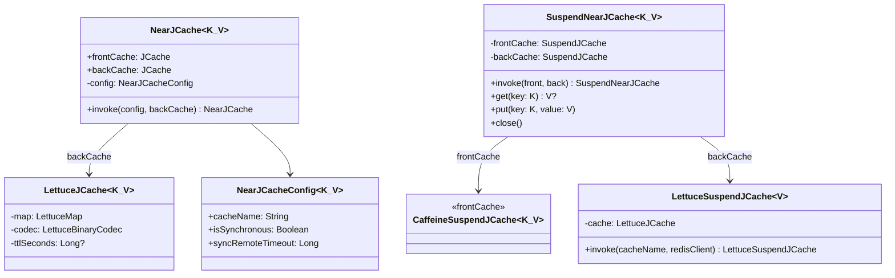
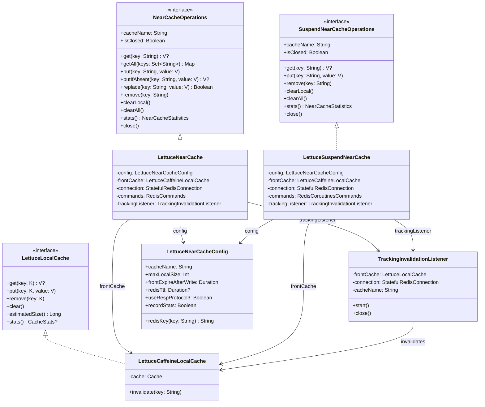
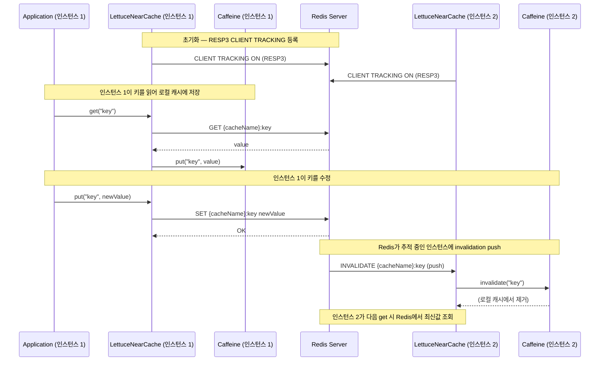

# Module bluetape4k-cache-lettuce

[English](./README.md) | 한국어

`bluetape4k-cache-lettuce`는 Lettuce(Redis) 기반 JCache Provider와 NearCache 구현을 제공합니다.

## 설치

```kotlin
dependencies {
    implementation("io.github.bluetape4k:bluetape4k-cache-lettuce:${bluetape4kVersion}")
}
```

## 제공 기능

### Memoizer (함수 결과 Redis 캐싱)

| 클래스                            | 설명                                                               |
|--------------------------------|------------------------------------------------------------------|
| `LettuceMemoizer<K, V>`        | `LettuceMap<V>` 기반 동기 메모이제이션 (`Memoizer<K,V>` 인터페이스)             |
| `LettuceAsyncMemoizer<K, V>`   | `LettuceMap<V>` 기반 비동기 메모이제이션 (`AsyncMemoizer<K,V>` 인터페이스)       |
| `LettuceSuspendMemoizer<K, V>` | `LettuceMap<V>` 기반 suspend 메모이제이션 (`SuspendMemoizer<K,V>` 인터페이스) |

```kotlin
import io.bluetape4k.redis.lettuce.codec.LettuceLongCodec
import io.bluetape4k.redis.lettuce.codec.LettuceIntCodec
import io.bluetape4k.redis.lettuce.map.LettuceMap
import io.bluetape4k.cache.memoizer.memoizer
import io.bluetape4k.cache.memoizer.asyncMemoizer
import io.bluetape4k.cache.memoizer.suspendMemoizer

// Long→Long 메모이저 (LettuceLongCodec 사용)
val longConnection = redisClient.connect(LettuceLongCodec)
val longMap = LettuceMap<Long>(longConnection, "memoizer:factorial")

val factorial = longMap.memoizer { n: Long -> computeFactorial(n) }
val result = factorial(10L)   // 계산 후 Redis에 저장
val cached = factorial(10L)   // Redis에서 반환

// Int→Int 비동기 메모이저 (LettuceIntCodec 사용)
val intConnection = redisClient.connect(LettuceIntCodec)
val intMap = LettuceMap<Int>(intConnection, "memoizer:squares")

val asyncSquare = intMap.asyncMemoizer { n: Int ->
    CompletableFuture.supplyAsync { n * n }
}
val squareResult = asyncSquare(7).join()  // 49

// suspend 메모이저
val suspendMemoizer = longMap.suspendMemoizer { n: Long ->
    delay(10)
    computeFactorial(n)
}
val suspendResult = suspendMemoizer(5L)  // 120L
```

### JCache (JSR-107)

- Lettuce 기반 `javax.cache.spi.CachingProvider` 구현
- `LettuceJCaching` — Lettuce JCache 설정 및 CachingProvider 초기화 헬퍼

### NearCache (2-Tier Cache)

Caffeine(로컬) + Redis(분산) 2단계 캐시로, RESP3 CLIENT TRACKING을 통한 자동 invalidation을 지원합니다.

| 클래스                                     | 설명                                                 |
|-----------------------------------------|----------------------------------------------------|
| `LettuceNearCache<V>`                   | 동기(Blocking) 2-Tier 캐시 (write-through)             |
| `LettuceSuspendNearCache<V>`            | Coroutines(suspend) 2-Tier 캐시 (write-through)      |
| `ResilientLettuceNearCache<V>`          | write-behind + retry + graceful degradation 동기 구현  |
| `ResilientLettuceSuspendNearCache<V>`   | write-behind + retry + graceful degradation 코루틴 구현 |
| `LettuceNearCacheConfig<K, V>`          | NearCache 설정 data class + DSL 빌더                   |
| `ResilientLettuceNearCacheConfig<K, V>` | Resilient NearCache 추가 설정 (retry, queue 등)         |
| `LocalCache<K, V>`                      | front cache 추상 인터페이스                               |
| `CaffeineLocalCache<K, V>`              | Caffeine 기반 LocalCache 구현                          |
| `TrackingInvalidationListener<V>`       | RESP3 CLIENT TRACKING push 리스너                     |

`LettuceCacheConfig`/`LettuceNearCacheConfig` 사용 시:

- 배치 크기, 큐 크기, 재시도 횟수, local cache 크기는 0보다 커야 합니다.
- TTL은 지정 시 0보다 커야 합니다.
- 캐시 이름과 key prefix는 공백일 수 없습니다.

### JCache 기반 NearCache (nearcache.jcache 패키지)

`NearJCache<K,V>` /
`SuspendNearJCache<K,V>`는 JCache 인터페이스를 직접 구현하는 2-tier 캐시입니다. Caffeine(front) + LettuceJCache(back) 구조로,
`NearJCacheConfig` Builder DSL로 설정합니다.



#### NearJCacheConfig DSL

```kotlin
import io.bluetape4k.cache.nearcache.jcache.nearJCacheConfig

val config = nearJCacheConfig<String, String> {
    cacheName = "my-near-jcache"
    isSynchronous = true               // 동기 이벤트 전파
    syncRemoteTimeout = 1000L          // 이벤트 타임아웃 (ms)
}
```

#### NearJCache (동기) 사용 예

```kotlin
val cache = LettuceCaches.nearJCache<String, String>(redisClient) {
    cacheName = "orders-near-jcache"
}

cache.put("order-1", "data")
val value = cache.get("order-1")   // front(Caffeine) → back(Lettuce) 순으로 조회
cache.close()
```

#### SuspendNearJCache (코루틴) 사용 예

```kotlin
val cache = LettuceCaches.suspendNearJCache<String>(redisClient) {
    cacheName = "sessions-suspend-near-jcache"
}

cache.put("session-1", "token-abc")
val token = cache.get("session-1")   // suspend fun
cache.close()
```

> **선택 기준**: JCache 표준 호환이 필요하면 `NearJCache`/`SuspendNearJCache`를, 더 풍부한 통계·resilience가 필요하면 `LettuceNearCache`/
`LettuceSuspendNearCache`를 사용하세요.

### 클래스 구조

#### LettuceNearCache 계층



#### RESP3 CLIENT TRACKING 기반 Invalidation 흐름



### NearCache 아키텍처

#### Write-through (기본)

```
Application
    |
[LettuceNearCache / LettuceSuspendNearCache]
    |
+---+---+
|       |
Front   Back
Caffeine  Redis (via Lettuce RESP3)

Invalidation: Redis CLIENT TRACKING → server push → local invalidate
```

- **Read**: front hit → 즉시 반환 / front miss → Redis GET → front populate → 반환
- **Write**: front put + Redis SET (write-through, 동기)
- **Invalidation**: RESP3 CLIENT TRACKING push → 로컬 캐시 자동 무효화

#### Write-behind (Resilient)

```
Application
    |
[ResilientLettuceNearCache / ResilientLettuceSuspendNearCache]
    |
+---+----------+
|              |
Front          Write Queue (LinkedBlockingQueue / Channel)
Caffeine           |
(즉시 반영)    Consumer (virtualThread / coroutine)
               (retry { syncCommands.set/del })
```

- **write-behind**: put/remove → front 즉시, Redis 쓰기는 비동기 큐로 처리
- **tombstones**: remove 후 write-behind 완료 전 stale read 방지
- **clearPending**: clearAll 호출 후 Redis read 차단
- **retry**: Resilience4j Retry로 Redis 쓰기 실패 시 재시도 (지수 백오프 옵션)
- **GetFailureStrategy**: Redis GET 실패 시 null 반환(RETURN_FRONT_OR_NULL) 또는 예외 전파(PROPAGATE_EXCEPTION)

### JCache TTL 계약

- `LettuceCacheConfig.ttlSeconds`는 Redis hash field가 아니라 캐시 hash key 전체 TTL입니다.
- `put`, `putAll`, `putIfAbsent`, `replace` 계열 쓰기 API는 성공 시 동일한 TTL을 다시 적용합니다.
- Redis 8 이상에서는 `HSETEX`를 우선 사용하고 hash key `EXPIRE`도 함께 갱신합니다.
- Redis 7 이하 서버에서는 자동으로 `HSET/HMSET + EXPIRE` 경로로 fallback 합니다.
- TTL이 지나면 해당 cacheName에 속한 항목이 함께 만료됩니다.
- 현재 JCache의 `EntryProcessor` 기반 `invoke` / `invokeAll`은 지원하지 않으며 호출 시 `CacheException`을 반환합니다.

```kotlin
import io.bluetape4k.cache.jcache.LettuceJCaching

val sessions = LettuceJCaching.getOrCreate<String, String>(
    cacheName = "sessions",
    ttlSeconds = 60,
)

sessions.put("token:1", "value")
sessions.putIfAbsent("token:2", "value2")
```

## Factory (LettuceCaches)

`LettuceCaches` object를 사용하면 JCache, NearCache, SuspendNearCache, ResilientNearCache를 간편하게 생성할 수 있습니다.

```kotlin
// JCache 생성
val jcache = LettuceCaches.jcache<String, String>(redisClient, "my-cache")

// SuspendJCache 생성 (코루틴)
val suspendJCache = LettuceCaches.suspendJCache<String>(redisClient, "my-cache")

// NearJCache — JCache 기반 2-Tier (동기)
val nearJCache = LettuceCaches.nearJCache<String, String>(redisClient) {
    cacheName = "my-near-jcache"
    isSynchronous = true
}

// SuspendNearJCache — JCache 기반 2-Tier (코루틴)
val suspendNearJCache = LettuceCaches.suspendNearJCache<String>(redisClient) {
    cacheName = "my-suspend-near-jcache"
}

// NearCache — RESP3 CLIENT TRACKING 기반 (동기)
val near = LettuceCaches.nearCache<String>(redisClient) { cacheName = "my-near" }

// SuspendNearCache — RESP3 CLIENT TRACKING 기반 (코루틴)
val suspendNear = LettuceCaches.suspendNearCache<String>(redisClient) { cacheName = "my-near" }

// ResilientNearCache (write-behind + retry)
val resilient = LettuceCaches.resilientNearCache<String>(redisClient)

// ResilientSuspendNearCache (코루틴 + write-behind + retry)
val resilientSuspend = LettuceCaches.resilientSuspendNearCache<String>(redisClient)
```

## 사용 예시

### LettuceNearCacheConfig DSL

```kotlin
import io.bluetape4k.cache.nearcache.lettuceNearCacheConfig

val config = lettuceNearCacheConfig<String, String> {
    cacheName = "my-cache"
    maxLocalSize = 10_000
    frontExpireAfterWrite = Duration.ofMinutes(30)
    redisTtl = Duration.ofHours(1)
    useRespProtocol3 = true  // CLIENT TRACKING 활성화
}
```

### 동기 NearCache

```kotlin
import io.bluetape4k.cache.nearcache.LettuceNearCache
import io.bluetape4k.cache.nearcache.LettuceNearCacheConfig
import io.lettuce.core.RedisClient
import io.lettuce.core.ClientOptions
import io.lettuce.core.protocol.ProtocolVersion

// RESP3 활성화 RedisClient 생성
val redisClient = RedisClient.create("redis://localhost:6379").also {
    it.options = ClientOptions.builder()
        .protocolVersion(ProtocolVersion.RESP3)
        .build()
}

val cache = LettuceNearCache(
    redisClient = redisClient,
    config = LettuceNearCacheConfig(cacheName = "orders"),
)

cache.use { c ->
    c.put("order-1", "data")
    val value = c.get("order-1")  // front hit (로컬)
    c.remove("order-1")
}
```

### Coroutines NearCache

```kotlin
import io.bluetape4k.cache.nearcache.LettuceSuspendNearCache
import io.bluetape4k.cache.nearcache.LettuceNearCacheConfig

val cache = LettuceSuspendNearCache(
    redisClient = redisClient,
    config = LettuceNearCacheConfig(cacheName = "sessions"),
)

cache.use { c ->
    c.put("session-1", "token-abc")
    val token = c.get("session-1")  // suspend fun
    c.clearAll()
}
```

### ResilientLettuceNearCache (write-behind + retry)

```kotlin
import io.bluetape4k.cache.nearcache.ResilientLettuceNearCache
import io.bluetape4k.cache.nearcache.ResilientLettuceNearCacheConfig
import io.bluetape4k.cache.nearcache.LettuceNearCacheConfig
import java.time.Duration

val cache = ResilientLettuceNearCache<String, String>(
    redisClient = redisClient,
    config = ResilientLettuceNearCacheConfig(
        base = LettuceNearCacheConfig(cacheName = "orders"),
        writeQueueCapacity = 1024,
        retryMaxAttempts = 3,
        retryWaitDuration = Duration.ofMillis(200),
        retryExponentialBackoff = true,
    ),
)

cache.put("key", "value")       // front 즉시 반영, Redis는 write-behind
cache.get("key")                // front hit → 즉시 반환
cache.localCacheSize()          // 로컬 Caffeine 크기
cache.backCacheSize()           // Redis 키 개수
cache.clearAll()                // front 즉시 초기화, Redis는 write-behind
cache.close()
```

### ResilientLettuceSuspendNearCache (코루틴)

```kotlin
import io.bluetape4k.cache.nearcache.ResilientLettuceSuspendNearCache

val cache = ResilientLettuceSuspendNearCache<String, String>(
    redisClient = redisClient,
    config = ResilientLettuceNearCacheConfig(
        base = LettuceNearCacheConfig(cacheName = "sessions"),
    ),
)

// suspend 함수로 사용
cache.put("session-1", "token-abc")
val token = cache.get("session-1")
cache.close()
```

## ResilientLettuceNearCacheConfig 옵션

| 옵션                        | 기본값                        | 설명                   |
|---------------------------|----------------------------|----------------------|
| `base`                    | `LettuceNearCacheConfig()` | 기본 NearCache 설정      |
| `writeQueueCapacity`      | `1024`                     | write-behind 큐 최대 용량 |
| `retryMaxAttempts`        | `3`                        | Redis 쓰기 최대 재시도 횟수   |
| `retryWaitDuration`       | `500ms`                    | 재시도 대기 시간            |
| `retryExponentialBackoff` | `true`                     | 지수 백오프 사용 여부         |
| `getFailureStrategy`      | `RETURN_FRONT_OR_NULL`     | Redis GET 실패 시 동작 전략 |

## LettuceNearCacheConfig 옵션

| 옵션                       | 기본값                    | 설명                               |
|--------------------------|------------------------|----------------------------------|
| `cacheName`              | `"lettuce-near-cache"` | 캐시 이름 (Redis key prefix, `:` 금지) |
| `maxLocalSize`           | `10_000`               | Caffeine 최대 항목 수                 |
| `frontExpireAfterWrite`  | `30분`                  | 로컬 캐시 write 후 만료 시간              |
| `frontExpireAfterAccess` | `null`                 | 로컬 캐시 access 후 만료 시간             |
| `redisTtl`               | `null`                 | Redis TTL (null이면 영구 보존)         |
| `useRespProtocol3`       | `true`                 | RESP3 CLIENT TRACKING 활성화 여부     |
| `recordStats`            | `false`                | Caffeine 통계 수집 여부                |

## Key 격리 전략

Redis key는 `{cacheName}:{key}` 형태의 prefix로 저장됩니다.

```
cacheName="orders", key="user:123" → Redis key: "orders:user:123"
```

- `clearAll()`은 SCAN으로 해당 cacheName의 key만 삭제 (FLUSHDB 사용 안 함)
- 서로 다른 cacheName 인스턴스는 완전히 독립적인 key 공간을 가짐
- key에 `:` 포함 가능 (cacheName에만 `:` 금지)

## 참고

- RESP3 CLIENT TRACKING은 Redis 6.0+ 이상에서 지원됩니다.
- NearCache는 단일 Redis 연결에서 동작하며, 클러스터 모드에서는 별도 설정이 필요합니다.
- 다른 분산 캐시 백엔드가 필요한 경우:
  - Redisson 기반: `bluetape4k-cache-redisson`
  - Hazelcast 기반: `bluetape4k-cache-hazelcast`
