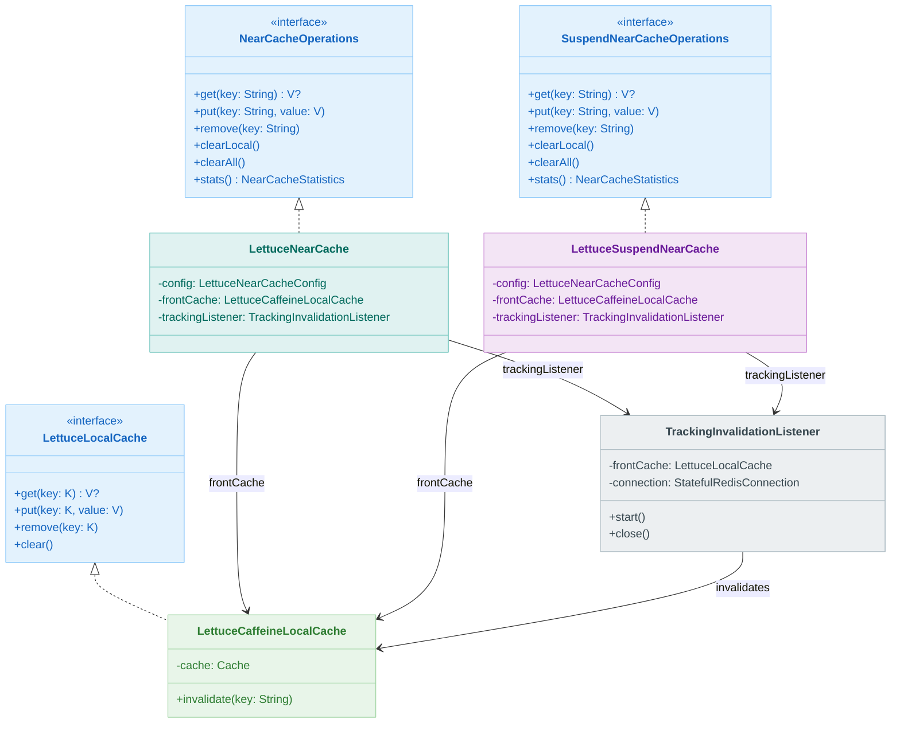
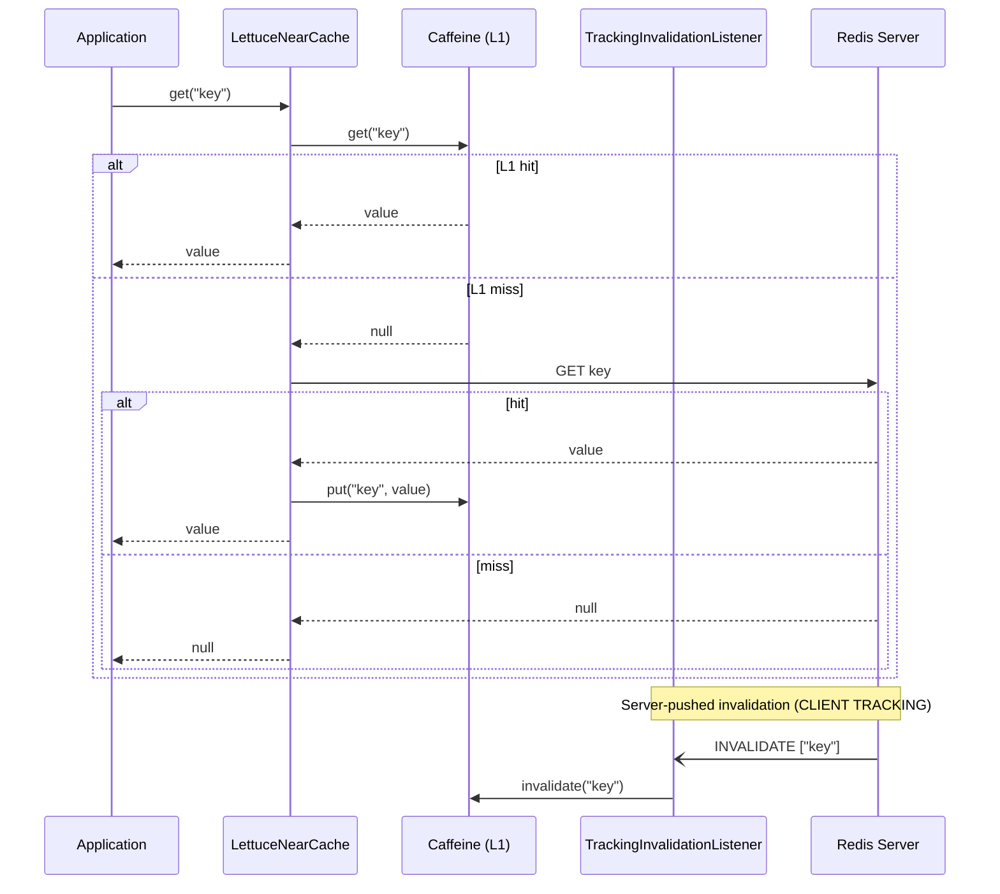

# Module bluetape4k-cache-lettuce

English | [한국어](./README.ko.md)

`bluetape4k-cache-lettuce` provides a Lettuce (Redis)-based JCache provider and NearCache implementations.

## Installation

```kotlin
dependencies {
    implementation("io.github.bluetape4k:bluetape4k-cache-lettuce:${bluetape4kVersion}")
}
```

## Provided Features

- sync / async / suspend memoizers built on `LettuceMap`
- Lettuce-based `CachingProvider` and `LettuceJCaching`
- blocking and coroutine two-tier near caches
- resilient near-cache variants with write-behind and retry
- JCache-based `NearJCache` / `SuspendNearJCache`
- RESP3 `CLIENT TRACKING` invalidation support

## Factory (`LettuceCaches`)

`LettuceCaches` exposes factory methods for:

- `jcache`
- `suspendCache`
- `nearJCache`
- `suspendNearJCache`
- `nearCache`
- `suspendNearCache`
- resilient near-cache variants

## Usage Examples

Typical examples include:

- memoizer creation for Redis-backed function caching
- `NearJCacheConfig` DSL usage
- sync / suspend JCache-backed near caches
- native `LettuceNearCache` / `LettuceSuspendNearCache`

## Architecture Diagrams

### LettuceNearCache Class Hierarchy



### RESP3 CLIENT TRACKING Flow



## `ResilientLettuceNearCacheConfig` Options

The resilient configuration extends the standard near-cache config with write-behind queueing, retry settings, and graceful-degradation behavior.

## `LettuceNearCacheConfig` Options

Core options include:

- `cacheName`
- `maxLocalSize`
- `frontExpireAfterWrite`
- `redisTtl`
- `useRespProtocol3`
- `recordStats`

Validation rules:

- batch size, queue size, retry count, and local cache size must be greater than zero
- TTL must be greater than zero when configured
- cache names and key prefixes must not be blank

## Key Isolation Strategy

Redis keys are namespaced through the configured cache name and key prefix so multiple caches can coexist safely in the same Redis deployment.

## Notes

- Use `NearJCache` / `SuspendNearJCache` when JCache standard compatibility is important.
- Use `LettuceNearCache` / `LettuceSuspendNearCache` when richer stats and resilience features matter.
- RESP3 `CLIENT TRACKING` is the basis for automatic invalidation.
