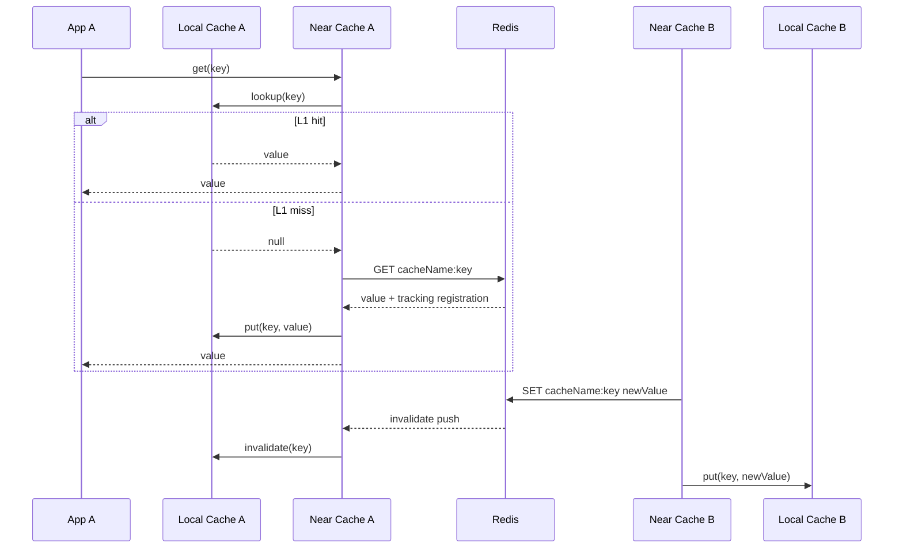
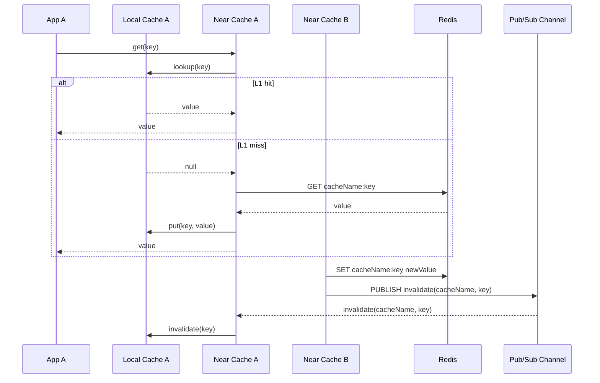
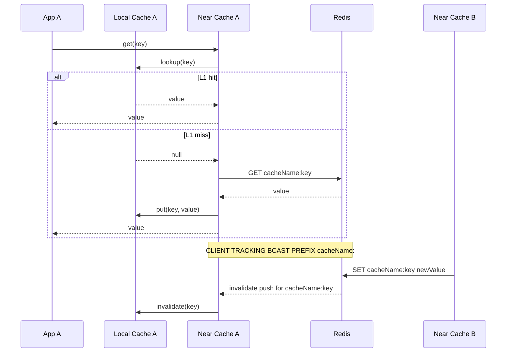
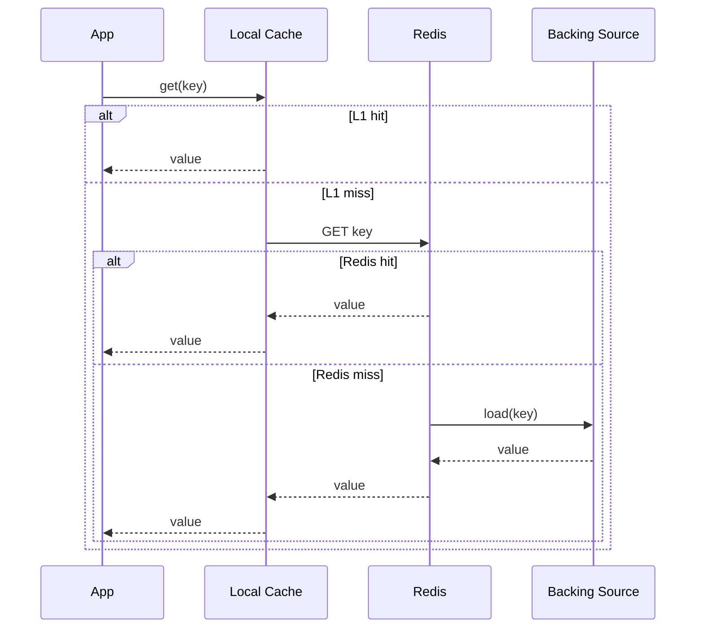
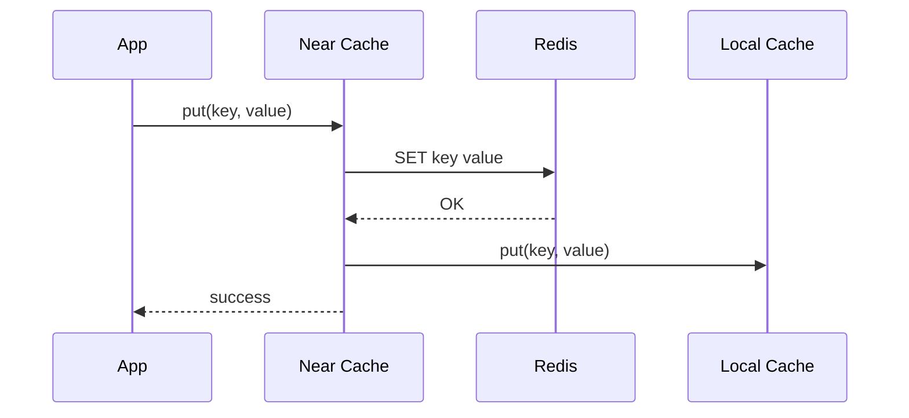
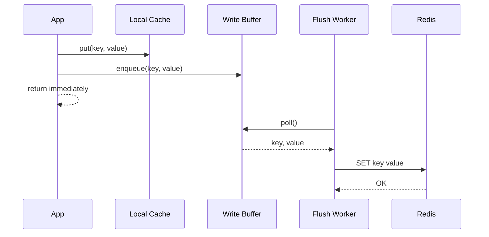
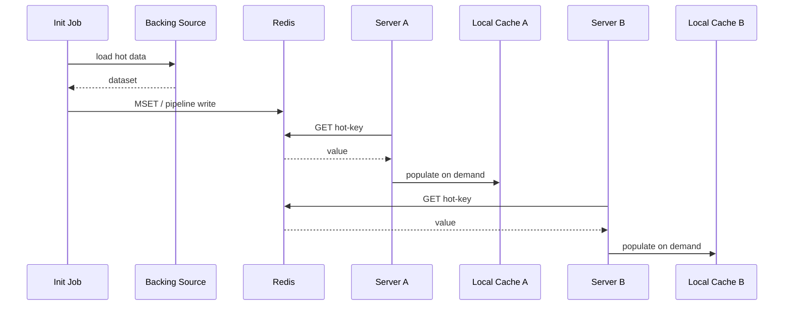

# Architecture 비교

`infra/cache-lettuce`의 Near Cache는 `L1 Local Cache + L2 Redis` 구조를 전제로 한다. 이 문서는 invalidation 방식과 운영 패턴별 권장 구조를 비교한다.

## 전제

- Near Cache는 휘발성 캐시이며, Redis를 중간 계층의 source of truth로 둔다.
- 일반적인 사용 패턴은 `Cache-Aside`, `Read-Through`, `Write-Through`, `Write-Behind` 이다.
- 초기 적재(init / warm-up)는 가능한 한 `L2 Redis`를 먼저 채우고, 각 서버의 `L1 Local Cache`는 lazy populate를 기본으로 한다.
- 모든 서버의 local cache를 eager full load하는 방식은 startup spike와 메모리 낭비를 유발할 수 있으므로 hot set preload가 필요한 경우에만 제한적으로 적용한다.

## RESP3 CLIENT TRACKING

Redis 서버가 "어떤 클라이언트가 어떤 키를 읽었는지"를 추적하고, 다른 클라이언트가 해당 키를 변경하면 invalidation push를 전달하는 방식이다.

### 장점

- 외부 writer가 Redis를 직접 수정해도 invalidation이 동작한다.
- 읽은 키 기준의 정밀 invalidation이 가능해 local cache churn이 적다.
- `NOLOOP`를 사용하면 자신의 write로 자신의 local cache를 무효화하지 않을 수 있다.
- 애플리케이션 레벨 publish 규약에 의존하지 않는다.

### 단점

- Redis 6+ 및 RESP3 지원이 필요하다.
- 구현이 상대적으로 복잡하다.
- 현재 구현처럼 tracking 등록용 `GET/MGET` 보정이 필요할 수 있다.
- 운영 환경에서 RESP3, push listener, 연결 상태를 함께 고려해야 한다.

### 적합한 경우

- 배치, 운영 스크립트, 외부 애플리케이션 등 Redis를 직접 쓰는 경로가 존재한다.
- stale local cache 허용 폭이 작다.
- invalidation 정확성이 단순성보다 더 중요하다.

## Custom Pub/Sub Invalidation

writer가 Redis에 write 한 뒤, 별도 channel에 invalidation 메시지를 publish 하고 다른 인스턴스가 subscribe 하여 local cache를 지우는 방식이다.

### 장점

- 개념이 단순하고 이해가 쉽다.
- RESP3 tracking 제약에서 자유롭다.
- 메시지 포맷을 key 단위, cacheName 단위, full flush 등으로 유연하게 설계할 수 있다.

### 단점

- 모든 writer가 publish 규약을 반드시 지켜야 한다.
- 외부 writer, 배치, 운영 스크립트가 publish 하지 않으면 stale local cache가 남는다.
- 일반 Pub/Sub는 subscriber가 끊긴 동안 메시지 replay를 보장하지 않는다.
- 재연결 시 local clear, version check, full reload 같은 보정 전략이 필요하다.

### 적합한 경우

- 모든 writer가 동일 애플리케이션 경계 안에 있다.
- Redis 직접 수정 경로를 통제할 수 있다.
- 운영 단순성이 invalidation 정확성보다 우선이다.

## Tracking BCAST + PREFIX

RESP3 tracking의 변형으로, 읽은 키만 추적하는 대신 특정 prefix 전체에 대해 broadcast invalidation을 받는 방식이다.

### 장점

- custom Pub/Sub보다 안전하다.
- Redis를 직접 수정하는 외부 writer에도 invalidation이 동작한다.
- 일반 tracking보다 구현이 단순해질 수 있다.
- 현재 구현의 `registerTrackingKey()` / `registerTrackingKeys()` 보정 경로를 제거할 여지가 있다.

### 단점

- per-key tracking보다 invalidation 범위가 거칠다.
- 같은 `cacheName` 아래 write 빈도가 높으면 local eviction churn이 늘 수 있다.

### 적합한 경우

- RESP3는 사용할 수 있지만, 현재 tracking 구현을 단순화하고 싶다.
- 정밀 invalidation보다 운영 단순성과 유지보수성을 조금 더 중시한다.

## Near Cache 운영 패턴별 권장 구조

### Read-Through / Cache-Aside

- 기본 권장 구조는 `L1 Local Cache -> L2 Redis -> backing source` 흐름이다.
- L1 miss 시 Redis에서 읽고 local populate 한다.
- 동일 키 miss가 몰릴 수 있으므로 single-flight 또는 per-key coalescing을 고려한다.

### Write-Through

- 라이브러리 기본 전략으로 가장 안전하다.
- `Redis write`를 먼저 성공시키고 local cache를 갱신하거나, 동일 트랜잭션 의미를 유지하는 순서를 고정해야 한다.
- invalidation은 Redis 기준으로 다른 서버에 전파되도록 두는 것이 안전하다.

### Write-Behind

- 성능상 장점은 있지만 기본 전략으로는 보수적으로 접근해야 한다.
- 큐 적재 실패, flush 지연, 재시도, 중복 반영, shutdown 시 flush 보장 문제를 함께 설계해야 한다.
- durable queue, idempotency key, retry 정책이 없으면 데이터 정합성 리스크가 커진다.

### Init Job / Warm-Up

- 권장 순서는 `Local Cache 전체 preload`가 아니라 `L2 Redis priming -> 각 서버 L1 lazy populate` 이다.
- 정말 필요한 hot key만 선택적으로 local preload 한다.
- 여러 서버가 동시에 warm-up 하더라도 Redis를 source of truth로 두면 구조가 단순하다.

## 결론

현재와 같은 Near Cache 전제에서는 `RESP3 CLIENT TRACKING`이 가장 안전한 기본 선택이다.

- 정확성 우선, writer 경로가 다양함: `RESP3 CLIENT TRACKING`
- RESP3는 가능하지만 구현 단순화가 필요함: `TRACKING BCAST + PREFIX`
- 모든 writer를 강하게 통제할 수 있고 운영 단순성이 최우선: `Custom Pub/Sub`

즉, 일반적인 bluetape4k 스타일의 라이브러리 기본값으로는 `custom Pub/Sub` 전환보다 `RESP3 tracking 유지` 또는 `tracking bcast/prefix` 검토가 더 적합하다.
