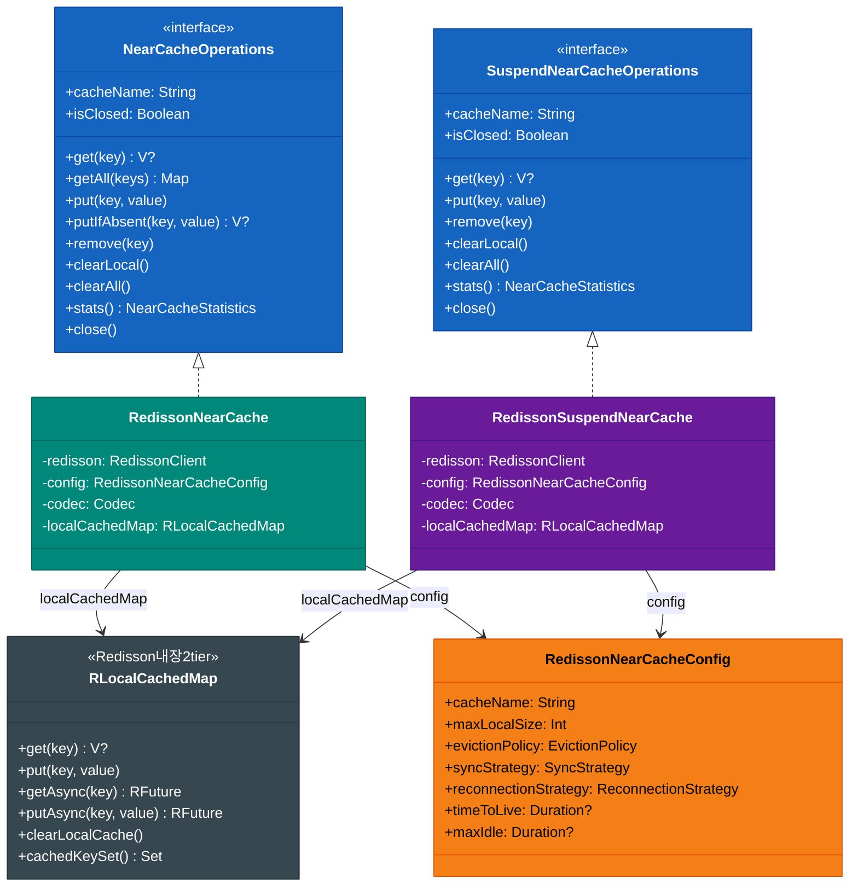
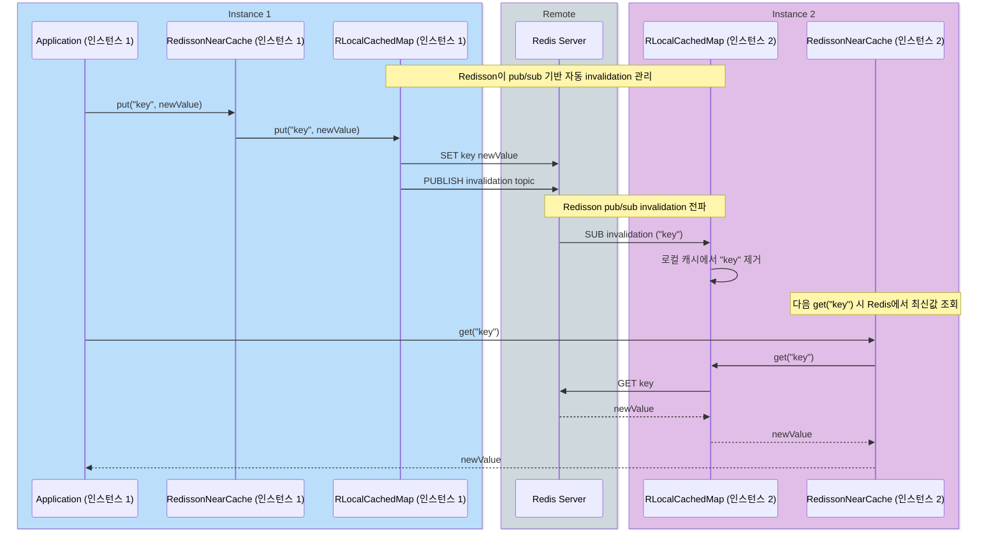

# Module bluetape4k-cache-redisson

[English](./README.md) | 한국어

`bluetape4k-cache-redisson`은 Redisson 기반 JCache Provider, Coroutines 캐시 구현, Memoizer, 그리고 다양한 **2-Tier Near Cache
** 구현을 제공합니다.

> 기존 `bluetape4k-cache-redisson-near` 모듈이 이 모듈에 통합되었습니다.

## 제공 기능

| 클래스                                         | 패키지         | 설명                                                                              |
|---------------------------------------------|-------------|---------------------------------------------------------------------------------|
| `org.redisson.jcache.JCachingProvider`      | —           | Redisson JCache Provider                                                        |
| `RedissonNearCachingProvider`               | `nearcache` | Redisson Near Cache JCache Provider                                             |
| `RedissonSuspendCache`                      | `jcache`    | JCache 기반 코루틴 캐시                                                                |
| `RedissonNearCache`                         | `nearcache` | Caffeine(front) + Redisson LocalCachedMap(back) 2-Tier Near Cache               |
| `RedissonSuspendNearCache`                  | `nearcache` | Near Cache 코루틴 래퍼                                                               |
| `RedissonResp3NearCache<V>`                 | `nearcache` | Redisson(RBucket) + Lettuce RESP3(invalidation) 하이브리드 NearCache — write-through |
| `RedissonResp3SuspendNearCache<V>`          | `nearcache` | RESP3 하이브리드 NearCache 코루틴 구현 — write-through                                    |
| `ResilientRedissonResp3NearCache<V>`        | `nearcache` | RESP3 하이브리드 + write-behind + Resilience4j retry (동기)                            |
| `ResilientRedissonResp3SuspendNearCache<V>` | `nearcache` | RESP3 하이브리드 + write-behind + Resilience4j retry (코루틴)                           |
| `RedissonMemoizer<T, R>`                    | `memoizer`  | RMap 기반 동기 메모이저                                                                 |
| `RedissonAsyncMemoizer<T, R>`               | `memoizer`  | RMap 기반 비동기(CompletableFuture) 메모이저                                             |
| `RedissonSuspendMemoizer<T, R>`             | `memoizer`  | RMap 기반 suspend 메모이저                                                            |

`RedissonNearCacheConfig` 제약:

- `cacheName`은 공백일 수 없습니다.
- `maxLocalSize`는 0보다 커야 합니다.
- `timeToLive`, `maxIdle`은 지정 시 0보다 커야 합니다.

## 의존성

```kotlin
// build.gradle.kts
dependencies {
    implementation("io.github.bluetape4k:bluetape4k-cache-redisson:$bluetape4kVersion")

    // RESP3 NearCache 사용 시 — Redis 6.0+ 필요
    // (lettuce-core는 bluetape4k-cache-redisson에 포함됨)
}
```

## 사용 예시

### 1. RedissonSuspendCache

JCache 기반 코루틴 캐시입니다.

```kotlin
import io.bluetape4k.cache.jcache.RedissonSuspendCache
import io.bluetape4k.cache.jcache.jcacheConfiguration

val config = jcacheConfiguration<String, Any> { }
val suspendCache = RedissonSuspendCache("redis-cache", redissonClient, config)

suspendCache.put("key", "value")
val value = suspendCache.get("key")
```

---

## 클래스 구조

### RedissonNearCache 계층



### RLocalCachedMap 내장 Invalidation 흐름



---

### 2. Redisson Near Cache (2-Tier)

Caffeine 로컬 캐시 + Redisson LocalCachedMap 분산 캐시를 조합한 2-tier Near Cache입니다.

```kotlin
import io.bluetape4k.cache.nearcache.RedissonNearCache
import io.bluetape4k.cache.nearcache.RedissonNearCacheConfig

val nearConfig = RedissonNearCacheConfig<String, Any>()
val nearCache = RedissonNearCache<String, Any>("redis-near", redissonClient, nearConfig)

nearCache.put("key", "value")
val value = nearCache.get("key")   // 로컬 Caffeine에서 우선 조회
```

### 3. RedissonSuspendNearCache (코루틴)

```kotlin
import io.bluetape4k.cache.nearcache.RedissonSuspendNearCache

val nearSuspend = RedissonSuspendNearCache<String, Any>("redis-near-suspend", redissonClient)
nearSuspend.put("key", "value")
val value = nearSuspend.get("key")
```

---

### 4. Memoizer — 함수 결과 Redis 캐싱

`RMap`을 사용해 함수 호출 결과를 Redis에 저장하고, 동일 키 재호출 시 저장된 값을 반환합니다. 같은 JVM에서 동일 키가 동시에 요청되면 in-flight 연산을 공유하여 중복 실행을 방지합니다.

#### 동기 Memoizer

```kotlin
import io.bluetape4k.cache.memoizer.RedissonMemoizer

val map: RMap<Int, Int> = redissonClient.getMap("squares")

// RMap 확장 함수로 생성
val memoizer = map.memoizer { key -> key * key }

val result1 = memoizer(5)   // 25 — 계산 후 Redis에 저장
val result2 = memoizer(5)   // 25 — Redis에서 반환

// 함수에 직접 연결하는 방식도 지원
val fn: (Int) -> Int = { it * it }
val memoizer2 = fn.memoizer(map)
```

#### 비동기 Memoizer (CompletableFuture)

```kotlin
import io.bluetape4k.cache.memoizer.RedissonAsyncMemoizer

val asyncMemoizer = map.asyncMemoizer { key ->
    CompletableFuture.supplyAsync { key * key }
}

val future = asyncMemoizer(5)   // CompletableFuture<Int>
val result = future.get()       // 25
```

#### suspend Memoizer (코루틴)

```kotlin
import io.bluetape4k.cache.memoizer.RedissonSuspendMemoizer

val suspendMemoizer = map.suspendMemoizer { key ->
    // suspend 함수 호출 가능
    computeExpensive(key)
}

val result = suspendMemoizer(5)   // suspend 호출
```

---

### 5. Spring Boot 설정 (Near Cache Provider 사용)

```kotlin
@Configuration
@EnableCaching
class CacheConfig {
    @Bean
    fun cacheManager(redissonClient: RedissonClient): CacheManager {
        val config = RedissonNearCacheConfig<String, Any>()
        return RedissonNearCacheManager(redissonClient, config)
    }
}
```

또는 `application.properties`:

```properties
spring.cache.jcache.provider=io.bluetape4k.cache.nearcache.RedissonNearCachingProvider
```

### 6. Spring `@Cacheable`과 함께 사용

```kotlin
@Service
class UserService {
    @Cacheable("users")
    fun findUser(id: Long): User = TODO()
}
```

---

### 7. RESP3 NearCache (Redisson + Lettuce RESP3 하이브리드)

기존 JCache 기반 Near Cache의 bulk 연산 이벤트 미발행 버그를 해결한 하이브리드 구현입니다. 데이터 연산은 Redisson
`RBucket`을 사용하고, invalidation은 Lettuce RESP3 CLIENT TRACKING push를 사용합니다.

> **Redis 6.0+ 필요**: RESP3 프로토콜과 CLIENT TRACKING은 Redis 6.0 이상에서만 지원됩니다.

#### 아키텍처

```
Application
    |
[RedissonResp3NearCache]
    |
+--------+---------+------------------+
|        |         |                  |
Front   Back     Tracking
Caffeine Redisson  Lettuce RESP3
(local) (RBucket)  (CLIENT TRACKING push)
```

- **Read**: front hit → return / front miss → Redisson GET + Lettuce tracking GET → front 저장 → return
- **Write**: front put + Redisson SET (write-through)
- **Invalidation**: 다른 클라이언트가 키를 변경하면 RESP3 CLIENT TRACKING push → 로컬 캐시 자동 무효화

#### RESP3 Lettuce RedisClient 설정

```kotlin
import io.lettuce.core.ClientOptions
import io.lettuce.core.RedisClient
import io.lettuce.core.protocol.ProtocolVersion

val resp3Client = RedisClient.create("redis://localhost:6379").also { client ->
    client.options = ClientOptions.builder()
        .protocolVersion(ProtocolVersion.RESP3)
        .build()
}
```

#### 동기 버전

```kotlin
import io.bluetape4k.cache.nearcache.RedissonResp3NearCache
import io.bluetape4k.cache.nearcache.RedissonResp3NearCacheConfig

val config = RedissonResp3NearCacheConfig(
    cacheName = "my-cache",
    maxLocalSize = 10_000,
    frontExpireAfterWrite = Duration.ofMinutes(30),
    redisTtl = null,              // Redis TTL (null = 만료 없음)
    useRespProtocol3 = true,      // RESP3 CLIENT TRACKING 활성화
)
val nearCache = RedissonResp3NearCache(
    redisson = redissonClient,
    redisClient = resp3Client,
    config = config,
)

nearCache.put("key", "value")
nearCache.get("key")       // 로컬 Caffeine에서 우선 조회
nearCache.clearLocal()     // 로컬 캐시만 초기화 (Redis 유지)
nearCache.clearAll()       // 로컬 + Redis 모두 초기화
nearCache.close()
```

#### Suspend (코루틴) 버전

```kotlin
import io.bluetape4k.cache.nearcache.RedissonResp3SuspendNearCache

val suspendCache = RedissonResp3SuspendNearCache(
    redisson = redissonClient,
    redisClient = resp3Client,
    config = config,
)

suspendCache.put("key", "value")
val value = suspendCache.get("key")
suspendCache.close()
```

#### NOLOOP 동작 주의사항

Redisson 데이터 연결과 Lettuce tracking 연결은 서로 다른 연결입니다. 따라서 자신이 Redisson으로 쓴 키도 Lettuce tracking 연결에 invalidation이 전파될 수 있습니다. 이는
`bluetape4k-cache-lettuce`의 단일 연결 방식(NOLOOP 보장)과 다른 동작입니다.

---

### 8. ResilientRedissonResp3NearCache (write-behind + retry)

RESP3 하이브리드 NearCache에 write-behind 패턴과 Resilience4j Retry를 추가한 구현입니다. Redis 일시 장애 시에도 로컬 캐시는 정상 동작하고, Redis 쓰기는 백그라운드에서 재시도합니다.

#### 아키텍처

```
Application
    |
[ResilientRedissonResp3NearCache]
    |
+--------+------------------+------------------+
|        |                  |                  |
Front   Write Queue        Tracking
Caffeine (LinkedBlocking    Lettuce RESP3
(즉시)   Queue / Channel)   (CLIENT TRACKING push)
         |
         Consumer (virtualThread / coroutine)
         (Resilience4j Retry → Redisson RBucket set/delete)
```

- **write-behind**: put/remove → front 즉시 반영, Redis 쓰기는 백그라운드 큐로 비동기 처리
- **tombstone**: pending delete 키를 추적하여 stale read 방지
- **retry**: Resilience4j Retry로 Redis 쓰기 실패 시 자동 재시도
- **invalidation**: Lettuce RESP3 CLIENT TRACKING push → 로컬 캐시 무효화

#### 동기 버전

```kotlin
import io.bluetape4k.cache.nearcache.ResilientRedissonResp3NearCache
import io.bluetape4k.cache.nearcache.ResilientRedissonResp3NearCacheConfig
import io.bluetape4k.cache.nearcache.RedissonResp3NearCacheConfig

val cache = ResilientRedissonResp3NearCache<String>(
    redisson = redissonClient,
    redisClient = resp3Client,
    config = ResilientRedissonResp3NearCacheConfig(
        base = RedissonResp3NearCacheConfig(cacheName = "orders"),
        retryMaxAttempts = 3,
        retryWaitDuration = Duration.ofMillis(200),
        writeQueueCapacity = 1024,
    ),
)

cache.put("key", "value")    // front 즉시 반영, Redis는 write-behind
cache.get("key")             // front hit → 즉시 반환
cache.localCacheSize()       // 로컬 Caffeine 크기
cache.backCacheSize()        // Redis 키 개수
cache.clearAll()             // front 즉시 초기화, Redis는 write-behind
cache.close()
```

#### Suspend (코루틴) 버전

```kotlin
import io.bluetape4k.cache.nearcache.ResilientRedissonResp3SuspendNearCache

val cache = ResilientRedissonResp3SuspendNearCache<String>(
    redisson = redissonClient,
    redisClient = resp3Client,
    config = ResilientRedissonResp3NearCacheConfig(
        base = RedissonResp3NearCacheConfig(cacheName = "sessions"),
    ),
)

cache.put("session-1", "token-abc")
val token = cache.get("session-1")
cache.close()
```

#### ResilientRedissonResp3NearCacheConfig 옵션

| 옵션                        | 기본값                              | 설명                    |
|---------------------------|----------------------------------|-----------------------|
| `base`                    | `RedissonResp3NearCacheConfig()` | 기본 RESP3 NearCache 설정 |
| `writeQueueCapacity`      | `1024`                           | write-behind 큐 최대 용량  |
| `retryMaxAttempts`        | `3`                              | Redis 쓰기 최대 재시도 횟수    |
| `retryWaitDuration`       | `500ms`                          | 재시도 대기 시간             |
| `retryExponentialBackoff` | `true`                           | 지수 백오프 사용 여부          |
| `getFailureStrategy`      | `RETURN_FRONT_OR_NULL`           | Redis GET 실패 시 동작 전략  |

---

## JCache 기반 NearCache (nearcache.jcache 패키지)

`NearJCache<K,V>` /
`SuspendNearJCache<K,V>`는 JCache 인터페이스를 직접 구현하는 2-tier 캐시입니다. Caffeine(front) + Redisson JCache(back) 구조입니다.

```mermaid
classDiagram
    class NearJCache~K_V~ {
        +frontCache: JCache~K_V~
        +backCache: JCache~K_V~
        -config: NearJCacheConfig~K_V~
        +invoke(config, backCache) NearJCache
    }

    class SuspendNearJCache~K_V~ {
        -frontCache: SuspendJCache~K_V~
        -backCache: SuspendJCache~K_V~
        +invoke(front, back) SuspendNearJCache
        +get(key: K) V?
        +put(key: K, value: V)
        +close()
    }

    class RedissonSuspendJCache~K_V~ {
        -redisson: RedissonClient
        -cacheName: String
        RMap 기반 SuspendJCache
    }

    class CaffeineSuspendJCache~K_V~ {
        Caffeine AsyncCache 기반
        (frontCache 역할)
    }

    class NearJCacheConfig~K_V~ {
        +cacheName: String
        +isSynchronous: Boolean
        +syncRemoteTimeout: Long
    }

    NearJCache --> NearJCacheConfig
    SuspendNearJCache --> CaffeineSuspendJCache: frontCache
    SuspendNearJCache --> RedissonSuspendJCache: backCache
```

### 팩토리 네이밍 규칙

| 함수명                       | 반환 타입                           | 설명                     |
|---------------------------|---------------------------------|------------------------|
| `nearJCache()`            | `NearJCache<K,V>`               | JCache 기반 동기 2-Tier    |
| `suspendNearJCache()`     | `SuspendNearJCache<K,V>`        | JCache 기반 코루틴 2-Tier   |
| `nearCache()`             | `NearCacheOperations<V>`        | RLocalCachedMap 기반 동기  |
| `suspendNearCache()`      | `SuspendNearCacheOperations<V>` | RLocalCachedMap 기반 코루틴 |
| `resp3NearCache()`        | `NearCacheOperations<V>`        | RESP3 하이브리드 동기         |
| `resp3SuspendNearCache()` | `SuspendNearCacheOperations<V>` | RESP3 하이브리드 코루틴        |

### NearJCache 사용 예

```kotlin
// NearJCache (동기)
val cache = RedissonCaches.nearJCache<String, String>("orders-near-jcache", redisson)
cache.put("order-1", "data")
val value = cache.get("order-1")   // front(Caffeine) → back(Redisson JCache) 순으로 조회
cache.close()

// SuspendNearJCache (코루틴)
val suspendCache = RedissonCaches.suspendNearJCache<String, String>("sessions-near-jcache", redisson)
suspendCache.put("session-1", "token-abc")
val token = suspendCache.get("session-1")
suspendCache.close()
```

---

## Factory (RedissonCaches)

`RedissonCaches` 오브젝트를 사용하면 모든 캐시 타입을 한 곳에서 생성할 수 있습니다.

```kotlin
import io.bluetape4k.cache.RedissonCaches

// JCache
val jcache = RedissonCaches.jcache<String, String>("my-cache", redisson)

// SuspendCache
val sc = RedissonCaches.suspendCache<String, String>("my-cache", redisson)

// NearJCache — JCache 기반 2-Tier (동기)
val nearJCache = RedissonCaches.nearJCache<String, String>("my-near-jcache", redisson)

// SuspendNearJCache — JCache 기반 2-Tier (코루틴)
val suspendNearJCache = RedissonCaches.suspendNearJCache<String, String>("my-near-jcache", redisson)

// NearCache — RLocalCachedMap 기반 (동기)
val near = RedissonCaches.nearCache<String>("my-near", redisson)

// SuspendNearCache — RLocalCachedMap 기반 (코루틴)
val suspendNear = RedissonCaches.suspendNearCache<String>("my-near", redisson)

// RESP3 NearCache (Redisson + Lettuce tracking)
val resp3 = RedissonCaches.resp3NearCache<String>(redisson, redisClient)

// RESP3 SuspendNearCache
val resp3Suspend = RedissonCaches.resp3SuspendNearCache<String>(redisson, redisClient)

// Resilient RESP3 NearCache
val resilient = RedissonCaches.resilientResp3NearCache<String>(redisson, redisClient)

// Resilient RESP3 SuspendNearCache
val resilientSuspend = RedissonCaches.resilientResp3SuspendNearCache<String>(redisson, redisClient)
```

---

## CachingProvider 등록 목록

`META-INF/services/javax.cache.spi.CachingProvider`에 등록된 Provider:

```
org.redisson.jcache.JCachingProvider
io.bluetape4k.cache.nearcache.RedissonNearCachingProvider
```

클래스패스에 여러 Provider가 공존할 때는 명시적으로 지정하세요:

```kotlin
val provider = Caching.getCachingProvider("io.bluetape4k.cache.nearcache.RedissonNearCachingProvider")
```

## Redis 버전 요구사항

| 기능                                         | 최소 Redis 버전 |
|--------------------------------------------|-------------|
| JCache, Near Cache (LocalCachedMap 기반)     | Redis 5.0+  |
| RESP3 NearCache, Resilient RESP3 NearCache | Redis 6.0+  |
