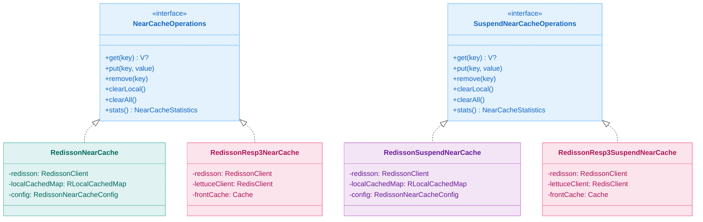
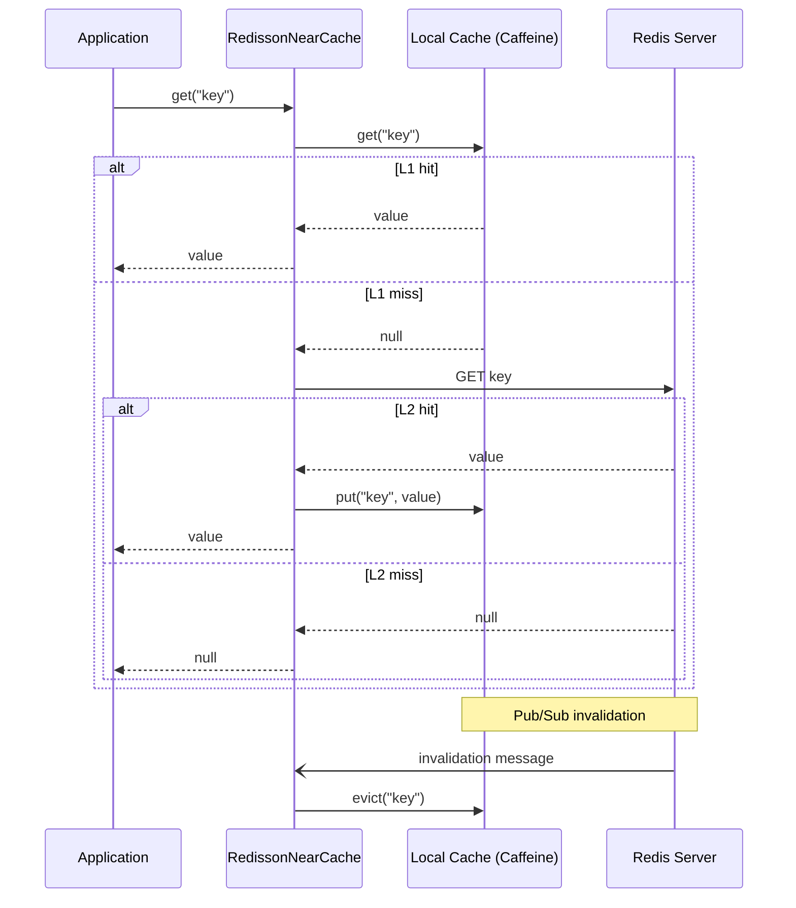

# Module bluetape4k-cache-redisson

English | [한국어](./README.ko.md)

`bluetape4k-cache-redisson` provides a Redisson-based JCache provider, coroutine-friendly cache implementations, memoizers, and multiple
**2-tier Near Cache** implementations.

> The former `bluetape4k-cache-redisson-near` module was merged into this module.

## Provided Features

- Redisson JCache provider and near-cache JCache provider
- `RedissonSuspendCache`
- `RedissonNearCache` / `RedissonSuspendNearCache`
- RESP3 hybrid near-cache variants backed by Redisson storage plus Lettuce invalidation
- sync / async / suspend memoizers based on `RMap`

## Dependency

```kotlin
dependencies {
    implementation("io.github.bluetape4k:bluetape4k-cache-redisson:$bluetape4kVersion")
}
```

RESP3 near-cache usage requires Redis 6.0 or newer.

## Usage Examples

Typical usage includes:

- `RedissonSuspendCache`
- local-plus-remote near caching through `RedissonNearCache`
- coroutine near cache through `RedissonSuspendNearCache`
- memoization of expensive function results in Redis
- Spring Boot integration through a Redisson cache manager or explicit provider configuration

## Class Structure

The core structure includes:

- `NearCacheOperations` / `SuspendNearCacheOperations`
- `RedissonNearCache` / `RedissonSuspendNearCache`
- `RedissonNearCacheConfig`
- Redisson's built-in `RLocalCachedMap`

The Korean README includes the detailed class diagram and invalidation sequence for `RLocalCachedMap`.

## Architecture Diagrams

### RedissonNearCache Class Hierarchy



### NearCache Flow (RLocalCachedMap)



## JCache-Based NearCache (`nearcache.jcache` package)

In addition to the native near-cache implementations, this module also supports JCache-oriented near-cache setups for applications that need to stay aligned with the standard JCache contract.

## Factory (`RedissonCaches`)

`RedissonCaches` provides factory methods for:

- JCache and suspend cache
- native near caches
- RESP3 hybrid near caches
- resilient near-cache variants

## Registered `CachingProvider` List

When multiple JCache providers are available, explicitly choose the Redisson provider where necessary, especially when using umbrella modules or Spring cache auto-configuration.

## Redis Version Requirements

- Standard Redisson near-cache features work with ordinary Redisson-compatible Redis setups.
- RESP3 hybrid near-cache features require Redis 6.0 or newer because `CLIENT TRACKING` depends on RESP3 support.
