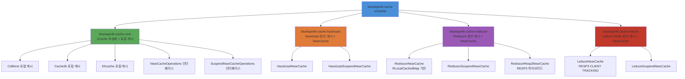
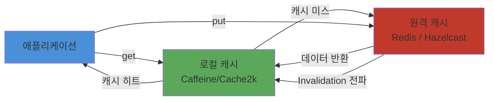

# Module bluetape4k-cache

`bluetape4k-cache`는 캐시 관련 모듈을 한 번에 묶어 쓰기 위한 Umbrella 모듈입니다.

> 캐시 모듈이 10개에서 5개+umbrella로 통합되었습니다. 각 분산 캐시 모듈에 Near Cache 기능이 포함되어 있습니다.

## 모듈 구성

| 모듈                           | 제공 기능                                                       |
|------------------------------|-------------------------------------------------------------|
| `bluetape4k-cache-core`      | JCache 추상화 + Caffeine/Cache2k/Ehcache 로컬 캐시 + Memorizer     |
| `bluetape4k-cache-hazelcast` | Hazelcast 분산 캐시 + Near Cache (구 `cache-hazelcast-near` 통합)  |
| `bluetape4k-cache-redisson`  | Redisson 분산 캐시 + Near Cache (구 `cache-redisson-near` 통합)    |
| `bluetape4k-cache-lettuce`   | Lettuce(Redis) 분산 캐시 + Near Cache                           |

## 설치

```kotlin
dependencies {
    implementation("io.github.bluetape4k:bluetape4k-cache:${bluetape4kVersion}")
}
```

모든 Provider가 포함되므로, 특정 Provider만 필요한 경우 해당 모듈을 직접 의존하는 것을 권장합니다.

## 선택 의존 권장 예시

### 1. 로컬 캐시만 필요

```kotlin
dependencies {
    implementation("io.github.bluetape4k:bluetape4k-cache-core:${bluetape4kVersion}")
}
```

### 2. Redisson 분산 캐시 + Near Cache

```kotlin
dependencies {
    implementation("io.github.bluetape4k:bluetape4k-cache-redisson:${bluetape4kVersion}")
}
```

### 3. Hazelcast 분산 캐시 + Near Cache

```kotlin
dependencies {
    implementation("io.github.bluetape4k:bluetape4k-cache-hazelcast:${bluetape4kVersion}")
}
```

## 빠른 시작

### 1. Caffeine 로컬 캐시

```kotlin
import io.bluetape4k.cache.jcache.JCaching

val cache = JCaching.Caffeine.getOrCreate<String, Any>("users")
cache.put("u:1", mapOf("name" to "debop"))
```

### 2. Hazelcast Near Cache (코루틴)

```kotlin
import io.bluetape4k.cache.nearcache.hazelcast.coroutines.HazelcastNearSuspendCache

val near = HazelcastNearSuspendCache<String, Any>("hz-users-near", hazelcastInstance)
near.put("key", "value")
val value = near.get("key")
```

### 3. Redisson Near Cache (코루틴)

```kotlin
import io.bluetape4k.cache.nearcache.redis.coroutines.RedissonNearSuspendCache

val near = RedissonNearSuspendCache<String, Any>("redis-users-near", redissonClient)
near.put("key", "value")
val value = near.get("key")
```

## 모듈 의존성 구조



## Near Cache 2-Tier 아키텍처



## CachingProvider 자동 로딩 주의

여러 모듈이 `META-INF/services/javax.cache.spi.CachingProvider`를 등록합니다. Umbrella 모듈 사용 시 Provider를 명시적으로 지정하세요:

```kotlin
import javax.cache.Caching

val provider = Caching.getCachingProvider("io.bluetape4k.cache.nearcache.redis.RedissonNearCachingProvider")
val manager = provider.cacheManager
```

Spring Boot에서는 `application.properties`로 지정:

```properties
spring.cache.jcache.provider=io.bluetape4k.cache.nearcache.redis.RedissonNearCachingProvider
```
