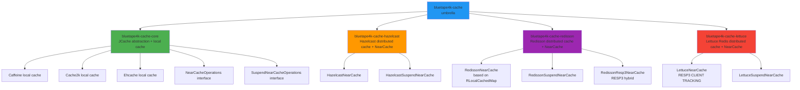
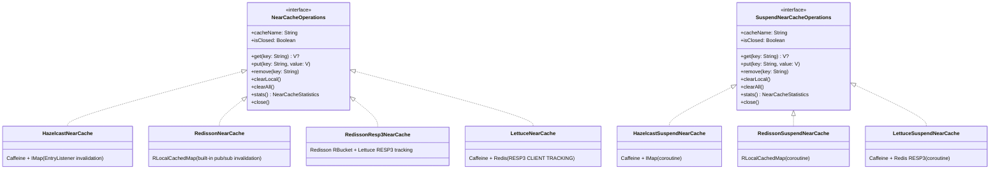
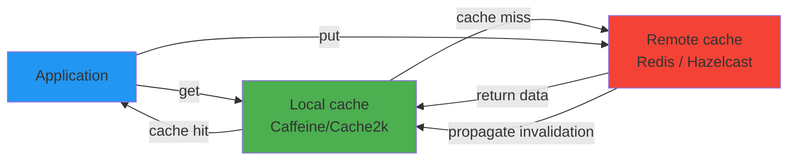

# Module bluetape4k-cache

English | [한국어](./README.ko.md)

`bluetape4k-cache` is an umbrella module that bundles the cache-related modules together.

> The cache modules were consolidated from 10 modules into 5 modules plus this umbrella. Each distributed cache module now includes near-cache functionality.

## Module Composition

| Module | Provided Functionality |
|---|---|
| `bluetape4k-cache-core` | JCache abstraction + Caffeine/Cache2k/Ehcache local caches + memorizer |
| `bluetape4k-cache-hazelcast` | Hazelcast distributed cache + near cache (merged from former `cache-hazelcast-near`) |
| `bluetape4k-cache-redisson` | Redisson distributed cache + near cache (merged from former `cache-redisson-near`) |
| `bluetape4k-cache-lettuce` | Lettuce (Redis) distributed cache + near cache |

## Installation

```kotlin
dependencies {
    implementation("io.github.bluetape4k:bluetape4k-cache:${bluetape4kVersion}")
}
```

Because this module pulls in every provider, it is usually better to depend directly on a provider module when you only need one.

## Recommended Selective Dependencies

### 1. If You Only Need a Local Cache

```kotlin
dependencies {
    implementation("io.github.bluetape4k:bluetape4k-cache-core:${bluetape4kVersion}")
}
```

### 2. Redisson Distributed Cache + Near Cache

```kotlin
dependencies {
    implementation("io.github.bluetape4k:bluetape4k-cache-redisson:${bluetape4kVersion}")
}
```

### 3. Hazelcast Distributed Cache + Near Cache

```kotlin
dependencies {
    implementation("io.github.bluetape4k:bluetape4k-cache-hazelcast:${bluetape4kVersion}")
}
```

## Quick Start

### 1. Caffeine Local Cache

```kotlin
import io.bluetape4k.cache.jcache.JCaching

val cache = JCaching.Caffeine.getOrCreate<String, Any>("users")
cache.put("u:1", mapOf("name" to "debop"))
```

### 2. Hazelcast Near Cache (Coroutine)

```kotlin
import io.bluetape4k.cache.nearcache.hazelcast.coroutines.HazelcastNearSuspendCache

val near = HazelcastNearSuspendCache<String, Any>("hz-users-near", hazelcastInstance)
near.put("key", "value")
val value = near.get("key")
```

### 3. Redisson Near Cache (Coroutine)

```kotlin
import io.bluetape4k.cache.nearcache.redis.coroutines.RedissonNearSuspendCache

val near = RedissonNearSuspendCache<String, Any>("redis-users-near", redissonClient)
near.put("key", "value")
val value = near.get("key")
```

## Module Dependency Structure



## Unified NearCache Interface Hierarchy



## Near Cache 2-Tier Architecture



## Caution About Automatic `CachingProvider` Loading

Multiple modules register `META-INF/services/javax.cache.spi.CachingProvider`. When using the umbrella module, specify the provider explicitly:

```kotlin
import javax.cache.Caching

val provider = Caching.getCachingProvider("io.bluetape4k.cache.nearcache.redis.RedissonNearCachingProvider")
val manager = provider.cacheManager
```

In Spring Boot, configure it through `application.properties`:

```properties
spring.cache.jcache.provider=io.bluetape4k.cache.nearcache.redis.RedissonNearCachingProvider
```
