# Module bluetape4k-elasticsearch

한국어 | [English](./README.md)

Elasticsearch 클라이언트 라이브러리 (Kotlin + Coroutines 지원). Elasticsearch 9.x Java API 클라이언트의 관용적인 Kotlin DSL 빌더와 suspend 함수를 제공하며, Coroutines 기반 애플리케이션에서 효율적인 비동기/논-블로킹 작업을 가능하게 합니다.

## 특징

- **Kotlin Coroutines 지원**: Elasticsearch 비동기 작업에 대한 완전한 suspend 함수 래퍼
- **DSL 빌더 패턴**: ElasticsearchAsyncClient와 ElasticsearchClient 설정을 위한 유창한 문법
- **고급 검색**: Point-in-Time(PIT) + search_after 페이징 및 Flow 기반 무한 스크롤
- **일괄 작업**: Flow 백프레셔 지원과 함께 스트림 기반 일괄 인덱싱
- **Virtual Thread 안전성**: 동기화 블록 없음, 필요시 ReentrantLock 사용
- **Elasticsearch 9.x 호환**: Rest5ClientTransport(HC5 기반)를 기본값으로 사용

## 설치

### Gradle (Kotlin DSL)

```kotlin
dependencies {
    implementation("io.github.bluetape4k:bluetape4k-elasticsearch:$version")
}
```

### Gradle (Groovy DSL)

```groovy
dependencies {
    implementation 'io.github.bluetape4k:bluetape4k-elasticsearch:$version'
}
```

### Maven

```xml
<dependency>
    <groupId>io.github.bluetape4k</groupId>
    <artifactId>bluetape4k-elasticsearch</artifactId>
    <version>${version}</version>
</dependency>
```

## 의존성

이 모듈은 다음 라이브러리에 의존합니다:

- `co.elastic.clients:elasticsearch-java:9.3.3` - 공식 Elasticsearch Java API 클라이언트
- `io.github.bluetape4k:bluetape4k-coroutines` - Coroutines 유틸리티
- `org.apache.httpcomponents.client5:httpclient5` - HTTP 클라이언트 (HC5)

## 아키텍처

모듈은 계층화된 설계를 따릅니다:

```
┌─────────────────────────────────────────────────┐
│  사용자 애플리케이션 (suspend 함수)              │
├─────────────────────────────────────────────────┤
│  Coroutines 계층 (suspendBulk, searchAsFlow)    │
├─────────────────────────────────────────────────┤
│  DSL 빌더 (elasticsearchAsyncClient)            │
├─────────────────────────────────────────────────┤
│  클라이언트 팩토리 (ElasticsearchClients)        │
├─────────────────────────────────────────────────┤
│  Rest5ClientTransport (HC5 기반)                │
├─────────────────────────────────────────────────┤
│  Elasticsearch 서버                             │
└─────────────────────────────────────────────────┘
```

## 클래스 계층



## 사용 예시

### 1. Elasticsearch 비동기 클라이언트 생성

#### DSL 빌더 사용 (권장)

```kotlin
import io.bluetape4k.elasticsearch.elasticsearchAsyncClient

val client = elasticsearchAsyncClient {
    host = "localhost"
    port = 9200
    scheme = "https"
    username = "elastic"
    password = "changeme"
}

client.use { c ->
    // 클라이언트 사용
    c.ping().await()
}
```

#### 팩토리 메서드 사용

```kotlin
import io.bluetape4k.elasticsearch.ElasticsearchClients

// 명시적 HTTP (ES 9.x 기본은 HTTPS — 레거시 클러스터에서만 scheme = "http" 지정)
val client = ElasticsearchClients.asyncClientOf(
    host = "localhost",
    port = 9200,
    scheme = "http"
)

// 인증과 SSL 포함
val client = ElasticsearchClients.asyncClientOf(
    host = "my-es.example.com",
    port = 9200,
    scheme = "https",
    username = "elastic",
    password = "secret"
)
```

### 2. 동기 클라이언트 생성 (Coroutines에는 권장하지 않음)

```kotlin
import io.bluetape4k.elasticsearch.elasticsearchClient

val client = elasticsearchClient {
    host = "localhost"
    port = 9200
}

// 주의: I/O 작업 시 호출 스레드를 블로킹함
client.use { c ->
    val response = c.info()  // 블로킹!
}
```

### 3. Point-in-Time(PIT)을 사용한 무한 스크롤

```kotlin
import io.bluetape4k.elasticsearch.coroutines.searchAsFlow
import co.elastic.clients.elasticsearch._types.SortOrder

suspend fun scrollAllDocuments() {
    val client = elasticsearchAsyncClient {
        host = "localhost"
    }

    client.use { c ->
        c.searchAsFlow<MyDocument>(
            indexName = "my-index",
            batchSize = 500,
            keepAlive = "2m"
        ) {
            query { q -> q.matchAll { it } }
            sort { s ->
                s.field { f ->
                    f.field("_shard_doc").order(SortOrder.Asc)
                }
            }
        }.collect { doc ->
            println("문서: $doc")
            // 문서 처리
        }
    }
}
```

**중요**: search_after 가 올바르게 작동하려면 정렬 절에 tie-breaker (예: `_shard_doc`)를 반드시 포함해야 합니다.

### 4. Flow를 사용한 일괄 인덱싱

```kotlin
import io.bluetape4k.elasticsearch.coroutines.bulkAsFlow
import co.elastic.clients.elasticsearch.core.bulk.IndexOperation
import kotlinx.coroutines.flow.flowOf

suspend fun bulkIndexDocuments() {
    val client = elasticsearchAsyncClient {
        host = "localhost"
    }

    val operations = flowOf(
        IndexOperation.of { op ->
            op.index("my-index")
                .id("doc1")
                .document(mapOf("name" to "John", "age" to 30))
        },
        IndexOperation.of { op ->
            op.index("my-index")
                .id("doc2")
                .document(mapOf("name" to "Jane", "age" to 28))
        }
    )

    client.use { c ->
        operations
            .bulkAsFlow(c, indexName = "my-index", chunkSize = 100) { failedItem ->
                println("일괄 작업 항목 실패: ${failedItem.error()?.reason()}")
            }
            .collect { response ->
                if (response.errors()) {
                    println("이 청크에서 일부 항목이 실패했습니다")
                }
            }
    }
}
```

### 5. 직접 일괄 작업

```kotlin
import io.bluetape4k.elasticsearch.coroutines.suspendBulk

suspend fun directBulk() {
    val client = elasticsearchAsyncClient {
        host = "localhost"
    }

    client.use { c ->
        val response = c.suspendBulk {
            index("my-index")
            operations(listOf(
                IndexOperation.of { op ->
                    op.id("doc1")
                        .document(mapOf("title" to "Hello"))
                },
                IndexOperation.of { op ->
                    op.id("doc2")
                        .document(mapOf("title" to "World"))
                }
            ))
        }

        if (response.errors()) {
            response.items().forEach { item ->
                if (item.error() != null) {
                    println("실패: ${item.id()} → ${item.error()?.reason()}")
                }
            }
        }
    }
}
```

### 6. Point-in-Time 수동 열기/닫기

```kotlin
import io.bluetape4k.elasticsearch.coroutines.openPointInTimeSuspending
import io.bluetape4k.elasticsearch.coroutines.closePointInTimeSuspending

suspend fun manualPIT() {
    val client = elasticsearchAsyncClient {
        host = "localhost"
    }

    client.use { c ->
        // PIT 열기
        val pitId = c.openPointInTimeSuspending("my-index", keepAlive = "2m")

        try {
            // 여러 검색에 PIT 사용
            val response = c.search { req ->
                req.pit { p -> p.id(pitId) }
                    .query { q -> q.matchAll { it } }
            }.await()

            println("${response.hits().total()?.value() ?: 0}개 문서 발견")
        } finally {
            // 리소스 누수를 방지하려면 항상 PIT를 닫아야 함
            val success = c.closePointInTimeSuspending(pitId)
            if (!success) {
                println("경고: PIT close 실패 가능성 있음")
            }
        }
    }
}
```

## 패키지 구조

```
io.bluetape4k.elasticsearch
├── ElasticsearchClients.kt         # 클라이언트 팩토리 (object, 팩토리 메서드)
├── ElasticsearchClientDsl.kt       # DSL 빌더 (elasticsearchAsyncClient, elasticsearchClient)
├── ElasticsearchDefaults.kt        # 기본값 상수
├── support/                         # 지원 유틸리티
│   └── JsonpMappers.kt             # JSON 매퍼 선택
└── coroutines/                     # Coroutine 확장
    ├── SearchApiCoroutines.kt      # search_after + PIT 페이징
    ├── BulkApiCoroutines.kt        # 일괄 인덱싱
    ├── BulkIngesterCoroutines.kt   # 일괄 수집 패턴
    └── ElasticsearchCoroutines.kt  # 기본 suspend 래퍼
```

## 설정 예시

### 개발 환경 (HTTP, 인증 없음)

> **참고:** ES 9.x 기본은 HTTPS입니다. SSL 없이 로컬 개발 클러스터를 사용할 때는 `scheme = "http"` 를 명시적으로 지정하세요.

```kotlin
val client = elasticsearchAsyncClient {
    host = "localhost"
    port = 9200
    scheme = "http"
}
```

### 프로덕션 환경 (HTTPS, 인증 포함)

```kotlin
val client = elasticsearchAsyncClient {
    host = "elasticsearch.prod.example.com"
    port = 9200
    scheme = "https"
    username = "elastic"
    password = System.getenv("ES_PASSWORD")
}
```

### 커스텀 SSL 컨텍스트

```kotlin
import javax.net.ssl.SSLContext

val sslContext = SSLContext.getInstance("TLSv1.3")
// ... SSL 컨텍스트 설정 ...

val client = ElasticsearchClients.asyncClientOf(
    host = "localhost",
    scheme = "https",
    sslContext = sslContext
)
```

## 테스트

```kotlin
import org.junit.jupiter.api.Test
import kotlinx.coroutines.test.runTest

class ElasticsearchIntegrationTest {
    
    @Test
    fun `should search documents`() = runTest {
        val client = elasticsearchAsyncClient {
            host = "localhost"  // testcontainers 또는 embedded 인스턴스
        }

        client.use { c ->
            val response = c.search { req ->
                req.index("test-index")
                    .query { q -> q.matchAll { it } }
            }.await()

            assert(response.hits().hits().isNotEmpty())
        }
    }
}
```

## 설계 패턴

### 팩토리 패턴 (ElasticsearchClients)

유연한 설정으로 클라이언트를 생성하기 위한 팩토리 메서드를 가진 singleton object. Lettuce와 Cassandra 모듈에서 사용하는 패턴을 따릅니다.

### DSL 빌더 패턴 (elasticsearchAsyncClient)

읽기 쉬운 클라이언트 설정을 위해 Kotlin 람다 확장을 사용한 유창한 설정:

```kotlin
val client = elasticsearchAsyncClient {
    // 설정 블록
    host = "localhost"
    port = 9200
}
```

### Flow 기반 페이징 (searchAsFlow)

Kotlin Flow를 사용한 지연(lazy), 백프레셔 인식 페이징. PIT 생명주기를 자동으로 관리합니다.

### Coroutine 래퍼 (suspendBulk)

`kotlinx.coroutines.future.await()`를 통해 `CompletableFuture`를 래핑한 suspend 함수로 Coroutines 코드와 원활하게 통합됩니다.

## 성능 고려사항

- **배치 크기 조정**: `bulkAsFlow`의 경우 문서 크기에 따라 `chunkSize` 조정 (일반적으로 100-500)
- **PIT keepAlive**: PIT 만료를 방지하려면 처리 속도에 따라 적절한 `keepAlive` 시간 설정
- **연결 풀링**: Elasticsearch 클라이언트가 자동으로 연결 풀링 관리
- **Virtual Thread 호환성**: Virtual Thread 환경에서 사용 안전; 블로킹 동기화 프리미티브 없음

## 에러 처리

```kotlin
try {
    val response = client.suspendBulk {
        index("my-index")
        operations(ops)
    }
    if (response.errors()) {
        // 부분 실패 처리
        response.items().filter { it.error() != null }.forEach { item ->
            log.error { "항목 ${item.id()} 실패: ${item.error()?.reason()}" }
        }
    }
} catch (e: Exception) {
    log.error(e) { "일괄 요청 실패" }
}
```

## 참고 자료

- [Elasticsearch Java API 클라이언트 문서](https://www.elastic.co/guide/en/elasticsearch/client/java-api-client/current/index.html)
- [Elasticsearch Point in Time](https://www.elastic.co/guide/en/elasticsearch/reference/current/point-in-time-api.html)
- [Elasticsearch Bulk API](https://www.elastic.co/guide/en/elasticsearch/reference/current/docs-bulk.html)
- [Kotlin Coroutines 문서](https://kotlinlang.org/docs/coroutines-overview.html)

## 라이선스

MIT License
