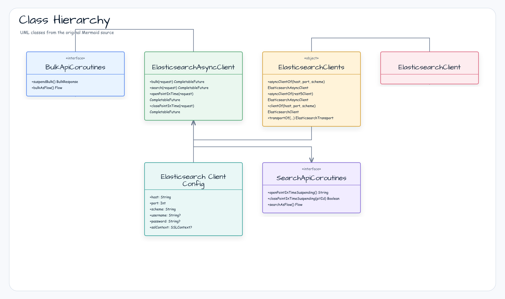

# Module bluetape4k-elasticsearch

[한국어](./README.ko.md) | English

Elasticsearch client library for Kotlin with Coroutines support. Provides idiomatic Kotlin DSL builders and suspend functions for Elasticsearch 9.x Java API client, enabling efficient async/non-blocking operations in Coroutines-based applications.

## Features

- **Kotlin Coroutines support**: Full suspend function wrappers for Elasticsearch async operations
- **DSL Builder pattern**: Fluent configuration for ElasticsearchAsyncClient and ElasticsearchClient
- **Advanced search**: Point-in-Time (PIT) + search_after pagination with Flow-based infinite scroll
- **Bulk operations**: Stream-based bulk indexing with Flow backpressure support
- **Virtual Thread safe**: No synchronized blocks; uses ReentrantLock where needed
- **Elasticsearch 9.x compatible**: Uses Rest5ClientTransport (HC5-based) as default

## Architecture

The module follows a layered design:

```
┌─────────────────────────────────────────────────┐
│  User Application (suspend functions)           │
├─────────────────────────────────────────────────┤
│  Coroutines Layer (suspendBulk, searchAsFlow)   │
├─────────────────────────────────────────────────┤
│  DSL Builders (elasticsearchAsyncClient)        │
├─────────────────────────────────────────────────┤
│  Client Factories (ElasticsearchClients)        │
├─────────────────────────────────────────────────┤
│  Rest5ClientTransport (HC5-based)               │
├─────────────────────────────────────────────────┤
│  Elasticsearch Server                           │
└─────────────────────────────────────────────────┘
```

## Installation

### Gradle (Kotlin DSL)

```kotlin
dependencies {
    implementation("io.github.bluetape4k:bluetape4k-elasticsearch:$version")
}
```

### Gradle (Groovy DSL)

```groovy
dependencies {
    implementation 'io.github.bluetape4k:bluetape4k-elasticsearch:$version'
}
```

### Maven

```xml
<dependency>
    <groupId>io.github.bluetape4k</groupId>
    <artifactId>bluetape4k-elasticsearch</artifactId>
    <version>${version}</version>
</dependency>
```

## Dependencies

This module depends on:

- `co.elastic.clients:elasticsearch-java:9.3.3` - Official Elasticsearch Java API Client
- `io.github.bluetape4k:bluetape4k-coroutines` - Coroutines utilities
- `org.apache.httpcomponents.client5:httpclient5` - HTTP client (HC5)

## Class Hierarchy



## Usage Examples

### 1. Creating an Elasticsearch Async Client

#### Using DSL Builder (Recommended)

```kotlin
import io.bluetape4k.elasticsearch.elasticsearchAsyncClient

val client = elasticsearchAsyncClient {
    host = "localhost"
    port = 9200
    scheme = "https"
    username = "elastic"
    password = "changeme"
}

client.use { c ->
    // Use client
    c.ping().await()
}
```

#### Using Factory Methods

```kotlin
import io.bluetape4k.elasticsearch.ElasticsearchClients

// Explicit HTTP (ES 9.x defaults to HTTPS — set scheme = "http" only for legacy clusters)
val client = ElasticsearchClients.asyncClientOf(
    host = "localhost",
    port = 9200,
    scheme = "http"
)

// With authentication and SSL
val client = ElasticsearchClients.asyncClientOf(
    host = "my-es.example.com",
    port = 9200,
    scheme = "https",
    username = "elastic",
    password = "secret"
)
```

### 2. Creating a Sync Client (Not Recommended for Coroutines)

```kotlin
import io.bluetape4k.elasticsearch.elasticsearchClient

val client = elasticsearchClient {
    host = "localhost"
    port = 9200
}

// Warning: This blocks the calling thread on I/O operations
client.use { c ->
    val response = c.info()  // Blocks!
}
```

### 3. Infinite Scroll with Point-in-Time (PIT)

```kotlin
import io.bluetape4k.elasticsearch.coroutines.searchAsFlow
import co.elastic.clients.elasticsearch._types.SortOrder

suspend fun scrollAllDocuments() {
    val client = elasticsearchAsyncClient {
        host = "localhost"
    }

    client.use { c ->
        c.searchAsFlow<MyDocument>(
            indexName = "my-index",
            batchSize = 500,
            keepAlive = "2m"
        ) {
            query { q -> q.matchAll { it } }
            sort { s ->
                s.field { f ->
                    f.field("_shard_doc").order(SortOrder.Asc)
                }
            }
        }.collect { doc ->
            println("Document: $doc")
            // Process document
        }
    }
}
```

**Important**: You must include a tie-breaker in sort clause (e.g., `_shard_doc`) for search_after to work correctly.

### 4. Bulk Indexing with Flow

```kotlin
import io.bluetape4k.elasticsearch.coroutines.bulkAsFlow
import co.elastic.clients.elasticsearch.core.bulk.IndexOperation
import kotlinx.coroutines.flow.flowOf

suspend fun bulkIndexDocuments() {
    val client = elasticsearchAsyncClient {
        host = "localhost"
    }

    val operations = flowOf(
        IndexOperation.of { op ->
            op.index("my-index")
                .id("doc1")
                .document(mapOf("name" to "John", "age" to 30))
        },
        IndexOperation.of { op ->
            op.index("my-index")
                .id("doc2")
                .document(mapOf("name" to "Jane", "age" to 28))
        }
    )

    client.use { c ->
        operations
            .bulkAsFlow(c, indexName = "my-index", chunkSize = 100) { failedItem ->
                println("Bulk item failed: ${failedItem.error()?.reason()}")
            }
            .collect { response ->
                if (response.errors()) {
                    println("Some items failed in this chunk")
                }
            }
    }
}
```

### 5. Direct Bulk Operation

```kotlin
import io.bluetape4k.elasticsearch.coroutines.suspendBulk

suspend fun directBulk() {
    val client = elasticsearchAsyncClient {
        host = "localhost"
    }

    client.use { c ->
        val response = c.suspendBulk {
            index("my-index")
            operations(listOf(
                IndexOperation.of { op ->
                    op.id("doc1")
                        .document(mapOf("title" to "Hello"))
                },
                IndexOperation.of { op ->
                    op.id("doc2")
                        .document(mapOf("title" to "World"))
                }
            ))
        }

        if (response.errors()) {
            response.items().forEach { item ->
                if (item.error() != null) {
                    println("Failed: ${item.id()} → ${item.error()?.reason()}")
                }
            }
        }
    }
}
```

### 6. Opening and Closing Point-in-Time Manually

```kotlin
import io.bluetape4k.elasticsearch.coroutines.openPointInTimeSuspending
import io.bluetape4k.elasticsearch.coroutines.closePointInTimeSuspending

suspend fun manualPIT() {
    val client = elasticsearchAsyncClient {
        host = "localhost"
    }

    client.use { c ->
        // Open PIT
        val pitId = c.openPointInTimeSuspending("my-index", keepAlive = "2m")

        try {
            // Use PIT for multiple searches
            val response = c.search { req ->
                req.pit { p -> p.id(pitId) }
                    .query { q -> q.matchAll { it } }
            }.await()

            println("Found ${response.hits().total()?.value() ?: 0} documents")
        } finally {
            // Always close PIT to avoid resource leaks
            val success = c.closePointInTimeSuspending(pitId)
            if (!success) {
                println("Warning: PIT close may have failed")
            }
        }
    }
}
```

## Package Structure

```
io.bluetape4k.elasticsearch
├── ElasticsearchClients.kt         # Client factory (object, factory methods)
├── ElasticsearchClientDsl.kt       # DSL builders (elasticsearchAsyncClient, elasticsearchClient)
├── ElasticsearchDefaults.kt        # Default constants
├── support/                         # Support utilities
│   └── JsonpMappers.kt             # JSON mapper selection
└── coroutines/                     # Coroutine extensions
    ├── SearchApiCoroutines.kt      # search_after + PIT pagination
    ├── BulkApiCoroutines.kt        # Bulk indexing
    ├── BulkIngesterCoroutines.kt   # Bulk ingester patterns
    └── ElasticsearchCoroutines.kt  # Base suspend wrappers
```

## Configuration Examples

### Development (HTTP, No Auth)

> **Note:** ES 9.x defaults to HTTPS. Specify `scheme = "http"` explicitly for local dev clusters without SSL.

```kotlin
val client = elasticsearchAsyncClient {
    host = "localhost"
    port = 9200
    scheme = "http"
}
```

### Production (HTTPS, With Auth)

```kotlin
val client = elasticsearchAsyncClient {
    host = "elasticsearch.prod.example.com"
    port = 9200
    scheme = "https"
    username = "elastic"
    password = System.getenv("ES_PASSWORD")
}
```

### Custom SSL Context

```kotlin
import javax.net.ssl.SSLContext

val sslContext = SSLContext.getInstance("TLSv1.3")
// ... configure SSL context ...

val client = ElasticsearchClients.asyncClientOf(
    host = "localhost",
    scheme = "https",
    sslContext = sslContext
)
```

## Testing

```kotlin
import org.junit.jupiter.api.Test
import kotlinx.coroutines.test.runTest

class ElasticsearchIntegrationTest {
    
    @Test
    fun `should search documents`() = runTest {
        val client = elasticsearchAsyncClient {
            host = "localhost"  // testcontainers or embedded instance
        }

        client.use { c ->
            val response = c.search { req ->
                req.index("test-index")
                    .query { q -> q.matchAll { it } }
            }.await()

            assert(response.hits().hits().isNotEmpty())
        }
    }
}
```

## Design Patterns

### Factory Pattern (ElasticsearchClients)

Singleton object with factory methods for creating clients with flexible configuration. Follows the pattern used in Lettuce and Cassandra modules.

### DSL Builder Pattern (elasticsearchAsyncClient)

Fluent configuration using Kotlin lambda extension for readable client setup:

```kotlin
val client = elasticsearchAsyncClient {
    // Configuration block
    host = "localhost"
    port = 9200
}
```

### Flow-based Pagination (searchAsFlow)

Lazy, backpressure-aware pagination using Kotlin Flow. Automatically manages PIT lifecycle.

### Coroutine Wrappers (suspendBulk)

Suspend functions wrapping `CompletableFuture` via `kotlinx.coroutines.future.await()` for seamless integration with Coroutines code.

## Performance Considerations

- **Batch size tuning**: For `bulkAsFlow`, adjust `chunkSize` based on document size (typically 100-500)
- **PIT keepAlive**: Set appropriate `keepAlive` time based on processing speed to avoid PIT expiration
- **Connection pooling**: Elasticsearch client manages connection pooling automatically
- **Virtual Thread compatibility**: Safe to use in Virtual Thread environments; no blocking synchronization primitives

## Error Handling

```kotlin
try {
    val response = client.suspendBulk {
        index("my-index")
        operations(ops)
    }
    if (response.errors()) {
        // Handle partial failures
        response.items().filter { it.error() != null }.forEach { item ->
            log.error { "Item ${item.id()} failed: ${item.error()?.reason()}" }
        }
    }
} catch (e: Exception) {
    log.error(e) { "Bulk request failed" }
}
```

## References

- [Elasticsearch Java API Client Documentation](https://www.elastic.co/guide/en/elasticsearch/client/java-api-client/current/index.html)
- [Elasticsearch Point in Time](https://www.elastic.co/guide/en/elasticsearch/reference/current/point-in-time-api.html)
- [Elasticsearch Bulk API](https://www.elastic.co/guide/en/elasticsearch/reference/current/docs-bulk.html)
- [Kotlin Coroutines Documentation](https://kotlinlang.org/docs/coroutines-overview.html)

## License

MIT License
