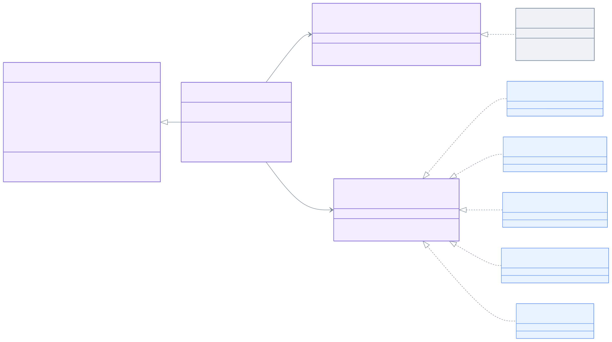

# bluetape4k-kafka-logback

[English](README.md)

로그 이벤트를 Apache Kafka 토픽으로 전송하는 Logback Appender. 동기/비동기 전송, 플러그어블 키 제공자, 커스텀 예외 핸들러를 지원합니다.

## 아키텍처



## 기능

- **KafkaAppender** — Logback `AppenderBase` 구현체. 로그 이벤트를 Kafka로 전송
- **키 제공자** — 호스트명, 로거명, 스레드명, 컨텍스트명, null 등 플러그어블 전략
- **KafkaExporter** — 전송 로직 분리 및 예외 처리 커스터마이징 가능
- **기본 비동기** — `KafkaProducer.send()` fire-and-forget 방식

## 사용법

### logback.xml

```xml
<appender name="KAFKA" class="io.bluetape4k.kafka.logback.KafkaAppender">
    <topic>application-logs</topic>
    <bootstrapServers>localhost:9092</bootstrapServers>
    <keyProvider class="io.bluetape4k.kafka.logback.keyprovider.HostnameKafkaKeyProvider"/>
    <encoder class="ch.qos.logback.classic.encoder.PatternLayoutEncoder">
        <pattern>%d{ISO8601} %-5level [%thread] %logger{36} - %msg%n</pattern>
    </encoder>
</appender>

<root level="INFO">
    <appender-ref ref="KAFKA"/>
</root>
```

### 커스텀 키 제공자

```kotlin
class ServiceNameKeyProvider : AbstractKafkaKeyProvider<ILoggingEvent>() {
    override fun getKey(event: ILoggingEvent): ByteArray? =
        System.getenv("SERVICE_NAME")?.toByteArray()
}
```

## 의존성

- `logback-classic` — Appender 베이스 클래스 및 `ILoggingEvent`
- `kafka-clients` — `KafkaProducer` 메시지 전송
- `bluetape4k-core` — Kotlin 유틸리티
