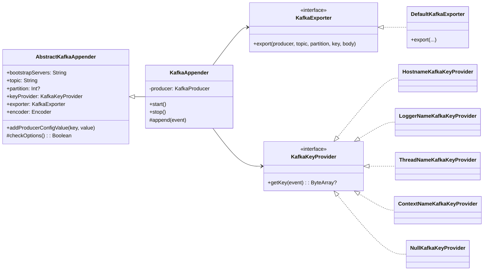

# bluetape4k-kafka-logback

[한국어](README.ko.md)

Logback Appender that delivers log events to Apache Kafka topics. Supports both synchronous and asynchronous delivery, pluggable key providers, and custom export exception handlers.

## Architecture



## Features

- **KafkaAppender** — Logback `AppenderBase` implementation that sends log events to Kafka
- **Key Providers** — Pluggable strategies: hostname, logger name, thread name, context name, or null
- **KafkaExporter** — Decoupled send logic with configurable exception handling
- **Async by default** — Fire-and-forget via `KafkaProducer.send()`

## Usage

### logback.xml

```xml
<appender name="KAFKA" class="io.bluetape4k.logback.kafka.KafkaAppender">
    <topic>application-logs</topic>
    <bootstrapServers>localhost:9092</bootstrapServers>
    <keyProvider class="io.bluetape4k.logback.kafka.keyprovider.HostnameKafkaKeyProvider"/>
    <encoder class="ch.qos.logback.classic.encoder.PatternLayoutEncoder">
        <pattern>%d{ISO8601} %-5level [%thread] %logger{36} - %msg%n</pattern>
    </encoder>
</appender>

<root level="INFO">
    <appender-ref ref="KAFKA"/>
</root>
```

### Custom Key Provider

```kotlin
class ServiceNameKeyProvider : AbstractKafkaKeyProvider<ILoggingEvent>() {
    override fun getKey(event: ILoggingEvent): ByteArray? =
        System.getenv("SERVICE_NAME")?.toByteArray()
}
```

## Dependencies

- `logback-classic` — Appender base classes and `ILoggingEvent`
- `kafka-clients` — `KafkaProducer` for message delivery
- `bluetape4k-core` — Kotlin utilities
