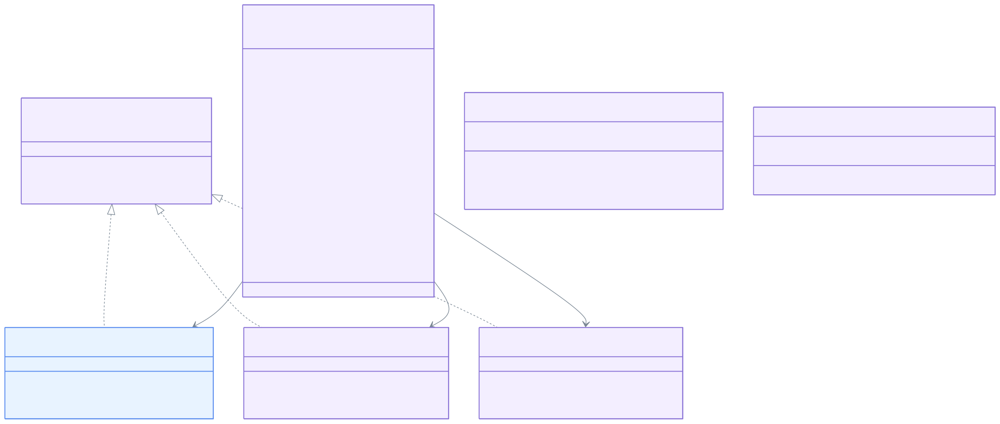
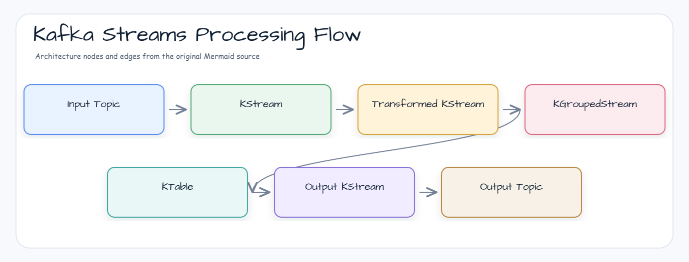

# Module bluetape4k-kafka

[English](./README.md) | 한국어

Apache Kafka를 Kotlin 환경에서 효율적으로 사용하기 위한 유틸리티 라이브러리입니다. Kafka 클라이언트, Spring Kafka, Kafka Streams를 Kotlin 코루틴과 함께 사용할 수 있도록 다양한 확장 함수와 래퍼 클래스를 제공합니다.

## 특징

- **Kotlin Coroutines 지원**: Kafka Producer/Consumer 작업을 suspend 함수로 수행
- **다양한 직렬화 지원**: Jackson, Kryo, Fory, LZ4/Snappy/Zstd 압축을 포함한 다양한 Codec 제공
- **Spring Kafka 통합**: Spring Kafka의 KafkaTemplate, 리스너 등을 위한 Kotlin 확장 함수
- **Kafka Streams 지원**: KStream, KTable 작업을 위한 편의 함수들
- **테스트 유틸리티**: Embedded Kafka를 활용한 테스트 지원

## 아키텍처 다이어그램

### Kafka 클래스 계층



### Producer/Consumer 메시지 흐름


### Kafka Streams 처리 흐름



## 설치

### Gradle (Kotlin DSL)

```kotlin
dependencies {
    implementation("io.github.bluetape4k:bluetape4k-kafka:$version")
}
```

### Gradle (Groovy DSL)

```groovy
dependencies {
    implementation 'io.github.bluetape4k:bluetape4k-kafka:$version'
}
```

### Maven

```xml

<dependency>
    <groupId>io.github.bluetape4k</groupId>
    <artifactId>bluetape4k-kafka</artifactId>
    <version>${version}</version>
</dependency>
```

## 의존성

이 모듈은 다음 라이브러리에 의존합니다:

- `org.apache.kafka:kafka-clients` - Kafka 클라이언트
- `org.springframework.kafka:spring-kafka` - Spring Kafka 지원
- `io.github.bluetape4k:bluetape4k-io` - 직렬화 관련 유틸리티
- `io.github.bluetape4k:bluetape4k-jackson2` - JSON 직렬화 지원
- `io.projectreactor.kafka:reactor-kafka` - Reactive Kafka 지원

## 사용 예시

### 1. Kafka Producer 생성

```kotlin
import io.bluetape4k.kafka.producerOf
import org.apache.kafka.common.serialization.StringSerializer

val producer = producerOf(
    mapOf(
        "bootstrap.servers" to "localhost:9092",
        "acks" to "all",
        "retries" to 3,
        "key.serializer" to StringSerializer::class.java,
        "value.serializer" to StringSerializer::class.java,
    )
)

// 메시지 발행
producer.send(ProducerRecord("test-topic", "key", "value"))
producer.close()
```

### 2. Coroutine 환경에서 Kafka Producer 사용

```kotlin
import io.bluetape4k.kafka.coroutines.suspendSend
import io.bluetape4k.kafka.coroutines.sendAsFlow
import kotlinx.coroutines.flow.flow

suspend fun produceMessages() {
    val producer = producerOf<String, String>(/* config */)

    // 단일 메시지 발행
    val record = ProducerRecord("test-topic", "key", "value")
    val metadata = producer.suspendSend(record)
    println("Sent to partition ${metadata.partition()}, offset ${metadata.offset()}")

    // Flow를 통한 다수 메시지 발행
    val records = flow {
        repeat(100) { i ->
            emit(ProducerRecord("test-topic", "key-$i", "value-$i"))
        }
    }
    producer.sendAsFlow(records).collect { metadata ->
        println("Sent: ${metadata.offset()}")
    }

    producer.close()
}
```

### 3. Kafka Consumer 생성

```kotlin
import io.bluetape4k.kafka.consumerOf
import org.apache.kafka.common.serialization.StringDeserializer

val consumer = consumerOf<String, String>(
    mapOf(
        "bootstrap.servers" to "localhost:9092",
        "group.id" to "test-group",
        "auto.offset.reset" to "earliest",
        "key.deserializer" to StringDeserializer::class.java,
        "value.deserializer" to StringDeserializer::class.java,
    )
)

consumer.subscribe(listOf("test-topic"))
while (true) {
    val records = consumer.poll(Duration.ofMillis(100))
    for (record in records) {
        println("Received: ${record.value()}")
    }
}
```

### 4. Kafka Codecs 사용

```kotlin
import io.bluetape4k.annotations.BluetapeDelicateApi
import io.bluetape4k.kafka.codec.JacksonKafkaCodec
import io.bluetape4k.kafka.codec.KafkaCodecs

// 문자열 Codec
val stringCodec = KafkaCodecs.String
val bytes = stringCodec.serialize("test-topic", "Hello Kafka")
val message = stringCodec.deserialize("test-topic", bytes)

// 명시적 허용 목록을 사용하는 Jackson JSON Codec
class ExampleJacksonCodec : JacksonKafkaCodec() {
    override val allowedTypePackages = setOf("java.util")
}

val jacksonCodec = ExampleJacksonCodec()
val data = mapOf("name" to "John", "age" to 30)
val jsonBytes = jacksonCodec.serialize("test-topic", data)
val decoded = jacksonCodec.deserialize("test-topic", jsonBytes)

// LZ4 압축 + Fory 직렬화
@OptIn(BluetapeDelicateApi::class)
val lz4ForyCodec = KafkaCodecs.Lz4Fory
val largeObject = LargeDataObject(/* ... */)
val compressed = lz4ForyCodec.serialize("test-topic", largeObject)
```

사용 가능한 Codecs:

| Codec                   | 설명                   |
|-------------------------|----------------------|
| `KafkaCodecs.String`    | UTF-8 문자열 직렬화        |
| `KafkaCodecs.ByteArray` | 바이트 배열 직접 전달         |
| `KafkaCodecs.Jackson`   | JSON 직렬화             |
| `KafkaCodecs.Kryo`      | Kryo 바이너리 직렬화        |
| `KafkaCodecs.Fory`      | 신뢰된 입력용 Fory 바이너리 직렬화 |
| `KafkaCodecs.Lz4Kryo`   | LZ4 압축 + Kryo 직렬화    |
| `KafkaCodecs.Lz4Fory`   | 신뢰된 입력용 LZ4 압축 + Fory 직렬화 |
| `KafkaCodecs.SnappyKryo` | Snappy 압축 + Kryo 직렬화 |
| `KafkaCodecs.SnappyFory` | 신뢰된 입력용 Snappy 압축 + Fory 직렬화 |
| `KafkaCodecs.ZstdKryo`  | Zstd 압축 + Kryo 직렬화   |
| `KafkaCodecs.ZstdFory`  | 신뢰된 입력용 Zstd 압축 + Fory 직렬화 |

#### 보안: Fory 신뢰 경계

Fory 기반 Kafka codec은 `@BluetapeDelicateApi`로 표시됩니다. 이 codec들은 기본
`ForyBinarySerializer`를 사용하며, 기본 Fory 설정은 역직렬화 시 등록되지 않은 클래스도
허용합니다. 완전히 신뢰할 수 있는 토픽과 브로커에서만 opt-in 하세요. 공유 토픽이나
외부 입력에는 `ForyBinarySerializer.secureFory(...)`로 명시적 클래스 등록을 강제한
커스텀 codec을 사용하세요.

`BinaryKafkaCodec`을 직접 상속하면서 `BinarySerializers.Fory`, `LZ4Fory`,
`SnappyFory`, `ZstdFory`를 주입하는 경우에도 같은 신뢰 경계가 적용됩니다. 이 하위
serializer들은 Kafka 전용 opt-in marker를 직접 제공하지 않습니다.

#### 성능: 타입 헤더 쓰기 비활성화

`AbstractKafkaCodec` 은 기본적으로 매 레코드 헤더에 value 타입의 Java FQN 을 기록합니다.
컨슈머가 타입을 정적으로 이미 알고 있다면 비활성화할 수 있습니다:

```kotlin
// Fory/Kryo 기반 코덱은 value-type 헤더가 필요하지 않습니다
@OptIn(BluetapeDelicateApi::class)
class NoHeaderForyCodec : ForyKafkaCodec() {
    override val writeValueTypeHeader = false
}
```

> **`JacksonKafkaCodec` 주의**: Jackson은 역직렬화 시 헤더에서 대상 타입을 결정합니다.
> `doDeserialize`를 함께 오버라이드하지 않고 `writeValueTypeHeader = false`만 설정하면
> `LinkedHashMap`으로 역직렬화되어 타입 손상이 발생합니다.
> 헤더를 비활성화하려면 `ForyKafkaCodec` 또는 `KryoKafkaCodec`을 사용하세요.

| `writeValueTypeHeader` | 동작 |
|------------------------|------|
| `true` (기본값) | 매 레코드에 FQN 헤더 기록 — 다형성 역직렬화 지원 |
| `false` | 헤더 생략 — 대역폭 오버헤드 없음. 컨슈머가 타입을 정적으로 알고 있을 때 사용. |

#### 보안: 클래스 로딩 허용 목록

신뢰 프로필: 기본값은 `AllowListedTypes`입니다. `UnsafeLegacyCompatibility`는
`AbstractKafkaCodec.ALLOW_ALL_TYPES_UNSAFE`를 통해서만 사용하세요.

`AbstractKafkaCodec` 은 Kafka 헤더 `bluetape4k.kafka.codec.value.type` 에서
역직렬화 대상 클래스를 로드합니다. 공격자가 이 헤더를 조작하면 임의 클래스 로딩(RCE)이
가능합니다.

`allowedTypePackages` 를 오버라이드하여 로드 가능한 패키지를 제한하세요:

```kotlin
class SecureJacksonCodec : JacksonKafkaCodec() {
    override val allowedTypePackages = setOf(
        "com.example.dto",
        "io.bluetape4k.domain",
    )
}
```

| `allowedTypePackages` 값 | 동작 |
|--------------------------|------|
| `emptySet()` (기본값) | **모든 클래스 차단** — 타입 헤더에서 클래스를 로드하지 않음. 신뢰할 수 없거나 공유된 토픽에 대한 안전한 기본값. |
| 비어 있지 않은 집합 | 나열된 패키지 접두사와 일치하는 FQN 클래스만 허용; 그 외 poison-pill `null` 반환. |
| `AbstractKafkaCodec.ALLOW_ALL_TYPES_UNSAFE` | 모든 검사 우회 — 1.8.0 이전의 허용-전체 동작 복원. 완전히 신뢰할 수 있는 내부 환경에서만 사용. |

레거시 마이그레이션 예시:

```kotlin
class LegacyTrustedJacksonCodec : JacksonKafkaCodec() {
    override val allowedTypePackages = AbstractKafkaCodec.ALLOW_ALL_TYPES_UNSAFE
}
```

### 5. Spring KafkaTemplate과 Coroutines

```kotlin
import io.bluetape4k.kafka.spring.suspendSend
import org.springframework.kafka.core.KafkaTemplate

@Service
class MessageService(
    private val kafkaTemplate: KafkaTemplate<String, String>
) {
    suspend fun sendMessage(topic: String, key: String, value: String) {
        val result = kafkaTemplate.suspendSend(topic, key, value)
        println("Message sent to partition ${result.recordMetadata.partition()}")
    }

    suspend fun sendMessage(record: ProducerRecord<String, String>) {
        val result = kafkaTemplate.suspendSend(record)
        println("Message sent with offset ${result.recordMetadata.offset()}")
    }
}
```

### 6. SuspendKafkaProducerTemplate 사용

```kotlin
import io.bluetape4k.kafka.spring.core.SuspendKafkaProducerTemplate
import reactor.kafka.sender.SenderOptions

val senderOptions = SenderOptions.create<String, String>(
    mapOf(
        "bootstrap.servers" to "localhost:9092",
        "key.serializer" to StringSerializer::class.java,
        "value.serializer" to StringSerializer::class.java,
        "acks" to "all",
    )
)

val producerTemplate = SuspendKafkaProducerTemplate(senderOptions)

suspend fun sendWithTemplate() {
    // 단순 발송
    producerTemplate.send("test-topic", "value")

    // 키와 함께 발송
    producerTemplate.send("test-topic", "key", "value")

    // ProducerRecord와 함께 발송
    val result = producerTemplate.send(ProducerRecord("test-topic", "key", "value"))
    println("Sent to partition ${result.recordMetadata().partition()}")
}
```

### 7. SuspendKafkaConsumerTemplate 사용

```kotlin
import io.bluetape4k.kafka.spring.core.SuspendKafkaConsumerTemplate
import reactor.kafka.receiver.ReceiverOptions

val receiverOptions = ReceiverOptions.create<String, String>(
    mapOf(
        "bootstrap.servers" to "localhost:9092",
        "group.id" to "test-group",
        "key.deserializer" to StringDeserializer::class.java,
        "value.deserializer" to StringDeserializer::class.java,
        "auto.offset.reset" to "earliest",
    )
).subscription(listOf("test-topic"))

val consumerTemplate = SuspendKafkaConsumerTemplate(receiverOptions)

suspend fun consumeWithTemplate() {
    consumerTemplate.subscribe("test-topic")
    val assignments = consumerTemplate.assignment()

    consumerTemplate.receive().collect { record ->
        println("Received: ${record.value()}")
        // 수동 커밋
        record.receiverOffset().commit().await()
    }

    // 운영 중 consumer 관리 기능
    consumerTemplate.commitCurrentOffsets(*assignments.toTypedArray())
    consumerTemplate.seekToTimestamp(assignments.first(), System.currentTimeMillis() - 60_000)
    consumerTemplate.unsubscribe()
}
```

### 8. Kafka Streams

```kotlin
import io.bluetape4k.kafka.streams.kstream.*
import org.apache.kafka.streams.kstream.Consumed
import org.apache.kafka.streams.kstream.Grouped
import org.apache.kafka.streams.kstream.Produced
import org.apache.kafka.streams.kstream.Materialized

fun buildTopology(builder: StreamsBuilder) {
    // 토픽 소비
    val consumed = consumedOf(
        keySerde = Serdes.String(),
        valueSerde = Serdes.String(),
        resetPolicy = Topology.AutoOffsetReset.EARLIEST
    )

    // 그룹화
    val grouped = groupedOf(
        keySerde = Serdes.String(),
        valueSerde = Serdes.Long().asSerde(),
        name = "group-by-key"
    )

    // 결과 생산
    val produced = producedOf(
        keySerde = Serdes.String(),
        valueSerde = Serdes.Long().asSerde()
    )

    // 상태 저장소
    val materialized = materializedOf<String, Long, KeyValueStore<Bytes, ByteArray>>(
        "count-store"
    )

    // Topology 구성
    builder.stream("input-topic", consumed)
        .groupByKey(grouped)
        .count(materialized)
        .toStream()
        .to("output-topic", produced)
}
```

### 9. 테스트 유틸리티

```kotlin
import io.bluetape4k.kafka.spring.test.utils.*
import org.springframework.kafka.test.EmbeddedKafkaBroker
import org.springframework.kafka.test.context.EmbeddedKafka

@EmbeddedKafka(
    partitions = 1,
    topics = ["test-topic"],
    brokerProperties = ["listeners=PLAINTEXT://localhost:9092"]
)
class KafkaIntegrationTest {

    @Autowired
    lateinit var embeddedKafka: EmbeddedKafkaBroker

    @Test
    fun `메시지 발행 및 수신 테스트`() {
        // Producer 생성
        val producer = KafkaProducer<String, String>(
            embeddedKafka.producerProps(),
            StringSerializer(),
            StringSerializer()
        )

        // 메시지 발행
        producer.send(ProducerRecord("test-topic", "key", "value"))
        producer.flush()

        // Consumer 생성
        val consumer = KafkaConsumer<String, String>(
            embeddedKafka.consumerProps("test-group", autoCommit = false),
            StringDeserializer(),
            StringDeserializer()
        )
        consumer.subscribe(listOf("test-topic"))

        // 메시지 수신 검증
        val record = consumer.getSingleRecord("test-topic", Duration.ofSeconds(5))
        assertThat(record.value()).isEqualTo("value")

        consumer.close()
        producer.close()
    }
}
```

## 패키지 구조

```
io.bluetape4k.kafka
├── codec/                    # Kafka 직렬화/역직렬화 Codec
│   ├── KafkaCodec.kt         # 기본 Codec 인터페이스
│   ├── KafkaCodecs.kt        # Codec 인스턴스 제공
│   ├── JacksonKafkaCodec.kt  # JSON 직렬화
│   ├── BinaryKafkaCodecs.kt  # 바이너리 직렬화 (Kryo, Fory)
│   ├── StringKafkaCodec.kt   # 문자열 직렬화
│   └── ByteArrayKafkaCodec.kt # 바이트 배열 직렬화
├── coroutines/               # Coroutine 지원
│   └── ProducerCoroutines.kt # Producer용 suspend 함수
├── spring/                   # Spring Kafka 통합
│   ├── KafkaOperationsExtensions.kt  # KafkaTemplate 확장
│   ├── core/                 # 핵심 Spring Kafka 지원
│   │   ├── SuspendKafkaProducerTemplate.kt  # Suspend Producer
│   │   ├── SuspendKafkaConsumerTemplate.kt  # Suspend Consumer
│   │   ├── KafkaOperationExtensions.kt      # KafkaOperations 확장
│   │   └── ProducerFactorySupport.kt        # ProducerFactory 지원
│   ├── listener/             # 리스너 유틸리티
│   │   ├── ListenerUtils.kt
│   │   └── adapter/
│   ├── support/              # 지원 유틸리티
│   │   └── KafkaUtils.kt
│   └── test/utils/           # 테스트 유틸리티
│       └── KafkaTestUtils.kt
├── streams/                  # Kafka Streams 지원
│   ├── StreamConfig.kt       # Streams 설정
│   └── kstream/              # KStream DSL 확장
│       ├── Consumed.kt
│       ├── Produced.kt
│       ├── Joined.kt
│       ├── Grouped.kt
│       ├── Materialized.kt
│       ├── StreamJoined.kt
│       ├── Repartitioned.kt
│       ├── TableJoined.kt
│       ├── Branched.kt
│       └── Windowed.kt
├── ProducerSupport.kt        # Producer 생성 유틸리티
├── ConsumerSupport.kt        # Consumer 생성 유틸리티
└── TopicPartitionSupport.kt  # TopicPartition 유틸리티
```

## 보안: LZ4 마이그레이션 (CVE-2025-12183, CVE-2025-66566)

`org.lz4:lz4-java` 는 2025년 12월에 아카이브되었으며, 두 개의 미해결 CVE 가 있습니다:

- **CVE-2025-12183** (CVSS 8.8) — 범위 초과 읽기(OOB read)
- **CVE-2025-66566** (CVSS 8.2) — 미초기화 버퍼 정보 유출

본 모듈은 유지보수가 활발한 포크 **`at.yawk.lz4:lz4-java:1.11.0`** 으로 마이그레이션했습니다.
패키지 네임스페이스 `net.jpountz.lz4.*` 가 동일하므로 **바이너리 호환** — 소스 코드 변경 불필요.

Kafka 계열 라이브러리 (`kafka-clients`, `spring-kafka`, `reactor-kafka`, `kafka-streams`) 가
여전히 `org.lz4:lz4-java` 를 추이적 의존성으로 선언하므로, 다음과 같이 제거합니다:

```kotlin
configurations.all {
    exclude(group = "org.lz4", module = "lz4-java")
}
```

### 다운스트림 사용자

`bluetape4k-kafka` 를 거치지 않고 `kafka-clients` 등을 직접 의존하는 경우,
exclude 블록과 함께 대체 아티팩트를 명시적으로 선언해야 합니다:

```kotlin
configurations.all {
    exclude(group = "org.lz4", module = "lz4-java")
}

dependencies {
    // runtime 에 net.jpountz.lz4.* 를 제공 — Kafka LZ4 압축 codec 에 필요
    implementation("at.yawk.lz4:lz4-java:1.11.0")
}
```

`bluetape4k-kafka` 를 사용하는 경우 `at.yawk.lz4:lz4-java:1.11.0` 이 `api` 의존성으로
자동 제공되므로 별도 선언이 불필요합니다.

## 참고 자료

- [Apache Kafka Documentation](https://kafka.apache.org/documentation/)
- [Spring for Apache Kafka](https://spring.io/projects/spring-kafka)
- [Kafka Streams Documentation](https://kafka.apache.org/documentation/streams/)
- [Microservices with Spring Boot and Kafka Demo Project](https://www.github.com/piomin/sample-spring-kafka-microservices)
- [Embedded Kafka를 통한 Kafka 테스트](https://velog.io/@wodyd202/Embedded-Kafka%EB%A5%BC-%ED%86%B5%ED%95%9C-Kafka-%ED%85%8C%EC%8A%A4%ED%8A%B8)

## 라이선스

MIT License
