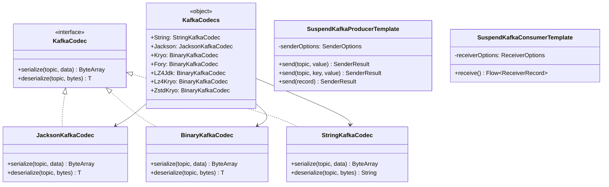
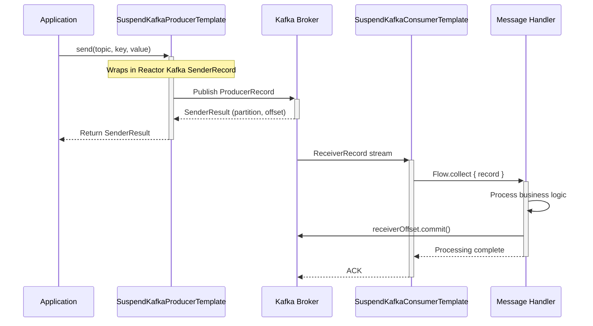

# Module bluetape4k-kafka

English | [한국어](./README.ko.md)

A utility library for using Apache Kafka efficiently in a Kotlin environment. Provides extension functions and wrapper classes for Kafka clients, Spring Kafka, and Kafka Streams with Kotlin Coroutines support.

## Features

- **Kotlin Coroutines support**: Kafka Producer/Consumer operations as suspend functions
- **Multiple serialization formats**: Codecs for Jackson, Kryo, FST, and compression with LZ4/Snappy/Zstd
- **Spring Kafka integration**: Kotlin extension functions for KafkaTemplate, listeners, and more
- **Kafka Streams support**: Convenience functions for KStream and KTable operations
- **Test utilities**: Testing support using Embedded Kafka

## Installation

### Gradle (Kotlin DSL)

```kotlin
dependencies {
    implementation("io.github.bluetape4k:bluetape4k-kafka:$version")
}
```

### Gradle (Groovy DSL)

```groovy
dependencies {
    implementation 'io.github.bluetape4k:bluetape4k-kafka:$version'
}
```

### Maven

```xml

<dependency>
    <groupId>io.github.bluetape4k</groupId>
    <artifactId>bluetape4k-kafka</artifactId>
    <version>${version}</version>
</dependency>
```

## Dependencies

This module depends on the following libraries:

- `org.apache.kafka:kafka-clients` - Kafka client
- `org.springframework.kafka:spring-kafka` - Spring Kafka support
- `io.github.bluetape4k:bluetape4k-io` - Serialization utilities
- `io.github.bluetape4k:bluetape4k-jackson2` - JSON serialization support
- `io.projectreactor.kafka:reactor-kafka` - Reactive Kafka support

## Usage Examples

### 1. Creating a Kafka Producer

```kotlin
import io.bluetape4k.kafka.producerOf
import org.apache.kafka.common.serialization.StringSerializer

val producer = producerOf(
    mapOf(
        "bootstrap.servers" to "localhost:9092",
        "acks" to "all",
        "retries" to 3,
        "key.serializer" to StringSerializer::class.java,
        "value.serializer" to StringSerializer::class.java,
    )
)

// Publish a message
producer.send(ProducerRecord("test-topic", "key", "value"))
producer.close()
```

### 2. Using a Kafka Producer in a Coroutine Context

```kotlin
import io.bluetape4k.kafka.coroutines.suspendSend
import io.bluetape4k.kafka.coroutines.sendAsFlow
import kotlinx.coroutines.flow.flow

suspend fun produceMessages() {
    val producer = producerOf<String, String>(/* config */)

    // Publish a single message
    val record = ProducerRecord("test-topic", "key", "value")
    val metadata = producer.suspendSend(record)
    println("Sent to partition ${metadata.partition()}, offset ${metadata.offset()}")

    // Publish multiple messages via Flow
    val records = flow {
        repeat(100) { i ->
            emit(ProducerRecord("test-topic", "key-$i", "value-$i"))
        }
    }
    producer.sendAsFlow(records).collect { metadata ->
        println("Sent: ${metadata.offset()}")
    }

    producer.close()
}
```

### 3. Creating a Kafka Consumer

```kotlin
import io.bluetape4k.kafka.consumerOf
import org.apache.kafka.common.serialization.StringDeserializer

val consumer = consumerOf<String, String>(
    mapOf(
        "bootstrap.servers" to "localhost:9092",
        "group.id" to "test-group",
        "auto.offset.reset" to "earliest",
        "key.deserializer" to StringDeserializer::class.java,
        "value.deserializer" to StringDeserializer::class.java,
    )
)

consumer.subscribe(listOf("test-topic"))
while (true) {
    val records = consumer.poll(Duration.ofMillis(100))
    for (record in records) {
        println("Received: ${record.value()}")
    }
}
```

### 4. Using Kafka Codecs

```kotlin
import io.bluetape4k.kafka.codec.KafkaCodecs

// String codec
val stringCodec = KafkaCodecs.String
val bytes = stringCodec.serialize("test-topic", "Hello Kafka")
val message = stringCodec.deserialize("test-topic", bytes)

// Jackson JSON codec
val jacksonCodec = KafkaCodecs.Jackson
val data = mapOf("name" to "John", "age" to 30)
val jsonBytes = jacksonCodec.serialize("test-topic", data)
val decoded = jacksonCodec.deserialize("test-topic", jsonBytes)

// LZ4 compression + Kryo serialization
val lz4KryoCodec = KafkaCodecs.Lz4Kryo
val largeObject = LargeDataObject(/* ... */)
val compressed = lz4KryoCodec.serialize("test-topic", largeObject)
```

Available codecs:

| Codec                   | Description                             |
|-------------------------|-----------------------------------------|
| `KafkaCodecs.String`    | UTF-8 string serialization              |
| `KafkaCodecs.ByteArray` | Raw byte array passthrough              |
| `KafkaCodecs.Jackson`   | JSON serialization                      |
| `KafkaCodecs.Jdk`       | Java serialization                      |
| `KafkaCodecs.Kryo`      | Kryo binary serialization               |
| `KafkaCodecs.Fory`      | FST binary serialization                |
| `KafkaCodecs.LZ4Jdk`    | LZ4 compression + Java serialization    |
| `KafkaCodecs.Lz4Kryo`   | LZ4 compression + Kryo serialization    |
| `KafkaCodecs.SnappyJdk` | Snappy compression + Java serialization |
| `KafkaCodecs.ZstdKryo`  | Zstd compression + Kryo serialization   |

### 5. Spring KafkaTemplate with Coroutines

```kotlin
import io.bluetape4k.kafka.spring.suspendSend
import org.springframework.kafka.core.KafkaTemplate

@Service
class MessageService(
    private val kafkaTemplate: KafkaTemplate<String, String>
) {
    suspend fun sendMessage(topic: String, key: String, value: String) {
        val result = kafkaTemplate.suspendSend(topic, key, value)
        println("Message sent to partition ${result.recordMetadata.partition()}")
    }

    suspend fun sendMessage(record: ProducerRecord<String, String>) {
        val result = kafkaTemplate.suspendSend(record)
        println("Message sent with offset ${result.recordMetadata.offset()}")
    }
}
```

### 6. Using SuspendKafkaProducerTemplate

```kotlin
import io.bluetape4k.kafka.spring.core.SuspendKafkaProducerTemplate
import reactor.kafka.sender.SenderOptions

val senderOptions = SenderOptions.create<String, String>(
    mapOf(
        "bootstrap.servers" to "localhost:9092",
        "key.serializer" to StringSerializer::class.java,
        "value.serializer" to StringSerializer::class.java,
        "acks" to "all",
    )
)

val producerTemplate = SuspendKafkaProducerTemplate(senderOptions)

suspend fun sendWithTemplate() {
    // Simple send
    producerTemplate.send("test-topic", "value")

    // Send with key
    producerTemplate.send("test-topic", "key", "value")

    // Send with ProducerRecord
    val result = producerTemplate.send(ProducerRecord("test-topic", "key", "value"))
    println("Sent to partition ${result.recordMetadata().partition()}")
}
```

### 7. Using SuspendKafkaConsumerTemplate

```kotlin
import io.bluetape4k.kafka.spring.core.SuspendKafkaConsumerTemplate
import reactor.kafka.receiver.ReceiverOptions

val receiverOptions = ReceiverOptions.create<String, String>(
    mapOf(
        "bootstrap.servers" to "localhost:9092",
        "group.id" to "test-group",
        "key.deserializer" to StringDeserializer::class.java,
        "value.deserializer" to StringDeserializer::class.java,
        "auto.offset.reset" to "earliest",
    )
).subscription(listOf("test-topic"))

val consumerTemplate = SuspendKafkaConsumerTemplate(receiverOptions)

suspend fun consumeWithTemplate() {
    consumerTemplate.subscribe("test-topic")
    val assignments = consumerTemplate.assignment()

    consumerTemplate.receive().collect { record ->
        println("Received: ${record.value()}")
        // Manual commit
        record.receiverOffset().commit().await()
    }

    // Consumer management operations
    consumerTemplate.commitCurrentOffsets(*assignments.toTypedArray())
    consumerTemplate.seekToTimestamp(assignments.first(), System.currentTimeMillis() - 60_000)
    consumerTemplate.unsubscribe()
}
```

### 8. Kafka Streams

```kotlin
import io.bluetape4k.kafka.streams.kstream.*
import org.apache.kafka.streams.kstream.Consumed
import org.apache.kafka.streams.kstream.Grouped
import org.apache.kafka.streams.kstream.Produced
import org.apache.kafka.streams.kstream.Materialized

fun buildTopology(builder: StreamsBuilder) {
    // Consume from topic
    val consumed = consumedOf(
        keySerde = Serdes.String(),
        valueSerde = Serdes.String(),
        resetPolicy = Topology.AutoOffsetReset.EARLIEST
    )

    // Group by key
    val grouped = groupedOf(
        keySerde = Serdes.String(),
        valueSerde = Serdes.Long().asSerde(),
        name = "group-by-key"
    )

    // Produce to topic
    val produced = producedOf(
        keySerde = Serdes.String(),
        valueSerde = Serdes.Long().asSerde()
    )

    // State store
    val materialized = materializedOf<String, Long, KeyValueStore<Bytes, ByteArray>>(
        "count-store"
    )

    // Build topology
    builder.stream("input-topic", consumed)
        .groupByKey(grouped)
        .count(materialized)
        .toStream()
        .to("output-topic", produced)
}
```

### 9. Test Utilities

```kotlin
import io.bluetape4k.kafka.spring.test.utils.*
import org.springframework.kafka.test.EmbeddedKafkaBroker
import org.springframework.kafka.test.context.EmbeddedKafka

@EmbeddedKafka(
    partitions = 1,
    topics = ["test-topic"],
    brokerProperties = ["listeners=PLAINTEXT://localhost:9092"]
)
class KafkaIntegrationTest {

    @Autowired
    lateinit var embeddedKafka: EmbeddedKafkaBroker

    @Test
    fun `test message publish and receive`() {
        // Create producer
        val producer = KafkaProducer<String, String>(
            embeddedKafka.producerProps(),
            StringSerializer(),
            StringSerializer()
        )

        // Publish message
        producer.send(ProducerRecord("test-topic", "key", "value"))
        producer.flush()

        // Create consumer
        val consumer = KafkaConsumer<String, String>(
            embeddedKafka.consumerProps("test-group", autoCommit = false),
            StringDeserializer(),
            StringDeserializer()
        )
        consumer.subscribe(listOf("test-topic"))

        // Verify received message
        val record = consumer.getSingleRecord("test-topic", Duration.ofSeconds(5))
        assertThat(record.value()).isEqualTo("value")

        consumer.close()
        producer.close()
    }
}
```

## Architecture Diagrams

### Kafka Class Hierarchy



### Producer/Consumer Message Flow



### Kafka Streams Processing Flow


## Package Structure

```
io.bluetape4k.kafka
├── codec/                    # Kafka serialization/deserialization codecs
│   ├── KafkaCodec.kt         # Base codec interface
│   ├── KafkaCodecs.kt        # Codec instances
│   ├── JacksonKafkaCodec.kt  # JSON serialization
│   ├── BinaryKafkaCodecs.kt  # Binary serialization (JDK, Kryo, FST)
│   ├── StringKafkaCodec.kt   # String serialization
│   └── ByteArrayKafkaCodec.kt # Byte array serialization
├── coroutines/               # Coroutine support
│   └── ProducerCoroutines.kt # Suspend functions for Producer
├── spring/                   # Spring Kafka integration
│   ├── KafkaOperationsExtensions.kt  # KafkaTemplate extensions
│   ├── core/                 # Core Spring Kafka support
│   │   ├── SuspendKafkaProducerTemplate.kt  # Suspend Producer
│   │   ├── SuspendKafkaConsumerTemplate.kt  # Suspend Consumer
│   │   ├── KafkaOperationExtensions.kt      # KafkaOperations extensions
│   │   └── ProducerFactorySupport.kt        # ProducerFactory support
│   ├── listener/             # Listener utilities
│   │   ├── ListenerUtils.kt
│   │   └── adapter/
│   ├── support/              # Support utilities
│   │   └── KafkaUtils.kt
│   └── test/utils/           # Test utilities
│       └── KafkaTestUtils.kt
├── streams/                  # Kafka Streams support
│   ├── StreamConfig.kt       # Streams configuration
│   └── kstream/              # KStream DSL extensions
│       ├── Consumed.kt
│       ├── Produced.kt
│       ├── Joined.kt
│       ├── Grouped.kt
│       ├── Materialized.kt
│       ├── StreamJoined.kt
│       ├── Repartitioned.kt
│       ├── TableJoined.kt
│       ├── Branched.kt
│       └── Windowed.kt
├── ProducerSupport.kt        # Producer creation utilities
├── ConsumerSupport.kt        # Consumer creation utilities
└── TopicPartitionSupport.kt  # TopicPartition utilities
```

## References

- [Apache Kafka Documentation](https://kafka.apache.org/documentation/)
- [Spring for Apache Kafka](https://spring.io/projects/spring-kafka)
- [Kafka Streams Documentation](https://kafka.apache.org/documentation/streams/)
- [Microservices with Spring Boot and Kafka Demo Project](https://www.github.com/piomin/sample-spring-kafka-microservices)

## License

Apache License 2.0
