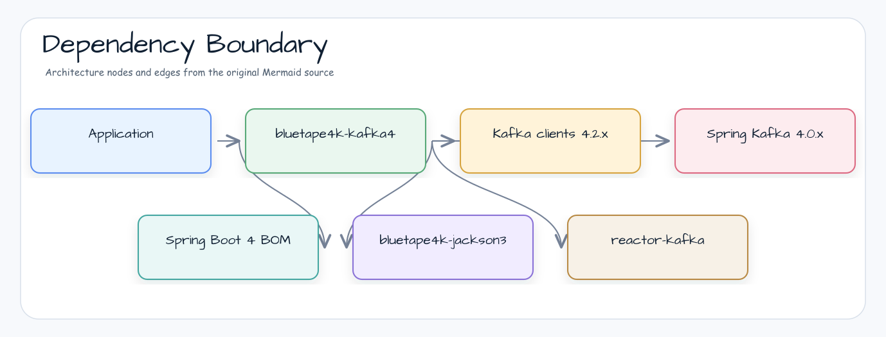

# Module bluetape4k-kafka4

[English](./README.md) | 한국어

`bluetape4k-kafka4`는 bluetape4k Kafka 유틸리티의 Kafka 4.x 라인입니다.
기존 `bluetape4k-kafka`와 같은 Kotlin 우선 API 형태를 유지하되 Kafka 4.2.x,
Spring Kafka 4.x, Spring Boot 4, Jackson 3 기준으로 컴파일합니다.

## 호환성

| 모듈 | Kafka | Spring Kafka | Spring Boot | Jackson | 비고 |
|---|---:|---:|---:|---:|---|
| `bluetape4k-kafka` | 3.9.x | 3.3.x | 3.x | Jackson 2 | 기존 Kafka 3 라인 |
| `bluetape4k-kafka4` | 4.2.x | 4.0.x | 4.x | Jackson 3 | Kafka 4 라인, Embedded Kafka는 KRaft 전용 |

두 모듈은 같은 `io.bluetape4k.kafka` API 패키지를 제공합니다. 중복 패키지 경계를
의도적으로 관리하는 경우가 아니라면 한 애플리케이션 런타임 classpath에는 둘 중 하나만
선택하세요.

## 특징

- Kafka producer/consumer 작업을 위한 coroutine 래퍼.
- `KafkaTemplate`, producer factory, listener container, test utility를 위한
  Spring Kafka 확장 함수.
- Kafka 4 기준으로 컴파일되는 Kafka Streams helper와 테스트.
- 문자열, 바이트 배열, Jackson 3 JSON, JDK 직렬화, Kryo, Fory, LZ4/Snappy/Zstd
  압축 payload codec.
- Spring Kafka 4의 KRaft 전용 embedded broker 테스트 지원.

## 의존성

### Gradle Kotlin DSL

```kotlin
dependencies {
    implementation("io.github.bluetape4k:bluetape4k-kafka4:$version")
}
```

### Maven

```xml
<dependency>
    <groupId>io.github.bluetape4k</groupId>
    <artifactId>bluetape4k-kafka4</artifactId>
    <version>${version}</version>
</dependency>
```

## 의존성 경계



`infra/kafka4/build.gradle.kts`는 모든 `org.apache.kafka` artifact를 이 모듈의
Kafka 4 버전으로 정렬합니다. root dependency management가 Kafka 3 artifact를
Kafka 4 test/runtime classpath에 섞는 것을 막기 위한 조치입니다.

## Producer

```kotlin
import io.bluetape4k.kafka.producerOf
import org.apache.kafka.clients.producer.ProducerRecord
import org.apache.kafka.common.serialization.StringSerializer

val producer = producerOf<String, String>(
    mapOf(
        "bootstrap.servers" to "localhost:9092",
        "acks" to "all",
        "key.serializer" to StringSerializer::class.java,
        "value.serializer" to StringSerializer::class.java,
    )
)

producer.send(ProducerRecord("events", "key", "value"))
producer.close()
```

## Coroutine Producer

```kotlin
import io.bluetape4k.kafka.coroutines.suspendSend
import org.apache.kafka.clients.producer.ProducerRecord

suspend fun sendEvent() {
    val metadata = producer.suspendSend(ProducerRecord("events", "key", "value"))
    println("sent partition=${metadata.partition()} offset=${metadata.offset()}")
}
```

## Spring Kafka

```kotlin
import io.bluetape4k.kafka.spring.suspendSend
import org.springframework.kafka.core.KafkaTemplate
import org.springframework.stereotype.Service

@Service
class EventPublisher(
    private val kafkaTemplate: KafkaTemplate<String, String>,
) {
    suspend fun publish(value: String) {
        kafkaTemplate.suspendSend("events", "key", value)
    }
}
```

Spring Kafka 4는 Kafka 3 라인보다 key/value generic의 non-null 경계를 엄격하게
적용합니다. tombstone/null-value 계약이 명확한 경우가 아니라면 template과 factory에는
non-null value type을 우선 사용하세요.

## Jackson 3 Codec

```kotlin
import io.bluetape4k.kafka.codec.JacksonKafkaCodec

class ExampleJacksonCodec : JacksonKafkaCodec() {
    override val allowedTypePackages = setOf("java.util")
}

val codec = ExampleJacksonCodec()
val bytes = codec.serialize("events", mapOf("name" to "spring-kafka-4"))
val decoded = codec.deserialize("events", bytes)
```

Jackson codec은 `bluetape4k-jackson3`와 `tools.jackson.*` API를 사용합니다.

사용 가능한 Codecs:

| Codec | 설명 |
|---|---|
| `KafkaCodecs.String` | UTF-8 문자열 직렬화 |
| `KafkaCodecs.ByteArray` | 바이트 배열 직접 전달 |
| `KafkaCodecs.Jackson` | Jackson 3 JSON 직렬화 |
| `KafkaCodecs.Jdk` | **사용 중단** — Java 직렬화 (RCE 위험, Fory 사용 권장) |
| `KafkaCodecs.Kryo` | Kryo 바이너리 직렬화 |
| `KafkaCodecs.Fory` | Fory 바이너리 직렬화 |
| `KafkaCodecs.LZ4Jdk` | LZ4 압축 + Java 직렬화 |
| `KafkaCodecs.Lz4Kryo` | LZ4 압축 + Kryo 직렬화 |
| `KafkaCodecs.Lz4Fory` | LZ4 압축 + Fory 직렬화 |
| `KafkaCodecs.SnappyJdk` | Snappy 압축 + Java 직렬화 |
| `KafkaCodecs.SnappyKryo` | Snappy 압축 + Kryo 직렬화 |
| `KafkaCodecs.SnappyFory` | Snappy 압축 + Fory 직렬화 |
| `KafkaCodecs.ZstdJdk` | Zstd 압축 + Java 직렬화 |
| `KafkaCodecs.ZstdKryo` | Zstd 압축 + Kryo 직렬화 |
| `KafkaCodecs.ZstdFory` | Zstd 압축 + Fory 직렬화 |

### Poison-pill 정책

`AbstractKafkaCodec.deserialize` 는 명시적인 poison-pill 정책을 가진다.

| Throwable 종류        | 동작                                                |
|-----------------------|-----------------------------------------------------|
| 일반 `Exception`      | WARN 로그 + `null` 반환 (consumer 루프 진행 보장)   |
| `CancellationException` | **재던짐** — 코루틴 취소 신호 보존                   |
| `Error` (OOM, StackOverflow 등) | **전파** — JVM 손상 상태를 은폐하지 않음        |

영구 손실을 막으려면 Spring-Kafka 의 `ErrorHandlingDeserializer` +
`DeadLetterPublishingRecoverer` 와 함께 사용하여 poison record 를 DLQ 토픽으로
라우팅하라.

### 성능: 타입 헤더 쓰기 비활성화

`AbstractKafkaCodec` 은 기본적으로 매 레코드 헤더에 value 타입의 Java FQN 을 기록합니다
(`bluetape4k.kafka.codec.value.type`). 다형성 역직렬화에 필요하지만,
처리량이 높은 토픽에서는 대역폭·저장 오버헤드가 발생하며 아래 설명하는
클래스 로딩 attack surface 도 넓어집니다.

컨슈머가 타입을 정적으로 이미 알고 있다면 헤더 쓰기를 비활성화할 수 있습니다:

```kotlin
// Fory/Kryo 기반 코덱은 헤더 없이 안전하게 작동합니다
class NoHeaderForyCodec : ForyKafkaCodec() {
    override val writeValueTypeHeader = false
}
```

> **`JacksonKafkaCodec` 주의**: Jackson은 역직렬화 시 헤더에서 대상 타입을 결정합니다.
> `doDeserialize`를 함께 오버라이드하지 않고 `writeValueTypeHeader = false`만 설정하면
> `LinkedHashMap`으로 역직렬화되어 타입 손상이 발생합니다.
> 헤더를 안전하게 비활성화하려면 `ForyKafkaCodec` 또는 `KryoKafkaCodec`을 사용하세요.

| `writeValueTypeHeader` | 동작 |
|------------------------|------|
| `true` (기본값) | 매 레코드에 FQN 헤더 기록 — 다형성 역직렬화 지원 |
| `false` | 헤더 생략 — 대역폭 오버헤드 없음, attack surface 축소. 컨슈머가 타입을 정적으로 알고 있을 때 사용. |

### 보안: 클래스 로딩 허용 목록

신뢰 프로필: 기본값은 `AllowListedTypes`입니다. `UnsafeLegacyCompatibility`는
`AbstractKafkaCodec.ALLOW_ALL_TYPES_UNSAFE`를 통해서만 사용하세요.

`AbstractKafkaCodec` 은 Kafka 헤더 `bluetape4k.kafka.codec.value.type` 에서
역직렬화 대상 클래스를 로드합니다. 이 헤더를 공격자가 조작할 수 있는 환경(신뢰할 수
없는 브로커, 외부 네트워크)에서는 임의 클래스 로딩(RCE)이 가능합니다.

`allowedTypePackages` 를 오버라이드하여 로드 가능한 패키지를 제한하세요:

```kotlin
class SecureJacksonCodec : JacksonKafkaCodec() {
    override val allowedTypePackages = setOf(
        "com.example.dto",
        "io.bluetape4k.domain",
    )
}
```

| `allowedTypePackages` 값 | 동작 |
|--------------------------|------|
| `emptySet()` (기본값) | **모든 클래스 차단** — 타입 헤더에서 클래스를 로드하지 않음. 신뢰할 수 없거나 공유된 토픽에 대한 안전한 기본값. |
| 비어 있지 않은 집합 | 나열된 패키지 접두사와 일치하는 FQN 클래스만 허용; 그 외 poison-pill `null` 반환. |
| `AbstractKafkaCodec.ALLOW_ALL_TYPES_UNSAFE` | 모든 검사 우회 — 1.8.0 이전의 허용-전체 동작 복원. 완전히 신뢰할 수 있는 내부 환경에서만 사용. |

레거시 마이그레이션 예시:

```kotlin
class LegacyTrustedJacksonCodec : JacksonKafkaCodec() {
    override val allowedTypePackages = AbstractKafkaCodec.ALLOW_ALL_TYPES_UNSAFE
}
```

### 보안: JdkKafkaCodec 지원 중단

`JdkKafkaCodec` 은 JDK 역직렬화 RCE 위험으로 인해 `@Deprecated` 처리되었습니다.
성능과 보안 모두 우수한 `ForyKafkaCodec` 을 사용하세요.

## Embedded Kafka 테스트

Spring Kafka 4의 embedded broker는 KRaft 전용입니다. Spring Kafka 3 전환기에 쓰던
`kraft = true` 속성은 사용하지 않습니다.

```kotlin
import org.springframework.kafka.test.context.EmbeddedKafka

@EmbeddedKafka(
    partitions = 1,
    topics = ["events"],
    bootstrapServersProperty = "spring.kafka.bootstrap-servers",
)
class EventKafkaTest
```

## 검증

```bash
./gradlew :bluetape4k-kafka4:compileKotlin
./gradlew :bluetape4k-kafka4:compileTestKotlin
./gradlew :bluetape4k-kafka4:test
```
