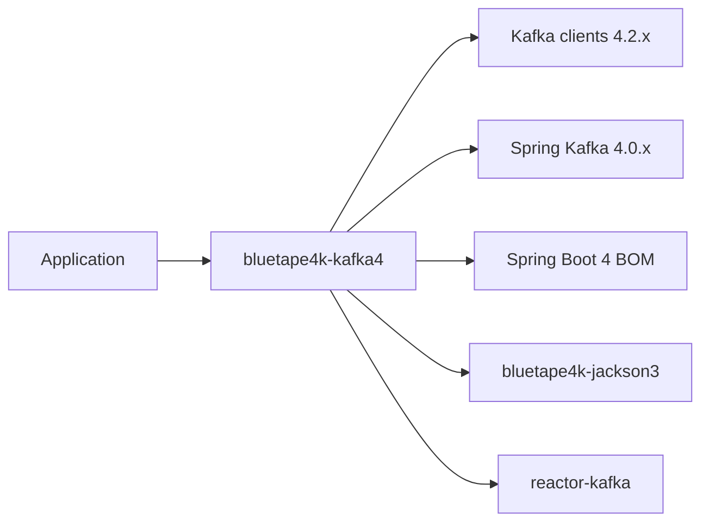

# Module bluetape4k-kafka4

English | [한국어](./README.ko.md)

`bluetape4k-kafka4` is the Kafka 4.x line of the bluetape4k Kafka utilities.
It keeps the same Kotlin-first API shape as `bluetape4k-kafka`, but is compiled
against Kafka 4.2.x, Spring Kafka 4.x, Spring Boot 4, and Jackson 3.

## Compatibility

| Module | Kafka | Spring Kafka | Spring Boot | Jackson | Notes |
|---|---:|---:|---:|---:|---|
| `bluetape4k-kafka` | 3.9.x | 3.3.x | 3.x | Jackson 2 | Existing Kafka 3 line |
| `bluetape4k-kafka4` | 4.2.x | 4.0.x | 4.x | Jackson 3 | Kafka 4 line, KRaft-only embedded tests |

Do not put both modules on the same runtime classpath unless you intentionally
manage the duplicate `io.bluetape4k.kafka` API package boundary. Choose one line
per application.

## Features

- Coroutine wrappers for Kafka producer and consumer operations.
- Spring Kafka extensions for `KafkaTemplate`, producer factories, listener
  containers, and test utilities.
- Kafka Streams helpers and test coverage compiled against Kafka 4.
- Codecs for string, byte array, Jackson 3 JSON, JDK serialization, Kryo, Fory,
  and compressed payloads with LZ4, Snappy, or Zstd.
- Embedded Kafka test support through Spring Kafka 4's KRaft-only broker.

## Dependency

### Gradle Kotlin DSL

```kotlin
dependencies {
    implementation("io.github.bluetape4k:bluetape4k-kafka4:$version")
}
```

### Maven

```xml
<dependency>
    <groupId>io.github.bluetape4k</groupId>
    <artifactId>bluetape4k-kafka4</artifactId>
    <version>${version}</version>
</dependency>
```

## Dependency Boundary



`infra/kafka4/build.gradle.kts` also aligns all `org.apache.kafka` artifacts to
the Kafka 4 version used by this module. This prevents the root dependency
management from pulling Kafka 3 artifacts into the Kafka 4 test/runtime
classpath.

## Producer

```kotlin
import io.bluetape4k.kafka.producerOf
import org.apache.kafka.clients.producer.ProducerRecord
import org.apache.kafka.common.serialization.StringSerializer

val producer = producerOf<String, String>(
    mapOf(
        "bootstrap.servers" to "localhost:9092",
        "acks" to "all",
        "key.serializer" to StringSerializer::class.java,
        "value.serializer" to StringSerializer::class.java,
    )
)

producer.send(ProducerRecord("events", "key", "value"))
producer.close()
```

## Coroutine Producer

```kotlin
import io.bluetape4k.kafka.coroutines.suspendSend
import org.apache.kafka.clients.producer.ProducerRecord

suspend fun sendEvent() {
    val metadata = producer.suspendSend(ProducerRecord("events", "key", "value"))
    println("sent partition=${metadata.partition()} offset=${metadata.offset()}")
}
```

## Spring Kafka

```kotlin
import io.bluetape4k.kafka.spring.suspendSend
import org.springframework.kafka.core.KafkaTemplate
import org.springframework.stereotype.Service

@Service
class EventPublisher(
    private val kafkaTemplate: KafkaTemplate<String, String>,
) {
    suspend fun publish(value: String) {
        kafkaTemplate.suspendSend("events", "key", value)
    }
}
```

Spring Kafka 4 uses non-null key/value generic boundaries more strictly than the
Kafka 3 line. Prefer non-null value types in templates and factories unless your
application has an explicit tombstone/null-value contract.

## Jackson 3 Codec

```kotlin
import io.bluetape4k.kafka.codec.KafkaCodecs

val codec = KafkaCodecs.Jackson
val bytes = codec.serialize("events", mapOf("name" to "spring-kafka-4"))
val decoded = codec.deserialize("events", bytes)
```

The Jackson codec uses `bluetape4k-jackson3` and `tools.jackson.*` APIs.

### Poison-pill Policy

`AbstractKafkaCodec.deserialize` exposes a documented poison-pill policy:

| Throwable type        | Behavior                                         |
|-----------------------|--------------------------------------------------|
| Generic `Exception`   | WARN log + return `null` (consumer loop continues) |
| `CancellationException` | **Rethrown** — coroutine cancellation is preserved |
| `Error` (OOM, StackOverflow, …) | **Propagated** — JVM corruption is not hidden |

For permanent loss prevention, combine with Spring-Kafka's
`ErrorHandlingDeserializer` and `DeadLetterPublishingRecoverer` to route
poisoned records to a DLQ topic.

### Security: Class Loading Allowlist

`AbstractKafkaCodec` loads the deserialization target class from the Kafka
header `bluetape4k.kafka.codec.value.type`. If that header can be set by an
attacker (untrusted broker or external network), arbitrary class loading (RCE)
is possible.

Override `allowedTypePackages` to restrict which packages may be loaded:

```kotlin
class SecureJacksonCodec : JacksonKafkaCodec() {
    override val allowedTypePackages = setOf(
        "com.example.dto",
        "io.bluetape4k.domain",
    )
}
```

| `allowedTypePackages` value | Effect |
|-----------------------------|--------|
| `emptySet()` (default) | All classes allowed — backward-compatible, trusted environments only |
| Non-empty set | Only classes under listed package prefixes are allowed; others throw `IllegalArgumentException` → poison-pill (`null`) |

> **Warning:** The default `emptySet()` maintains backward compatibility but
> allows any class to be loaded. Set explicit packages in production when the
> Kafka broker is not fully trusted.

### Security: JdkKafkaCodec Deprecated

`JdkKafkaCodec` is deprecated due to JDK deserialization RCE risks. Use
`KryoKafkaCodec` or `JacksonKafkaCodec` instead.

## Embedded Kafka Tests

Spring Kafka 4 embedded brokers are KRaft-only. Do not use `kraft = true`; that
flag belonged to the Spring Kafka 3 transition period.

```kotlin
import org.springframework.kafka.test.context.EmbeddedKafka

@EmbeddedKafka(
    partitions = 1,
    topics = ["events"],
    bootstrapServersProperty = "spring.kafka.bootstrap-servers",
)
class EventKafkaTest
```

## Verification

```bash
./gradlew :bluetape4k-kafka4:compileKotlin
./gradlew :bluetape4k-kafka4:compileTestKotlin
./gradlew :bluetape4k-kafka4:test
```
