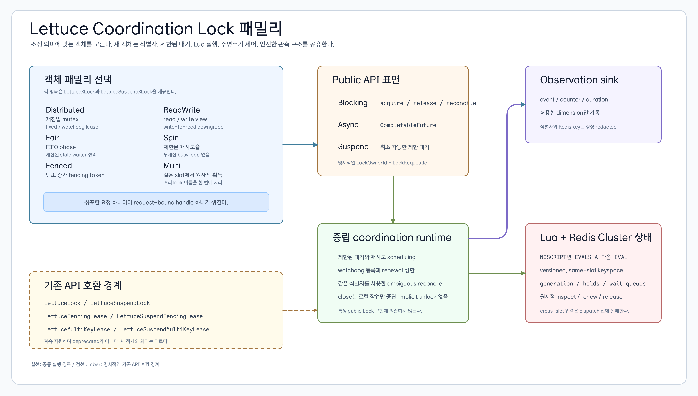
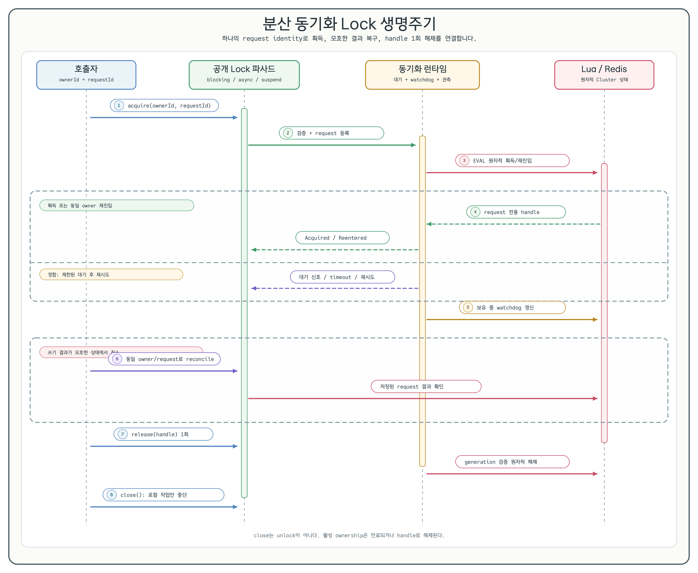

# 분산 동기화 Lock

[English](./CoordinationLocks.md) | 한국어

분산 동기화 Lock 패밀리는 “동기화 primitive마다 하나의 객체”라는 익숙한 모델을 따르면서 Lettuce에 맞는
blocking, `CompletableFuture`, coroutine API를 제공합니다. 새 API는 additive입니다. 기존 token mutex/lease
6개 표면은 Delivery 1에서도 지원되며 deprecated가 아닙니다.

## Lock 객체 선택

| 패밀리 | 선택 기준 | 특화 계약 |
|---|---|---|
| `LettuceDistributedLock` | 재진입 가능한 단일 resource 배타 제어 | `LockHandle`, fixed/watchdog lease |
| `LettuceFairLock` | 제한된 stale waiter 정리를 포함한 FIFO admission | `LockHandle`, `CleanupPending` |
| `LettuceFencedLock` | downstream stale writer 거부 | `FencedLockHandle`, `(epoch, sequence)` token |
| `LettuceReadWriteLock` | writer-preference 기반 read 공유 | `ReadLockHandle`, `WriteLockHandle`, downgrade |
| `LettuceSpinLock` | 제한된 polling에 적합한 매우 짧은 임계 구역 | `LockHandle`, 제한된 backoff/rate |
| `LettuceMultiLock` | same-slot resource 집합의 원자적 all-or-nothing 제어 | `MultiLockHandle`, 정규화된 불변 names |

모든 패밀리는 `LettuceSuspendDistributedLock`, `LettuceSuspendFairLock`, `LettuceSuspendFencedLock`,
`LettuceSuspendReadWriteLock`, `LettuceSuspendSpinLock`, `LettuceSuspendMultiLock` 대응 객체를 제공합니다.
Blocking 객체에는 동기 및 `CompletableFuture`
메서드가 있고 suspend 객체에는 suspending 메서드와 의도적으로 non-suspending인 `close()`가 있습니다.



공통 runtime은 제한된 대기, watchdog scheduling, 식별자를 노출하지 않는 관측, Lua 실행을 담당합니다.
Redis가 ownership의 최종 authority입니다. Lock 객체는 connection이나 주입한 scheduler를 소유하지 않습니다.

## 생명주기와 예제



논리 process/worker마다 owner identity를 한 번 만들고, 획득 요청마다 request identity를 만드세요. 동일 요청을
retry하거나 reconcile할 때는 반드시 같은 owner/request 쌍을 재사용합니다.

### Blocking 획득

```kotlin
val lock = LettuceDistributedLock.create(connection, "orders")
val ownerId = LockOwnerId.from("checkout-worker-7")
val requestId = LockRequestId.random()
val result = lock.acquire(
    ownerId,
    requestId,
    Duration.ofSeconds(2),
    LeasePolicy.Fixed(Duration.ofSeconds(15)),
)

fun releaseSuccessfully(handle: LockHandle) = try {
    processOrder()
} finally {
    lock.release(handle)
}

when (result) {
    is LockAcquireResult.Acquired -> releaseSuccessfully(result.handle)
    is LockAcquireResult.Reentered -> releaseSuccessfully(result.handle)
    is LockAcquireResult.Ambiguous ->
        when (val reconciled = lock.reconcile(result.ownerId, result.requestId)) {
            is LockReconcileResult.Owned -> releaseSuccessfully(reconciled.handle)
            else -> recordReconciliation(reconciled)
        }
    LockAcquireResult.TimedOut -> deferOrder()
    else -> recordRejectedAcquisition(result)
}
```

### Async 획득

```kotlin
val ownerId = LockOwnerId.from("async-checkout")
val requestId = LockRequestId.random()
val future: CompletableFuture<LockAcquireResult<LockHandle>> =
    lock.acquireAsync(
        ownerId,
        requestId,
        Duration.ofSeconds(2),
        LeasePolicy.Fixed(Duration.ofSeconds(15)),
    )

future.thenCompose { result ->
    val completion: CompletableFuture<*> = when (result) {
        is LockAcquireResult.Acquired -> lock.releaseAsync(result.handle)
        is LockAcquireResult.Reentered -> lock.releaseAsync(result.handle)
        is LockAcquireResult.Ambiguous ->
            lock.reconcileAsync(result.ownerId, result.requestId).thenCompose { reconciled ->
                when (reconciled) {
                    is LockReconcileResult.Owned -> lock.releaseAsync(reconciled.handle)
                    else -> CompletableFuture.completedFuture(null)
                }
            }
        else -> CompletableFuture.completedFuture(null)
    }
    completion.thenAccept {}
}
```

### Suspend 획득과 close

```kotlin
val suspendLock = LettuceSuspendDistributedLock.create(connection, "orders")
val ownerId = LockOwnerId.from("coroutine-checkout")
val requestId = LockRequestId.random()

when (val result = suspendLock.acquire(
    ownerId,
    requestId,
    Duration.ofSeconds(2),
    LeasePolicy.Fixed(Duration.ofSeconds(15)),
)) {
    is LockAcquireResult.Acquired -> suspendLock.release(result.handle)
    is LockAcquireResult.Reentered -> suspendLock.release(result.handle)
    is LockAcquireResult.Ambiguous ->
        when (val reconciled = suspendLock.reconcile(result.ownerId, result.requestId)) {
            is LockReconcileResult.Owned -> suspendLock.release(reconciled.handle)
            else -> Unit
        }
    else -> Unit
}
suspendLock.close() // non-suspending: 로컬 registration과 새 작업을 중단
```

`close()`는 새 작업, 대기 registration, 로컬 watchdog task를 중단합니다. Redis connection과 주입한 scheduler를
닫지 않고 Redis ownership도 해제하지 않습니다. 활성 hold는 handle로 해제하거나 제한된 lease 만료를 기다립니다.

### 재진입은 request 단위다

성공한 획득 요청 하나는 정확히 한 번 해제해야 하는 request-bound hold 하나를 만듭니다. 동일 request ID replay는
같은 hold를 돌려주고, 동일 owner의 다른 request ID는 중첩 hold를 만듭니다.

```kotlin
val ownerId = LockOwnerId.from("reentrant-worker")
val outerRequest = LockRequestId.random()
val innerRequest = LockRequestId.random()

val outer = lock.tryAcquire(ownerId, outerRequest, LeasePolicy.Fixed(Duration.ofSeconds(15)))
    as LockAcquireResult.Acquired
val inner = lock.tryAcquire(ownerId, innerRequest, LeasePolicy.Fixed(Duration.ofSeconds(15)))
    as LockAcquireResult.Reentered

check(lock.release(inner.handle) is LockMutationResult.Released)
check(lock.release(outer.handle) is LockMutationResult.Released)
check(lock.release(outer.handle) is LockMutationResult.AlreadyReleased)
```

## 정책별 의무

### Fixed lease와 watchdog

임계 구역의 명확한 상한이 있으면 `LeasePolicy.Fixed`를 사용합니다. `LeasePolicy.Watchdog`는 TTL, renewal interval,
maximum lifetime을 명시해야 하며 무기한 동작하지 않습니다.

```kotlin
val fixed = LeasePolicy.Fixed(Duration.ofSeconds(15))
val watchdog = LeasePolicy.Watchdog(
    ttl = Duration.ofSeconds(12),
    renewalInterval = Duration.ofSeconds(3),
    maxLifetime = Duration.ofMinutes(2),
)
```

Inspect/mutation의 `OwnershipLost`는 보호 작업을 중단하고 durable authority와 reconcile해야 한다는 뜻입니다.
라이브러리는 stale process를 강제로 중단한다고 주장하지 않습니다.

### Fair timeout 정리

Fair 획득은 제한된 waiter batch만 정리합니다. `TimedOut`은 대기 만료, `CleanupPending`은 정확한 waiter 제거 결과가
여전히 모호함을 뜻합니다. 새 request를 만들기 전에 동일 owner/request identity로 reconcile하세요.

### Fencing

트래픽 제공 전에 `bootstrapFencing()`을 호출하고 rollout, rollback, backup, restore 동안 Redis counter를
보존합니다. Downstream store는 마지막 commit token보다 엄격히 큰 token만 받아야 합니다.

```sql
UPDATE orders
SET status = :status, fence_epoch = :epoch, fence_sequence = :sequence
WHERE id = :id
  AND (fence_epoch, fence_sequence) < (:epoch, :sequence);
```

Downstream이 이 strict-greater guard를 강제하는 곳에서만 fencing이 stale write를 거부합니다.

### Read/write downgrade

`lock.readLock()`과 `lock.writeLock()`을 사용합니다. Read-to-write upgrade는 지원하지 않습니다. `downgrade(writeHandle)`은
write hold를 반환된 read hold로 원자적으로 교체합니다. 기존 write handle이 아니라 반환된 read handle을 해제하세요.

### Spin 제한

`SpinLockConfig`는 initial/max delay, multiplier, jitter, `maxAttemptsPerSecond`를 제한합니다. Caller wait도
제한됩니다. 긴 임계 구역이나 무기한 retry loop에 spin lock을 사용하지 마세요.

### Same-slot multi-lock

모든 name은 하나의 Redis Cluster slot에 매핑되어야 합니다. 공통 hash tag와 논리 resource name을 사용하세요.

```kotlin
val config = MultiLockConfig(lock = LockConfig(hashTag = "sale-42"))
val multi = LettuceMultiLock.create(
    connection,
    listOf("inventory-a", "inventory-b"),
    config,
)
```

Cross-slot best effort는 지원하지 않으며 획득은 원자적으로 성공하거나 거부됩니다.

<!-- coordination-locks:ambiguous-reconcile -->
## 모호한 완료와 재조정

Dispatch 뒤 cancellation이나 transport failure가 발생하면 `LockAcquireResult.Ambiguous`가 될 수 있습니다.
새 request ID를 만들지 말고 원래 identity 그대로 `reconcile(ownerId, requestId)`을 호출해 owned, released,
queued, removed, not-found 또는 명시적인 failure를 확인하세요. 복구한 handle도 정확히 한 번 해제해야 합니다.

<!-- coordination-locks:watchdog-leak -->
## Watchdog 누수 방지

`ttl`, `renewalInterval`, `maxLifetime`, 활성 watchdog registration, scheduler task를 제한합니다. 사용하지 않는
Lock 객체를 닫고 capacity 거부/renewal 실패를 alert하며 process 종료 전에 활성 handle을 drain합니다.
Object close는 로컬 registration만 제거하며 unlock을 뜻하지 않습니다.

<!-- coordination-locks:observability -->
## 관측성

Metric이 필요하면 `LockObservationSink`를 주입합니다. Event는 sanitize되어 owner ID, request ID, resource name,
namespace, raw Redis reply, credential을 노출하지 않습니다. Operation, family, topology, outcome, recovery action,
제한된 latency를 수집합니다.

<!-- coordination-locks:alerts -->
## Metric과 alert

지속되는 `BackendFailure`, `IntegrityFailure`, `Ambiguous`, `CleanupPending`, `CapacityExceeded`,
`OwnershipLost`, watchdog renewal 실패, queue 포화, acquisition latency p95/p99에 alert를 겁니다. 단일 contention은
장애가 아니라 수요이므로 rate와 service별 threshold를 사용합니다.

<!-- coordination-locks:acl-tls -->
## ACL, TLS, credential

배포한 Lock 패밀리가 쓰는 keyspace와 최소 command만 허용합니다. `EVALSHA`, `EVAL`, `SCRIPT LOAD` 및 script
내부 Redis key command(`GET`, `SET`, `DEL`, `PTTL`, `PEXPIRE`, hash, sorted set, 선택한 wait 경로의
publish/stream command)를 포함하고 실제 command 집합은 deployment test로 검증합니다. Trust boundary를
넘으면 TLS를 요구하고 credential은 secret manager에 보관합니다. Connection string을 logging하지 않고
application/operator principal을 분리해 rotation합니다.

<!-- coordination-locks:namespace-migration -->
## Versioned namespace migration

`bt4k:coord:v1`처럼 명시적인 version namespace를 씁니다. 호환되지 않는 protocol 두 개를 같은 namespace에
연결하지 않습니다. 변경 시 새 획득을 중단하고 활성 hold를 drain/expire한 뒤 fencing generation/counter를
보존하고 새 namespace reader/writer를 배포합니다. 구 key는 제한되고 감사 가능한 batch로 정리합니다.

<!-- coordination-locks:rollout-rollback -->
## Rollout과 rollback

Caller-side switch 뒤에서 새 객체를 canary합니다. 같은 임계 구역을 old/new Lock으로 이중 획득하지 말고
outcome/latency signal을 비교합니다. State 삭제, fencing counter reset, request ID 재사용 없이 caller를 기존
API로 rollback합니다. 모든 ambiguous request를 reconcile하고 활성 lease가 만료될 때까지 새 namespace를
읽을 수 있게 유지합니다.

<!-- coordination-locks:drain-cleanup -->
## Drain과 cleanup

새 획득을 중단하고 알려진 handle의 해제 또는 제한된 lease 만료를 기다린 뒤 로컬 객체를 닫습니다. Ambiguous
request를 reconcile하고 stale queue/request record는 제한된 batch로 제거합니다. Rollback 가능성이 사라질
때까지 generation/fencing-counter state를 보존하며 production에서 unbounded wildcard delete를 하지 않습니다.

## 기존 primitive에서 migration

| 기존 지원 API | 더 강한 semantics가 필요할 때 새 패밀리 |
|---|---|
| `LettuceLock` | `LettuceDistributedLock` |
| `LettuceSuspendLock` | `LettuceSuspendDistributedLock` |
| `LettuceFencingLease` | `LettuceFencedLock` |
| `LettuceSuspendFencingLease` | `LettuceSuspendFencedLock` |
| `LettuceMultiKeyLease` | `LettuceMultiLock` |
| `LettuceSuspendMultiKeyLease` | `LettuceSuspendMultiLock` |

기존 API는 compatibility token mutex/lease입니다. Delivery 1에서도 지원되며 deprecated가 아닙니다. Typed
outcome, 명시적 identity, reconciliation, reentry, watchdog 제한, 특화 handle, 새 객체 모델이 필요할 때만
migration합니다.

## Non-goals

- Java thread ownership 없음: `LockOwnerId`/`LockRequestId`로 ownership을 명시합니다.
- 무기한 wait/watchdog 없음: wait, lease, renewal, queue, task path는 모두 제한됩니다.
- Cross-slot best effort 없음: multi-lock은 하나의 Redis Cluster slot을 요구합니다.
- Read upgrade 없음: write-to-read downgrade만 지원합니다.
- Exactly-once/stale-work-stop 주장 없음: caller가 reconcile하고 downstream이 fencing을 강제합니다.
- `close()`의 implicit unlock 없음: handle 또는 lease expiry로 ownership을 해제합니다.
