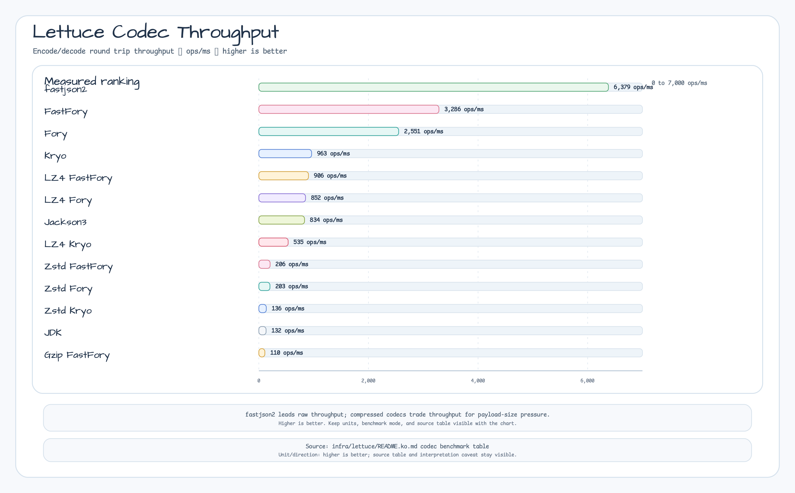
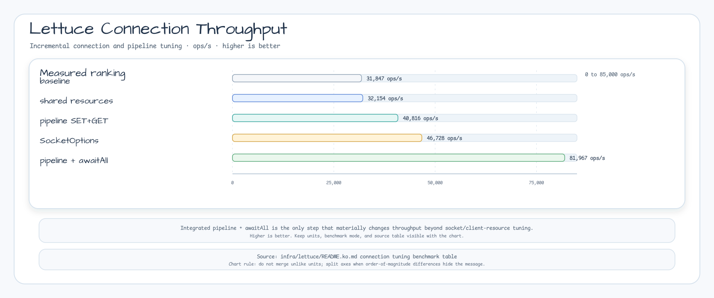
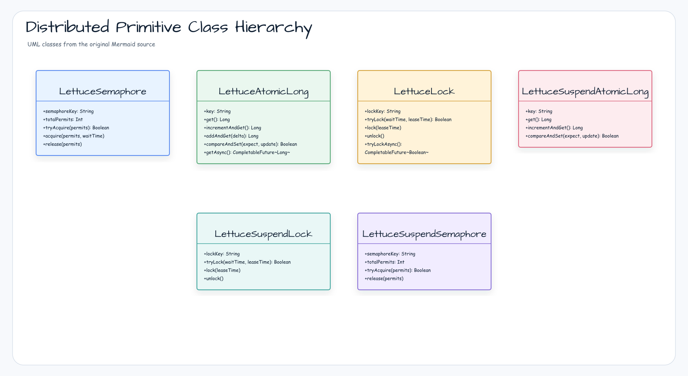
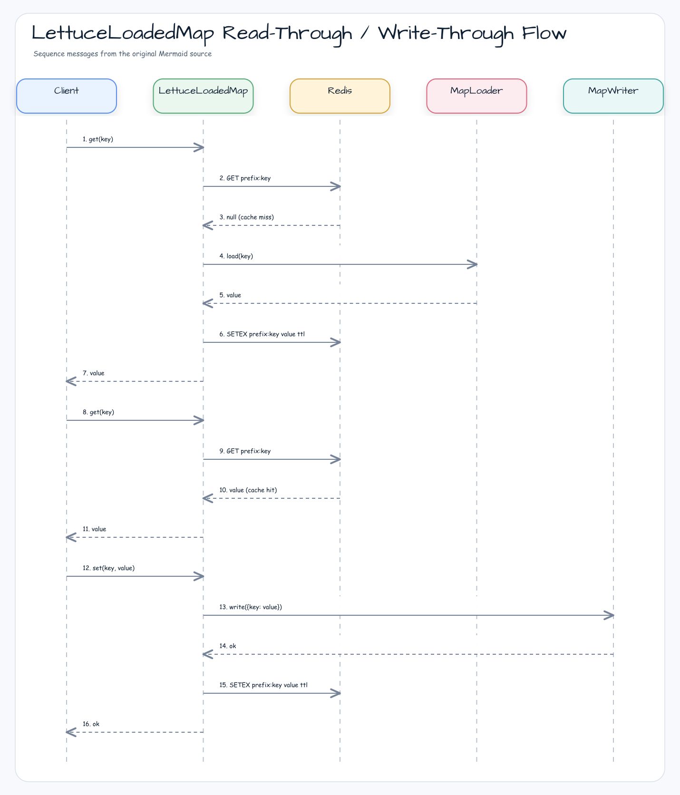
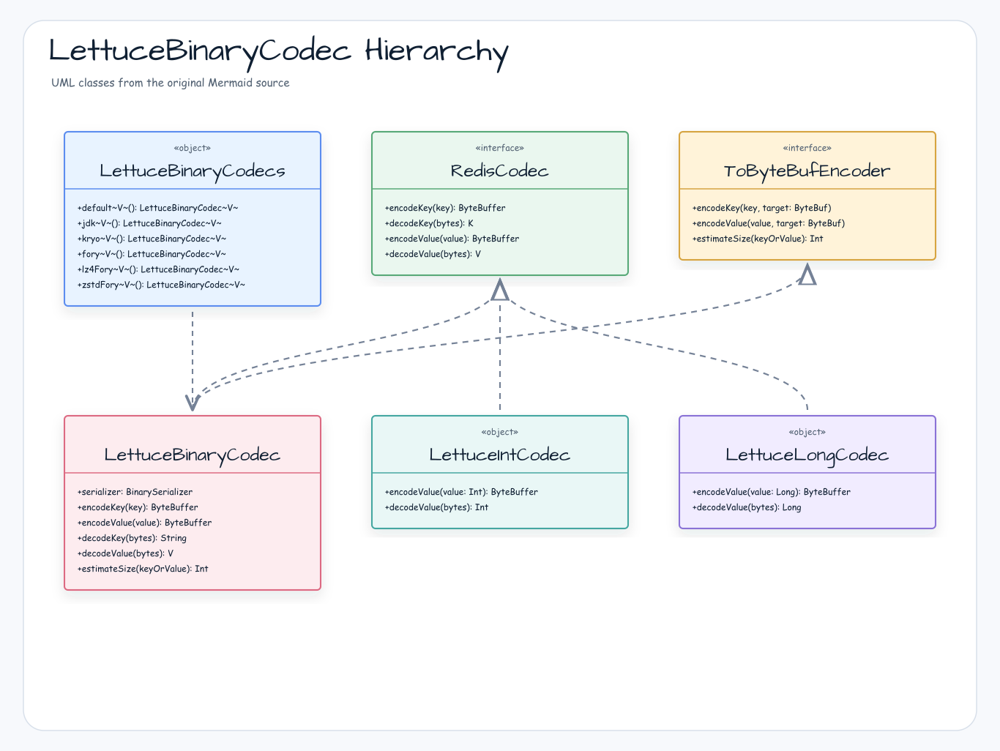

# bluetape4k-lettuce

[English](./README.md) | 한국어

Lettuce Redis 클라이언트를 Kotlin에서 편리하게 사용할 수 있도록 확장한 모듈입니다. 고성능 바이너리 Codec과 `RedisFuture` → Coroutines 어댑터를 제공합니다.

## 주요 기능

| 기능                                  | 설명                                                                                       |
|-------------------------------------|------------------------------------------------------------------------------------------|
| `LettuceClients`                    | `RedisClient` / `StatefulRedisConnection` 팩토리 및 커넥션 풀 관리                                 |
| `LettuceBinaryCodec<V>`             | `BinarySerializer` 기반 고성능 값 직렬화 Codec (Generic)                                          |
| `LettuceBinaryCodecs`               | 직렬화(Jdk/Kryo/Fory) × 압축(GZip/Deflate/LZ4/Snappy/Zstd) 조합 팩토리                             |
| `LettuceJsonCodec<V>`               | JSON 기반 값 직렬화 Codec (Jackson 3.x 또는 Fastjson2) — 사람이 읽을 수 있는 JSON 텍스트로 저장               |
| `LettuceJsonCodecs`                 | `jackson3<V>()` / `fastjson2<V>()` 팩토리 메서드 제공                                            |
| `LettuceIntCodec`                   | Int 값을 4바이트 big-endian으로 직렬화하는 Codec (Redisson `IntegerCodec`과 호환)                       |
| `LettuceLongCodec`                  | Long 값을 8바이트 big-endian으로 직렬화하는 Codec (Redisson `LongCodec`과 호환)                         |
| `RedisFuture` 확장                    | `awaitSuspending()` — `RedisFuture`를 suspend 함수로 변환                                      |
| `LettuceMap<V>`                     | Generic 분산 Hash Map (sync + async). 코루틴 버전: `LettuceSuspendMap<V>`                       |
| `LettuceSuspendMap<V>`              | Generic 분산 Hash Map (suspend 전용). `LettuceBinaryCodec<V>` 지원                             |
| `LettuceStringMap`                  | String 값 전용 분산 Hash Map (sync + async)                                                   |
| `LettuceSuspendStringMap`           | String 값 전용 분산 Hash Map (suspend 전용)                                                     |
| `LettuceAtomicLong`                 | 분산 AtomicLong (sync + async). 코루틴 버전: `LettuceSuspendAtomicLong`                         |
| `LettuceSuspendAtomicLong`          | 분산 AtomicLong (suspend 전용)                                                               |
| `LettuceSemaphore`                  | 분산 세마포어 (sync + async). 코루틴 버전: `LettuceSuspendSemaphore`                                |
| `LettuceSuspendSemaphore`           | 분산 세마포어 (suspend 전용)                                                                     |
| `LettuceLock`                       | 분산 뮤텍스 락 (sync + async). 코루틴 버전: `LettuceSuspendLock`                                    |
| `LettuceSuspendLock`                | 분산 뮤텍스 락 (suspend 전용)                                                                    |
| `LettuceMultiKeyLease`              | 제한된 same-slot 키 집합의 원자적 소유권 lease (sync + async)                                      |
| `LettuceSuspendMultiKeyLease`       | 제한된 same-slot 키 집합의 원자적 소유권 lease (suspend 전용)                                        |
| `LettuceFencingLease`               | 정렬 가능한 `(epoch, sequence)` token을 발급하는 config-bound Redis fencing lease (sync + async)       |
| `LettuceSuspendFencingLease`        | 정렬 가능한 `(epoch, sequence)` token을 발급하는 config-bound Redis fencing lease (suspend 전용)         |
| `LettuceHyperLogLog<V>`             | Redis HyperLogLog 근사 카디널리티 추정 (sync). 코루틴 버전: `LettuceSuspendHyperLogLog<V>`             |
| `LettuceSuspendHyperLogLog<V>`      | Redis HyperLogLog 근사 카디널리티 추정 (suspend 전용)                                               |
| `LettuceBloomFilter`                | Redis BitSet 기반 Bloom Filter (sync). 코루틴 버전: `LettuceSuspendBloomFilter`                 |
| `LettuceSuspendBloomFilter`         | Redis BitSet 기반 Bloom Filter (suspend 전용)                                                |
| `LettuceCuckooFilter`               | 삭제를 지원하는 Redis 기반 Cuckoo Filter (sync). 코루틴 버전: `LettuceSuspendCuckooFilter`             |
| `LettuceSuspendCuckooFilter`        | 삭제를 지원하는 Redis 기반 Cuckoo Filter (suspend 전용)                                             |
| `RedisScript`                       | SHA1을 미리 계산해 보관하는 재사용 Lua 스크립트. `EVALSHA` 우선 실행, `NOSCRIPT` 시 `EVAL` 자동 fallback        |
| `RedisScriptRunner`                 | `RedisScript`를 sync / async / suspend API로 실행하는 헬퍼 객체 (`EVALSHA`→`EVAL` fallback 내장)   |

Protobuf Codec은 `bluetape4k-protobuf` 모듈의
`io.bluetape4k.protobuf.serializers.redis.LettuceProtobufCodecs`에서 제공합니다.

압축하지 않는 `protobuf()`와 `trustedInternalProtobuf()` factory는 nullable target overload를 통해 Lettuce가
소유한 `ByteBuf`에 Protobuf message를 기록합니다. 성공 시 packed message 전체를 기록한 뒤에만 `writerIndex`를
commit합니다. Encode가 실패하면 index는 유지되지만 capacity 증가나 시도한 range의 bytes는 남을 수 있으므로
재사용 전에 해당 range를 clear/reinitialize하거나 buffer를 폐기해야 합니다. 단일 인자의 `ByteBuffer`
encode/decode, 압축 factory, 비 Protobuf fallback 값, custom-prefix serializer는 copied compatibility 경로를
유지합니다. 이는 실측 allocation 감소이며 zero-copy나 throughput 보장은 아닙니다. 자세한 수치는
[issue #757 근거](../../docs/benchmarks/2026-07-18-protobuf-buffer-allocation.md)를 참고하세요.

`LettuceBinaryCodec`은 nullable target-taking `encodeValue(value, target)` source extension seam만 제공하기 위해
open이며 일반 `RedisCodec` method는 final입니다. Class를 open하면 Kotlin이 생성한 JVM bridge도 override할 수
있으므로 subclass는 serializer의 wire와 trust 계약을 보존해야 합니다. 기존 factory caller는 migration이
필요하지 않습니다. Java에서는 `LettuceProtobufCodecs.INSTANCE.protobuf()`를 사용합니다.

### 호출자 소유 serializer target 계약

Built-in codec의 target-taking binary encode는 `serializeBinaryToStream`, target-taking JSON encode는
`serializeJsonToStream`을 호출합니다. 두 serializer interface 기본 구현은 allocating 호환 fallback이므로
direct stream 기록은 concrete serializer가 명시적으로 제공해야 합니다. Codec은 bounded absolute-index
writer를 통해 caller-owned `ByteBuf`를 동기 borrow하며 target을 retain, close, flush, release하지 않습니다.
Built-in 호출은 serializer 보고 count와 target snapshot을 검증하고 complete wire가 기록된 뒤 성공 시에만
`writerIndex`를 한 번 commit합니다.

Mutable target은 호출이 끝날 때까지 한 thread에 가두세요. Concurrent `readerIndex`, `writerIndex`, `refCnt`,
capacity boundary drift는 지원하지 않으며 fail-closed입니다. Codec은 concurrent mutation을 복구하지 않습니다.
Encode 실패 시 `writerIndex`는 commit되지 않지만 attempted bytes와 capacity growth가 남을 수 있습니다. 이
계약과 `release()`는 byte wipe를 보장하지 않습니다. Target의 full capacity를 logging하지 말고 재사용 전에
attempted range를 폐기/reinitialize하거나 allocator의 disposal policy를 따르세요.

`LettuceBinaryCodec.encodeValue(value, target)`만 지원되는 custom target override seam입니다. Subclass
override는 built-in의 count/snapshot/success-only commit 보장을 자동 상속하지 않으므로 wire와 trust 호환을
직접 보존해야 합니다. `LettuceJsonCodec`은 final이며 같은 custom seam이 없습니다. Decode는 bounded
read-only, non-array-backed `ByteBuffer` view를 `deserializeFrom`에 전달합니다. Custom serializer는 이 동기
borrow를 지원하거나 interface의 allocating 기본 구현을 상속해야 합니다.

[이슈 #756 근거](../../docs/benchmarks/2026-07-22-issue-756-lettuce-buffer-codec-allocation.md)는 측정
payload/기본 serializer config, pooled 512-byte pre-sized reusable heap/direct target, no-growth 경로에만
적용됩니다.

| Serializer | Heap | Direct | 주장 |
|---|---|---|---|
| JDK | accepted | accepted | 정확히 측정한 cell의 allocation 감소 |
| Kryo | accepted | accepted | 정확히 측정한 cell의 allocation 감소 |
| Jackson 2 | accepted | accepted | 정확히 측정한 cell의 allocation 감소 |
| Jackson 3 | inconclusive | inconclusive | ergonomic direct path 전용, allocation 주장 없음 |

단일 인자 encode, decode, 압축/Fory/Fastjson codec, 다른 payload, capacity growth, target 크기,
allocator/pooling 선택, zero-copy, throughput에는 일반화하지 마세요. Runtime auto-fallback, feature flag,
dispatch telemetry는 없습니다. 유지한 direct path에 결함이 있으면 previous artifact/codec deployment로
rollback합니다. Implementation이 바뀌면 allocation 주장을 재사용하기 전에 canonical run 두 번을 새로
수집해야 합니다.

`LettuceCacheConfig` 제약:

- `writeBehindBatchSize`, `writeBehindQueueCapacity`, `writeRetryAttempts`, `nearCacheMaxSize`는 0보다 커야 합니다.
- `ttl`, `nearCacheTtl`은 지정 시 0보다 커야 합니다.
- `keyPrefix`, `nearCacheName`은 공백일 수 없습니다.

> **Memoizer**는
`bluetape4k-cache-lettuce` 모듈로 이동되었습니다. 자세한 내용은 [cache-lettuce README](../../cache/cache-lettuce/README.ko.md)를 참조하세요.

## 성능 최적화

`LettuceClients`는 기본적으로 여러 성능 최적화가 적용되어 있습니다. 이 최적화들은 자동화된 self-improvement 벤치마크 루프(`LettuceThroughputBenchmark`, Testcontainers Redis에서 비동기 SET+GET 1만 회)를 통해 발견·검증되었습니다.

### Codec 벤치마크 결과

`LettuceCodecBenchmark` 기준 (JMH, Apple M4 Pro / GraalVM 21 / Warmup 3×2s / Measurement 5×3s / Fork 1 / 2026-04-27):

| Codec | ops/ms | ± 오차 |
|-------|-------:|-------:|
| **fastjson2** | **6,379** | ± 1,358 |
| **FastFory** | **3,286** | ± 142 |
| Fory | 2,551 | ± 2,001 |
| Kryo | 963 | ± 474 |
| LZ4FastFory | 906 | ± 66 |
| LZ4Fory | 852 | ± 39 |
| Jackson3 | 834 | ± 25 |
| LZ4Kryo | 535 | ± 16 |
| ZstdFastFory | 206 | ± 17 |
| ZstdFory | 203 | ± 5 |
| ZstdKryo | 136 | ± 3 |
| JDK | 132 | ± 13 |
| GzipFastFory | 110 | ± 2 |



> 전체 결과 및 분석: [Benchmark.md](./Benchmark.md) · [한국어](./Benchmark.ko.md)
> 실행: `./gradlew :bluetape4k-lettuce:benchmark`

### 커넥션 벤치마크 결과

| 최적화 기법 | ops/sec | 기준 대비 |
|---|---|---|
| 기본값 (튜닝 없음) | ~31,847 | — |
| + 공유 `DEFAULT_CLIENT_RESOURCES` (NCPU 스레드 풀) | 32,154 | +1% |
| + 전체 파이프라이닝 (`withPipeline{}` SET+GET) | 40,816 | +28% |
| + `SocketOptions` (keepAlive + tcpNoDelay) | 46,728 | +47% |
| **+ 통합 파이프라인 + `awaitAll()`** | **81,967** | **+157%** |



### 핵심 기법

#### 1. 공유 `DEFAULT_CLIENT_RESOURCES` (NCPU 스레드 풀)

`LettuceClients.clientOf(...)`를 통해 생성되는 모든 `RedisClient`는 NCPU 기반으로 튜닝된 단일 `ClientResources` 싱글톤을 공유합니다. 클라이언트마다 스레드를 새로 생성하는 오버헤드를 제거합니다.

#### 2. 튜닝된 `SocketOptions`

모든 클라이언트에 `keepAlive=true`, `tcpNoDelay=true`, `connectTimeout=5s`가 `ClientOptions`를 통해 자동 적용됩니다. 프로토콜 변경 없이 TCP 레벨 레이턴시를 줄입니다.

#### 3. `withPipeline{}` — 일괄 플러시 확장

```kotlin
import io.bluetape4k.redis.lettuce.withPipeline

// 모든 명령 발행 → 단일 플러시 → 결과는 외부에서 await
val (setFutures, getFutures) = connection.withPipeline { cmd ->
    val sets = (0 until count).map { i -> cmd.set("key:$i", value) }
    val gets = (0 until count).map { i -> cmd.get("key:$i") }
    sets to gets
}
setFutures.awaitAll()   // RedisFutureSupport의 Collection<RedisFuture>.awaitAll()
getFutures.awaitAll()
```

- 명령 발행 중 `autoFlushCommands`를 비활성화하고, 전체 배치에 대해 **단일 `flushCommands()`** 를 실행합니다
- SET과 GET을 **하나의 블록**으로 병합하여 페이즈 간 장벽을 제거합니다 (2번의 TCP 버스트 → 1번으로)
- `finally`에서 `autoFlushCommands(true)` 복원으로 안전 보장

#### 4. `Collection<RedisFuture>.awaitAll()` — 일괄 대기

```kotlin
import io.bluetape4k.redis.lettuce.awaitAll

// N×async{} 코루틴 생성 대신 CompletableFuture.allOf 단일 continuation 사용
val results: List<String?> = futures.awaitAll()
```

`futures.map { async { it.await() } }.awaitAll()` 대신 `RedisFutureSupport.awaitAll()`을 사용하세요. 전자는 Future마다 코루틴을 생성하는 반면, `awaitAll()`은 단일 `CompletableFuture.allOf` continuation을 사용합니다.

### 벤치마크에서 얻은 교훈

| 피해야 할 것 | 이유 |
|---|---|
| `ProtocolVersion.RESP3` + `TimeoutOptions.enabled()` + `REJECT_COMMANDS` | 고연산 localhost 환경에서 −12% — 명령당 오버헤드가 지배적 |
| 소형 ASCII 값에 `ByteArrayCodec` 사용 | −17% — Lettuce `StringCodec`의 ASCII 빠른 경로 + 버퍼 재사용이 64B에서 우세 |
| `withPipeline{}` 람다 내부에서 await | `flushCommands()`가 실행되지 않음 — 플러시 전에 코루틴이 suspend됨 |
| 부분 파이프라이닝 (SET만, GET 제외) | 파이프라이닝되지 않은 구간이 병목이 됨 |

## 의존성

```kotlin
// build.gradle.kts
dependencies {
    implementation("io.github.bluetape4k:bluetape4k-lettuce:$bluetape4kVersion")
}
```

## 다이어그램

### 분산 Primitive API 패밀리



### LettuceLoadedMap Read-Through / Write-Through 흐름



### Lettuce Codec API 구조



## 사용 예시

### RedisClient 생성 및 연결

```kotlin
import io.bluetape4k.redis.lettuce.LettuceClients

// URL로 클라이언트 생성
val client = LettuceClients.clientOf("redis://localhost:6379")

// Sync commands
val commands = LettuceClients.commands(client)
commands.set("key", "value")
val value = commands.get("key")

// Async commands
val asyncCommands = LettuceClients.asyncCommands(client)
val future = asyncCommands.get("key")

// Coroutines commands
val coCommands = LettuceClients.coroutinesCommands(client)
// suspend 함수이므로 코루틴 스코프 내에서 호출
val result = coCommands.get("key")

// 종료
LettuceClients.shutdown(client)
```

### 고성능 Codec으로 객체 저장

```kotlin
import io.bluetape4k.redis.lettuce.LettuceClients
import io.bluetape4k.redis.lettuce.codec.LettuceBinaryCodecs

data class User(val id: Long, val name: String)

val client = LettuceClients.clientOf("redis://localhost:6379")

// LZ4 + Fory 조합 (기본값, 가장 빠름)
val codec = LettuceBinaryCodecs.lz4Fory<User>()
val connection = LettuceClients.connect(client, codec)
val commands = connection.sync()

commands.set("user:1", User(1L, "Alice"))
val user = commands.get("user:1") // User(id=1, name="Alice")
```

### Primitive 타입 Codec (LettuceIntCodec / LettuceLongCodec)

Int, Long 원시 타입을 Redis에 효율적으로 저장할 때 사용합니다. Redisson의 `IntegerCodec` / `LongCodec`과 바이너리 호환됩니다.

```kotlin
import io.bluetape4k.redis.lettuce.codec.LettuceIntCodec
import io.bluetape4k.redis.lettuce.codec.LettuceLongCodec
import io.bluetape4k.redis.lettuce.map.LettuceMap

// Int 전용 연결
val intConnection = redisClient.connect(LettuceIntCodec)
val intCommands = intConnection.sync()

intCommands.set("counter", 42)
val count = intCommands.get("counter")  // 42

// Hash Map에도 사용 가능
intCommands.hset("scores", mapOf("alice" to 100, "bob" to 200))
val scores = intCommands.hgetall("scores")  // Map<String, Int>

// Long 전용 연결
val longConnection = redisClient.connect(LettuceLongCodec)
val longMap = LettuceMap<Long>(longConnection, "my-long-map")
longMap.put("seq", 1_000_000L)
val seq = longMap.get("seq")   // 1_000_000L
```

### RedisFuture를 Coroutines로 변환

```kotlin
import io.bluetape4k.redis.lettuce.awaitSuspending
import io.bluetape4k.redis.lettuce.awaitAll

// 단일 future
val value = asyncCommands.get("key").awaitSuspending()

// 다수 future 병렬 대기
val results = listOf(
    asyncCommands.get("key1"),
    asyncCommands.get("key2"),
    asyncCommands.get("key3"),
).awaitAll()
```

## Codec 조합표

### 바이너리 Codec (`LettuceBinaryCodecs`)

| 팩토리 메서드             | 직렬화  | 압축     |
|---------------------|------|--------|
| `jdk()`             | JDK  | 없음     |
| `kryo()`            | Kryo | 없음     |
| `fory()`            | Fory | 없음     |
| `lz4Fory()` *(기본값)* | Fory | LZ4    |
| `lz4Kryo()`         | Kryo | LZ4    |
| `zstdFory()`        | Fory | Zstd   |
| `snappyFory()`      | Fory | Snappy |
| `gzipFory()`        | Fory | GZip   |
| `fastFory()`        | FastFory | 없음     |
| `lz4FastFory()`     | FastFory | LZ4    |
| `zstdFastFory()`    | FastFory | Zstd   |
| `snappyFastFory()`  | FastFory | Snappy |
| `gzipFastFory()`    | FastFory | GZip   |

> **⚠️ 와이어 포맷 경고**: FastFory 코덱은 기본 Fory codec과 **호환되지 않으며** fallback이 없습니다. 휘발성 캐시 전용.

### JSON Codec (`LettuceJsonCodecs`)

사람이 읽을 수 있는 JSON 텍스트 저장. 디버깅이나 타 시스템과의 상호 운용성에 유용합니다.

```kotlin
import io.bluetape4k.redis.lettuce.codec.LettuceJsonCodecs

data class User(val id: Long, val name: String)

// Jackson 3.x JSON Codec
val jacksonCodec = LettuceJsonCodecs.jackson3<User>()
val jacksonConnection = redisClient.connect(jacksonCodec)
val cmds = jacksonConnection.sync()

cmds.set("user:1", User(1L, "Alice"))
val user = cmds.get("user:1")   // User(id=1, name="Alice")

// Fastjson2 JSON Codec
val fastjsonCodec = LettuceJsonCodecs.fastjson2<User>()
val fastjsonConnection = redisClient.connect(fastjsonCodec)
```

| 팩토리 메서드           | 직렬화       | 포맷  | 설명                        |
|-------------------|-----------|-----|---------------------------|
| `jackson3<V>()`   | Jackson 3 | JSON | Jackson ObjectMapper 기반  |
| `fastjson2<V>()`  | Fastjson2 | JSON | Fastjson2 JSON 기반         |

### Primitive Codec

| 클래스                | 키 타입   | 값 타입 | 인코딩             | Redisson 호환    |
|--------------------|--------|------|-----------------|----------------|
| `LettuceIntCodec`  | String | Int  | 4바이트 big-endian | `IntegerCodec` |
| `LettuceLongCodec` | String | Long | 8바이트 big-endian | `LongCodec`    |

## 분산 Primitive

### LettuceMap\<V\> — Generic 분산 Hash Map

```kotlin
import io.bluetape4k.redis.lettuce.codec.LettuceBinaryCodecs
import io.bluetape4k.redis.lettuce.map.LettuceMap
import io.bluetape4k.redis.lettuce.map.LettuceSuspendMap

data class Product(val id: Long, val name: String)

// LZ4 + Fory 코덱으로 연결
val codec = LettuceBinaryCodecs.lz4Fory<Product>()
val connection = redisClient.connect(codec)

// 동기/비동기
val map = LettuceMap<Product>(connection, "products")
map.put("p1", Product(1L, "Widget"))
val product = map.get("p1")                        // Product?
val all = map.entries()                             // Map<String, Product>
map.getAsync("p1").thenAccept { println(it) }      // CompletableFuture

// 코루틴 전용
val suspendMap = LettuceSuspendMap<Product>(connection, "products")
val p = suspendMap.get("p1")                       // suspend fun
suspendMap.put("p2", Product(2L, "Gadget"))
```

> **String 기본값 이유**: Lettuce 기본 코덱은 `StringCodec.UTF8`입니다.
> `LettuceMap<V>`처럼 단순 저장/조회(HGET/HSET)는 바이너리 코덱 사용이 가능하지만,
> `LettuceAtomicLong`/`LettuceSemaphore`는 Redis의 `INCR`/`DECR` 명령이 10진수 문자열을 요구하므로
> `StatefulRedisConnection<String, String>`만 사용해야 합니다.

### LettuceAtomicLong — 분산 AtomicLong

```kotlin
import io.bluetape4k.redis.lettuce.atomic.LettuceAtomicLong
import io.bluetape4k.redis.lettuce.atomic.LettuceSuspendAtomicLong

// 동기/비동기
val counter = LettuceAtomicLong(connection, "my-counter", initialValue = 0L)
counter.incrementAndGet()        // 1L
counter.addAndGet(5L)            // 6L
counter.compareAndSet(6L, 10L)   // true

// 코루틴 전용
val suspendCounter = LettuceSuspendAtomicLong(connection, "my-counter")
suspendCounter.incrementAndGet()
suspendCounter.addAndGet(5L)
```

### LettuceSemaphore — 분산 세마포어

```kotlin
import io.bluetape4k.redis.lettuce.semaphore.LettuceSemaphore
import io.bluetape4k.redis.lettuce.semaphore.LettuceSuspendSemaphore

// 동기/비동기
val semaphore = LettuceSemaphore(connection, "my-semaphore", totalPermits = 3)
semaphore.initialize()
if (semaphore.tryAcquire()) {
    try { doWork() } finally { semaphore.release() }
}

// 코루틴 전용
val suspendSemaphore = LettuceSuspendSemaphore(connection, "my-semaphore", totalPermits = 3)
if (suspendSemaphore.tryAcquire()) {
    try { doWork() } finally { suspendSemaphore.release() }
}
```

### LettuceLock — 분산 뮤텍스 락

```kotlin
import io.bluetape4k.redis.lettuce.lock.LettuceLock
import io.bluetape4k.redis.lettuce.lock.LettuceSuspendLock

// 동기/비동기
val lock = LettuceLock(connection, "my-lock")
if (lock.tryLock(waitTime = 5.seconds)) {
    try { doWork() } finally { lock.unlock() }
}

// 코루틴 전용
val suspendLock = LettuceSuspendLock(connection, "my-lock")
if (suspendLock.tryLock(waitTime = 5.seconds)) {
    try { doWork() } finally { suspendLock.unlock() }
}
```

<!-- multi-key-lease:basic -->
### 다중 키 소유권 Lease

`LettuceMultiKeyLease`는 제한된 키 집합에 대해 한 소유자를 원자적으로 조정합니다. 모든 키는 동일한 Redis
Cluster slot에 매핑되어야 하며, shared hash tag가 이를 보장하는 일반적인 방법입니다. lease는 advisory
single-writer guard입니다. 영속적인 비즈니스 불변식은 database 또는 다른 authoritative store에 유지해야 합니다.

```kotlin
import io.bluetape4k.redis.lettuce.lease.LettuceMultiKeyLease
import io.bluetape4k.redis.lettuce.lease.MultiKeyAcquireResult
import java.time.Duration
import java.util.UUID

val lease = LettuceMultiKeyLease(connection)
val keys = listOf(
    "ticket:{sale-42}:inflight:ip:$ipDigest",
    "ticket:{sale-42}:inflight:user:$userDigest",
)
val ownerToken = UUID.randomUUID().toString()
when (val result = lease.acquire(keys, ownerToken, Duration.ofSeconds(10))) {
    MultiKeyAcquireResult.Acquired -> startWorkflow()
    is MultiKeyAcquireResult.AlreadyOwned -> recoverExistingAttempt(result.minimumPttlMillis)
    is MultiKeyAcquireResult.PartialOwnership -> reconcileWithDurableAuthority(result.counts)
    is MultiKeyAcquireResult.Conflicted -> reject(result.counts)
}
```

고엔트로피 owner token은 retry decorator 밖에서 한 번 생성하고 모든 attempt에서 재사용합니다. Acquire만
same-token deterministic replay(`AlreadyOwned`)를 제공합니다.

<!-- multi-key-lease:resilience -->
#### Retry, Circuit Breaker, Bulkhead

resilience policy는 lease 외부에 둡니다. 모호한 transport failure만 retry하고 validation, cancellation,
integrity exception, domain result는 retry하지 않습니다.

```kotlin
val retryable: (Throwable) -> Boolean = {
    it is IOException || it is RedisConnectionException || it is RedisCommandTimeoutException
}
val retry = Retry.of(
    "ticket-lease",
    RetryConfig.custom<Any?>()
        .maxAttempts(2)
        .waitDuration(Duration.ofMillis(50))
        .retryOnException(retryable)
        .build(),
)
val circuitBreaker = CircuitBreaker.of(
    "ticket-lease",
    CircuitBreakerConfig.custom()
        .slidingWindowSize(20)
        .minimumNumberOfCalls(10)
        .failureRateThreshold(50.0F)
        .recordException(retryable)
        .ignoreException { it is CancellationException }
        .build(),
)
val bulkhead = Bulkhead.of(
    "ticket-lease",
    BulkheadConfig.custom()
        .maxConcurrentCalls(32)
        .maxWaitDuration(Duration.ofMillis(100))
        .build(),
)

val ownerToken = UUID.randomUUID().toString() // decorator 밖에서 한 번만 생성
val result = SuspendDecorators.ofSupplier {
    suspendLease.acquire(keys, ownerToken, Duration.ofSeconds(10))
}
    .withRetry(retry)
    .withCircuitBreaker(circuitBreaker)
    .withBulkhead(bulkhead)
    .invoke()
```

production retry backoff는 제한된 non-zero 값이어야 합니다. `Duration.ZERO`는 deterministic test에서만
사용합니다. 위 decorator 순서는 Retry -> CircuitBreaker -> Bulkhead로 의도된 순서입니다.

<!-- multi-key-lease:recovery -->
#### Result와 모호한 완료 복구

```kotlin
suspend fun recoverAfterAmbiguousMutation(
    lease: LettuceSuspendMultiKeyLease,
    keys: List<String>,
    ownerToken: String,
): MultiKeyInspectResult = lease.inspect(keys, ownerToken)
```

| Operation | 전체 result | Caller 조치 |
|---|---|---|
| acquire | `Acquired`, `AlreadyOwned`, `PartialOwnership`, `Conflicted` | 계속/replay하거나 reconcile/reject합니다. partial/conflict result에서는 mutation이 없습니다. |
| inspect | `Owned`, `Lost`, `PartialOwnership`, `Conflicted` | `Owned`를 현재 증거로 사용하고 partial/conflict 상태를 reconcile합니다. |
| renew | `Renewed`, `PartialLoss`, `Lost`, `OwnershipMismatch` | `PartialLoss`/`OwnershipMismatch`를 durable authority와 reconcile합니다. |
| release | `Released`, `PartialRelease`, `Lost`, `OwnershipMismatch` | `PartialRelease`/`OwnershipMismatch`를 durable authority와 reconcile합니다. |

모든 counts는 mutation 전 관찰한 소유권입니다. renew 또는 release 완료가 모호하면 새 token이 아니라 같은
token으로 먼저 inspect합니다. `Lost`만으로는 이전 release 성공과 expiry를 구분할 수 없습니다. 반환된
`CompletableFuture`를 cancel해도 caller wait만 취소되며 upstream 또는 Redis server execution 취소를 증명하지
않습니다. 이 결과도 모호한 완료로 취급하고 같은 token으로 복구합니다.

<!-- multi-key-lease:security-telemetry -->
#### 보안과 Telemetry

owner token은 credential이 아닙니다. JWT, session token, 사용자 식별자, PII를 재사용하지 마십시오. Redis는
owner token을 plaintext로 저장하므로 Redis ACL과 TLS가 실제 보안 경계입니다. Metric dimension은 제한된
`operation`, `result`, `exception`만 허용하며 key/token은 log, trace, metric label에 절대 기록하지 않습니다.

<!-- multi-key-lease:migration -->
#### Cutover와 Rollback

1. production key가 shared slot인지 확인하고 durable database guard를 유지합니다.
2. 기존 writer를 중지합니다.
3. 기존 최대 TTL만큼 drain하거나 기존 token으로 정리합니다.
4. 같은 namespace, hash-tag, token 계약으로 새 writer를 활성화합니다.
5. dual-write를 금지합니다.
6. rollback은 역순으로 새 writer 중지, drain 또는 정리, durable authority 확인, 기존 writer 재활성화를 수행합니다.

<!-- multi-key-lease:lost-token -->
#### Token 유실 Persistent-Key Runbook

예상 owner token을 가진 persistent key는 `MultiKeyLeaseIntegrityException`을 발생시킵니다. 운영 승인을 받아
exact namespace/key 집합을 확인한 뒤 그 집합만 수동 삭제하거나 namespace를 교체하고, writer를 활성화하기
전에 Redis 상태와 durable authority를 다시 검증합니다.

<!-- fencing-lease:basic -->
### Downstream Stale Writer 차단을 위한 Fencing Lease

불투명한 advisory ownership guard만 필요하면 `LettuceMultiKeyLease`를 사용합니다. 보호 대상 downstream
resource가 정렬 token을 영속 저장하고 strict compare할 때만 `LettuceFencingLease` 또는
`LettuceSuspendFencingLease`를 사용합니다. `LettuceFencingLeaseConfig(namespace, resourceName, epoch)`는 인스턴스
생성 시 하나의 ordering domain을 고정합니다. 파생된 lease/counter key는 동일한 Redis Cluster slot을 사용합니다.

`epoch`은 durable external authority가 발급합니다. 새로 승인된 epoch에만 `bootstrap`을 명시적으로 호출합니다.
Acquire가 `CounterUnavailable`을 반환해도 bootstrap 권한이 생기지 않습니다. acquire를 중지하고 최초 배포인지
history loss인지 판정해야 합니다. Counter 유실 뒤 같은 epoch를 bootstrap하거나 binary rollback/restore recovery에서
epoch를 낮추면 안 됩니다. Token은 `(epoch, sequence)`만 가지며 resource identity를 포함하지 않습니다.

<!-- fencing-lease:downstream-guard -->
#### Durable Downstream Tuple Guard

Stable resource identity와 token의 두 field를 함께 저장합니다. PostgreSQL-style migration과 strict update 예시:

```sql
ALTER TABLE guarded_resource
    ADD COLUMN fence_epoch BIGINT NOT NULL DEFAULT 0,
    ADD COLUMN fence_sequence BIGINT NOT NULL DEFAULT 0;

UPDATE guarded_resource
SET fence_epoch = :epoch,
    fence_sequence = :sequence,
    payload = :payload
WHERE id = :id
  AND (fence_epoch, fence_sequence) < (:epoch, :sequence);
```

`affectedRows == 1`일 때만 write를 승인합니다. `0`은 같은 token 또는 stale token을 거절한 것입니다. Business
idempotency key는 별도 column과 policy로 관리합니다. Fencing order와 business idempotency는 서로 다른 문제입니다.

<!-- fencing-lease:resilience -->
#### Caller-Owned Retry, Circuit Breaker, Bulkhead

Primitive는 backend failure를 result value로 반환합니다. `FencingAcquireResult.BackendFailure`만 retry하고, 모호하게
성공한 acquire가 새 token 발급 대신 `AlreadyOwned`가 되도록 같은 owner ID를 재사용합니다. Validation,
cancellation, protocol exception은 caller layer에서 retry나 circuit breaker 기록 없이 빠져나가야 합니다. 다음
decorator chain은 의도된 순서입니다. Retry가 가장 안쪽이고 CircuitBreaker는 최종 result 한 번만 보며 Bulkhead가
가장 바깥쪽입니다.

```kotlin
val retry = Retry.of(
    "fencing-acquire",
    RetryConfig.custom<FencingAcquireResult>()
        .maxAttempts(2)
        .waitDuration(Duration.ofMillis(50))
        .retryOnResult { it is FencingAcquireResult.BackendFailure }
        .retryOnException { false }
        .build(),
)
val circuitBreaker = CircuitBreaker.of(
    "fencing-acquire",
    CircuitBreakerConfig.custom()
        .slidingWindowSize(20)
        .minimumNumberOfCalls(10)
        .failureRateThreshold(50.0F)
        .recordResult { it is FencingAcquireResult.BackendFailure }
        .ignoreException { true }
        .build(),
)
val bulkhead = Bulkhead.of(
    "fencing-acquire",
    BulkheadConfig.custom()
        .maxConcurrentCalls(32)
        .maxWaitDuration(Duration.ofMillis(100))
        .build(),
)

val result = SuspendDecorators.ofSupplier {
    lease.acquire(ownerId, leaseTime)
}
    .withRetry(retry)
    .withCircuitBreaker(circuitBreaker)
    .withBulkhead(bulkhead)
    .invoke()
```

Production backoff는 bounded non-zero 값이어야 합니다. Bootstrap, inspect, renew, release에도 operation별
`BackendFailure` predicate만 적용하고 Redis primitive 내부에 retry loop를 추가하지 않습니다.

<!-- fencing-lease:recovery -->
#### Epoch Recovery와 Rollback

Promotion, known-old backup restore 같은 external history-loss signal은 다음 control-plane 순서를 요구합니다.

```text
pause -> block old acquire -> drain lease and downstream writer -> CAS bump epoch ->
bootstrap -> verify readiness and tuple guard -> rollout -> confirm old absence -> resume
```

CAS allocator는 durable해야 하며 정확히 하나의 higher epoch만 허용해야 합니다. Readiness는 counter가 string이고
`PTTL=-1`이며 canonical non-negative decimal이고 downstream strict tuple guard가 활성화된 경우에만 통과합니다.
Mixed epoch이면 abort합니다. 이전 binary나 lower epoch를 resume하지 않습니다. Downstream에 higher epoch가 이미
저장됐다면 sequence가 더 크더라도 restore된 lower-epoch token을 모두 거절해야 합니다.

<!-- fencing-lease:diagnostics -->
#### Bounded Read-Only 진단과 수동 복구

다음 fixed-two-key Lua를 `EVAL_RO`로 실행하고 exact derived lease key, counter key, expected epoch만 전달합니다.
결과는 stable classification과 bounded lease-only repair-candidate boolean입니다. Owner, token, key, stored value를
반환하지 않으며 `KEYS`, `SCAN`, `HGETALL`도 사용하지 않습니다.

```lua
local counter_type = redis.call('TYPE', KEYS[2])['ok']
if counter_type == 'none' then return {'COUNTER_MISSING', '0'} end
if counter_type ~= 'string' then return {'COUNTER_INVALID', '0'} end
if redis.call('PTTL', KEYS[2]) ~= -1 then return {'COUNTER_INVALID', '0'} end
local counter_length = redis.call('STRLEN', KEYS[2])
if counter_length < 1 or counter_length > 19 then return {'COUNTER_INVALID', '0'} end
local counter = redis.call('GET', KEYS[2])
local counter_valid = counter == '0' or string.match(counter, '^[1-9][0-9]*$')
counter_valid = counter_valid and (#counter < 19 or counter <= '9223372036854775807')
if not counter_valid then return {'COUNTER_INVALID', '0'} end

local lease_type = redis.call('TYPE', KEYS[1])['ok']
if lease_type == 'none' then return {'CLEAN', '0'} end
if lease_type ~= 'hash' then return {'LEASE_MALFORMED', '0'} end
if redis.call('HLEN', KEYS[1]) ~= 3 then return {'LEASE_MALFORMED', '0'} end
local owner_length = redis.call('HSTRLEN', KEYS[1], 'owner')
local epoch_length = redis.call('HSTRLEN', KEYS[1], 'epoch')
local sequence_length = redis.call('HSTRLEN', KEYS[1], 'sequence')
if owner_length < 1 or owner_length > 256 or epoch_length < 1 or epoch_length > 19 or
   sequence_length < 1 or sequence_length > 19 then
    return {'LEASE_MALFORMED', '0'}
end
local fields = redis.call('HMGET', KEYS[1], 'owner', 'epoch', 'sequence')
local epoch = fields[2]
local sequence = fields[3]
if not string.match(epoch, '^[1-9][0-9]*$') then return {'LEASE_MALFORMED', '0'} end
if not string.match(sequence, '^[1-9][0-9]*$') then return {'LEASE_MALFORMED', '0'} end
if epoch ~= ARGV[1] then return {'LEASE_MALFORMED', '0'} end
if #epoch > 19 or (#epoch == 19 and epoch > '9223372036854775807') then
    return {'LEASE_MALFORMED', '0'}
end
if #sequence > 19 or (#sequence == 19 and sequence > '9223372036854775807') then
    return {'LEASE_MALFORMED', '0'}
end
if #counter < #sequence or (#counter == #sequence and counter < sequence) then
    return {'COUNTER_BEHIND_LEASE', '0'}
end
if redis.call('PTTL', KEYS[1]) == -1 then return {'LEASE_NO_TTL', '1'} end
return {'ACTIVE', '0'}
```

수동 delete는 네 조건을 모두 만족할 때만 허용합니다. Incident가 pause되고 old acquire가 차단돼야 합니다. Lease와
downstream writer가 모두 drain돼야 합니다. Counter는 valid, persistent이며 lease보다 뒤처지면 안 됩니다. 마지막으로
exact classification이 `LEASE_NO_TTL`이어야 합니다. Lease key만 삭제합니다. Counter를 delete, decrement, expire,
recreate하면 안 됩니다.

운영 mapping: `CounterUnavailable`은 acquire를 pause하고 history를 진단합니다. `IntegrityFailure`는 모든 mutation을
pause하고 이 read-only diagnostic과 runbook을 실행합니다. `SequenceExhausted`는 higher-epoch cutover를 시작합니다.
`BackendFailure`는 operation별 ambiguous completion을 reconcile합니다. External restore/promotion signal은 즉시 전체
pause-to-cutover 순서를 시작합니다.

<!-- fencing-lease:caller-actions -->
#### 전체 Result별 Caller 조치

| Result | Required caller action |
|---|---|
| `Initialized`, `AlreadyInitialized` | Readiness를 확인한 뒤 승인된 epoch rollout만 계속합니다. |
| `Acquired`, `AlreadyOwned`, `Owned`, `Renewed` | 정상 ownership 경로를 계속하고 token을 stable resource/domain identity와 함께 저장합니다. |
| `Released` | Local ownership을 폐기하고 downstream write를 금지합니다. |
| acquire `Contended` | TTL 또는 bounded backoff 뒤 새 owner로 시도하며 backend retry로 취급하지 않습니다. |
| inspect `Contended` | Local ownership을 폐기하고 downstream write를 금지합니다. |
| `Lost`, `OwnershipMismatch` | Local ownership을 폐기하고 downstream write를 금지합니다. |
| `CounterUnavailable` | Acquire를 중지하고 최초 배포인지 history loss인지 판정하며 result만 보고 bootstrap하지 않습니다. |
| `SequenceExhausted` | Retry하지 않고 higher-epoch cutover를 alert하며 max epoch이면 domain을 freeze/migrate합니다. |
| `IntegrityFailure` | Retry와 mutation을 중지하고 read-only diagnosis와 승인된 runbook을 실행합니다. |
| `BackendFailure` | Operation별 ambiguous completion을 reconcile하며 policy retry는 같은 owner/token을 사용합니다. |

<!-- fencing-lease:security-telemetry -->
#### 보안과 Telemetry

Owner ID는 Redis에 저장되는 capability material입니다. High-entropy 값을 만들고 credential, JWT, session token,
사용자 식별자, PII를 재사용하지 않습니다. Redis ACL과 TLS를 사용합니다. Log에는 allowlisted operation, result,
backend-or-integrity kind, bounded domain fingerprint만 허용합니다. Metric label은 `operation`, `result`, `kind`만
사용하며 `namespace/resource/owner/token/fingerprint`는 금지된 metric-label dimension입니다.

<!-- fencing-lease:limitations -->
#### 보장 범위와 비보장 범위

Primitive는 config-bound domain 안에서 atomic Redis lease mutation과 monotonically ordered token을 제공합니다.
exactly-once 실행, business idempotency, durable correctness, 자동 database fencing, durable epoch allocation,
topology failure detection, 자동 recovery는 제공하지 않습니다. 이는 caller와 operator 책임입니다. Fencing lease는
multi-key ownership lease를 보완하며 자동 대체하지 않습니다.

## Memoizer (함수 결과 Redis 캐싱)

> Memoizer는
`bluetape4k-cache-lettuce` 모듈에 위치합니다. 자세한 사용법은 [cache-lettuce README](../../cache/cache-lettuce/README.ko.md)를 참조하세요.

```kotlin
// build.gradle.kts
dependencies {
    implementation("io.github.bluetape4k:bluetape4k-cache-lettuce:$bluetape4kVersion")
}
```

## 확률 자료구조

### LettuceHyperLogLog<V> - 근사 카디널리티 추정

```kotlin
import io.bluetape4k.redis.lettuce.LettuceClients
import io.bluetape4k.redis.lettuce.hll.LettuceHyperLogLog
import io.bluetape4k.redis.lettuce.hll.LettuceSuspendHyperLogLog
import io.lettuce.core.codec.StringCodec

val connection = LettuceClients.connect(client, StringCodec.UTF8)

val hll = LettuceHyperLogLog(connection, "unique-visitors")
hll.add("user:1", "user:2", "user:3")
val count = hll.count()

val suspendHll = LettuceSuspendHyperLogLog(connection, "unique-visitors-suspend")
```

### LettuceBloomFilter - 존재 가능성 검사

```kotlin
import io.bluetape4k.redis.lettuce.LettuceClients
import io.bluetape4k.redis.lettuce.filter.BloomFilterOptions
import io.bluetape4k.redis.lettuce.filter.LettuceBloomFilter
import io.lettuce.core.codec.StringCodec

val bloomFilter = LettuceBloomFilter(
    connection = LettuceClients.connect(client, StringCodec.UTF8),
    filterName = "email-blacklist",
    options = BloomFilterOptions(expectedInsertions = 1_000_000L, falseProbability = 0.01),
)

bloomFilter.tryInit()
bloomFilter.add("spam@evil.com")
val mightContain = bloomFilter.contains("spam@evil.com")
```

### LettuceCuckooFilter - 삭제 가능한 확률 필터

```kotlin
import io.bluetape4k.redis.lettuce.LettuceClients
import io.bluetape4k.redis.lettuce.filter.CuckooFilterOptions
import io.bluetape4k.redis.lettuce.filter.LettuceCuckooFilter
import io.lettuce.core.codec.StringCodec

val cuckooFilter = LettuceCuckooFilter(
    connection = LettuceClients.connect(client, StringCodec.UTF8),
    filterName = "dedup-ids",
    options = CuckooFilterOptions(capacity = 100_000L, bucketSize = 4),
)

cuckooFilter.tryInit()
cuckooFilter.insert("order:123")
val exists = cuckooFilter.contains("order:123")
cuckooFilter.delete("order:123")
```

Bloom Filter와 Cuckoo Filter는 같은 이름을 다른 옵션으로 재초기화하면
`IllegalStateException`을 던져 구성 불일치를 차단합니다. Cuckoo Filter는 삽입 실패 시 undo-log 기반 Lua 스크립트로 기존 원소 유실을 방지합니다.

## 빌드 및 테스트

테스트 실행 시 Redis 서버(기본값: `localhost:6379`)가 필요합니다.
[Testcontainers](../testing/testcontainers)를 통해 Docker 기반으로 자동 구성됩니다.

```bash
./gradlew :bluetape4k-lettuce:test
```
