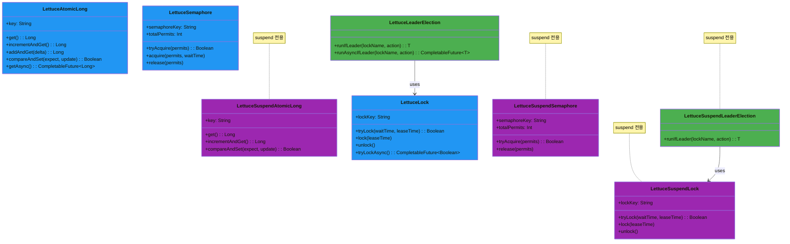
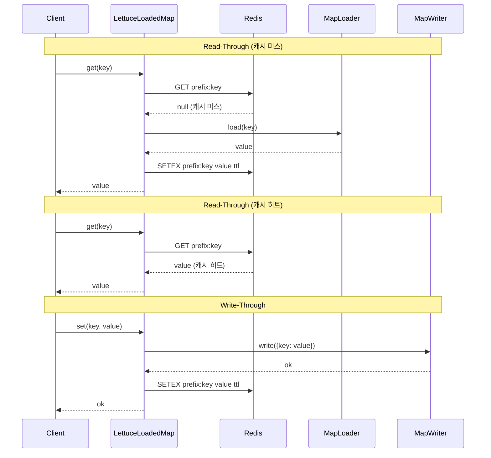
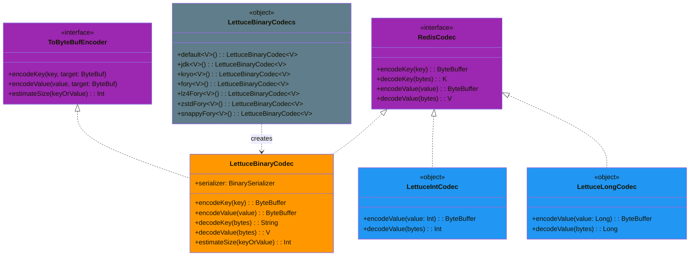

# bluetape4k-lettuce

Lettuce Redis 클라이언트를 Kotlin에서 편리하게 사용할 수 있도록 확장한 모듈입니다. 고성능 바이너리 Codec과 `RedisFuture` → Coroutines 어댑터를 제공합니다.

## 주요 기능

| 기능                                  | 설명                                                                                       |
|-------------------------------------|------------------------------------------------------------------------------------------|
| `LettuceClients`                    | `RedisClient` / `StatefulRedisConnection` 팩토리 및 커넥션 풀 관리                                 |
| `LettuceBinaryCodec<V>`             | `BinarySerializer` 기반 고성능 값 직렬화 Codec (Generic)                                          |
| `LettuceBinaryCodecs`               | 직렬화(Jdk/Kryo/Fory) × 압축(GZip/Deflate/LZ4/Snappy/Zstd) 조합 팩토리                             |
| `LettuceIntCodec`                   | Int 값을 4바이트 big-endian으로 직렬화하는 Codec (Redisson `IntegerCodec`과 호환)                       |
| `LettuceLongCodec`                  | Long 값을 8바이트 big-endian으로 직렬화하는 Codec (Redisson `LongCodec`과 호환)                         |
| `LettuceProtobufCodecs`             | Protobuf 기반 Codec 팩토리 (`bluetape4k-protobuf` 필요)                                         |
| `RedisFuture` 확장                    | `awaitSuspending()` — `RedisFuture`를 suspend 함수로 변환                                      |
| `LettuceMap<V>`                     | Generic 분산 Hash Map (sync + async). 코루틴 버전: `LettuceSuspendMap<V>`                       |
| `LettuceSuspendMap<V>`              | Generic 분산 Hash Map (suspend 전용). `LettuceBinaryCodec<V>` 지원                             |
| `LettuceStringMap`                  | String 값 전용 분산 Hash Map (sync + async)                                                   |
| `LettuceSuspendStringMap`           | String 값 전용 분산 Hash Map (suspend 전용)                                                     |
| `LettuceAtomicLong`                 | 분산 AtomicLong (sync + async). 코루틴 버전: `LettuceSuspendAtomicLong`                         |
| `LettuceSuspendAtomicLong`          | 분산 AtomicLong (suspend 전용)                                                               |
| `LettuceSemaphore`                  | 분산 세마포어 (sync + async). 코루틴 버전: `LettuceSuspendSemaphore`                                |
| `LettuceSuspendSemaphore`           | 분산 세마포어 (suspend 전용)                                                                     |
| `LettuceLock`                       | 분산 뮤텍스 락 (sync + async). 코루틴 버전: `LettuceSuspendLock`                                    |
| `LettuceSuspendLock`                | 분산 뮤텍스 락 (suspend 전용)                                                                    |
| `LettuceLeaderElection`             | 분산 단일 리더 선출 (sync + async). 코루틴 버전: `LettuceSuspendLeaderElection`                       |
| `LettuceSuspendLeaderElection`      | 분산 단일 리더 선출 (suspend 전용)                                                                 |
| `LettuceLeaderGroupElection`        | 분산 그룹 리더 선출 — 최대 N개 동시 리더 허용 (sync + async). 코루틴 버전: `LettuceSuspendLeaderGroupElection` |
| `LettuceSuspendLeaderGroupElection` | 분산 그룹 리더 선출 (suspend 전용)                                                                 |
| `LettuceHyperLogLog<V>`             | Redis HyperLogLog 근사 카디널리티 추정 (sync). 코루틴 버전: `LettuceSuspendHyperLogLog<V>`             |
| `LettuceSuspendHyperLogLog<V>`      | Redis HyperLogLog 근사 카디널리티 추정 (suspend 전용)                                               |
| `LettuceBloomFilter`                | Redis BitSet 기반 Bloom Filter (sync). 코루틴 버전: `LettuceSuspendBloomFilter`                 |
| `LettuceSuspendBloomFilter`         | Redis BitSet 기반 Bloom Filter (suspend 전용)                                                |
| `LettuceCuckooFilter`               | 삭제를 지원하는 Redis 기반 Cuckoo Filter (sync). 코루틴 버전: `LettuceSuspendCuckooFilter`             |
| `LettuceSuspendCuckooFilter`        | 삭제를 지원하는 Redis 기반 Cuckoo Filter (suspend 전용)                                             |

`LettuceCacheConfig` 제약:
- `writeBehindBatchSize`, `writeBehindQueueCapacity`, `writeRetryAttempts`, `nearCacheMaxSize`는 0보다 커야 합니다.
- `ttl`, `nearCacheTtl`은 지정 시 0보다 커야 합니다.
- `keyPrefix`, `nearCacheName`은 공백일 수 없습니다.

> **Memoizer**는 `bluetape4k-cache-lettuce` 모듈로 이동되었습니다. 자세한 내용은 [cache-lettuce README](../cache-lettuce/README.md)를 참조하세요.

## 의존성

```kotlin
// build.gradle.kts
dependencies {
    implementation("io.github.bluetape4k:bluetape4k-lettuce:$bluetape4kVersion")
}
```

## 사용 예시

### RedisClient 생성 및 연결

```kotlin
import io.bluetape4k.redis.lettuce.LettuceClients

// URL로 클라이언트 생성
val client = LettuceClients.clientOf("redis://localhost:6379")

// Sync commands
val commands = LettuceClients.commands(client)
commands.set("key", "value")
val value = commands.get("key")

// Async commands
val asyncCommands = LettuceClients.asyncCommands(client)
val future = asyncCommands.get("key")

// Coroutines commands
val coCommands = LettuceClients.coroutinesCommands(client)
// suspend 함수이므로 코루틴 스코프 내에서 호출
val result = coCommands.get("key")

// 종료
LettuceClients.shutdown(client)
```

### 고성능 Codec으로 객체 저장

```kotlin
import io.bluetape4k.redis.lettuce.LettuceClients
import io.bluetape4k.redis.lettuce.codec.LettuceBinaryCodecs

data class User(val id: Long, val name: String)

val client = LettuceClients.clientOf("redis://localhost:6379")

// LZ4 + Fory 조합 (기본값, 가장 빠름)
val codec = LettuceBinaryCodecs.lz4Fory<User>()
val connection = LettuceClients.connect(client, codec)
val commands = connection.sync()

commands.set("user:1", User(1L, "Alice"))
val user = commands.get("user:1") // User(id=1, name="Alice")
```


### Primitive 타입 Codec (LettuceIntCodec / LettuceLongCodec)

Int, Long 원시 타입을 Redis에 효율적으로 저장할 때 사용합니다. Redisson의 `IntegerCodec` / `LongCodec`과 바이너리 호환됩니다.

```kotlin
import io.bluetape4k.redis.lettuce.codec.LettuceIntCodec
import io.bluetape4k.redis.lettuce.codec.LettuceLongCodec
import io.bluetape4k.redis.lettuce.map.LettuceMap

// Int 전용 연결
val intConnection = redisClient.connect(LettuceIntCodec)
val intCommands = intConnection.sync()

intCommands.set("counter", 42)
val count = intCommands.get("counter")  // 42

// Hash Map에도 사용 가능
intCommands.hset("scores", mapOf("alice" to 100, "bob" to 200))
val scores = intCommands.hgetall("scores")  // Map<String, Int>

// Long 전용 연결
val longConnection = redisClient.connect(LettuceLongCodec)
val longMap = LettuceMap<Long>(longConnection, "my-long-map")
longMap.put("seq", 1_000_000L)
val seq = longMap.get("seq")   // 1_000_000L
```

### RedisFuture를 Coroutines로 변환

```kotlin
import io.bluetape4k.redis.lettuce.awaitSuspending
import io.bluetape4k.redis.lettuce.awaitAll

// 단일 future
val value = asyncCommands.get("key").awaitSuspending()

// 다수 future 병렬 대기
val results = listOf(
    asyncCommands.get("key1"),
    asyncCommands.get("key2"),
    asyncCommands.get("key3"),
).awaitAll()
```

## Codec 조합표

| 팩토리 메서드             | 직렬화  | 압축     |
|---------------------|------|--------|
| `jdk()`             | JDK  | 없음     |
| `kryo()`            | Kryo | 없음     |
| `fory()`            | Fory | 없음     |
| `lz4Fory()` *(기본값)* | Fory | LZ4    |
| `lz4Kryo()`         | Kryo | LZ4    |
| `zstdFory()`        | Fory | Zstd   |
| `snappyFory()`      | Fory | Snappy |
| `gzipFory()`        | Fory | GZip   |

### Primitive Codec

| 클래스              | 키 타입  | 값 타입 | 인코딩       | Redisson 호환      |
|------------------|--------|-------|------------|-----------------|
| `LettuceIntCodec`  | String | Int   | 4바이트 big-endian | `IntegerCodec`  |
| `LettuceLongCodec` | String | Long  | 8바이트 big-endian | `LongCodec`     |

## 분산 Primitive

### LettuceMap\<V\> — Generic 분산 Hash Map

```kotlin
import io.bluetape4k.redis.lettuce.codec.LettuceBinaryCodecs
import io.bluetape4k.redis.lettuce.map.LettuceMap
import io.bluetape4k.redis.lettuce.map.LettuceSuspendMap

data class Product(val id: Long, val name: String)

// LZ4 + Fory 코덱으로 연결
val codec = LettuceBinaryCodecs.lz4Fory<Product>()
val connection = redisClient.connect(codec)

// 동기/비동기
val map = LettuceMap<Product>(connection, "products")
map.put("p1", Product(1L, "Widget"))
val product = map.get("p1")                        // Product?
val all = map.entries()                             // Map<String, Product>
map.getAsync("p1").thenAccept { println(it) }      // CompletableFuture

// 코루틴 전용
val suspendMap = LettuceSuspendMap<Product>(connection, "products")
val p = suspendMap.get("p1")                       // suspend fun
suspendMap.put("p2", Product(2L, "Gadget"))
```

> **String 기본값 이유**: Lettuce 기본 코덱은 `StringCodec.UTF8`입니다.
> `LettuceMap<V>`처럼 단순 저장/조회(HGET/HSET)는 바이너리 코덱 사용이 가능하지만,
> `LettuceAtomicLong`/`LettuceSemaphore`는 Redis의 `INCR`/`DECR` 명령이 10진수 문자열을 요구하므로
> `StatefulRedisConnection<String, String>`만 사용해야 합니다.

### LettuceAtomicLong — 분산 AtomicLong

```kotlin
import io.bluetape4k.redis.lettuce.atomic.LettuceAtomicLong
import io.bluetape4k.redis.lettuce.atomic.LettuceSuspendAtomicLong

// 동기/비동기
val counter = LettuceAtomicLong(connection, "my-counter", initialValue = 0L)
counter.incrementAndGet()        // 1L
counter.addAndGet(5L)            // 6L
counter.compareAndSet(6L, 10L)   // true

// 코루틴 전용
val suspendCounter = LettuceSuspendAtomicLong(connection, "my-counter")
suspendCounter.incrementAndGet()
suspendCounter.addAndGet(5L)
```

### LettuceSemaphore — 분산 세마포어

```kotlin
import io.bluetape4k.redis.lettuce.semaphore.LettuceSemaphore
import io.bluetape4k.redis.lettuce.semaphore.LettuceSuspendSemaphore

// 동기/비동기
val semaphore = LettuceSemaphore(connection, "my-semaphore", totalPermits = 3)
semaphore.initialize()
if (semaphore.tryAcquire()) {
    try { doWork() } finally { semaphore.release() }
}

// 코루틴 전용
val suspendSemaphore = LettuceSuspendSemaphore(connection, "my-semaphore", totalPermits = 3)
if (suspendSemaphore.tryAcquire()) {
    try { doWork() } finally { suspendSemaphore.release() }
}
```

### LettuceLock — 분산 뮤텍스 락

```kotlin
import io.bluetape4k.redis.lettuce.lock.LettuceLock
import io.bluetape4k.redis.lettuce.lock.LettuceSuspendLock

// 동기/비동기
val lock = LettuceLock(connection, "my-lock")
if (lock.tryLock(waitTime = 5.seconds)) {
    try { doWork() } finally { lock.unlock() }
}

// 코루틴 전용
val suspendLock = LettuceSuspendLock(connection, "my-lock")
if (suspendLock.tryLock(waitTime = 5.seconds)) {
    try { doWork() } finally { suspendLock.unlock() }
}
```

### LettuceLeaderElection — 분산 단일 리더 선출

```kotlin
import io.bluetape4k.redis.lettuce.leader.LettuceLeaderElection
import io.bluetape4k.redis.lettuce.leader.LettuceSuspendLeaderElection

// 동기/비동기
val election = LettuceLeaderElection(connection, "my-leader-lock")
election.runIfLeader {
    println("나는 리더입니다!")
}

// 코루틴 전용
val suspendElection = LettuceSuspendLeaderElection(connection, "my-leader-lock")
suspendElection.runIfLeader {
    // suspend 함수 호출 가능
}
```

### LettuceLeaderGroupElection — 분산 그룹 리더 선출

최대 N개의 노드가 동시에 리더 역할을 수행할 수 있는 그룹 선출입니다. 내부적으로 세마포어를 이용합니다.

```kotlin
import io.bluetape4k.redis.lettuce.leader.LettuceLeaderGroupElection
import io.bluetape4k.redis.lettuce.leader.LettuceSuspendLeaderGroupElection
import io.bluetape4k.leader.LeaderGroupElectionOptions
import java.time.Duration

val options = LeaderGroupElectionOptions(
    maxLeaders = 3,
    waitTime = Duration.ofSeconds(5),
    leaseTime = Duration.ofSeconds(10),
)

// 동기/비동기
val election = LettuceLeaderGroupElection(connection, options)
election.runIfLeader("my-group-lock") {
    println("그룹 리더로 실행 중 (최대 3개 동시)")
}

// 코루틴 전용
val suspendElection = LettuceSuspendLeaderGroupElection(connection, options)
suspendElection.runIfLeader("my-group-lock") {
    // suspend 함수 호출 가능
}
```

## Memoizer (함수 결과 Redis 캐싱)

> Memoizer는 `bluetape4k-cache-lettuce` 모듈에 위치합니다. 자세한 사용법은 [cache-lettuce README](../cache-lettuce/README.md#memoizer)를 참조하세요.

```kotlin
// build.gradle.kts
dependencies {
    implementation("io.github.bluetape4k:bluetape4k-cache-lettuce:$bluetape4kVersion")
}
```

## 다이어그램

### 분산 Primitive 클래스 계층



### LettuceLoadedMap Read-Through / Write-Through 흐름



### LettuceBinaryCodec 계층



## 확률 자료구조

### LettuceHyperLogLog<V> - 근사 카디널리티 추정

```kotlin
import io.bluetape4k.redis.lettuce.LettuceClients
import io.bluetape4k.redis.lettuce.hll.LettuceHyperLogLog
import io.bluetape4k.redis.lettuce.hll.LettuceSuspendHyperLogLog
import io.lettuce.core.codec.StringCodec

val connection = LettuceClients.connect(client, StringCodec.UTF8)

val hll = LettuceHyperLogLog(connection, "unique-visitors")
hll.add("user:1", "user:2", "user:3")
val count = hll.count()

val suspendHll = LettuceSuspendHyperLogLog(connection, "unique-visitors-suspend")
```

### LettuceBloomFilter - 존재 가능성 검사

```kotlin
import io.bluetape4k.redis.lettuce.LettuceClients
import io.bluetape4k.redis.lettuce.filter.BloomFilterOptions
import io.bluetape4k.redis.lettuce.filter.LettuceBloomFilter
import io.lettuce.core.codec.StringCodec

val bloomFilter = LettuceBloomFilter(
    connection = LettuceClients.connect(client, StringCodec.UTF8),
    filterName = "email-blacklist",
    options = BloomFilterOptions(expectedInsertions = 1_000_000L, falseProbability = 0.01),
)

bloomFilter.tryInit()
bloomFilter.add("spam@evil.com")
val mightContain = bloomFilter.contains("spam@evil.com")
```

### LettuceCuckooFilter - 삭제 가능한 확률 필터

```kotlin
import io.bluetape4k.redis.lettuce.LettuceClients
import io.bluetape4k.redis.lettuce.filter.CuckooFilterOptions
import io.bluetape4k.redis.lettuce.filter.LettuceCuckooFilter
import io.lettuce.core.codec.StringCodec

val cuckooFilter = LettuceCuckooFilter(
    connection = LettuceClients.connect(client, StringCodec.UTF8),
    filterName = "dedup-ids",
    options = CuckooFilterOptions(capacity = 100_000L, bucketSize = 4),
)

cuckooFilter.tryInit()
cuckooFilter.insert("order:123")
val exists = cuckooFilter.contains("order:123")
cuckooFilter.delete("order:123")
```

Bloom Filter와 Cuckoo Filter는 같은 이름을 다른 옵션으로 재초기화하면
`IllegalStateException`을 던져 구성 불일치를 차단합니다. Cuckoo Filter는 삽입 실패 시 undo-log 기반 Lua 스크립트로 기존 원소 유실을 방지합니다.

## 빌드 및 테스트

테스트 실행 시 Redis 서버(기본값: `localhost:6379`)가 필요합니다.
[Testcontainers](../testing/testcontainers)를 통해 Docker 기반으로 자동 구성됩니다.

```bash
./gradlew :bluetape4k-lettuce:test
```
