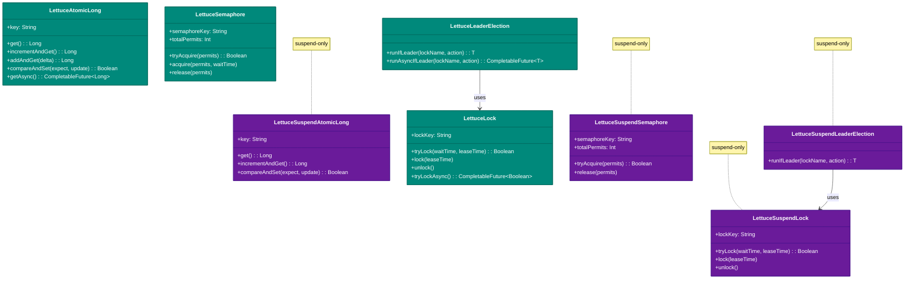
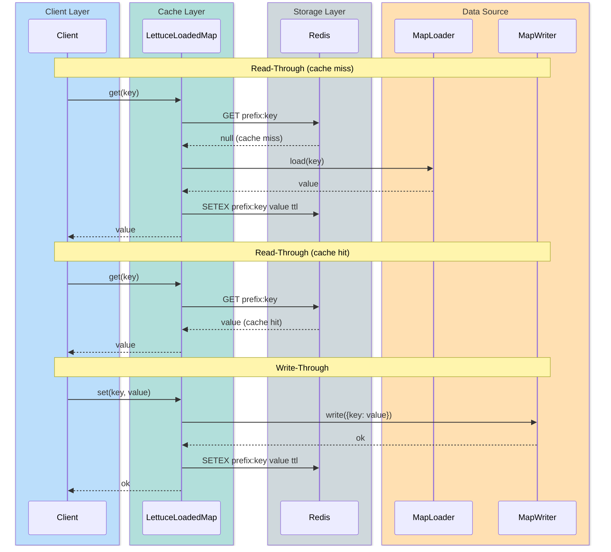
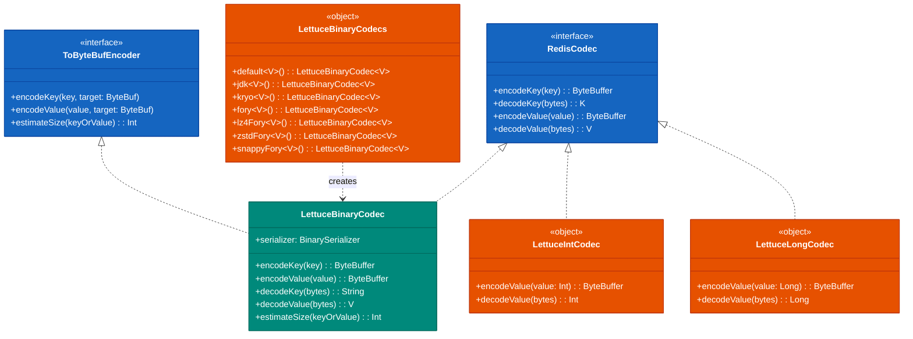

# bluetape4k-lettuce

English | [한국어](./README.ko.md)

A Kotlin extension module for the Lettuce Redis client, providing high-performance binary codecs and
`RedisFuture` → Coroutines adapters.

## Features

| Feature                             | Description                                                                                                                                  |
|-------------------------------------|----------------------------------------------------------------------------------------------------------------------------------------------|
| `LettuceClients`                    | Factory and connection pool management for `RedisClient` / `StatefulRedisConnection`                                                         |
| `LettuceBinaryCodec<V>`             | High-performance generic value serialization codec based on `BinarySerializer`                                                               |
| `LettuceBinaryCodecs`               | Factory combining serializers (Jdk/Kryo/Fory) with compression (GZip/Deflate/LZ4/Snappy/Zstd)                                                |
| `LettuceIntCodec`                   | Codec that serializes Int values as 4-byte big-endian (binary-compatible with Redisson `IntegerCodec`)                                       |
| `LettuceLongCodec`                  | Codec that serializes Long values as 8-byte big-endian (binary-compatible with Redisson `LongCodec`)                                         |
| `LettuceProtobufCodecs`             | Protobuf-based codec factory (requires `bluetape4k-protobuf`)                                                                                |
| `RedisFuture` extensions            | `awaitSuspending()` — converts `RedisFuture` to a suspend function                                                                           |
| `LettuceMap<V>`                     | Generic distributed hash map (sync + async). Coroutine variant: `LettuceSuspendMap<V>`                                                       |
| `LettuceSuspendMap<V>`              | Generic distributed hash map (suspend-only). Supports `LettuceBinaryCodec<V>`                                                                |
| `LettuceStringMap`                  | Distributed hash map for String values (sync + async)                                                                                        |
| `LettuceSuspendStringMap`           | Distributed hash map for String values (suspend-only)                                                                                        |
| `LettuceAtomicLong`                 | Distributed AtomicLong (sync + async). Coroutine variant: `LettuceSuspendAtomicLong`                                                         |
| `LettuceSuspendAtomicLong`          | Distributed AtomicLong (suspend-only)                                                                                                        |
| `LettuceSemaphore`                  | Distributed semaphore (sync + async). Coroutine variant: `LettuceSuspendSemaphore`                                                           |
| `LettuceSuspendSemaphore`           | Distributed semaphore (suspend-only)                                                                                                         |
| `LettuceLock`                       | Distributed mutex lock (sync + async). Coroutine variant: `LettuceSuspendLock`                                                               |
| `LettuceSuspendLock`                | Distributed mutex lock (suspend-only)                                                                                                        |
| `LettuceLeaderElection`             | Distributed single-leader election (sync + async). Coroutine variant: `LettuceSuspendLeaderElection`                                         |
| `LettuceSuspendLeaderElection`      | Distributed single-leader election (suspend-only)                                                                                            |
| `LettuceLeaderGroupElection`        | Distributed group leader election — allows up to N concurrent leaders (sync + async). Coroutine variant: `LettuceSuspendLeaderGroupElection` |
| `LettuceSuspendLeaderGroupElection` | Distributed group leader election (suspend-only)                                                                                             |
| `LettuceHyperLogLog<V>`             | Redis HyperLogLog approximate cardinality estimation (sync). Coroutine variant: `LettuceSuspendHyperLogLog<V>`                               |
| `LettuceSuspendHyperLogLog<V>`      | Redis HyperLogLog approximate cardinality estimation (suspend-only)                                                                          |
| `LettuceBloomFilter`                | Redis BitSet-based Bloom Filter (sync). Coroutine variant: `LettuceSuspendBloomFilter`                                                       |
| `LettuceSuspendBloomFilter`         | Redis BitSet-based Bloom Filter (suspend-only)                                                                                               |
| `LettuceCuckooFilter`               | Redis-based Cuckoo Filter with deletion support (sync). Coroutine variant: `LettuceSuspendCuckooFilter`                                      |
| `LettuceSuspendCuckooFilter`        | Redis-based Cuckoo Filter with deletion support (suspend-only)                                                                               |

`LettuceCacheConfig` constraints:

- `writeBehindBatchSize`, `writeBehindQueueCapacity`, `writeRetryAttempts`, and
  `nearCacheMaxSize` must be greater than 0.
- `ttl` and `nearCacheTtl` must be greater than 0 when specified.
- `keyPrefix` and `nearCacheName` must not be blank.

> **Memoizer** has been moved to the
`bluetape4k-cache-lettuce` module. See the [cache-lettuce README](../cache-lettuce/README.md) for details.

## Dependency

```kotlin
// build.gradle.kts
dependencies {
    implementation("io.github.bluetape4k:bluetape4k-lettuce:$bluetape4kVersion")
}
```

## Usage Examples

### Creating a RedisClient and Connecting

```kotlin
import io.bluetape4k.redis.lettuce.LettuceClients

// Create a client from a URL
val client = LettuceClients.clientOf("redis://localhost:6379")

// Sync commands
val commands = LettuceClients.commands(client)
commands.set("key", "value")
val value = commands.get("key")

// Async commands
val asyncCommands = LettuceClients.asyncCommands(client)
val future = asyncCommands.get("key")

// Coroutine commands
val coCommands = LettuceClients.coroutinesCommands(client)
// Must be called within a coroutine scope (suspend function)
val result = coCommands.get("key")

// Shutdown
LettuceClients.shutdown(client)
```

### Storing Objects with High-Performance Codec

```kotlin
import io.bluetape4k.redis.lettuce.LettuceClients
import io.bluetape4k.redis.lettuce.codec.LettuceBinaryCodecs

data class User(val id: Long, val name: String)

val client = LettuceClients.clientOf("redis://localhost:6379")

// LZ4 + Fory combination (default, fastest)
val codec = LettuceBinaryCodecs.lz4Fory<User>()
val connection = LettuceClients.connect(client, codec)
val commands = connection.sync()

commands.set("user:1", User(1L, "Alice"))
val user = commands.get("user:1") // User(id=1, name="Alice")
```

### Primitive Type Codecs (LettuceIntCodec / LettuceLongCodec)

Use these for efficiently storing Int and Long primitive types in Redis. They are binary-compatible with Redisson's
`IntegerCodec` / `LongCodec`.

```kotlin
import io.bluetape4k.redis.lettuce.codec.LettuceIntCodec
import io.bluetape4k.redis.lettuce.codec.LettuceLongCodec
import io.bluetape4k.redis.lettuce.map.LettuceMap

// Int-specific connection
val intConnection = redisClient.connect(LettuceIntCodec)
val intCommands = intConnection.sync()

intCommands.set("counter", 42)
val count = intCommands.get("counter")  // 42

// Also works with hash maps
intCommands.hset("scores", mapOf("alice" to 100, "bob" to 200))
val scores = intCommands.hgetall("scores")  // Map<String, Int>

// Long-specific connection
val longConnection = redisClient.connect(LettuceLongCodec)
val longMap = LettuceMap<Long>(longConnection, "my-long-map")
longMap.put("seq", 1_000_000L)
val seq = longMap.get("seq")   // 1_000_000L
```

### Converting RedisFuture to Coroutines

```kotlin
import io.bluetape4k.redis.lettuce.awaitSuspending
import io.bluetape4k.redis.lettuce.awaitAll

// Single future
val value = asyncCommands.get("key").awaitSuspending()

// Wait for multiple futures in parallel
val results = listOf(
    asyncCommands.get("key1"),
    asyncCommands.get("key2"),
    asyncCommands.get("key3"),
).awaitAll()
```

## Codec Combinations

| Factory Method          | Serializer | Compression |
|-------------------------|------------|-------------|
| `jdk()`                 | JDK        | None        |
| `kryo()`                | Kryo       | None        |
| `fory()`                | Fory       | None        |
| `lz4Fory()` *(default)* | Fory       | LZ4         |
| `lz4Kryo()`             | Kryo       | LZ4         |
| `zstdFory()`            | Fory       | Zstd        |
| `snappyFory()`          | Fory       | Snappy      |
| `gzipFory()`            | Fory       | GZip        |

### Primitive Codecs

| Class              | Key Type | Value Type | Encoding          | Redisson Compatible |
|--------------------|----------|------------|-------------------|---------------------|
| `LettuceIntCodec`  | String   | Int        | 4-byte big-endian | `IntegerCodec`      |
| `LettuceLongCodec` | String   | Long       | 8-byte big-endian | `LongCodec`         |

## Distributed Primitives

### LettuceMap\<V\> — Generic Distributed Hash Map

```kotlin
import io.bluetape4k.redis.lettuce.codec.LettuceBinaryCodecs
import io.bluetape4k.redis.lettuce.map.LettuceMap
import io.bluetape4k.redis.lettuce.map.LettuceSuspendMap

data class Product(val id: Long, val name: String)

// Connect with LZ4 + Fory codec
val codec = LettuceBinaryCodecs.lz4Fory<Product>()
val connection = redisClient.connect(codec)

// Sync/async
val map = LettuceMap<Product>(connection, "products")
map.put("p1", Product(1L, "Widget"))
val product = map.get("p1")                        // Product?
val all = map.entries()                             // Map<String, Product>
map.getAsync("p1").thenAccept { println(it) }      // CompletableFuture

// Coroutine-only
val suspendMap = LettuceSuspendMap<Product>(connection, "products")
val p = suspendMap.get("p1")                       // suspend fun
suspendMap.put("p2", Product(2L, "Gadget"))
```

> **Why String is the default**: Lettuce's default codec is `StringCodec.UTF8`.
> While `LettuceMap<V>` supports binary codecs for simple HGET/HSET operations,
> `LettuceAtomicLong` and `LettuceSemaphore` rely on Redis's `INCR`/
`DECR` commands which require decimal string encoding,
> so they must use `StatefulRedisConnection<String, String>`.

### LettuceAtomicLong — Distributed AtomicLong

```kotlin
import io.bluetape4k.redis.lettuce.atomic.LettuceAtomicLong
import io.bluetape4k.redis.lettuce.atomic.LettuceSuspendAtomicLong

// Sync/async
val counter = LettuceAtomicLong(connection, "my-counter", initialValue = 0L)
counter.incrementAndGet()        // 1L
counter.addAndGet(5L)            // 6L
counter.compareAndSet(6L, 10L)   // true

// Coroutine-only
val suspendCounter = LettuceSuspendAtomicLong(connection, "my-counter")
suspendCounter.incrementAndGet()
suspendCounter.addAndGet(5L)
```

### LettuceSemaphore — Distributed Semaphore

```kotlin
import io.bluetape4k.redis.lettuce.semaphore.LettuceSemaphore
import io.bluetape4k.redis.lettuce.semaphore.LettuceSuspendSemaphore

// Sync/async
val semaphore = LettuceSemaphore(connection, "my-semaphore", totalPermits = 3)
semaphore.initialize()
if (semaphore.tryAcquire()) {
    try { doWork() } finally { semaphore.release() }
}

// Coroutine-only
val suspendSemaphore = LettuceSuspendSemaphore(connection, "my-semaphore", totalPermits = 3)
if (suspendSemaphore.tryAcquire()) {
    try { doWork() } finally { suspendSemaphore.release() }
}
```

### LettuceLock — Distributed Mutex Lock

```kotlin
import io.bluetape4k.redis.lettuce.lock.LettuceLock
import io.bluetape4k.redis.lettuce.lock.LettuceSuspendLock

// Sync/async
val lock = LettuceLock(connection, "my-lock")
if (lock.tryLock(waitTime = 5.seconds)) {
    try { doWork() } finally { lock.unlock() }
}

// Coroutine-only
val suspendLock = LettuceSuspendLock(connection, "my-lock")
if (suspendLock.tryLock(waitTime = 5.seconds)) {
    try { doWork() } finally { suspendLock.unlock() }
}
```

### LettuceLeaderElection — Distributed Single-Leader Election

```kotlin
import io.bluetape4k.redis.lettuce.leader.LettuceLeaderElection
import io.bluetape4k.redis.lettuce.leader.LettuceSuspendLeaderElection

// Sync/async
val election = LettuceLeaderElection(connection, "my-leader-lock")
election.runIfLeader {
    println("I am the leader!")
}

// Coroutine-only
val suspendElection = LettuceSuspendLeaderElection(connection, "my-leader-lock")
suspendElection.runIfLeader {
    // Can call suspend functions
}
```

### LettuceLeaderGroupElection — Distributed Group Leader Election

Group election that allows up to N nodes to act as leaders simultaneously. Uses a semaphore internally.

```kotlin
import io.bluetape4k.redis.lettuce.leader.LettuceLeaderGroupElection
import io.bluetape4k.redis.lettuce.leader.LettuceSuspendLeaderGroupElection
import io.bluetape4k.leader.LeaderGroupElectionOptions
import java.time.Duration

val options = LeaderGroupElectionOptions(
    maxLeaders = 3,
    waitTime = Duration.ofSeconds(5),
    leaseTime = Duration.ofSeconds(10),
)

// Sync/async
val election = LettuceLeaderGroupElection(connection, options)
election.runIfLeader("my-group-lock") {
    println("Running as a group leader (up to 3 concurrent)")
}

// Coroutine-only
val suspendElection = LettuceSuspendLeaderGroupElection(connection, options)
suspendElection.runIfLeader("my-group-lock") {
    // Can call suspend functions
}
```

## Memoizer (Caching Function Results in Redis)

> The Memoizer lives in the
`bluetape4k-cache-lettuce` module. See [cache-lettuce README](../cache-lettuce/README.md) for detailed usage.

```kotlin
// build.gradle.kts
dependencies {
    implementation("io.github.bluetape4k:bluetape4k-cache-lettuce:$bluetape4kVersion")
}
```

## Diagrams

### Distributed Primitive Class Hierarchy



### LettuceLoadedMap Read-Through / Write-Through Flow



### LettuceBinaryCodec Hierarchy



## Probabilistic Data Structures

### LettuceHyperLogLog<V> - Approximate Cardinality Estimation

```kotlin
import io.bluetape4k.redis.lettuce.LettuceClients
import io.bluetape4k.redis.lettuce.hll.LettuceHyperLogLog
import io.bluetape4k.redis.lettuce.hll.LettuceSuspendHyperLogLog
import io.lettuce.core.codec.StringCodec

val connection = LettuceClients.connect(client, StringCodec.UTF8)

val hll = LettuceHyperLogLog(connection, "unique-visitors")
hll.add("user:1", "user:2", "user:3")
val count = hll.count()

val suspendHll = LettuceSuspendHyperLogLog(connection, "unique-visitors-suspend")
```

### LettuceBloomFilter - Probabilistic Membership Test

```kotlin
import io.bluetape4k.redis.lettuce.LettuceClients
import io.bluetape4k.redis.lettuce.filter.BloomFilterOptions
import io.bluetape4k.redis.lettuce.filter.LettuceBloomFilter
import io.lettuce.core.codec.StringCodec

val bloomFilter = LettuceBloomFilter(
    connection = LettuceClients.connect(client, StringCodec.UTF8),
    filterName = "email-blacklist",
    options = BloomFilterOptions(expectedInsertions = 1_000_000L, falseProbability = 0.01),
)

bloomFilter.tryInit()
bloomFilter.add("spam@evil.com")
val mightContain = bloomFilter.contains("spam@evil.com")
```

### LettuceCuckooFilter - Probabilistic Filter with Deletion Support

```kotlin
import io.bluetape4k.redis.lettuce.LettuceClients
import io.bluetape4k.redis.lettuce.filter.CuckooFilterOptions
import io.bluetape4k.redis.lettuce.filter.LettuceCuckooFilter
import io.lettuce.core.codec.StringCodec

val cuckooFilter = LettuceCuckooFilter(
    connection = LettuceClients.connect(client, StringCodec.UTF8),
    filterName = "dedup-ids",
    options = CuckooFilterOptions(capacity = 100_000L, bucketSize = 4),
)

cuckooFilter.tryInit()
cuckooFilter.insert("order:123")
val exists = cuckooFilter.contains("order:123")
cuckooFilter.delete("order:123")
```

Reinitializing a Bloom Filter or Cuckoo Filter under the same name with different options throws an
`IllegalStateException` to prevent configuration mismatches. On insertion failure, the Cuckoo Filter uses a Lua script with an undo-log to prevent data loss.

## Build and Testing

A Redis server (default:
`localhost:6379`) is required to run tests. It is automatically provisioned via Docker through [Testcontainers](../testing/testcontainers).

```bash
./gradlew :bluetape4k-lettuce:test
```
