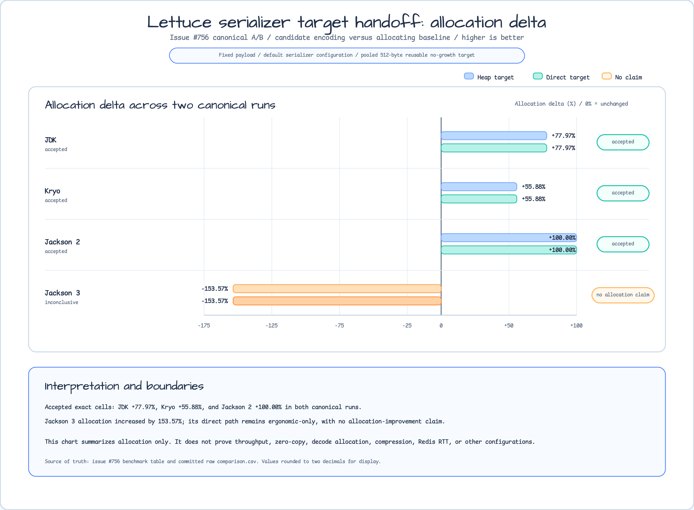
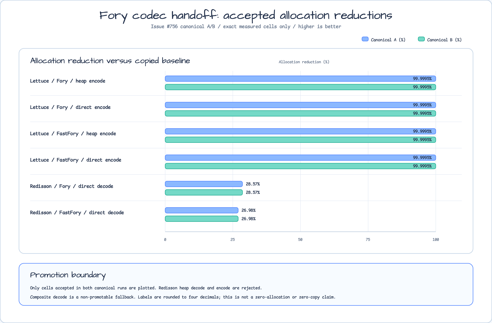
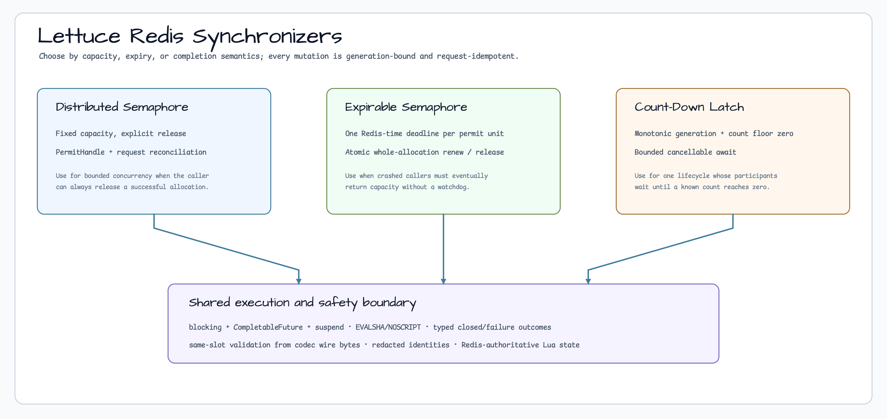
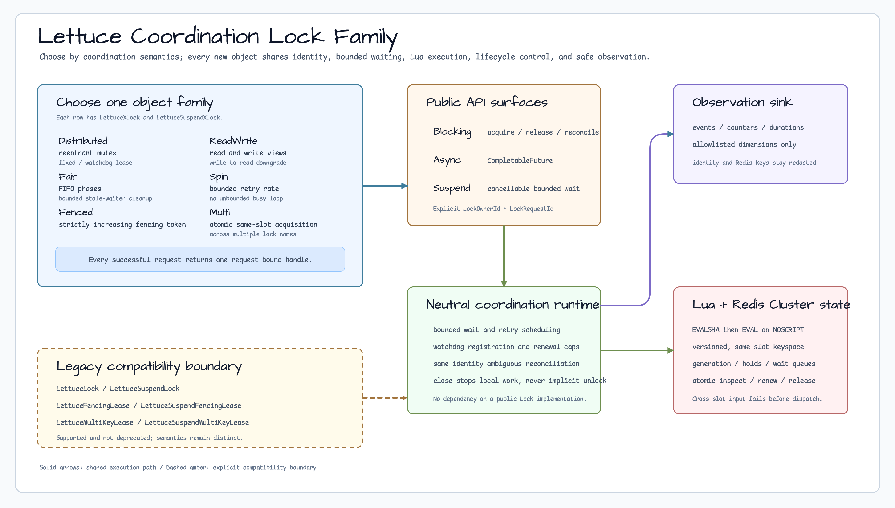
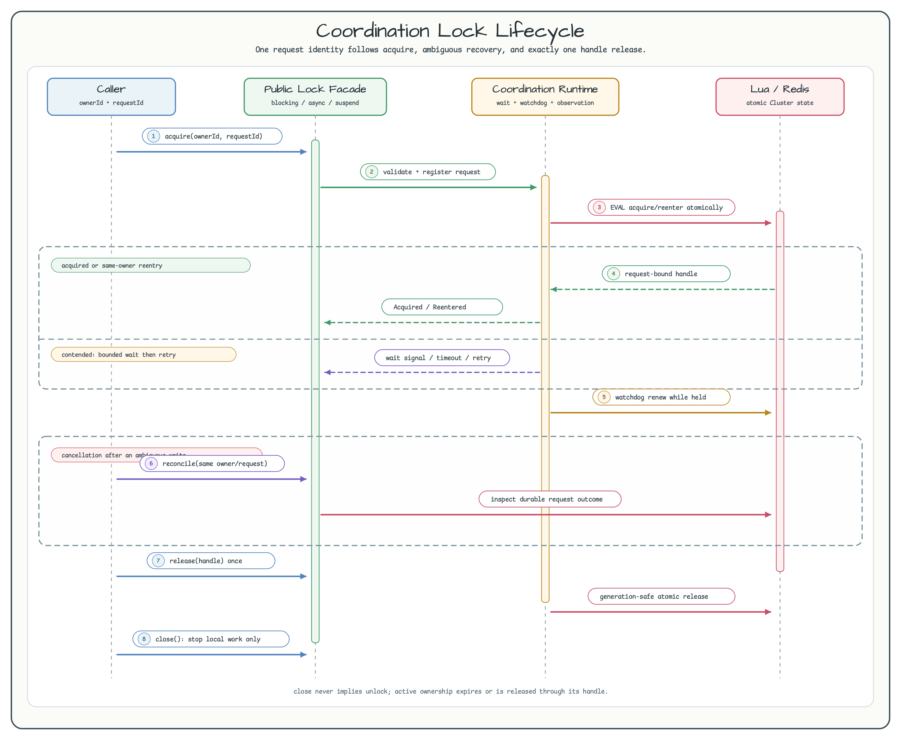

# Module bluetape4k-lettuce

English | [한국어](./README.ko.md)

A Kotlin extension module for the Lettuce Redis client, providing high-performance binary codecs and
`RedisFuture` → Coroutines adapters.

## Features

| Feature                             | Description                                                                                                                                  |
|-------------------------------------|----------------------------------------------------------------------------------------------------------------------------------------------|
| `LettuceClients`                    | Factory and connection pool management for `RedisClient` / `StatefulRedisConnection`                                                         |
| `LettuceBinaryCodec<V>`             | High-performance generic value serialization codec based on `BinarySerializer`                                                               |
| `LettuceBinaryCodecs`               | Factory combining serializers (Jdk/Kryo/Fory) with compression (GZip/Deflate/LZ4/Snappy/Zstd)                                                |
| `LettuceJsonCodec<V>`               | JSON-based value codec using Jackson 3.x or Fastjson2 — stores values as human-readable JSON text                                            |
| `LettuceJsonCodecs`                 | Factory object providing `jackson3<V>()` and `fastjson2<V>()` factory methods                                                                |
| `LettuceIntCodec`                   | Codec that serializes Int values as 4-byte big-endian (binary-compatible with Redisson `IntegerCodec`)                                       |
| `LettuceLongCodec`                  | Codec that serializes Long values as 8-byte big-endian (binary-compatible with Redisson `LongCodec`)                                         |
| `RedisFuture` extensions            | `awaitSuspending()` — converts `RedisFuture` to a suspend function                                                                           |
| `LettuceMap<V>`                     | Generic distributed hash map (sync + async). Coroutine variant: `LettuceSuspendMap<V>`                                                       |
| `LettuceSuspendMap<V>`              | Generic distributed hash map (suspend-only). Supports `LettuceBinaryCodec<V>`                                                                |
| `LettuceStringMap`                  | Distributed hash map for String values (sync + async)                                                                                        |
| `LettuceSuspendStringMap`           | Distributed hash map for String values (suspend-only)                                                                                        |
| `LettuceAtomicLong`                 | Distributed AtomicLong (sync + async). Coroutine variant: `LettuceSuspendAtomicLong`                                                         |
| `LettuceSuspendAtomicLong`          | Distributed AtomicLong (suspend-only)                                                                                                        |
| `LettuceSemaphore`                  | Distributed semaphore (sync + async). Coroutine variant: `LettuceSuspendSemaphore`                                                           |
| `LettuceSuspendSemaphore`           | Distributed semaphore (suspend-only)                                                                                                         |
| `LettuceDistributedSemaphore`       | Request-idempotent, generation-bound counting semaphore (blocking + async)                                                                    |
| `LettucePermitExpirableSemaphore`   | Redis-time expirable permit-unit semaphore with atomic allocation renewal/release                                                             |
| `LettuceCountDownLatch`             | Monotonic-generation count-down latch with bounded await                                                                                      |
| `LettuceDistributedLock`            | Reentrant-capable distributed lock with identity/handle lifecycle and typed outcomes                                                       |
| `LettuceSuspendDistributedLock`     | Suspend distributed lock with identity/handle lifecycle and typed outcomes                                                                   |
| `LettuceFairLock`                   | Fair queueing distributed lock (sync + async + suspend)                                                                                    |
| `LettuceSuspendFairLock`            | Suspend fair lock with identity/handle lifecycle                                                                                              |
| `LettuceFencedLock`                 | Fenced lock with monotonic epoch/token semantics and typed acquisition state                                                                  |
| `LettuceSuspendFencedLock`          | Suspend fenced lock with monotonic epoch/token semantics                                                                                      |
| `LettuceReadWriteLock`              | Read/write lock pair with handle-based read/write downgrade flow                                                                              |
| `LettuceSuspendReadWriteLock`       | Suspend read/write lock pair with read/write handle views                                                                                     |
| `LettuceSpinLock`                   | Spin-first lock using bounded attempts and explicit ownership handles                                                                           |
| `LettuceSuspendSpinLock`            | Suspend spin-first lock with bounded attempts                                                                                                 |
| `LettuceMultiLock`                  | All-or-nothing multi-key lock with same-slot safe composition                                                                                 |
| `LettuceSuspendMultiLock`           | Suspend all-or-nothing multi-key lock with same-slot composition                                                                              |
| `LettuceLock`                       | Compatibility token mutex (sync + async). Coroutine variant: `LettuceSuspendLock`                                                            |
| `LettuceSuspendLock`                | Compatibility token mutex (suspend-only)                                                                                                      |
| `LettuceMultiKeyLease`              | Same-slot atomic ownership lease across bounded keys (sync + async)                                                                           |
| `LettuceSuspendMultiKeyLease`       | Same-slot atomic ownership lease across bounded keys (suspend-only)                                                                           |
| `LettuceFencingLease`               | Config-bound Redis fencing lease with ordered `(epoch, sequence)` tokens (sync + async)                                                       |
| `LettuceSuspendFencingLease`        | Config-bound Redis fencing lease with ordered `(epoch, sequence)` tokens (suspend-only)                                                       |
| `LettuceHyperLogLog<V>`             | Redis HyperLogLog approximate cardinality estimation (sync). Coroutine variant: `LettuceSuspendHyperLogLog<V>`                               |
| `LettuceSuspendHyperLogLog<V>`      | Redis HyperLogLog approximate cardinality estimation (suspend-only)                                                                          |
| `LettuceBloomFilter`                | Redis BitSet-based Bloom Filter (sync). Coroutine variant: `LettuceSuspendBloomFilter`                                                       |
| `LettuceSuspendBloomFilter`         | Redis BitSet-based Bloom Filter (suspend-only)                                                                                               |
| `LettuceCuckooFilter`               | Redis-based Cuckoo Filter with deletion support (sync). Coroutine variant: `LettuceSuspendCuckooFilter`                                      |
| `LettuceSuspendCuckooFilter`        | Redis-based Cuckoo Filter with deletion support (suspend-only)                                                                               |
| `RedisScript`                       | Reusable Lua script with pre-computed SHA1. Enables `EVALSHA`-first execution with automatic `EVAL` fallback on `NOSCRIPT`                   |
| `RedisScriptRunner`                 | Helper object to execute `RedisScript` via sync / async / suspend APIs with `EVALSHA`→`EVAL` fallback                                        |

Protobuf codecs are provided by the `bluetape4k-protobuf` module through
`io.bluetape4k.protobuf.serializers.redis.LettuceProtobufCodecs`.

The uncompressed `protobuf()` and `trustedInternalProtobuf()` factories write Protobuf messages into Lettuce's
caller-owned `ByteBuf` through the nullable target overload. A successful write commits `writerIndex` only after the
complete packed message is present. If encoding fails, the index is unchanged, but capacity growth or bytes in the
attempted range may remain; clear/reinitialize that range or discard the buffer before reuse. The single-argument
`ByteBuffer` encode/decode methods, compressed factories, non-Protobuf fallback values, and custom-prefix serializers
keep the copied compatibility path. This is a measured allocation reduction, not a zero-copy or throughput guarantee;
see the [issue #757 evidence](../../docs/benchmarks/2026-07-18-protobuf-buffer-allocation.md).

`LettuceBinaryCodec` is open only to expose the nullable target-taking `encodeValue(value, target)` source extension
seam; ordinary `RedisCodec` methods remain final. The open class also makes Kotlin-generated JVM bridge methods
overrideable, so subclasses must preserve the serializer wire and trust contract. Existing factory callers do not need
to migrate. Java callers use `LettuceProtobufCodecs.INSTANCE.protobuf()`.

### Caller-owned serializer target contract

For built-in codecs, target-taking binary encode calls `serializeBinaryToStream`; target-taking JSON encode calls
`serializeJsonToStream`. Both serializer interface defaults are allocating compatibility fallbacks, so direct stream
writing is opt-in per concrete serializer. The codec borrows the caller-owned `ByteBuf` synchronously through a bounded
absolute-index writer. It never retains, closes, flushes, or releases the target. A successful built-in call verifies
the serializer-reported count and target snapshot, then commits `writerIndex` exactly once after the complete wire is
present.

Keep each mutable target thread-confined until the call returns. Concurrent `readerIndex`, `writerIndex`, `refCnt`, or
capacity-boundary drift is unsupported and fails closed; the codec does not repair concurrent mutation. On any encode
failure, `writerIndex` is not committed, but attempted bytes and capacity growth may remain. Neither this contract nor
`release()` guarantees byte wiping. Do not log the target's full capacity. Discard/reinitialize the attempted range or
follow the allocator's disposal policy before reuse.

Only `LettuceBinaryCodec.encodeValue(value, target)` is a supported custom target override seam. A subclass override
does not automatically inherit the built-in count/snapshot/success-only commit guarantees and must preserve wire and
trust compatibility itself. `LettuceJsonCodec` is final and exposes no equivalent custom seam. Decode passes a bounded
read-only, non-array-backed `ByteBuffer` view to `deserializeFrom`; a custom serializer must support that synchronous
borrow, or inherit the interface allocating default.

The [issue #756 evidence](../../docs/benchmarks/2026-07-22-issue-756-lettuce-buffer-codec-allocation.md) applies only
to the measured payload/default serializer configuration, pooled pre-sized reusable 512-byte heap/direct targets, and
no-growth path:

| Serializer | Heap | Direct | Claim |
|---|---|---|---|
| JDK | accepted | accepted | allocation reduction in the exact measured cells |
| Kryo | accepted | accepted | allocation reduction in the exact measured cells |
| Jackson 2 | accepted | accepted | allocation reduction in the exact measured cells |
| Jackson 3 | inconclusive | inconclusive | ergonomic direct path only; no allocation claim |



The chart summarizes allocation delta versus the allocating baseline. Heap and direct values agree to the displayed
precision in both canonical runs for each backend. JDK, Kryo, and Jackson 2 satisfy the two-run acceptance rule;
Jackson 3 allocates more, so it remains ergonomic-only. The benchmark table and committed raw CSV remain the numeric
source of truth.

Do not generalize these results to one-argument encode, decode, compressed/Fory/Fastjson codecs, other payloads,
capacity growth, target sizes, allocator/pooling choices, zero-copy, or throughput. There is no runtime auto-fallback,
feature flag, or dispatch telemetry. If a retained direct path is defective, roll back to the previous artifact/codec
deployment; any implementation change requires two fresh canonical runs before reusing an allocation claim.

#### Raw Fory/FastFory boundary

The uncompressed `fory()` and `fastFory()` factories use the same bounded caller-owned `ByteBuf` writer for their
target-taking encode path. That path removes the codec-level handoff `ByteArray`, while Apache Fory's internal reusable
`MemoryBuffer` and its final destination write remain; it is not zero-copy. One-argument encode and every compressed
factory retain the allocating compatibility path.

Keeping the same factory requires no caller API or payload migration. `fastFory()` has no Fory fallback and remains
wire-incompatible with `fory()`, so changing modes requires an explicit cache migration or eviction. Only exact cells
accepted by the committed [issue #756 Fory follow-up evidence](../../docs/benchmarks/2026-07-23-issue-756-fory-codec-followup.md)
may carry an allocation claim:

| Raw target-taking encode | Heap | Direct |
|---|---:|---:|
| Fory | accepted: 99.99947% allocation reduction in canonical A/B | accepted: 99.99949–99.99950% |
| FastFory | accepted: 99.99952–99.99954% | accepted: 99.99950–99.99954% |



All four exact Lettuce cells are accepted. The allocation values do not imply zero-copy or a general throughput gain.
There is no runtime auto-fallback, feature flag, or dispatch telemetry for this path.

`LettuceCacheConfig` constraints:

- `writeBehindBatchSize`, `writeBehindQueueCapacity`, `writeRetryAttempts`, and
  `nearCacheMaxSize` must be greater than 0.
- `ttl` and `nearCacheTtl` must be greater than 0 when specified.
- `keyPrefix` and `nearCacheName` must not be blank.

> **Memoizer** has been moved to the
`bluetape4k-cache-lettuce` module. See the [cache-lettuce README](../../cache/cache-lettuce/README.md) for details.

## Performance Optimizations

`LettuceClients` ships with several built-in performance optimizations applied by default. These were discovered and validated through an automated self-improvement benchmark loop (`LettuceThroughputBenchmark`, 10,000 async SET+GET ops via Testcontainers Redis).

### Codec Benchmark Results

Based on `LettuceCodecBenchmark` (JMH, Apple M4 Pro / GraalVM 21 / Warmup 3×2s / Measurement 5×3s / Fork 1 / 2026-04-27):

| Codec | ops/ms | ± Error |
|-------|-------:|--------:|
| **fastjson2** | **6,379** | ± 1,358 |
| **FastFory** | **3,286** | ± 142 |
| Fory | 2,551 | ± 2,001 |
| Kryo | 963 | ± 474 |
| LZ4FastFory | 906 | ± 66 |
| LZ4Fory | 852 | ± 39 |
| Jackson3 | 834 | ± 25 |
| LZ4Kryo | 535 | ± 16 |
| ZstdFastFory | 206 | ± 17 |
| ZstdFory | 203 | ± 5 |
| ZstdKryo | 136 | ± 3 |
| JDK | 132 | ± 13 |
| GzipFastFory | 110 | ± 2 |


> Full results & analysis: [Benchmark.md](./Benchmark.md) · [벤치마크 결과 (한국어)](./Benchmark.ko.md)
> Run: `./gradlew :bluetape4k-lettuce:benchmark`

### Connection Benchmark Results

| Optimization | ops/sec | vs Baseline |
|---|---|---|
| Default (no tuning) | ~31,847 | — |
| + Shared `DEFAULT_CLIENT_RESOURCES` (NCPU thread pool) | 32,154 | +1% |
| + Full pipeline (`withPipeline{}` SET+GET) | 40,816 | +28% |
| + `SocketOptions` (keepAlive + tcpNoDelay) | 46,728 | +47% |
| **+ Merged pipeline + `awaitAll()`** | **81,967** | **+157%** |


### Key Techniques

#### 1. Shared `DEFAULT_CLIENT_RESOURCES` (NCPU Thread Pool)

All `RedisClient` instances created via `LettuceClients.clientOf(...)` share a single `ClientResources` singleton tuned to `NCPU` I/O and computation threads. This avoids per-client thread creation overhead.

#### 2. Tuned `SocketOptions`

Every client automatically applies `keepAlive=true`, `tcpNoDelay=true`, and `connectTimeout=5s` via `ClientOptions`. These reduce TCP-level latency without requiring protocol changes.

#### 3. `withPipeline{}` — Batch Flush Extension

```kotlin
import io.bluetape4k.redis.lettuce.withPipeline

// Issue all commands → single flush → await results outside
val (setFutures, getFutures) = connection.withPipeline { cmd ->
    val sets = (0 until count).map { i -> cmd.set("key:$i", value) }
    val gets = (0 until count).map { i -> cmd.get("key:$i") }
    sets to gets
}
setFutures.awaitAll()   // Collection<RedisFuture>.awaitAll() from RedisFutureSupport
getFutures.awaitAll()
```

- Disables `autoFlushCommands` while issuing commands, then issues a **single `flushCommands()`** for the entire batch
- Merge SET and GET into **one block** to eliminate the inter-phase barrier (single TCP burst vs two sequential bursts)
- Restores `autoFlushCommands(true)` in `finally` for safety

#### 4. `Collection<RedisFuture>.awaitAll()` — Bulk Await

```kotlin
import io.bluetape4k.redis.lettuce.awaitAll

// One CompletableFuture.allOf continuation vs N×async{} coroutine spawns
val results: List<String?> = futures.awaitAll()
```

Prefer `RedisFutureSupport.awaitAll()` over `futures.map { async { it.await() } }.awaitAll()` — the latter spawns one coroutine per future, while `awaitAll()` uses a single `CompletableFuture.allOf` continuation.

### Lessons from Benchmarking

| What NOT to do | Why |
|---|---|
| `ProtocolVersion.RESP3` + `TimeoutOptions.enabled()` + `REJECT_COMMANDS` | −12% at high-ops localhost scale — per-command overhead dominates |
| `ByteArrayCodec` for small ASCII values | −17% — Lettuce's `StringCodec` ASCII fast-path + buffer reuse beats ByteArrayCodec at 64B |
| Await inside `withPipeline{}` lambda | `flushCommands()` never fires — coroutine suspends before the flush |
| Partial pipelining (SET only, not GET) | The non-pipelined leg becomes the bottleneck |

## Dependency

```kotlin
// build.gradle.kts
dependencies {
    implementation("io.github.bluetape4k:bluetape4k-lettuce:$bluetape4kVersion")
}
```

## Diagrams

### Distributed Primitive API Families


### LettuceLoadedMap Read-Through / Write-Through Flow


### Lettuce Codec API Structure


### Redis Synchronizer Selection



## Usage Examples

### Creating a RedisClient and Connecting

```kotlin
import io.bluetape4k.redis.lettuce.LettuceClients

// Create a client from a URL
val client = LettuceClients.clientOf("redis://localhost:6379")

// Sync commands
val commands = LettuceClients.commands(client)
commands.set("key", "value")
val value = commands.get("key")

// Async commands
val asyncCommands = LettuceClients.asyncCommands(client)
val future = asyncCommands.get("key")

// Coroutine commands
val coCommands = LettuceClients.coroutinesCommands(client)
// Must be called within a coroutine scope (suspend function)
val result = coCommands.get("key")

// Shutdown
LettuceClients.shutdown(client)
```

### Storing Objects with High-Performance Codec

```kotlin
import io.bluetape4k.redis.lettuce.LettuceClients
import io.bluetape4k.redis.lettuce.codec.LettuceBinaryCodecs

data class User(val id: Long, val name: String)

val client = LettuceClients.clientOf("redis://localhost:6379")

// LZ4 + Fory combination (default, fastest)
val codec = LettuceBinaryCodecs.lz4Fory<User>()
val connection = LettuceClients.connect(client, codec)
val commands = connection.sync()

commands.set("user:1", User(1L, "Alice"))
val user = commands.get("user:1") // User(id=1, name="Alice")
```

### Primitive Type Codecs (LettuceIntCodec / LettuceLongCodec)

Use these for efficiently storing Int and Long primitive types in Redis. They are binary-compatible with Redisson's
`IntegerCodec` / `LongCodec`.

```kotlin
import io.bluetape4k.redis.lettuce.codec.LettuceIntCodec
import io.bluetape4k.redis.lettuce.codec.LettuceLongCodec
import io.bluetape4k.redis.lettuce.map.LettuceMap

// Int-specific connection
val intConnection = redisClient.connect(LettuceIntCodec)
val intCommands = intConnection.sync()

intCommands.set("counter", 42)
val count = intCommands.get("counter")  // 42

// Also works with hash maps
intCommands.hset("scores", mapOf("alice" to 100, "bob" to 200))
val scores = intCommands.hgetall("scores")  // Map<String, Int>

// Long-specific connection
val longConnection = redisClient.connect(LettuceLongCodec)
val longMap = LettuceMap<Long>(longConnection, "my-long-map")
longMap.put("seq", 1_000_000L)
val seq = longMap.get("seq")   // 1_000_000L
```

### Converting RedisFuture to Coroutines

```kotlin
import io.bluetape4k.redis.lettuce.awaitSuspending
import io.bluetape4k.redis.lettuce.awaitAll

// Single future
val value = asyncCommands.get("key").awaitSuspending()

// Wait for multiple futures in parallel
val results = listOf(
    asyncCommands.get("key1"),
    asyncCommands.get("key2"),
    asyncCommands.get("key3"),
).awaitAll()
```

## Codec Combinations

### Binary Codecs (`LettuceBinaryCodecs`)

| Factory Method          | Serializer | Compression |
|-------------------------|------------|-------------|
| `jdk()`                 | JDK        | None        |
| `kryo()`                | Kryo       | None        |
| `fory()`                | Fory       | None        |
| `lz4Fory()` *(default)* | Fory       | LZ4         |
| `lz4Kryo()`             | Kryo       | LZ4         |
| `zstdFory()`            | Fory       | Zstd        |
| `snappyFory()`          | Fory       | Snappy      |
| `gzipFory()`            | Fory       | GZip        |
| `fastFory()`            | FastFory   | None        |
| `lz4FastFory()`         | FastFory   | LZ4         |
| `zstdFastFory()`        | FastFory   | Zstd        |
| `snappyFastFory()`      | FastFory   | Snappy      |
| `gzipFastFory()`        | FastFory   | GZip        |

> **⚠️ Wire Format Warning**: FastFory codecs use `CompatibleMode.SCHEMA_CONSISTENT` and are **NOT compatible** with the default Fory codec. No fallback. Use only for volatile caches.

### JSON Codecs (`LettuceJsonCodecs`)

Human-readable JSON text storage. Useful for debugging or interoperability with other systems.

```kotlin
import io.bluetape4k.redis.lettuce.codec.LettuceJsonCodecs

data class User(val id: Long, val name: String)

// Jackson 3.x JSON codec
val jacksonCodec = LettuceJsonCodecs.jackson3<User>()
val jacksonConnection = redisClient.connect(jacksonCodec)
val cmds = jacksonConnection.sync()

cmds.set("user:1", User(1L, "Alice"))
val user = cmds.get("user:1")   // User(id=1, name="Alice")

// Fastjson2 JSON codec
val fastjsonCodec = LettuceJsonCodecs.fastjson2<User>()
val fastjsonConnection = redisClient.connect(fastjsonCodec)
```

| Factory Method      | Serializer | Format | Description                |
|---------------------|------------|--------|----------------------------|
| `jackson3<V>()`     | Jackson 3  | JSON   | Jackson ObjectMapper-based |
| `fastjson2<V>()`    | Fastjson2  | JSON   | Fastjson2 JSON-based       |

### Primitive Codecs

| Class              | Key Type | Value Type | Encoding          | Redisson Compatible |
|--------------------|----------|------------|-------------------|---------------------|
| `LettuceIntCodec`  | String   | Int        | 4-byte big-endian | `IntegerCodec`      |
| `LettuceLongCodec` | String   | Long       | 8-byte big-endian | `LongCodec`         |

## Distributed Primitives

### LettuceMap\<V\> — Generic Distributed Hash Map

```kotlin
import io.bluetape4k.redis.lettuce.codec.LettuceBinaryCodecs
import io.bluetape4k.redis.lettuce.map.LettuceMap
import io.bluetape4k.redis.lettuce.map.LettuceSuspendMap

data class Product(val id: Long, val name: String)

// Connect with LZ4 + Fory codec
val codec = LettuceBinaryCodecs.lz4Fory<Product>()
val connection = redisClient.connect(codec)

// Sync/async
val map = LettuceMap<Product>(connection, "products")
map.put("p1", Product(1L, "Widget"))
val product = map.get("p1")                        // Product?
val all = map.entries()                             // Map<String, Product>
map.getAsync("p1").thenAccept { println(it) }      // CompletableFuture

// Coroutine-only
val suspendMap = LettuceSuspendMap<Product>(connection, "products")
val p = suspendMap.get("p1")                       // suspend fun
suspendMap.put("p2", Product(2L, "Gadget"))
```

> **Why String is the default**: Lettuce's default codec is `StringCodec.UTF8`.
> While `LettuceMap<V>` supports binary codecs for simple HGET/HSET operations,
> `LettuceAtomicLong` and `LettuceSemaphore` rely on Redis's `INCR`/
`DECR` commands which require decimal string encoding,
> so they must use `StatefulRedisConnection<String, String>`.

### LettuceAtomicLong — Distributed AtomicLong

```kotlin
import io.bluetape4k.redis.lettuce.atomic.LettuceAtomicLong
import io.bluetape4k.redis.lettuce.atomic.LettuceSuspendAtomicLong

// Sync/async
val counter = LettuceAtomicLong(connection, "my-counter", initialValue = 0L)
counter.incrementAndGet()        // 1L
counter.addAndGet(5L)            // 6L
counter.compareAndSet(6L, 10L)   // true

// Coroutine-only
val suspendCounter = LettuceSuspendAtomicLong(connection, "my-counter")
suspendCounter.incrementAndGet()
suspendCounter.addAndGet(5L)
```

### LettuceSemaphore — Distributed Semaphore

```kotlin
import io.bluetape4k.redis.lettuce.semaphore.LettuceSemaphore
import io.bluetape4k.redis.lettuce.semaphore.LettuceSuspendSemaphore

// Sync/async
val semaphore = LettuceSemaphore(connection, "my-semaphore", totalPermits = 3)
semaphore.initialize()
if (semaphore.tryAcquire()) {
    try { doWork() } finally { semaphore.release() }
}

// Coroutine-only
val suspendSemaphore = LettuceSuspendSemaphore(connection, "my-semaphore", totalPermits = 3)
if (suspendSemaphore.tryAcquire()) {
    try { doWork() } finally { suspendSemaphore.release() }
}
```

## Coordination primitives

Choose the object by semantics. Lock families and synchronizer families provide explicit identities, typed outcomes,
standalone/Cluster factories, and blocking/async/suspend surfaces.

| Object family | Key characteristics | Recommended uses | Main constraint |
|---|---|---|---|
| `LettuceDistributedLock` | Reentrant single-resource exclusion | Order processing, duplicate-job prevention, and one aggregate mutation | Advisory ownership; use fencing when stale writers must be rejected |
| `LettuceFairLock` | FIFO admission and bounded waiter cleanup | Contended work that values predictable admission and reduced starvation | Additional Redis queue state and cleanup outcomes |
| `LettuceFencedLock` | Monotonic fencing token | Durable downstream writes that must reject a delayed former owner | Downstream must persist and compare strictly increasing tokens |
| `LettuceReadWriteLock` | Concurrent readers, writer preference, downgrade only | Read-heavy shared metadata with occasional exclusive updates | Read-to-write upgrade is unsupported |
| `LettuceSpinLock` | Bounded scheduled polling and attempt rate | Low-contention, very short critical sections | Avoid long waits, long holds, and sustained contention |
| `LettuceMultiLock` | Atomic all-or-nothing resource set | A small, fixed group of related resources | Every key must share one Redis Cluster slot |

| Synchronizer | Select when | Lifecycle rule | Do not use when |
|---|---|---|---|
| `LettuceDistributedSemaphore` | Fixed capacity must be returned explicitly | Release the complete request-bound `PermitHandle` | A crashed caller must return capacity automatically |
| `LettucePermitExpirableSemaphore` | Capacity must recover after caller failure | Each permit unit expires by Redis time; renew/release the whole allocation | Partial permit renewal or release is required |
| `LettuceCountDownLatch` | Participants wait for a known count to reach zero | Carry the active `LatchGeneration` through count-down, await, and delete | The object must be reusable without a new generation |





See [Coordination Locks](./CoordinationLocks.md) for compile-tested blocking, async, suspend, reentry, fencing, recovery,
operations, and migration guidance.

See [Redis Synchronizers](./CoordinationSynchronizers.md) for contract examples, ACL/TLS responsibilities, metrics,
rollback, key cleanup, and migration guidance.

### LettuceLock — Compatibility Token Mutex

`LettuceLock` and `LettuceSuspendLock` are supported compatibility token mutexes. They are not deprecated in Delivery 1.
Choose `LettuceDistributedLock` or another coordination object only when its explicit identity, reconciliation,
specialized handle, or policy contract is needed.

```kotlin
import io.bluetape4k.redis.lettuce.lock.LettuceLock
import io.bluetape4k.redis.lettuce.lock.LettuceSuspendLock

// Sync/async
val lock = LettuceLock(connection, "my-lock")
if (lock.tryLock(waitTime = 5.seconds)) {
    try { doWork() } finally { lock.unlock() }
}

// Coroutine-only
val suspendLock = LettuceSuspendLock(connection, "my-lock")
if (suspendLock.tryLock(waitTime = 5.seconds)) {
    try { doWork() } finally { suspendLock.unlock() }
}
```

<!-- multi-key-lease:basic -->
### Multi-Key Ownership Lease

`LettuceMultiKeyLease` atomically coordinates one owner across a bounded set of keys. Every key must map to the same
Redis Cluster slot; a shared hash tag is the usual way to guarantee that. The lease remains an advisory, single-writer
guard: keep the durable business invariant in a database or another authoritative store.

```kotlin
import io.bluetape4k.redis.lettuce.lease.LettuceMultiKeyLease
import io.bluetape4k.redis.lettuce.lease.MultiKeyAcquireResult
import java.time.Duration
import java.util.UUID

val lease = LettuceMultiKeyLease(connection)
val keys = listOf(
    "ticket:{sale-42}:inflight:ip:$ipDigest",
    "ticket:{sale-42}:inflight:user:$userDigest",
)
val ownerToken = UUID.randomUUID().toString()
when (val result = lease.acquire(keys, ownerToken, Duration.ofSeconds(10))) {
    MultiKeyAcquireResult.Acquired -> startWorkflow()
    is MultiKeyAcquireResult.AlreadyOwned -> recoverExistingAttempt(result.minimumPttlMillis)
    is MultiKeyAcquireResult.PartialOwnership -> reconcileWithDurableAuthority(result.counts)
    is MultiKeyAcquireResult.Conflicted -> reject(result.counts)
}
```

Generate the high-entropy owner token outside any retry decorator and reuse it for every attempt. Acquire is the only
operation with deterministic same-token replay (`AlreadyOwned`).

<!-- multi-key-lease:resilience -->
#### Retry, Circuit Breaker, and Bulkhead

Keep resilience policy outside the lease. Retry only ambiguous transport failures; validation, cancellation, integrity
exceptions, and domain results are not retryable.

```kotlin
val retryable: (Throwable) -> Boolean = {
    it is IOException || it is RedisConnectionException || it is RedisCommandTimeoutException
}
val retry = Retry.of(
    "ticket-lease",
    RetryConfig.custom<Any?>()
        .maxAttempts(2)
        .waitDuration(Duration.ofMillis(50))
        .retryOnException(retryable)
        .build(),
)
val circuitBreaker = CircuitBreaker.of(
    "ticket-lease",
    CircuitBreakerConfig.custom()
        .slidingWindowSize(20)
        .minimumNumberOfCalls(10)
        .failureRateThreshold(50.0F)
        .recordException(retryable)
        .ignoreException { it is CancellationException }
        .build(),
)
val bulkhead = Bulkhead.of(
    "ticket-lease",
    BulkheadConfig.custom()
        .maxConcurrentCalls(32)
        .maxWaitDuration(Duration.ofMillis(100))
        .build(),
)

val ownerToken = UUID.randomUUID().toString() // once, outside the decorators
val result = SuspendDecorators.ofSupplier {
    suspendLease.acquire(keys, ownerToken, Duration.ofSeconds(10))
}
    .withRetry(retry)
    .withCircuitBreaker(circuitBreaker)
    .withBulkhead(bulkhead)
    .invoke()
```

Production retry backoff must be bounded and non-zero. `Duration.ZERO` is appropriate only for deterministic tests.
The decorator order above is intentional: Retry -> CircuitBreaker -> Bulkhead.

<!-- multi-key-lease:recovery -->
#### Result and Ambiguous-Completion Recovery

```kotlin
suspend fun recoverAfterAmbiguousMutation(
    lease: LettuceSuspendMultiKeyLease,
    keys: List<String>,
    ownerToken: String,
): MultiKeyInspectResult = lease.inspect(keys, ownerToken)
```

| Operation | Exhaustive results | Caller action |
|---|---|---|
| acquire | `Acquired`, `AlreadyOwned`, `PartialOwnership`, `Conflicted` | Continue/replay, or reconcile/reject; no mutation occurs for partial/conflict results. |
| inspect | `Owned`, `Lost`, `PartialOwnership`, `Conflicted` | Treat `Owned` as current evidence; reconcile partial/conflict state. |
| renew | `Renewed`, `PartialLoss`, `Lost`, `OwnershipMismatch` | Reconcile `PartialLoss`/`OwnershipMismatch` with durable authority. |
| release | `Released`, `PartialRelease`, `Lost`, `OwnershipMismatch` | Reconcile `PartialRelease`/`OwnershipMismatch` with durable authority. |

All counts describe the ownership observed before mutation. After ambiguous renew or release completion, inspect with
the same token first; never switch to a new token as a recovery probe. `Lost` alone cannot distinguish a prior
successful release from expiry. Cancelling a returned `CompletableFuture` cancels only the caller wait; it does not
prove that upstream or Redis server execution was cancelled. Treat that outcome as ambiguous and recover with the
same token.

<!-- multi-key-lease:security-telemetry -->
#### Security and Telemetry

The owner token is not a credential. Never reuse a JWT, session token, user identifier, or PII. Redis stores owner
tokens in plaintext, so Redis ACLs and TLS are the actual security boundary. Metrics may use only bounded
`operation`, `result`, and `exception` dimensions; never emit a key/token in logs, traces, or metric labels.

<!-- multi-key-lease:migration -->
#### Cutover and Rollback

1. Verify production keys use a shared slot and keep the durable database guard active.
2. Stop the old writer.
3. Drain for the old maximum TTL or clean up with the old token.
4. Enable the new writer with the same namespace, hash-tag, and token contract.
5. Prohibit dual-write.
6. Rollback in reverse: stop the new writer, drain or clean up, verify durable authority, then re-enable the old writer.

<!-- multi-key-lease:lost-token -->
#### Lost-Token Persistent-Key Runbook

A persistent key with the expected owner token raises `MultiKeyLeaseIntegrityException`. With operator approval,
confirm the exact namespace/key set, then manually delete only that set or replace the namespace, and reverify both
Redis state and the durable authority before enabling a writer.

<!-- fencing-lease:basic -->
### Fencing Lease for Downstream Stale-Writer Rejection

Use `LettuceMultiKeyLease` when an opaque advisory ownership guard is sufficient. Use `LettuceFencingLease` or
`LettuceSuspendFencingLease` only when every protected downstream resource durably stores and strictly compares an
ordered token. `LettuceFencingLeaseConfig(namespace, resourceName, epoch)` fixes one ordering domain at instance
creation. The derived lease and counter keys share one Redis Cluster slot.

`epoch` comes from a durable external authority. Call `bootstrap` explicitly only for a newly approved epoch. An
acquire returning `CounterUnavailable` is not permission to bootstrap: stop acquisition and determine whether this is
first deployment or history loss. Never bootstrap the same epoch after counter loss, and never lower an epoch during
binary rollback or restore recovery. A token contains only `(epoch, sequence)`; it does not contain resource identity.

<!-- fencing-lease:downstream-guard -->
#### Durable Downstream Tuple Guard

Store stable resource identity and both token fields together. PostgreSQL-style schema migration and strict update:

```sql
ALTER TABLE guarded_resource
    ADD COLUMN fence_epoch BIGINT NOT NULL DEFAULT 0,
    ADD COLUMN fence_sequence BIGINT NOT NULL DEFAULT 0;

UPDATE guarded_resource
SET fence_epoch = :epoch,
    fence_sequence = :sequence,
    payload = :payload
WHERE id = :id
  AND (fence_epoch, fence_sequence) < (:epoch, :sequence);
```

Accept the write only when `affectedRows == 1`. A result of `0` rejects a same or stale token. Keep the business
idempotency key in a separate column and policy; fencing order and business idempotency solve different problems.

<!-- fencing-lease:resilience -->
#### Caller-Owned Retry, Circuit Breaker, and Bulkhead

The primitive returns backend failures as result values. Retry only `FencingAcquireResult.BackendFailure`, and reuse
the same owner ID so an ambiguous successful acquire returns `AlreadyOwned` instead of allocating another token.
Validation, cancellation, and protocol exceptions stay in the caller layer and must escape without retry or circuit
breaker recording. The exact decorator chain is intentional: Retry is innermost, CircuitBreaker sees one final result,
and Bulkhead is outermost.

```kotlin
val retry = Retry.of(
    "fencing-acquire",
    RetryConfig.custom<FencingAcquireResult>()
        .maxAttempts(2)
        .waitDuration(Duration.ofMillis(50))
        .retryOnResult { it is FencingAcquireResult.BackendFailure }
        .retryOnException { false }
        .build(),
)
val circuitBreaker = CircuitBreaker.of(
    "fencing-acquire",
    CircuitBreakerConfig.custom()
        .slidingWindowSize(20)
        .minimumNumberOfCalls(10)
        .failureRateThreshold(50.0F)
        .recordResult { it is FencingAcquireResult.BackendFailure }
        .ignoreException { true }
        .build(),
)
val bulkhead = Bulkhead.of(
    "fencing-acquire",
    BulkheadConfig.custom()
        .maxConcurrentCalls(32)
        .maxWaitDuration(Duration.ofMillis(100))
        .build(),
)

val result = SuspendDecorators.ofSupplier {
    lease.acquire(ownerId, leaseTime)
}
    .withRetry(retry)
    .withCircuitBreaker(circuitBreaker)
    .withBulkhead(bulkhead)
    .invoke()
```

Use bounded, non-zero production backoff. Apply an operation-specific `BackendFailure` predicate for bootstrap,
inspect, renew, and release; do not add retry loops to the Redis primitive.

<!-- fencing-lease:recovery -->
#### Epoch Recovery and Rollback

Promotion, known-old backup restore, or other external history-loss signals require this control-plane order:

```text
pause -> block old acquire -> drain lease and downstream writer -> CAS bump epoch ->
bootstrap -> verify readiness and tuple guard -> rollout -> confirm old absence -> resume
```

The CAS allocator must be durable and permit exactly one higher epoch. Readiness requires a string counter with
`PTTL=-1`, canonical non-negative decimal content, and the downstream strict tuple guard enabled. Abort on mixed
epochs. Never resume an old binary or lower epoch; downstream state at a higher epoch must reject all restored
lower-epoch tokens even when their sequence is larger.

<!-- fencing-lease:diagnostics -->
#### Bounded Read-Only Diagnosis and Manual Repair

Run the following fixed-two-key Lua with `EVAL_RO`, passing only the exact derived lease key, counter key, and expected
epoch. It returns a stable classification and a bounded lease-only repair-candidate boolean. It never returns owner,
token, key, or stored values and never uses `KEYS`, `SCAN`, or `HGETALL`.

```lua
local counter_type = redis.call('TYPE', KEYS[2])['ok']
if counter_type == 'none' then return {'COUNTER_MISSING', '0'} end
if counter_type ~= 'string' then return {'COUNTER_INVALID', '0'} end
if redis.call('PTTL', KEYS[2]) ~= -1 then return {'COUNTER_INVALID', '0'} end
local counter_length = redis.call('STRLEN', KEYS[2])
if counter_length < 1 or counter_length > 19 then return {'COUNTER_INVALID', '0'} end
local counter = redis.call('GET', KEYS[2])
local counter_valid = counter == '0' or string.match(counter, '^[1-9][0-9]*$')
counter_valid = counter_valid and (#counter < 19 or counter <= '9223372036854775807')
if not counter_valid then return {'COUNTER_INVALID', '0'} end

local lease_type = redis.call('TYPE', KEYS[1])['ok']
if lease_type == 'none' then return {'CLEAN', '0'} end
if lease_type ~= 'hash' then return {'LEASE_MALFORMED', '0'} end
if redis.call('HLEN', KEYS[1]) ~= 3 then return {'LEASE_MALFORMED', '0'} end
local owner_length = redis.call('HSTRLEN', KEYS[1], 'owner')
local epoch_length = redis.call('HSTRLEN', KEYS[1], 'epoch')
local sequence_length = redis.call('HSTRLEN', KEYS[1], 'sequence')
if owner_length < 1 or owner_length > 256 or epoch_length < 1 or epoch_length > 19 or
   sequence_length < 1 or sequence_length > 19 then
    return {'LEASE_MALFORMED', '0'}
end
local fields = redis.call('HMGET', KEYS[1], 'owner', 'epoch', 'sequence')
local epoch = fields[2]
local sequence = fields[3]
if not string.match(epoch, '^[1-9][0-9]*$') then return {'LEASE_MALFORMED', '0'} end
if not string.match(sequence, '^[1-9][0-9]*$') then return {'LEASE_MALFORMED', '0'} end
if epoch ~= ARGV[1] then return {'LEASE_MALFORMED', '0'} end
if #epoch > 19 or (#epoch == 19 and epoch > '9223372036854775807') then
    return {'LEASE_MALFORMED', '0'}
end
if #sequence > 19 or (#sequence == 19 and sequence > '9223372036854775807') then
    return {'LEASE_MALFORMED', '0'}
end
if #counter < #sequence or (#counter == #sequence and counter < sequence) then
    return {'COUNTER_BEHIND_LEASE', '0'}
end
if redis.call('PTTL', KEYS[1]) == -1 then return {'LEASE_NO_TTL', '1'} end
return {'ACTIVE', '0'}
```

Manual deletion is allowed only when all four conditions hold: the incident is paused and old acquire is blocked; all
lease and downstream writers are drained; the counter is valid, persistent, and not behind the lease; and the exact
classification is `LEASE_NO_TTL`. Delete only the lease key. Never delete, decrement, expire, or recreate the counter.

Operational mapping: `CounterUnavailable` pauses acquire and triggers history diagnosis; `IntegrityFailure` pauses all
mutation and uses this read-only diagnostic; `SequenceExhausted` triggers a higher-epoch cutover; `BackendFailure`
triggers operation-specific ambiguous-completion reconciliation; an external restore/promotion signal immediately
starts the full pause-to-cutover sequence.

<!-- fencing-lease:caller-actions -->
#### Exhaustive Result Actions

| Result | Required caller action |
|---|---|
| `Initialized`, `AlreadyInitialized` | Verify readiness, then continue only the approved epoch rollout. |
| `Acquired`, `AlreadyOwned`, `Owned`, `Renewed` | Continue the ownership path; store the token with stable resource/domain identity. |
| `Released` | Discard local ownership and prohibit downstream writes. |
| acquire `Contended` | Retry with a new owner only after TTL or bounded backoff; never treat it as a backend retry. |
| inspect `Contended` | Discard local ownership and prohibit downstream writes. |
| `Lost`, `OwnershipMismatch` | Discard local ownership and prohibit downstream writes. |
| `CounterUnavailable` | Stop acquire and determine first deployment versus history loss; never bootstrap from this result alone. |
| `SequenceExhausted` | Do not retry; alert for higher-epoch cutover, or freeze/migrate the domain at maximum epoch. |
| `IntegrityFailure` | Stop retry and mutation; run read-only diagnosis and the approved runbook. |
| `BackendFailure` | Reconcile operation-specific ambiguous completion; policy retry must reuse the same owner/token. |

<!-- fencing-lease:security-telemetry -->
#### Security and Telemetry

Owner IDs are capability material stored in Redis. Generate high-entropy values and never reuse credentials, JWTs,
session tokens, user identifiers, or PII. Use Redis ACLs and TLS. Logs may include only an allowlisted operation,
result, backend-or-integrity kind, and bounded domain fingerprint. Metrics may label only `operation`, `result`, and
`kind`; `namespace/resource/owner/token/fingerprint` are forbidden metric-label dimensions.

<!-- fencing-lease:limitations -->
#### Guarantees and Non-Guarantees

The primitive provides atomic Redis lease mutation and monotonically ordered tokens within a config-bound domain. It
does not provide exactly-once execution, business idempotency, durable correctness, automatic database fencing,
durable epoch allocation, topology failure detection, or automatic recovery. Those remain caller and operator
responsibilities. This fencing lease complements rather than automatically replaces the multi-key ownership lease.

## Memoizer (Caching Function Results in Redis)

> The Memoizer lives in the
`bluetape4k-cache-lettuce` module. See [cache-lettuce README](../../cache/cache-lettuce/README.md) for detailed usage.

```kotlin
// build.gradle.kts
dependencies {
    implementation("io.github.bluetape4k:bluetape4k-cache-lettuce:$bluetape4kVersion")
}
```

## Probabilistic Data Structures

### LettuceHyperLogLog<V> - Approximate Cardinality Estimation

```kotlin
import io.bluetape4k.redis.lettuce.LettuceClients
import io.bluetape4k.redis.lettuce.hll.LettuceHyperLogLog
import io.bluetape4k.redis.lettuce.hll.LettuceSuspendHyperLogLog
import io.lettuce.core.codec.StringCodec

val connection = LettuceClients.connect(client, StringCodec.UTF8)

val hll = LettuceHyperLogLog(connection, "unique-visitors")
hll.add("user:1", "user:2", "user:3")
val count = hll.count()

val suspendHll = LettuceSuspendHyperLogLog(connection, "unique-visitors-suspend")
```

### LettuceBloomFilter - Probabilistic Membership Test

```kotlin
import io.bluetape4k.redis.lettuce.LettuceClients
import io.bluetape4k.redis.lettuce.filter.BloomFilterOptions
import io.bluetape4k.redis.lettuce.filter.LettuceBloomFilter
import io.lettuce.core.codec.StringCodec

val bloomFilter = LettuceBloomFilter(
    connection = LettuceClients.connect(client, StringCodec.UTF8),
    filterName = "email-blacklist",
    options = BloomFilterOptions(expectedInsertions = 1_000_000L, falseProbability = 0.01),
)

bloomFilter.tryInit()
bloomFilter.add("spam@evil.com")
val mightContain = bloomFilter.contains("spam@evil.com")
```

### LettuceCuckooFilter - Probabilistic Filter with Deletion Support

```kotlin
import io.bluetape4k.redis.lettuce.LettuceClients
import io.bluetape4k.redis.lettuce.filter.CuckooFilterOptions
import io.bluetape4k.redis.lettuce.filter.LettuceCuckooFilter
import io.lettuce.core.codec.StringCodec

val cuckooFilter = LettuceCuckooFilter(
    connection = LettuceClients.connect(client, StringCodec.UTF8),
    filterName = "dedup-ids",
    options = CuckooFilterOptions(capacity = 100_000L, bucketSize = 4),
)

cuckooFilter.tryInit()
cuckooFilter.insert("order:123")
val exists = cuckooFilter.contains("order:123")
cuckooFilter.delete("order:123")
```

Reinitializing a Bloom Filter or Cuckoo Filter under the same name with different options throws an
`IllegalStateException` to prevent configuration mismatches. On insertion failure, the Cuckoo Filter uses a Lua script with an undo-log to prevent data loss.

## Build and Testing

A Redis server (default:
`localhost:6379`) is required to run tests. It is automatically provisioned via Docker through [Testcontainers](../testing/testcontainers).

```bash
./gradlew :bluetape4k-lettuce:test
```

### Multi-key Lease Performance Characterization (Opt-in)

The multi-key lease characterization is intentionally outside the default `test` task and CI required checks. Run it
as a dedicated, serialized Testcontainers task when changing the lease Lua script or `maxKeys` behavior:

```bash
lockf -k -t 900 "$(git rev-parse --git-common-dir)/bluetape-testcontainers.lock" \
  ./gradlew :bluetape4k-lettuce:multiKeyLeasePerformanceTest \
    --no-configuration-cache
```

The task performs three independent measurement runs with 20 warm-up and 300 measured rounds per combination. The
regression comparison uses the median of each run's p95 latency (`median-of-run-p95`) and keeps the normalized p95
ratio limit at `4.0`; a single noisy run therefore remains visible without deciding the result by itself. The JSON
report includes Redis/Java/Kotlin/Lettuce versions, version-lookup diagnostics, CPU and executor configuration,
sample counts, probe error details, raw runs, aggregation policy, and any failure reason:

```
infra/lettuce/build/reports/multi-key-lease-performance/results.json
```

This opt-in task is the evidence-producing performance lane; it is not a release gate until a dedicated CI lane and
required-check policy are explicitly configured.
