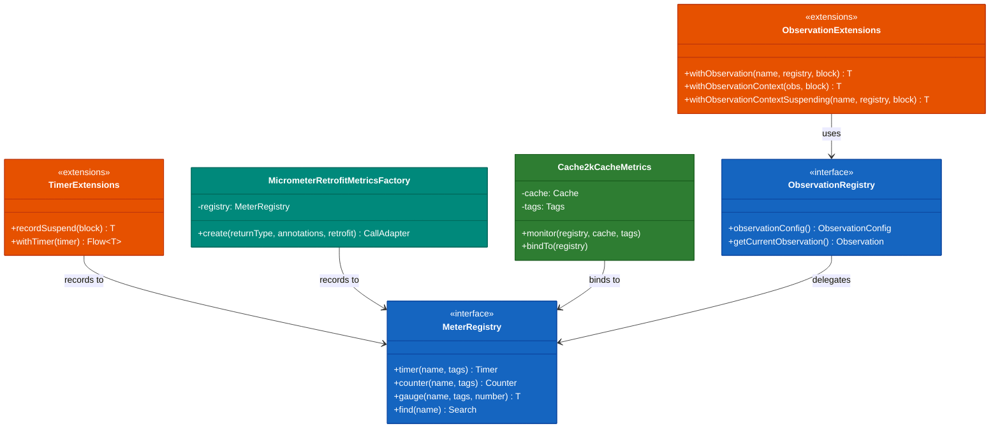
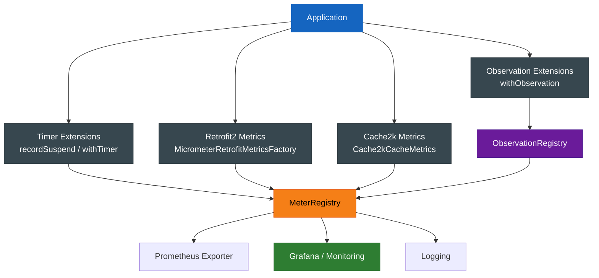
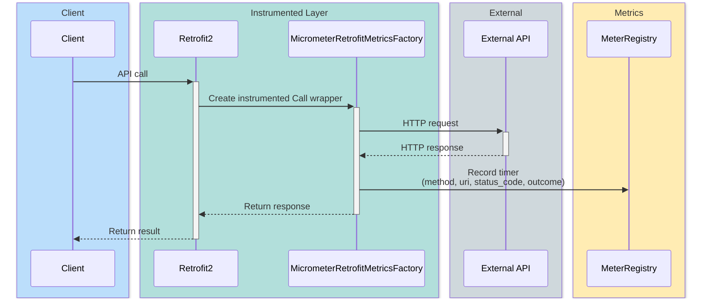
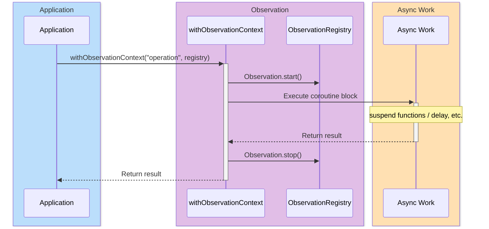

# Module bluetape4k-micrometer

English | [한국어](./README.ko.md)

A module that provides application performance measurement and observability features using Micrometer and the Observation API.

## Overview

This module extends [Micrometer](https://micrometer.io/) and Spring Boot's Observation API with the following capabilities:

- **Timer extensions**: Measure execution time for suspend functions and Kotlin Flow
- **Observation extensions**: Observation support in coroutine contexts
- **Retrofit2 metrics**: Automatic metric collection for HTTP client calls
- **Cache2k metrics**: Cache performance metric collection
- **KeyValue utilities**: Extension functions for creating Micrometer KeyValues

## Dependency

```kotlin
dependencies {
    implementation("io.github.bluetape4k:bluetape4k-micrometer:${bluetape4kVersion}")
}
```

## Key Features

### 1. Timer Extensions

#### Measuring Execution Time of Suspend Functions

```kotlin
import io.bluetape4k.micrometer.instrument.recordSuspend
import io.micrometer.core.instrument.simple.SimpleMeterRegistry

val registry = SimpleMeterRegistry()
val timer = registry.timer("api.call")

// Measure execution time of a suspend function
val result = timer.recordSuspend {
    fetchUserData(userId)  // suspend function
}
```

#### Measuring Flow Execution Time

```kotlin
import io.bluetape4k.micrometer.instrument.withTimer
import kotlinx.coroutines.flow.flow

val timer = registry.timer("flow.processing")

val flow = flow {
    emit(fetchData())
}.withTimer(timer)
    .collect { data ->
        // Processing logic
    }
```

`withTimer` measures time per collection, so even if the same Flow is collected multiple times or terminates with an exception, only one measurement is recorded per
`collect` call.

### 2. Observation Extensions

#### Basic Observation Usage

```kotlin
import io.bluetape4k.micrometer.observation.withObservation
import io.micrometer.observation.ObservationRegistry

val registry = ObservationRegistry.create()

val result = withObservation("user.service.getUser", registry) {
    userService.findById(userId)
}
```

#### Using Observation Context

```kotlin
import io.bluetape4k.micrometer.observation.withObservationContext

observation.withObservationContext { context ->
    context.put("user.id", userId)
    context.put("user.type", "premium")
    processUser(userId)
}
```

#### Using Observation in a Coroutine Context

```kotlin
import io.bluetape4k.micrometer.observation.coroutines.withObservationContext
import io.bluetape4k.micrometer.observation.coroutines.currentObservationInContext

withObservationContext("async.operation", registry) {
    val observation = currentObservationInContext()
    observation?.highCardinalityKeyValue("operation.id", generateId())

    // Perform async work
    delay(100)
    performAsyncWork()
}
```

The `withObservationContextSuspending` and
`observeSuspending` extension functions clean up the Observation scope and call
`stop()` when the suspend block ends. Passing an unstarted
`Observation` is fine — it is started internally before execution — and the observation is always cleaned up even if an exception is thrown.

#### Creating ObservationRegistry

```kotlin
import io.bluetape4k.micrometer.observation.observationRegistryOf
import io.bluetape4k.micrometer.observation.simpleObservationRegistryOf

// Registry with a custom handler
val registry = observationRegistryOf { ctx ->
    log.debug { "Observation: ${ctx.name}" }
    true  // Continue processing
}

// Simple registry
val simpleRegistry = simpleObservationRegistryOf { ctx ->
    log.trace { "Context: $ctx" }
}
```

### 3. Retrofit2 Metrics

Automatically collects execution time and outcomes for Retrofit2 HTTP calls.

#### Basic Usage

```kotlin
import io.bluetape4k.micrometer.instrument.retrofit2.MicrometerRetrofitMetricsFactory
import io.micrometer.core.instrument.simple.SimpleMeterRegistry
import retrofit2.Retrofit

val registry = SimpleMeterRegistry()
val metricsFactory = MicrometerRetrofitMetricsFactory(registry)

val retrofit = Retrofit.Builder()
    .baseUrl("https://api.example.com")
    .addCallAdapterFactory(metricsFactory)
    .addConverterFactory(JacksonConverterFactory.create())
    .build()

val apiService = retrofit.create(ApiService::class.java)

// All API calls are now automatically measured
val users = apiService.getUsers().execute()
```

#### Collected Metrics

| Tag           | Description                | Example                             |
|---------------|----------------------------|-------------------------------------|
| `method`      | HTTP method                | GET, POST, PUT, DELETE              |
| `uri`         | Request URI                | /users/{id}                         |
| `base_url`    | Base URL                   | https://api.example.com             |
| `status_code` | HTTP status code           | 200, 404, 500                       |
| `outcome`     | Outcome category           | SUCCESS, CLIENT_ERROR, SERVER_ERROR |
| `coroutines`  | Coroutine usage            | true, false                         |
| `exception`   | Transport/decode exception | IOException, SocketTimeoutException |

#### Percentiles

The following percentiles are automatically collected: 50%, 70%, 90%, 95%, 97%, 99%

#### Exception and Retry Behavior

- Transport exceptions without an HTTP response are tagged with `outcome=UNKNOWN`, `status_code=IO_ERROR`, and
  `exception=<exception type>`.
- Retry calls created with `Call.clone()` retain the instrumentation wrapper, so the same metric policy applies.

### 4. Cache2k Metrics

Exposes Cache2k cache performance metrics to Micrometer.

```kotlin
import io.bluetape4k.micrometer.instrument.cache.Cache2kCacheMetrics
import io.micrometer.core.instrument.Tags
import org.cache2k.Cache

val cache: Cache<String, User> = Cache2kBuilder.of(String::class.java, User::class.java)
    .name("user-cache")
    .build()

val registry = SimpleMeterRegistry()
val tags = Tags.of("service", "user-service")

// Register cache metrics
Cache2kCacheMetrics.monitor(registry, cache, tags)
```

#### Collected Metrics

| Metric Name               | Type            | Description                        |
|---------------------------|-----------------|------------------------------------|
| `cache.size`              | Gauge           | Current cache size                 |
| `cache.gets`              | FunctionCounter | Cache lookup count (hit/miss tags) |
| `cache.puts`              | FunctionCounter | Cache put count                    |
| `cache.evictions`         | FunctionCounter | Cache eviction count               |
| `cache.load.duration`     | TimeGauge       | Cache loading time                 |
| `cache.cleared.timestamp` | Gauge           | Last cache clear timestamp         |
| `cache.load`              | FunctionCounter | Load success/failure count         |
| `cache.expired.count`     | FunctionCounter | Expired entry count                |

### 5. KeyValue Utilities

Extension functions for creating Micrometer KeyValues.

```kotlin
import io.bluetape4k.micrometer.common.keyValueOf
import io.bluetape4k.micrometer.common.keyValuesOf

// Single KeyValue
val kv1 = keyValueOf("key", "value")

// With value validation
val kv2 = keyValueOf("count", 150) { it > 100 }

// Multiple KeyValues
val kvs1 = keyValuesOf("k1", "v1", "k2", "v2")

// From Pairs
val kvs2 = keyValuesOf("key1" to "value1", "key2" to "value2")

// From Map
val kvs3 = keyValueOf(mapOf("x" to "1", "y" to "2"))

// From a collection of KeyValues
val kvs4 = keyValueOf(listOf(KeyValue.of("a", "1")))
```

## Architecture Diagrams

### Core Class Structure



### Metric Collection Flow



### Retrofit2 Metric Collection Sequence



### Coroutine Observation Flow



## Architecture

```
┌─────────────────────────────────────────────────────────────┐
│                    bluetape4k-micrometer                     │
├─────────────────────────────────────────────────────────────┤
│  ┌──────────────┐  ┌──────────────┐  ┌──────────────┐       │
│  │   Timer      │  │ Observation  │  │   KeyValue   │       │
│  │  Extensions  │  │  Extensions  │  │   Support    │       │
│  └──────────────┘  └──────────────┘  └──────────────┘       │
├─────────────────────────────────────────────────────────────┤
│  ┌──────────────────────────────────────────────────────┐   │
│  │              Instrumentation Modules                  │   │
│  ├────────────────────┬──────────────────────────────────┤   │
│  │  Retrofit2 Metrics │       Cache2k Metrics            │   │
│  │  - HTTP call timing│  - Cache hit/miss measurement    │   │
│  │  - Response time   │  - Load time measurement        │   │
│  │  - Status code tag │  - Expiry/eviction count        │   │
│  └────────────────────┴──────────────────────────────────┘   │
├─────────────────────────────────────────────────────────────┤
│                    Micrometer Core                          │
└─────────────────────────────────────────────────────────────┘
```

## Testing

Tests are included for all features:

```bash
# Run all tests
./gradlew :bluetape4k-micrometer:test

# Run a specific test class
./gradlew :bluetape4k-micrometer:test --tests "io.bluetape4k.micrometer.instrument.TimerExtensionsTest"

# Run Retrofit instrumentation support tests
./gradlew :bluetape4k-micrometer:test --tests "io.bluetape4k.micrometer.instrument.retrofit2.RetrofitMetricsSupportTest"
```

## Notes

- Requires Kotlin 2.3 or later
- Requires Java 21 or later
- Requires Micrometer 1.13.x or later
- In coroutine tests, use `runSuspendIO` for real wall-clock timing (`runTest` emulates time)

## Related Modules

- `bluetape4k-core`: Core utilities
- `bluetape4k-coroutines`: Coroutines support
- `bluetape4k-retrofit2`: Retrofit2 integration
- `bluetape4k-cache`: Cache2k integration
