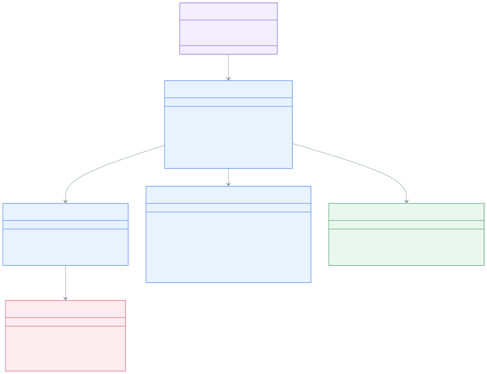

# Module bluetape4k-nats

[English](./README.md) | 한국어

[NATS.io](https://nats.io/)는 클라우드 네이티브 애플리케이션, IoT 메시징, 마이크로서비스 아키텍처를 위한 단순하고 안전하며 고성능의 오픈소스 메시징 시스템입니다.

이 모듈은 NATS Java 클라이언트(`io.nats:jnats`)에 Kotlin 관용구 확장 함수와 DSL, 코루틴 퍼스트 비동기 지원을 추가합니다.

## 아키텍처



## 특징

- **Kotlin 확장 함수** — NATS Java 클라이언트를 코틀린 스타일로 사용
- **코루틴 지원** — `suspend` 함수로 비동기 처리 (`requestSuspending`, `publishSuspending`, `drainSuspending`)
- **JetStream 지원** — 스트림 생성, 메시지 발행/구독, 소비자 관리
- **NATS Service** — DSL 기반 마이크로서비스 엔드포인트 구축
- **DSL 빌더** — Stream, Consumer, Key-Value, Object Store 설정을 위한 유창한 DSL
- **Spring Boot 통합** — 선택적 `nats-spring` 지원 (사용자 클래스패스에서 선언, `compileOnly`)

## 의존성

```kotlin
dependencies {
    implementation("io.github.bluetape4k:bluetape4k-nats:${bluetape4kVersion}")
}
```

Spring Boot 통합이 필요하다면 `nats-spring`을 명시적으로 추가합니다:

```kotlin
dependencies {
    implementation("io.github.bluetape4k:bluetape4k-nats:${bluetape4kVersion}")
    implementation("io.nats:nats-spring:0.6.2+3.5")
}
```

## 주요 기능

### 1. Connection 확장 함수

```kotlin
import io.bluetape4k.nats.client.*
import io.nats.client.Nats
import kotlin.time.Duration.Companion.seconds

val connection = Nats.connect("nats://localhost:4222")

// 메시지 발행
connection.publish("subject", "Hello, NATS!")

// Request-Reply 패턴
val response = connection.request("subject", "request body", timeout = 5.seconds)

// 코루틴 지원
suspend fun coroutineExample() {
    val response = connection.requestSuspending("subject", "body".toUtf8Bytes())
}

// Drain + 연결 종료
connection.drainSuspending(10.seconds)
```

### 2. JetStream 지원

```kotlin
import io.bluetape4k.nats.client.*
import io.nats.client.api.StorageType

val jetStream = connection.jetStream()

// 동기 발행
val ack = jetStream.publish("stream.subject", "message body")

// 비동기 발행 (CompletableFuture)
val future = jetStream.publishAsync("stream.subject", "message body")

// 코루틴 발행
suspend fun publishAsync() {
    val ack = jetStream.publishSuspending("stream.subject", "message body")
}

// 스트림 생성
val streamInfo = connection.createStream(
    streamName = "my-stream",
    storageType = StorageType.Memory,
    subjects = arrayOf("events.*")
)
```

### 3. JetStreamManagement

```kotlin
import io.bluetape4k.nats.client.*

val management = connection.jetStreamManagement()

// 스트림 생명주기 — 멱등성 생성/업데이트
management.createStream("my-stream", subjects = arrayOf("orders.*"))
management.createOrReplaceStream("my-stream", subjects = arrayOf("orders.*"))
management.createStreamOrUpdateSubjects("my-stream", subjects = arrayOf("orders.*", "payments.*"))

// 조회
val exists = management.streamExists("my-stream")
val info = management.getStreamInfoOrNull("my-stream")

// 삭제 — "대상 없음"은 성공으로 처리, 나머지 예외는 전파
management.forcedDeleteStream("my-stream")
management.forcedPurgeStream("my-stream")

// 소비자 관리
val consumerExists = management.consumerExists("my-stream", "my-consumer")
management.forcedDeleteConsumer("my-stream", "my-consumer")
```

### 4. Subscription 확장

```kotlin
import io.bluetape4k.nats.client.nextMessage
import kotlin.time.Duration.Companion.seconds

val subscription = connection.subscribe("subject")
val message = subscription.nextMessage(5.seconds)
```

### 5. NATS Service

```kotlin
import io.bluetape4k.nats.service.*
import io.nats.service.ServiceEndpoint

// 팩토리 함수
val service = natsServiceOf(
    nc = connection,
    name = "my-service",
    version = "1.0.0",
    serviceEndpointOf(name = "echo", subject = "service.echo") { msg ->
        msg.respond(connection, msg.data)
    }
)

// DSL 스타일
val service = natsService {
    connection(connection)
    name("my-service")
    version("1.0.0")
    addServiceEndpoint(endpoint)
}
```

### 6. 스트림 설정 DSL

```kotlin
import io.bluetape4k.nats.client.api.*
import io.nats.client.api.*

val config = streamConfiguration {
    name("my-stream")
    subjects("events.*", "logs.*")
    storageType(StorageType.File)
    retentionPolicy(RetentionPolicy.Limits)
    maxMessages(100_000)
    maxBytes(100 * 1024 * 1024)  // 100MB
    maxAge(Duration.ofDays(7))
}
```

### 7. 소비자 설정 DSL

```kotlin
import io.bluetape4k.nats.client.api.*

val config = consumerConfiguration {
    name("my-consumer")
    durable("my-consumer-durable")
    deliverPolicy(DeliverPolicy.All)
    ackPolicy(AckPolicy.Explicit)
    maxDeliver(3)
    maxAckPending(1000)
}
```

### 8. Key-Value Store

```kotlin
import io.bluetape4k.nats.client.*

val kvManagement = connection.keyValueManagement()

val config = keyValueConfiguration {
    name("my-bucket")
    maxHistoryPerKey(5)
    ttl(3600)  // 초 단위 1시간
}
kvManagement.create(config)

// 연산
val kv = connection.keyValue("my-bucket")
kv.put("key", "value")
val value = kv.get("key")
kv.delete("key")

// 기존 버킷 업데이트 또는 생성
val config2 = keyValueConfiguration("my-bucket") {
    maxHistoryPerKey(10)
}
kvManagement.createOrUpdate(config2)
```

### 9. Object Store

```kotlin
import io.bluetape4k.nats.client.*
import io.bluetape4k.nats.client.api.*

val objManagement = connection.objectStoreManagement()

val config = objectStoreConfiguration {
    name("my-objects")
    maxBytes(1_000 * 1024 * 1024)  // 1GB
}
objManagement.create(config)

// 연산
val store = connection.objectStore("my-objects")
store.put("file.txt", inputStream)
val obj = store.get("file.txt")
store.delete("file.txt")

// ObjectLink 팩토리 헬퍼
val bucketLink = objectLinkOf("my-objects")                   // 버킷 레벨 링크
val objectLink = objectLinkOf("my-objects", "file.txt")      // 객체 레벨 링크
```

### 10. ConsumerContext 팩토리

```kotlin
import io.bluetape4k.nats.client.*

// durable 소비자 이름으로 ConsumerContext 생성
val consumerCtx = consumerContextOf(connection, "my-stream", "my-consumer")

// ConsumerConfiguration으로 ConsumerContext 생성
val consumerCtx2 = consumerContextOf(connection, "my-stream", consumerConfiguration {
    durable("my-consumer")
    deliverPolicy(DeliverPolicy.All)
})
```

### 11. StreamInfoOptions

```kotlin
import io.bluetape4k.nats.client.api.*

// DSL 빌더
val opts = streamInfoOptions { /* StreamInfoOptions.Builder DSL */ }

// subject 필터 적용
val filteredOpts = streamInfoOptionsOfFilterSubject("events.>")

// 모든 subject 포함
val allOpts = streamInfoOptionsOfAllSubjects()

val info = management.getStreamInfo("my-stream", filteredOpts)
```

## 테스트 커버리지

라인 커버리지: **79.45%** (259/326 라인) — Kover 측정.

서버 없이 실행 가능한 단위 테스트:

| 테스트 파일 | 대상 |
|-----------|------|
| `OptionsTest` | `natsOptions`, `natsOptionsOf` 빌더 |
| `JetStreamOptionsTest` | `jetStreamOptionsOf`, `defaultJetStreamOptions` |
| `PublishOptionsTest` | `publishOptions`, `publishOptionsOf` 빌더 |
| `KeyValueOptionsTest` | `keyValueOptions` (3가지 오버로드) |
| `PullSubscriptionOptionsTest` | `pullSubscriptionOptions`, `pullSubscriptionOptionsOf` |
| `PushSubscriptionOptionsTest` | `pushSubscriptionOptions`, `pushSubscriptionOf` (2가지 오버로드) |
| `NatsMessageTest` | `natsMessage`, `natsMessageOf` (3가지 오버로드) |
| `ConnectionExtensionsTest` | `publish`, `request`, `requestAsync`, `requestSuspending`, `drainSuspending` (MockK) |
| `ConsumerExtensionsTest` | `Consumer.drain`, `Consumer.drainSuspending` (MockK) |
| `ServiceExtensionsTest` | `natsService`, `natsServiceOf` (MockK Connection) |

## 테스트 지원

`AbstractNatsTest`를 상속하면 Testcontainers 기반 NATS 서버에 자동으로 연결됩니다:

```kotlin
class MyNatsTest : AbstractNatsTest() {

    @Test
    fun `메시지 발행 및 수신`() {
        val subject = "test.subject"
        val message = "Hello, NATS!"

        val subscription = connection.subscribe(subject)
        connection.publish(subject, message)

        val received = subscription.nextMessage(5.seconds)
        received.data.toUtf8String() shouldBeEqualTo message
    }
}
```

## 예제

테스트 예제는 `src/test/kotlin/io/bluetape4k/nats/` 하위에 위치합니다:

| 패키지 | 설명 |
|--------|------|
| `client.examples` | 기본 pub/sub, request-reply, 인코딩, JetStream 기초 |
| `client.examples.jetstream` | JetStream 비동기 발행, 스트림 관리 |
| `client.examples.jetstream.simple` | 단순 소비자 API (fetch, iterable, message consumer) |
| `client.examples.chainOfCommand` | 책임 연쇄(Chain of Command) 마이크로서비스 패턴 |
| `service.examples` | NATS Service API 엔드포인트 등록 |

## 참고 자료

- [NATS 공식 문서](https://docs.nats.io/)
- [NATS Java Client](https://github.com/nats-io/nats.java)
- [JetStream 문서](https://docs.nats.io/nats-concepts/jetstream)
- [NATS Service API](https://docs.nats.io/nats-concepts/service)

## 라이선스

MIT License
