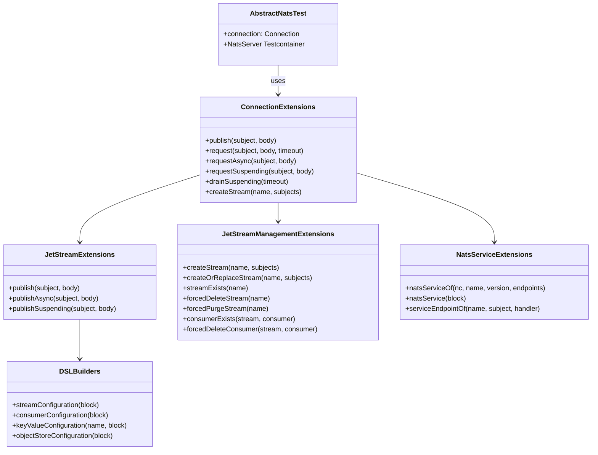

# Module bluetape4k-nats

English | [한국어](./README.ko.md)

[NATS.io](https://nats.io/) is a simple, secure, and high-performance open-source messaging system for cloud-native applications, IoT messaging, and microservices architectures.

This module provides Kotlin-idiomatic extension functions and DSLs for the NATS Java client (`io.nats:jnats`), with first-class Coroutines support.

## Architecture



## Features

- **Kotlin extension functions** — NATS Java client in idiomatic Kotlin style
- **Coroutines support** — `suspend` functions for async operations (`requestSuspending`, `publishSuspending`, `drainSuspending`)
- **JetStream support** — stream creation, publish/subscribe, consumer management
- **NATS Service** — build microservice endpoints with DSL
- **DSL builders** — fluent configuration for Streams, Consumers, Key-Value stores, and Object Stores
- **Spring Boot integration** — optional `nats-spring` support (consumer's classpath, `compileOnly`)

## Dependency

```kotlin
dependencies {
    implementation("io.github.bluetape4k:bluetape4k-nats:${bluetape4kVersion}")
}
```

For Spring Boot integration, add `nats-spring` explicitly:

```kotlin
dependencies {
    implementation("io.github.bluetape4k:bluetape4k-nats:${bluetape4kVersion}")
    implementation("io.nats:nats-spring:0.6.2+3.5")
}
```

## Key Features

### 1. Connection Extension Functions

```kotlin
import io.bluetape4k.nats.client.*
import io.nats.client.Nats
import kotlin.time.Duration.Companion.seconds

val connection = Nats.connect("nats://localhost:4222")

// Publish a message
connection.publish("subject", "Hello, NATS!")

// Request-Reply pattern
val response = connection.request("subject", "request body", timeout = 5.seconds)

// Coroutines support
suspend fun coroutineExample() {
    val response = connection.requestSuspending("subject", "body".toUtf8Bytes())
}

// Drain and close
connection.drainSuspending(10.seconds)
```

### 2. JetStream Support

```kotlin
import io.bluetape4k.nats.client.*
import io.nats.client.api.StorageType

val jetStream = connection.jetStream()

// Publish
val ack = jetStream.publish("stream.subject", "message body")

// Async publish (CompletableFuture)
val future = jetStream.publishAsync("stream.subject", "message body")

// Coroutines support
suspend fun publishAsync() {
    val ack = jetStream.publishSuspending("stream.subject", "message body")
}

// Create a stream
val streamInfo = connection.createStream(
    streamName = "my-stream",
    storageType = StorageType.Memory,
    subjects = arrayOf("events.*")
)
```

### 3. JetStreamManagement

```kotlin
import io.bluetape4k.nats.client.*

val management = connection.jetStreamManagement()

// Stream lifecycle — idempotent create/update
management.createStream("my-stream", subjects = arrayOf("orders.*"))
management.createOrReplaceStream("my-stream", subjects = arrayOf("orders.*"))
management.createStreamOrUpdateSubjects("my-stream", subjects = arrayOf("orders.*", "payments.*"))

// Queries
val exists = management.streamExists("my-stream")
val info = management.getStreamInfoOrNull("my-stream")

// Deletion — treats "not found" as success, propagates all other errors
management.forcedDeleteStream("my-stream")
management.forcedPurgeStream("my-stream")

// Consumer management
val consumerExists = management.consumerExists("my-stream", "my-consumer")
management.forcedDeleteConsumer("my-stream", "my-consumer")
```

### 4. Subscription Extensions

```kotlin
import io.bluetape4k.nats.client.nextMessage
import kotlin.time.Duration.Companion.seconds

val subscription = connection.subscribe("subject")
val message = subscription.nextMessage(5.seconds)
```

### 5. NATS Service

```kotlin
import io.bluetape4k.nats.service.*
import io.nats.service.ServiceEndpoint

// Factory function
val service = natsServiceOf(
    nc = connection,
    name = "my-service",
    version = "1.0.0",
    serviceEndpointOf(name = "echo", subject = "service.echo") { msg ->
        msg.respond(connection, msg.data)
    }
)

// DSL-style
val service = natsService {
    connection(connection)
    name("my-service")
    version("1.0.0")
    addServiceEndpoint(endpoint)
}
```

### 6. Stream Configuration DSL

```kotlin
import io.bluetape4k.nats.client.api.*
import io.nats.client.api.*

val config = streamConfiguration {
    name("my-stream")
    subjects("events.*", "logs.*")
    storageType(StorageType.File)
    retentionPolicy(RetentionPolicy.Limits)
    maxMessages(100_000)
    maxBytes(100 * 1024 * 1024)  // 100MB
    maxAge(Duration.ofDays(7))
}
```

### 7. Consumer Configuration DSL

```kotlin
import io.bluetape4k.nats.client.api.*

val config = consumerConfiguration {
    name("my-consumer")
    durable("my-consumer-durable")
    deliverPolicy(DeliverPolicy.All)
    ackPolicy(AckPolicy.Explicit)
    maxDeliver(3)
    maxAckPending(1000)
}
```

### 8. Key-Value Store

```kotlin
import io.bluetape4k.nats.client.*

val kvManagement = connection.keyValueManagement()

val config = keyValueConfiguration {
    name("my-bucket")
    maxHistoryPerKey(5)
    ttl(3600)  // 1 hour in seconds
}
kvManagement.create(config)

// Operations
val kv = connection.keyValue("my-bucket")
kv.put("key", "value")
val value = kv.get("key")
kv.delete("key")

// Create or update existing bucket
val config2 = keyValueConfiguration("my-bucket") {
    maxHistoryPerKey(10)
}
kvManagement.createOrUpdate(config2)
```

### 9. Object Store

```kotlin
import io.bluetape4k.nats.client.*
import io.bluetape4k.nats.client.api.*

val objManagement = connection.objectStoreManagement()

val config = objectStoreConfiguration {
    name("my-objects")
    maxBytes(1_000 * 1024 * 1024)  // 1GB
}
objManagement.create(config)

// Operations
val store = connection.objectStore("my-objects")
store.put("file.txt", inputStream)
val obj = store.get("file.txt")
store.delete("file.txt")

// ObjectLink factory helpers
val bucketLink = objectLinkOf("my-objects")                   // bucket-level link
val objectLink = objectLinkOf("my-objects", "file.txt")      // object-level link
```

### 10. ConsumerContext Factory

```kotlin
import io.bluetape4k.nats.client.*

// Create ConsumerContext from durable consumer name
val consumerCtx = consumerContextOf(connection, "my-stream", "my-consumer")

// Create ConsumerContext from ConsumerConfiguration
val consumerCtx2 = consumerContextOf(connection, "my-stream", consumerConfiguration {
    durable("my-consumer")
    deliverPolicy(DeliverPolicy.All)
})
```

### 11. StreamInfoOptions

```kotlin
import io.bluetape4k.nats.client.api.*

// DSL builder
val opts = streamInfoOptions { /* StreamInfoOptions.Builder DSL */ }

// Subject-filtered stream info
val filteredOpts = streamInfoOptionsOfFilterSubject("events.>")

// All subjects
val allOpts = streamInfoOptionsOfAllSubjects()

val info = management.getStreamInfo("my-stream", filteredOpts)
```

## Test Coverage

Line coverage: **79.45%** (259/326 lines) — measured with Kover.

Unit tests (no server required):

| Test File | Scope |
|-----------|-------|
| `OptionsTest` | `natsOptions`, `natsOptionsOf` builders |
| `JetStreamOptionsTest` | `jetStreamOptionsOf`, `defaultJetStreamOptions` |
| `PublishOptionsTest` | `publishOptions`, `publishOptionsOf` builders |
| `KeyValueOptionsTest` | `keyValueOptions` (3 overloads) |
| `PullSubscriptionOptionsTest` | `pullSubscriptionOptions`, `pullSubscriptionOptionsOf` |
| `PushSubscriptionOptionsTest` | `pushSubscriptionOptions`, `pushSubscriptionOf` (2 overloads) |
| `NatsMessageTest` | `natsMessage`, `natsMessageOf` (3 overloads) |
| `ConnectionExtensionsTest` | `publish`, `request`, `requestAsync`, `requestSuspending`, `drainSuspending` (MockK) |
| `ConsumerExtensionsTest` | `Consumer.drain`, `Consumer.drainSuspending` (MockK) |
| `ServiceExtensionsTest` | `natsService`, `natsServiceOf` (MockK Connection) |

## Test Support

Extend `AbstractNatsTest` to get a pre-connected NATS server via Testcontainers:

```kotlin
class MyNatsTest : AbstractNatsTest() {

    @Test
    fun `publish and receive a message`() {
        val subject = "test.subject"
        val message = "Hello, NATS!"

        val subscription = connection.subscribe(subject)
        connection.publish(subject, message)

        val received = subscription.nextMessage(5.seconds)
        received.data.toUtf8String() shouldBeEqualTo message
    }
}
```

## Examples

Test examples are located in `src/test/kotlin/io/bluetape4k/nats/`:

| Package | Description |
|---------|-------------|
| `client.examples` | Core pub/sub, request-reply, encoding, JetStream basics |
| `client.examples.jetstream` | JetStream async publishing, stream management |
| `client.examples.jetstream.simple` | Simple consumer API (fetch, iterable, message consumer) |
| `client.examples.chainOfCommand` | Chain-of-command microservice pattern |
| `service.examples` | NATS Service API endpoint registration |

## References

- [NATS Official Documentation](https://docs.nats.io/)
- [NATS Java Client](https://github.com/nats-io/nats.java)
- [JetStream Documentation](https://docs.nats.io/nats-concepts/jetstream)
- [NATS Service API](https://docs.nats.io/nats-concepts/service)

## License

Apache License 2.0
